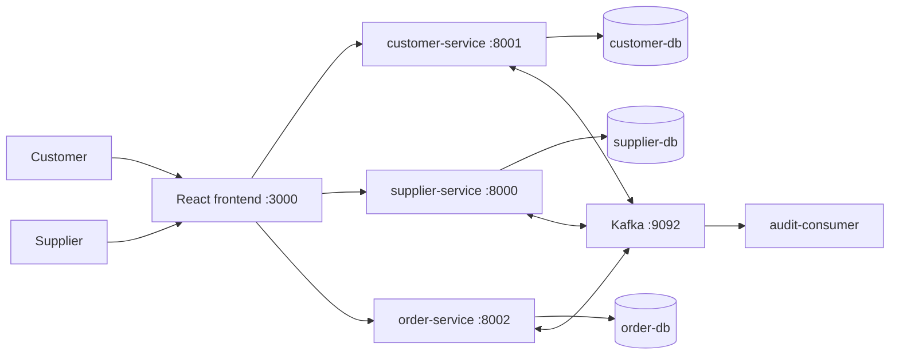

# Marketplace-QA

Распределённый учебный e-commerce стенд для QA-инженера уровня Middle Manual QA. Проект позволяет в одном локальном окружении проверять frontend, REST API, PostgreSQL, Kafka, асинхронный жизненный цикл заказов и типовые сбои распределённой системы.

Это учебный проект и QA-лаборатория, а не production-магазин и не описание коммерческого опыта.

## Что демонстрирует проект

- React + TypeScript frontend для ролей Customer и Supplier;
- REST API и OpenAPI/Swagger;
- PostgreSQL с раздельным владением данными;
- Kafka и eventual consistency;
- transactional outbox и consumer inbox/deduplication;
- идемпотентное создание заказа;
- optimistic locking через `ETag` / `If-Match`;
- all-or-nothing резервирование остатков;
- confirm/finalize, reject/release и cancel/release;
- компенсацию позднего успешного резервирования;
- retry, timeout worker и DLQ;
- correlation ID и structured logs ключевых order/supplier компонентов;
- backend, component, API smoke и Playwright E2E проверки;
- запуск и CI через Docker Compose.

## Architecture



`supplier-service` владеет товарами, складами, фактическими остатками и резервами. `customer-service` владеет пользователями, избранным, корзиной и локальной проекцией каталога. `order-service` является источником истины для заказа и координирует резервирование через Kafka.

Подробные диаграммы: [docs/architecture/README.md](docs/architecture/README.md). State machine: [docs/to-be/05-order-state-machine.md](docs/to-be/05-order-state-machine.md).

## Services

| Компонент | Назначение | Локальный адрес |
|---|---|---|
| frontend | Customer/Supplier UI, QA Panel, Dev Panel | http://localhost:3000 |
| supplier-service | Поставщики, товары, склады, остатки и резервы | http://localhost:8000 |
| customer-service | Пользователи, projection, favorites и cart | http://localhost:8001 |
| order-service | Создание и жизненный цикл заказов | http://localhost:8002 |
| Kafka UI | Просмотр topics и сообщений | http://localhost:8080 |
| supplier-db | PostgreSQL supplier domain | localhost:5432 |
| customer-db | PostgreSQL customer domain | localhost:5433 |
| order-db | PostgreSQL order domain | localhost:5434 |
| audit-consumer | Аудит legacy supplier events | без HTTP-порта |

Также запускаются order/supplier outbox publishers, reservation/result consumers и order timeout worker.

## Main business flows

1. **Create / reserve:** Customer создаёт заказ → order outbox публикует `StockReservationRequested` → supplier резервирует все позиции либо отклоняет весь заказ → order-service применяет результат.
2. **Confirm / finalize:** Supplier подтверждает `RESERVED` заказ → Kafka-команда финализирует stock → заказ становится `CONFIRMED`.
3. **Reject / release:** Supplier отклоняет `RESERVED` заказ → резерв освобождается → заказ становится `REJECTED`.
4. **Cancel / release:** Customer отменяет заказ до `CONFIRMED` → резерв освобождается → заказ становится `CANCELLED`.
5. **Late success compensation:** если reservation success приходит после cancel request, order-service не восстанавливает заказ, а повторно инициирует release.

Частичная комплектация не поддерживается: один заказ содержит товары одного поставщика и резервируется по правилу all-or-nothing.

## Quick start

Требуются Docker и Docker Compose.

```bash
git clone https://github.com/semyonios/Marketplace-QA.git
cd Marketplace-QA
docker compose up --build -d
```

Команда автоматически:

- поднимает три PostgreSQL, Kafka и Kafka UI;
- применяет Alembic migrations order/supplier;
- создаёт Kafka topics через broker auto-create;
- создаёт детерминированные seed-данные;
- запускает API, publishers, consumers, worker и frontend;
- ожидает обязательные healthchecks.

Откройте http://localhost:3000. Альтернативная команда: `make up`.

Полезные команды:

```bash
make down       # остановить
make reset      # удалить локальные volumes и вернуть известные seed-данные
make logs       # общие логи
make smoke      # API/Kafka smoke
make test       # backend + frontend tests
make e2e        # headless Playwright в Docker
```

`make reset` удаляет только Compose volumes этого проекта.

## Test users and seed data

После чистого `make reset` идентификаторы стабильны:

| Роль | ID | Имя | Email |
|---|---:|---|---|
| Customer | 1 | Elena QA Customer | elena.customer@example.com |
| Customer | 2 | Pavel QA Customer | pavel.customer@example.com |
| Supplier | 1 | Atlas Demo Supplier | atlas.supplier@example.com |
| Supplier | 2 | Northstar Demo Supplier | northstar.supplier@example.com |

Seed создаёт 10 товаров двух поставщиков и три склада. В наборе есть товары с большим и малым остатком, два товара с нулевым остатком, архивный товар и неактивный товар. Повторный seed безопасен:

```bash
make seed
```

## Demo scenario

Сценарий занимает около 5–10 минут:

1. На главной выбрать Customer `#1`.
2. Открыть каталог, сравнить projection и source stock, добавить `QA Laptop Pro` в корзину.
3. Оформить заказ и обратить внимание на `Idempotency-Key`.
4. На карточке дождаться `RESERVED`; показать polling, `ETag`, version, correlation ID, timeline и Dev Panel.
5. Переключиться на Supplier `#1`, открыть заказ и нажать Confirm.
6. Дождаться `CONFIRMED`, показать `StockFinalized` в timeline и изменение stock.
7. Повторить создание и показать Reject либо Customer Cancel с release.
8. Открыть QA Panel, Kafka UI и structured logs.

## Running tests

Все backend-тесты используют PostgreSQL; SQLite не применяется.

```bash
# Полный backend-набор
make backend-test

# React Testing Library / Vitest
make frontend-test

# Playwright headless; stack должен быть запущен
make e2e

# API + Kafka smoke после запуска
make smoke

# Backend + frontend unit/integration
make test
```

Прямые Docker-команды:

```bash
docker compose --profile tools run --rm order-tests
docker compose --profile tools run --rm supplier-tests
docker compose --profile tools run --rm customer-tests
docker compose --profile tools run --rm frontend-tests
docker compose --profile tools run --rm e2e
docker compose --profile tools run --rm smoke
```

Локальный Playwright UI доступен при установленных Node.js/pnpm и браузерах Playwright:

```bash
cd e2e
pnpm install
pnpm exec playwright install
pnpm test:ui
```

## API

- Supplier Swagger: http://localhost:8000/docs
- Customer Swagger: http://localhost:8001/docs
- Order Swagger: http://localhost:8002/docs
- OpenAPI JSON: `/openapi.json` на соответствующем порту.

Order mutations используют тестовые заголовки `X-Test-Role`, `X-Test-Subject-ID`, опциональный `X-Correlation-ID`, а также обязательный `If-Match` для confirm/reject/cancel. Create order требует `Idempotency-Key`.

Актуальные примеры запросов находятся в [Postman collection](postman/Marketplace-QA-2.0.postman_collection.json).

## Kafka

| Topic | Назначение |
|---|---|
| `marketplace.stock.commands.v1` | reserve/finalize/release команды |
| `marketplace.stock.events.v1` | результаты операций с остатками |
| `marketplace.order.events.v1` | доменные события заказа |
| `marketplace.order.dlq.v1` | необработанные stock commands/results |
| `supplier-events` | legacy supplier events для audit-consumer |
| `product-events` | обновление customer catalog projection |
| `product-stock-events` | обновление stock в customer projection |

Просмотр DLQ:

```bash
make dlq
docker compose --profile tools run --rm dlq-tools list --limit 50
```

Ручной replay сохраняет исходный event ID и требует явного `--yes`:

```bash
docker compose --profile tools run --rm dlq-tools \
  replay <dlq_record_id> --yes
```

Перед replay проверьте inbox: повторная доставка безопасна только в границах реализованной deduplication.

## Observability

Order/supplier lifecycle компоненты пишут JSON logs с `order_id`, `event_id`, `correlation_id`, состояниями, версиями, попытками и результатом.

```bash
docker compose logs -f order-service
docker compose logs -f supplier-service
docker compose logs -f order-stock-events-consumer
docker compose logs -f supplier-reservation-consumer
```

Как проследить flow:

1. скопировать `order_id` и `correlation_id` из Dev Panel;
2. найти их в логах сервисов: `docker compose logs | grep '<correlation_id>'`;
3. открыть Kafka UI и проверить stock commands/events;
4. проверить order/supplier inbox и outbox через PostgreSQL либо соответствующие тесты.

Health/readiness:

```bash
curl http://localhost:8000/health
curl http://localhost:8000/ready
curl http://localhost:8001/health
curl http://localhost:8002/health
curl http://localhost:8002/ready
```

## QA artifacts

- [AS IS requirements index](docs/requirements/00_index.md)
- [TO BE vision](docs/to-be/01-vision-and-architecture-principles.md)
- [MVP scope and scenarios](docs/to-be/02-mvp-scope-roles-and-user-scenarios.md)
- [Frontend requirements](docs/to-be/03-frontend-functional-requirements.md)
- [Order architecture](docs/to-be/04-order-service-architecture.md)
- [Order state machine](docs/to-be/05-order-state-machine.md)
- [Order contracts](docs/to-be/06-order-service-contracts.md)
- [Test strategy](docs/qa/test-strategy.md)
- [Critical checklist](docs/qa/critical-checklist.md)
- [Sample bug reports](docs/qa/bug-examples.md)
- [Known limitations](docs/KNOWN_LIMITATIONS.md)
- [Architecture diagrams](docs/architecture/README.md)

## Project structure

```text
.
├── frontend/             React + TypeScript QA UI
├── order-service/        Order source of truth and lifecycle workers
├── supplier-service/     Catalog, warehouses, stock and reservations
├── customer-service/     Customer data, cart and catalog projection
├── audit-consumer/       Legacy supplier event audit
├── e2e/                  Playwright critical scenarios
├── scripts/              Seed, smoke, recovery and DLQ tools
├── postman/              Collection and local environment
├── docs/                 Requirements, architecture and QA artifacts
├── .github/workflows/    CI
└── docker-compose.yml
```

## Known limitations

Главные ограничения перечислены в [docs/KNOWN_LIMITATIONS.md](docs/KNOWN_LIMITATIONS.md). В частности: нет полноценной авторизации, оплаты, доставки, partial fulfillment, Kubernetes и distributed tracing; UI использует polling вместо WebSocket; customer-service сохраняет упрощённую legacy-модель и не имеет Alembic migrations.

## Future improvements

- вынести customer-service schema evolution в Alembic;
- добавить отдельный read-only API для warehouse stock rows;
- унифицировать structured logging legacy customer/audit компонентов;
- добавить управляемый chaos-профиль для Kafka outage/recovery;
- расширить contract testing без увеличения числа хрупких UI-тестов.

## Author / purpose

Marketplace-QA создан как учебный стенд и портфолио-проект для демонстрации практик manual/API/integration QA на реалистичной распределённой системе.
