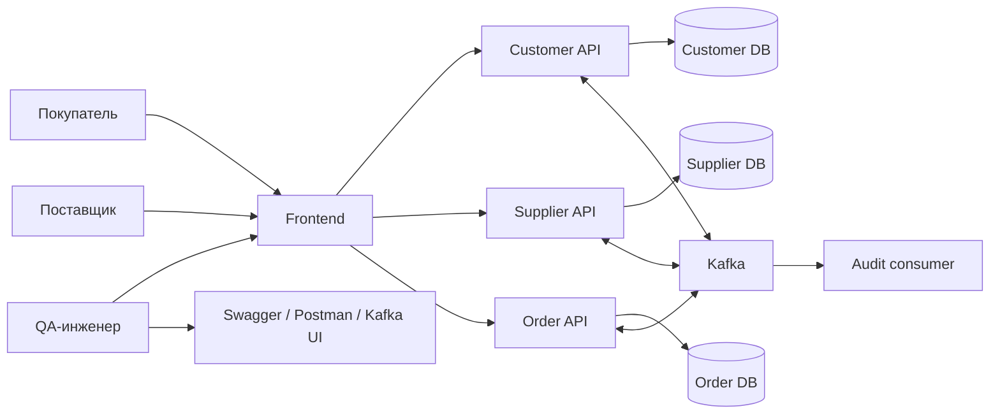
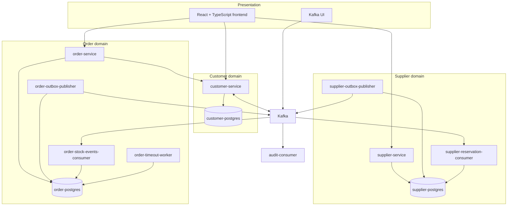
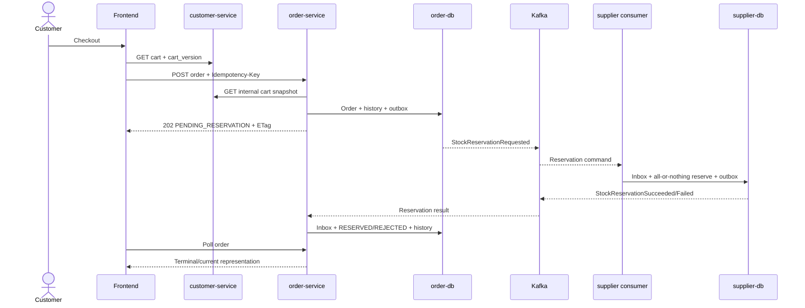
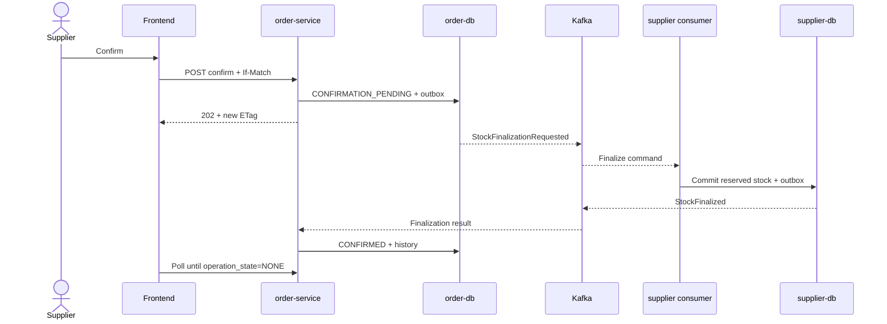
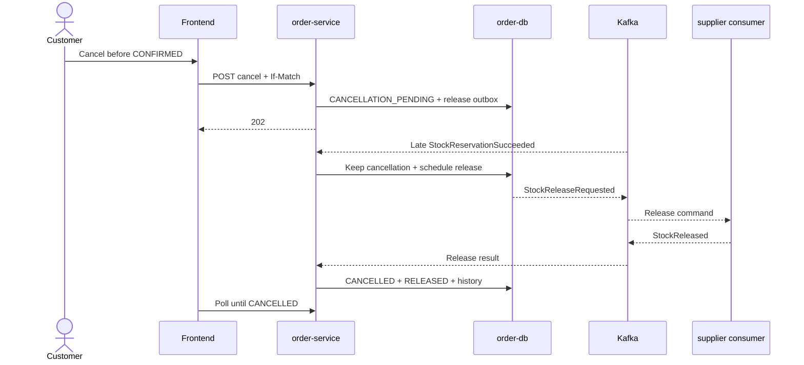

# Marketplace-QA 2.0 — архитектурные диаграммы

Диаграммы отражают реализованный MVP. Детальные решения и контракты остаются в документах [TO BE](../to-be/01-vision-and-architecture-principles.md).

## System context

## Containers and services

## Order creation and reservation

## Supplier confirm

## Cancel with late reservation success

## Order state machine

Единственный нормативный вариант state machine находится в
[05-order-state-machine.md](../to-be/05-order-state-machine.md). Диаграмма здесь не дублируется, чтобы изменения правил не расходились между документами.
