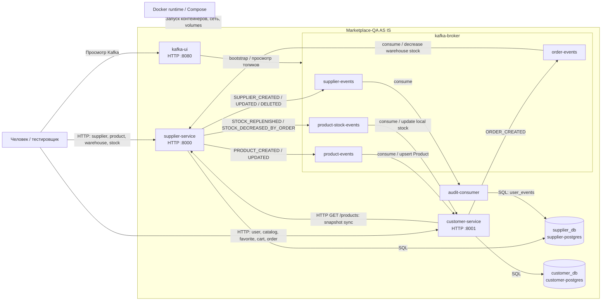

# Системный контекст Marketplace-QA AS IS

## 1. Назначение документа

Документ описывает системные границы, состав компонентов и потоки данных Marketplace-QA в их текущем виде. Описание основано на реализации сервисов, `docker-compose.yml`, `README.md` и результатах анализа в `docs/requirements`. Здесь не задаются функциональные требования, будущая архитектура или изменения существующей системы.

## 2. Границы системы

### 2.1. Что входит в Marketplace-QA

В границу текущей локальной системы входят семь компонентов, описанных в Docker Compose:

- `supplier-service` — HTTP API supplier-домена и consumer событий заказов;
- `customer-service` — HTTP API customer-домена, локальная проекция каталога, producer событий заказов и consumer событий товаров/остатков;
- `audit-consumer` — фоновый consumer событий поставщиков;
- `supplier-postgres` — PostgreSQL с базой `supplier_db`;
- `customer-postgres` — PostgreSQL с базой `customer_db`;
- `kafka-broker` — одновузловой Kafka broker/controller;
- `kafka-ui` — веб-интерфейс просмотра локального Kafka-кластера.

Docker Compose также создаёт внутреннюю сеть по умолчанию и два именованных тома: `postgres_data` и `customer_postgres_data`. Они обеспечивают сетевую связность контейнеров и сохранение данных PostgreSQL, но не являются самостоятельными прикладными компонентами.

### 2.2. Что не входит в Marketplace-QA

В репозитории и Compose-топологии отсутствуют:

- аутентификация и авторизация (`auth`);
- обработка оплаты (`payment`);
- управление доставкой (`delivery`);
- интеграции с внешними marketplace или иными внешними бизнес-системами;
- production monitoring, централизованные метрики и трассировка;
- CI/CD-конвейеры;
- пользовательский web/mobile UI.

Swagger UI, автоматически предоставляемый FastAPI по `/docs`, и `kafka-ui` являются техническими интерфейсами для просмотра и ручной работы. Они не образуют пользовательский интерфейс marketplace.

## 3. Пользователи и внешние акторы

### 3.1. Человек, вызывающий supplier API

Человек обращается к `supplier-service` по HTTP на локальном порту `8000`, обычно через Swagger или `curl`, как описано в README. Через API он создаёт и изменяет поставщиков, товары, склады и складские остатки.

Код не определяет, является ли этот человек поставщиком, оператором marketplace, администратором или только тестировщиком. Аутентификация и модель ролей отсутствуют. Поэтому точное название бизнес-роли остаётся неоднозначным; подтверждён только факт внешнего HTTP-вызова.

### 3.2. Человек, вызывающий customer API

Человек обращается к `customer-service` по HTTP на локальном порту `8001`. Он создаёт записи покупателей, просматривает каталог, управляет избранным и корзиной, создаёт и отменяет заказы.

Код не подтверждает, что вызывающий API человек совпадает с сущностью `User`, чей `user_id` передаётся в запросе. Также не определено, является ли актор конечным покупателем, оператором или тестировщиком. README позиционирует проект как среду ручной QA-практики, поэтому «человек/тестировщик» — наиболее точное нейтральное обозначение текущего актора.

### 3.3. Docker runtime

Docker runtime вместе с Docker Compose создаёт контейнеры, сеть и volumes, передаёт переменные окружения, публикует локальные порты и соблюдает заданные условия запуска. PostgreSQL ожидается до состояния `service_healthy`, Kafka и прикладные сервисы — до `service_started` в соответствии с `depends_on`.

Docker runtime находится снаружи прикладной логики, но является внешней средой исполнения всей локальной системы.

### 3.4. Kafka broker как инфраструктурный участник

`kafka-broker` входит в развёртываемую систему и действует как инфраструктурный посредник между producer и consumer. Он принимает, хранит и выдаёт сообщения четырёх прикладных топиков. Бизнес-решений broker не принимает.

### 3.5. PostgreSQL как инфраструктурный участник

Два PostgreSQL-компонента входят в развёртываемую систему и предоставляют сервисам постоянное хранение. `supplier-postgres` обслуживает одновременно `supplier-service` и `audit-consumer`; `customer-postgres` обслуживает `customer-service`. PostgreSQL обеспечивает ограничения таблиц и транзакции внутри отдельной БД, но не координирует транзакции между сервисами и Kafka.

## 4. Компонентная модель

### 4.1. `supplier-service`

**Назначение.** Источник истины для поставщиков, товаров, складов, складских строк остатков и агрегированных остатков. Сервис также применяет созданные заказы к складским остаткам.

**Входящие взаимодействия.**

- HTTP-запросы человека/тестировщика на порт `8000`;
- HTTP `GET /products` от `customer-service` при полной синхронизации каталога;
- сообщения `ORDER_CREATED` из `order-events`;
- SQL-ответы и результаты транзакций `supplier-postgres`.

**Исходящие взаимодействия.**

- SQL-команды в `supplier-postgres`;
- события `SUPPLIER_CREATED`, `SUPPLIER_UPDATED`, `SUPPLIER_DELETED` в `supplier-events`;
- события `PRODUCT_CREATED` и `PRODUCT_UPDATED` в `product-events`;
- события `STOCK_REPLENISHED` и `STOCK_DECREASED_BY_ORDER` в `product-stock-events`;
- HTTP-ответы вызывающим клиентам и `customer-service`.

**Данные.** Обрабатывает модели `Supplier`, `Product`, `Warehouse`, `WarehouseProduct`, `ProcessedEvent`; рассчитывает `Product.stocks` как сумму складских строк. Producer формирует JSON-события версии 1.

**Зависимости.** Для старта по Compose зависит от healthy `supplier-postgres` и started `kafka-broker`. Во время работы зависит от доступности своей БД для HTTP-операций и consumer-обработки; Kafka нужен для асинхронного обмена. Consumer работает daemon-thread внутри процесса API.

### 4.2. `customer-service`

**Назначение.** Предоставляет customer API, хранит покупателей, локальную проекцию каталога, избранное, корзины, заказы и позиции заказов.

**Входящие взаимодействия.**

- HTTP-запросы человека/тестировщика на порт `8001`;
- `PRODUCT_CREATED` и `PRODUCT_UPDATED` из `product-events`;
- stock events из `product-stock-events`;
- HTTP-ответ каталога от `supplier-service`;
- SQL-ответы и результаты транзакций `customer-postgres`.

**Исходящие взаимодействия.**

- SQL-команды в `customer-postgres`;
- HTTP `GET /products` в `supplier-service` при старте и в fallback-сценарии stock consumer;
- по одному `ORDER_CREATED` в `order-events` на каждую агрегированную позицию созданного заказа;
- HTTP-ответы человеку/тестировщику.

**Данные.** Обрабатывает `User`, локальный `Product`, `Favorite`, `CartItem`, `Order`, `OrderItem`. Для заказа сохраняет цену единицы и сумму позиции; для корзины цена берётся из текущей product-проекции.

**Зависимости.** По Compose зависит от healthy `customer-postgres`, started `kafka-broker` и started `supplier-service`. Фактическая полная синхронизация зависит от HTTP-доступности supplier API, но её ошибка только логируется и не останавливает startup. Kafka consumer двух топиков работает daemon-thread внутри API-процесса.

### 4.3. `audit-consumer`

**Назначение.** Сохраняет историю полученных событий создания, изменения и удаления поставщиков.

**Входящие взаимодействия.**

- сообщения из `supplier-events`;
- ответы `supplier-postgres` на SQL-операции.

**Исходящие взаимодействия.**

- INSERT записей `SupplierEvent` в таблицу `user_events` базы `supplier_db`;
- ручной commit Kafka offset после успешной обработки;
- диагностические логи.

**Данные.** Хранит `event_type`, supplier ID, полный JSON payload и время получения. Отдельного HTTP API у компонента нет.

**Зависимости.** По Compose зависит от healthy `supplier-postgres` и started `kafka-broker`. Отдельной audit DB нет.

### 4.4. `supplier-postgres`

**Назначение.** Постоянное хранение supplier-домена, обработанных order events и аудита supplier events.

**Входящие взаимодействия.** SQL-соединения от `supplier-service` и `audit-consumer`; healthcheck `pg_isready` от контейнерной среды.

**Исходящие взаимодействия.** Результаты запросов и транзакций двум приложениям; статус healthcheck.

**Данные.** Таблицы `users`, `products`, `warehouses`, `warehouse_products`, `processed_events`, `user_events`. Данные сохраняются в volume `postgres_data`.

**Зависимости.** Запускается из образа `postgres:16-alpine`, использует заданные в Compose имя БД и credentials, а также volume. Прикладных зависимостей от других сервисов нет.

### 4.5. `customer-postgres`

**Назначение.** Постоянное хранение customer-домена и локальной проекции каталога.

**Входящие взаимодействия.** SQL-соединения от `customer-service`; healthcheck `pg_isready`.

**Исходящие взаимодействия.** Результаты SQL-запросов/транзакций и статус healthcheck.

**Данные.** Таблицы `users`, `products`, `favorites`, `cart_items`, `orders`, `order_items`. Данные сохраняются в volume `customer_postgres_data`.

**Зависимости.** Запускается из образа `postgres:16-alpine`, использует конфигурацию и volume из Compose.

### 4.6. `kafka-broker`

**Назначение.** Асинхронная доставка событий между прикладными компонентами.

**Входящие взаимодействия.** Публикации producer от `supplier-service` и `customer-service`; запросы consumer от всех трёх приложений; запросы просмотра от `kafka-ui`.

**Исходящие взаимодействия.** Выдача сообщений consumer, metadata/offset протокол и данные для `kafka-ui`.

**Данные.** Сообщения топиков `supplier-events`, `product-events`, `product-stock-events`, `order-events`, consumer offsets и внутреннее состояние Kafka. Прикладные топики автоматически создаются при обращении.

**Зависимости.** Одноузловой Kafka 4.2.0 одновременно выполняет роли broker и controller в KRaft. Внешних Kafka-узлов в Compose нет.

### 4.7. `kafka-ui`

**Назначение.** Технический web-интерфейс для наблюдения за локальным Kafka-кластером и событиями.

**Входящие взаимодействия.** HTTP-запросы человека/тестировщика на порт `8080`; ответы Kafka broker.

**Исходящие взаимодействия.** Запросы к `kafka-broker:9092` и web-ответы пользователю.

**Данные.** Собственных прикладных данных и отдельной БД в Compose не имеет; отображает состояние и данные Kafka.

**Зависимости.** Зависит от started `kafka-broker` и адреса bootstrap server из переменной окружения.

## 5. Потоки данных

### 5.1. Создание и изменение supplier

1. Человек/тестировщик отправляет HTTP-запрос в `supplier-service`.
2. Сервис валидирует входные данные и создаёт либо изменяет запись `Supplier` в `supplier_db`.
3. После успешного commit сервис вызывает producer для публикации `SUPPLIER_CREATED` либо `SUPPLIER_UPDATED` в `supplier-events`, затем обработчик возвращает HTTP-ответ.
4. `audit-consumer` асинхронно получает событие и добавляет JSON payload в `user_events` той же `supplier_db`.

При удалении supplier поток аналогичен, но сервис предварительно проверяет отсутствие связанных товаров, физически удаляет запись и публикует `SUPPLIER_DELETED` с payload, сформированным до удаления.

### 5.2. Создание, изменение и архивирование product

1. Человек/тестировщик вызывает product API `supplier-service`.
2. Сервис проверяет supplier и допустимость сочетания `is_active`/`is_archived`.
3. Изменение коммитится в `supplier_db`; новый товар получает агрегированный stock `0`.
4. `supplier-service` публикует `PRODUCT_CREATED` или `PRODUCT_UPDATED` в `product-events`.
5. `customer-service` асинхронно выполняет upsert локальной `Product` в `customer_db`.

`DELETE /products/{id}` не удаляет строку: он устанавливает `is_active=false`, `is_archived=true` и публикует `PRODUCT_UPDATED`. Событие `PRODUCT_DELETED` supplier-service фактически не публикует.

### 5.3. Изменение stock

1. Человек/тестировщик передаёт абсолютные количества товаров для склада в `POST /warehouses/{warehouse_id}/stocks`.
2. `supplier-service` создаёт или обновляет `WarehouseProduct` для каждой пары склад–товар.
3. Сервис суммирует все складские строки товара и сохраняет агрегат в `Product.stocks`.
4. После пересчёта публикуется `STOCK_REPLENISHED` с `product_id` и `total_quantity`.
5. `customer-service` асинхронно обновляет `stocks` локальной product-проекции.

Удаление склада также пересчитывает затронутые агрегаты и публикует событие типа `STOCK_REPLENISHED`, хотя итоговое количество при этом может уменьшиться.

### 5.4. Синхронизация customer catalog

Существуют два дополняющих потока:

- поток Kafka: `product-events` создаёт/обновляет карточки, `product-stock-events` обновляет остатки;
- полный HTTP snapshot: при старте `customer-service` запрашивает `GET /products` у `supplier-service`, выполняет upsert всех полученных товаров и пытается удалить отсутствующие локальные товары.

HTTP sync также запускается как fallback, когда обработка stock event не изменила локальную запись. В коде один результат `False` означает как отсутствие товара, так и уже совпадающий stock, поэтому snapshot может выполняться и для stock-события без изменения.

### 5.5. Добавление товара в cart

1. Человек/тестировщик передаёт `user_id`, `product_id` и положительное `quantity` в `customer-service`.
2. Сервис читает пользователя и локальную проекцию товара из `customer_db`.
3. Проверяются `is_archived`, `is_active` и достаточность локального `stocks`.
4. Новая `CartItem` создаётся либо количество существующей позиции увеличивается.
5. Изменение коммитится в `customer_db`, затем возвращается HTTP-ответ.

Supplier-service в этом потоке не вызывается. Stock не резервируется и не уменьшается; проверка использует потенциально отстающую локальную проекцию.

### 5.6. Создание order

1. Человек/тестировщик вызывает `POST /orders` в `customer-service`.
2. Сервис берёт непустой переданный `items` или позиции корзины и агрегирует повторяющиеся product ID.
3. Для каждой позиции проверяется локальная product-проекция: существование, флаги и stock.
4. В одной транзакционной сессии создаются `Order` и `OrderItem`, рассчитываются цены и номер заказа.
5. Все текущие `CartItem` пользователя удаляются, независимо от источника позиций заказа.
6. Изменения коммитятся в `customer_db`.
7. После commit producer публикует отдельный `ORDER_CREATED` для каждого уникального товара.
8. HTTP 201 возвращает уже созданный заказ; обработка supplier-service происходит асинхронно.

Между commit customer DB и публикацией/обработкой Kafka нет общей транзакции.

### 5.7. Обработка order event в supplier-service

1. Встроенный consumer `supplier-service` читает `ORDER_CREATED` из `order-events`.
2. UUID `event_id` резервируется в `processed_events`; повторное событие с тем же ID пропускается.
3. Складские строки товара выбираются по возрастанию `warehouse_id`.
4. Из строк последовательно вычитается заказанное количество до его исчерпания либо исчерпания доступного остатка.
5. Агрегированный `Product.stocks` пересчитывается и коммитится в `supplier_db`.
6. Если stock изменился, публикуется `STOCK_DECREASED_BY_ORDER` в `product-stock-events`.
7. `customer-service` асинхронно сохраняет новый агрегированный stock в свою проекцию.

Consumer не отправляет событие подтверждения заказа и не меняет статус customer order. Если supplier stock недостаточен, код может списать только доступную часть; результат такого частичного списания обратно с конкретным заказом не связывается.

### 5.8. Аудит supplier events

1. `supplier-service` публикует supplier event после commit основной операции.
2. `kafka-broker` передаёт его группе `audit-supplier-events-consumer-group`.
3. `audit-consumer` сохраняет отдельную строку `SupplierEvent` в `supplier_db`.
4. После успешного commit consumer вручную фиксирует Kafka offset.

Дедупликации audit events по `event_id` нет, и сами supplier events не содержат `event_id`.

## 6. Mermaid-схема текущей архитектуры



На схеме топики показаны внутри `kafka-broker` как логические каналы. Физически Compose создаёт один Kafka-контейнер; отдельными сервисами топики не являются.

## 7. Mermaid-схема потока заказа

```mermaid
sequenceDiagram
    autonumber
    actor User as Пользователь / тестировщик
    participant Customer as customer-service
    participant CustomerDB as customer_db
    participant Orders as order-events
    participant Supplier as supplier-service
    participant SupplierDB as supplier_db
    participant Stocks as product-stock-events

    User->>Customer: POST /orders
    Customer->>CustomerDB: Прочитать User, CartItem и локальную Product
    CustomerDB-->>Customer: Локальная проекция и позиции
    Customer->>Customer: Проверить is_active, is_archived и local stocks
    Customer->>CustomerDB: INSERT Order и OrderItem
    Customer->>CustomerDB: DELETE всех CartItem пользователя
    Customer->>CustomerDB: COMMIT
    Customer-)Orders: ORDER_CREATED для каждой позиции
    Customer-->>User: HTTP 201, status=created

    Note over User,Supplier: HTTP-ответ не ожидает обработки события supplier-service
    Note over User,Supplier: Заказ уже создан; supplier stock ещё может быть прежним (eventual consistency)

    Orders-)Supplier: ORDER_CREATED
    Supplier->>SupplierDB: Зарезервировать event_id
    Supplier->>SupplierDB: Уменьшить WarehouseProduct и пересчитать Product.stocks
    Supplier->>SupplierDB: COMMIT
    Supplier-)Stocks: STOCK_DECREASED_BY_ORDER
    Stocks-)Customer: Новый total_quantity
    Customer->>CustomerDB: UPDATE локального Product.stocks

    Note over Customer,Supplier: События подтверждения заказа от supplier-service нет
    Note over Customer,Supplier: Статус Order не зависит от результата списания supplier stock
```

HTTP-ответ 201 формируется после commit `customer_db`, до подтверждённой обработки `order-events`. Producer не ожидает delivery callback. Последующее обновление локального stock является отдельным асинхронным потоком и не служит подтверждением конкретного заказа.

## 8. Текущие архитектурные ограничения

- `audit-consumer` пишет непосредственно в `supplier_db`.
- Отдельной `audit_db` нет.
- Supplier-service не публикует событие подтверждения или отклонения заказа.
- Отмена заказа меняет только статус в `customer_db` и не возвращает stock.
- Отдельного DLQ-топика нет; после исчерпания retry сообщение обозначается как dead letter только в логе.
- Outbox-механизм между транзакцией БД и Kafka отсутствует.
- Producer вызывает `produce()` и `poll(0)`, но не задаёт delivery callback и не проверяет результат доставки события.
- `GET /health` обоих API всегда возвращает `{"status":"ok"}` и не проверяет PostgreSQL, Kafka или соседний сервис.
- Межсервисная согласованность каталога и stock является eventual.
- Нет общей транзакции между `customer_db`, Kafka и `supplier_db`.
- Supplier consumer может выполнить частичное списание доступного stock без изменения статуса заказа.
- Consumer retry не сопровождается формализованным маршрутом изоляции необработанных сообщений.
- Формальные схемы Kafka-событий в репозитории отсутствуют; поле `event_version` читается и логируется, но не управляет ветвлением обработки.

Этот список фиксирует наблюдаемое состояние и не является перечнем предложений по изменению архитектуры.

## 9. Связь с будущими требованиями

Системный контекст создаёт исходную карту текущих границ, владельцев данных и каналов взаимодействия. Она может быть использована как фактическая основа для последующих отдельных документов по темам:

- API requirements;
- Kafka/event requirements;
- data requirements;
- business rules;
- future architecture 2.0.

Настоящий документ не определяет содержание этих требований и не описывает целевое состояние future architecture 2.0.
