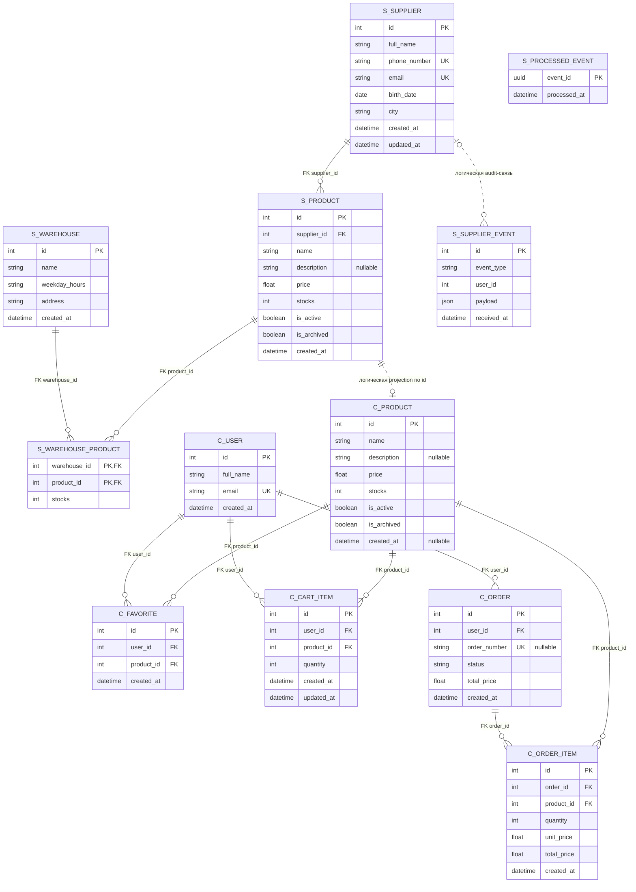

# Data Contract Specification AS IS

## 1. Назначение документа

Документ фиксирует фактическую модель данных текущей Marketplace-QA: хранилища, таблицы, поля, ключи, связи, владельцев, Source of Truth, вычисляемые и дублируемые значения, жизненный цикл и наблюдаемые ограничения согласованности.

Описание основано на SQLAlchemy-моделях, runtime schema code, API/event contracts и `docker-compose.yml`. Оно не проектирует будущую БД, не переименовывает сущности и не предлагает миграции.

## 2. Общая модель хранения

### 2.1. PostgreSQL databases

Система использует два независимых PostgreSQL 16 хранилища:

| Container | Database | External port | Named volume | Основные writers |
|---|---|---:|---|---|
| `supplier-postgres` | `supplier_db` | 5432 | `postgres_data` | `supplier-service`, `audit-consumer` |
| `customer-postgres` | `customer_db` | 5433 | `customer_postgres_data` | `customer-service` |

Отдельной `audit_db` нет. Audit rows записываются `audit-consumer` в `supplier_db`.

Приложения не обращаются напрямую к чужой БД: supplier-service не читает `customer_db`, customer-service не читает `supplier_db`. Межбазовая синхронизация Product/stock выполняется через Kafka и HTTP snapshot.

### 2.2. Персистентность

Named volumes сохраняют PostgreSQL data directories между пересозданиями application containers. Политика backup, retention и очистки volumes в репозитории не определена.

### 2.3. Создание и изменение schema

Отдельной системы миграций и migration files нет.

- Supplier-service вызывает `Base.metadata.create_all()` на startup.
- Затем проверяет таблицу `products` и выполняет runtime `ALTER TABLE`, добавляя `is_active` и `is_archived` с `NOT NULL DEFAULT`, если колонок нет.
- Customer-service вызывает свой `Base.metadata.create_all()`.
- При обнаружении legacy `orders` с колонками `product_id` и `quantity` он может добавить `order_number`, `total_price` и снять NOT NULL с legacy-колонок.
- Customer-service также добавляет отсутствующие product flags через runtime `ALTER TABLE`.
- Audit-consumer самостоятельно вызывает `create_all()` для своей metadata и тем самым создаёт `user_events`, если таблица отсутствует.

Полная совместимость произвольных старых схем этим кодом не определяется.

## 3. Data ownership и Source of Truth

| Сущность | Владелец | Source of Truth | Копии/проекции | Синхронизация |
|---|---|---|---|---|
| Supplier | `supplier-service` | `supplier_db.users` | JSON payload в `user_events` как audit snapshot | `supplier-events` в audit-consumer |
| Product | `supplier-service` | `supplier_db.products` | `customer_db.products`; Product data внутри Kafka payload | `product-events`, `product-stock-events`, HTTP `GET /products` snapshot |
| Warehouse | `supplier-service` | `supplier_db.warehouses` | Нет подтверждённых копий | Не синхронизируется в customer-service |
| WarehouseProduct / stock | `supplier-service` | `supplier_db.warehouse_products`; aggregate также в `supplier_db.products.stocks` | Только aggregate в `customer_db.products.stocks` | `product-stock-events`; Product snapshot также переносит stocks |
| Customer/User | `customer-service` | `customer_db.users` | Нет подтверждённых копий | Не синхронизируется наружу |
| Favorite | `customer-service` | `customer_db.favorites` | Нет | Только Customer API |
| CartItem | `customer-service` | `customer_db.cart_items` | Нет | Только Customer API; удаляется при создании Order |
| Order | `customer-service` | `customer_db.orders` | Supplier получает отдельные product/quantity events, но не Order entity | `ORDER_CREATED` после commit, без обратной синхронизации статуса |
| OrderItem | `customer-service` | `customer_db.order_items` | Product ID/quantity частично отражаются в `order-events` | По одному event на агрегированную Product position |
| SupplierEvent / audit row | `audit-consumer` как writer | `supplier_db.user_events` | Payload повторяет Supplier state на момент source event | Consumer `supplier-events` |
| ProcessedEvent | встроенный consumer `supplier-service` | `supplier_db.processed_events` | Нет | Создаётся при обработке `ORDER_CREATED` |

Организационный владелец данных в репозитории не указан; «владелец» в таблице означает компонент, фактически создающий и изменяющий записи.

## 4. `supplier_db` schema

### 4.1. Таблица `users` — ORM `Supplier`

**Назначение.** Основное хранение поставщиков. Физическое имя `users` не совпадает с доменным именем ORM `Supplier`.

**Владелец записи.** `supplier-service`.

| Поле | SQLAlchemy/DB contract | Nullable | Ключи/ограничения | Timestamp behavior |
|---|---|---:|---|---|
| `id` | integer | нет | PK, index | — |
| `full_name` | varchar(255) | нет | — | — |
| `phone_number` | varchar(30) | нет | UNIQUE | — |
| `email` | varchar(255) | нет | UNIQUE, index | — |
| `birth_date` | date | нет | — | — |
| `city` | varchar(120) | нет | — | — |
| `created_at` | timestamptz | нет | server default `now()` | назначается БД |
| `updated_at` | timestamptz | нет | server default `now()`, ORM `onupdate` | обновляется при ORM UPDATE |

**Foreign keys.** Нет исходящих. `products.supplier_id` ссылается на `users.id`.

**Кто пишет/читает.** Supplier CRUD пишет и читает; Product create/update читает для проверки owner; Supplier delete проверяет `products`.

**Связанные API/events.** `/suppliers`; `POST/PUT /products`; `SUPPLIER_CREATED`, `SUPPLIER_UPDATED`, `SUPPLIER_DELETED`.

**Ограничения и неоднозначности.** DB не проверяет формат email/телефона, длину имени минимум, возраст или город — это Pydantic-level checks. Phone нормализуется приложением. Supplier delete запрещён бизнес-логикой при наличии Product; DB FK без `ON DELETE` также не описывает cascade.

### 4.2. Таблица `products` — supplier Product

**Назначение.** Source of Truth карточки товара и денормализованного агрегированного остатка.

**Владелец записи.** `supplier-service`.

| Поле | SQLAlchemy/DB contract | Nullable | Ключи/ограничения | Timestamp behavior |
|---|---|---:|---|---|
| `id` | integer | нет | PK, index | — |
| `supplier_id` | integer | нет | FK `users.id`, index | — |
| `name` | varchar(255) | нет | — | — |
| `description` | varchar(1000) | да | — | — |
| `price` | float/double precision mapping | нет | — | — |
| `stocks` | integer | нет | — | — |
| `is_active` | boolean, ORM default true | нет | — | — |
| `is_archived` | boolean, ORM default false | нет | — | — |
| `created_at` | timestamptz | нет | server default `now()` | назначается БД |

**Foreign keys.** `supplier_id → users.id`. На Product ссылаются `warehouse_products.product_id` в той же БД. Межбазового FK на customer Product нет.

**Кто пишет/читает.** Supplier Product API; restock/delete Warehouse recalculation; supplier order consumer. Customer-service читает данные только через HTTP/events, не SQL.

**Связанные API/events.** `/products`, `/warehouses/{id}/stocks`, delete Warehouse; `PRODUCT_CREATED`, `PRODUCT_UPDATED`, stock events.

**Ограничения и неоднозначности.** DB не имеет CHECK `price>0`, `stocks>=0` или запрета active+archived. Эти правила обеспечиваются входными схемами/бизнес-логикой только на известных HTTP paths. Product не имеет `updated_at`, revision или SKU. DELETE архивирует строку; физического delete через API нет.

### 4.3. Таблица `warehouses`

**Назначение.** Хранение складов.

**Владелец записи.** `supplier-service`.

| Поле | DB contract | Nullable | Ключи/ограничения | Timestamp behavior |
|---|---|---:|---|---|
| `id` | integer | нет | PK, index | — |
| `name` | varchar(255) | нет | — | — |
| `weekday_hours` | varchar(255) | нет | — | — |
| `address` | varchar(500) | нет | — | — |
| `created_at` | timestamptz | нет | server default `now()` | назначается БД |

**Foreign keys.** Нет исходящих; `warehouse_products.warehouse_id` ссылается на `warehouses.id`.

**Кто пишет/читает.** Warehouse CRUD и stock endpoint.

**Связанные API/events.** `/warehouses`, `/warehouses/{id}/stocks`. Собственных Warehouse events нет; delete может вызвать stock events.

**Ограничения и неоднозначности.** Уникальность name/address и формат schedule не определены. `updated_at` отсутствует. При delete приложение вручную удаляет WarehouseProduct до Warehouse.

### 4.4. Таблица `warehouse_products`

**Назначение.** Фактический stock конкретного Product на конкретном Warehouse.

**Владелец записи.** `supplier-service`.

| Поле | DB contract | Nullable | Ключи/ограничения |
|---|---|---:|---|
| `warehouse_id` | integer | нет | составной PK, FK `warehouses.id` |
| `product_id` | integer | нет | составной PK, FK `products.id` |
| `stocks` | integer | нет | — |

**Primary key.** (`warehouse_id`, `product_id`) обеспечивает не более одной строки пары.

**Timestamps.** Отсутствуют.

**Кто пишет/читает.** Stock endpoint делает insert/update; delete Warehouse удаляет rows; order consumer читает и уменьшает rows; recalculation суммирует rows.

**Связанные API/events.** `POST /warehouses/{warehouse_id}/stocks`; `ORDER_CREATED` consumer; stock events публикуют aggregate, а не rows.

**Ограничения и неоднозначности.** DB CHECK `stocks>=0` отсутствует. HTTP restock валидирует non-negative; order consumer использует `min()` и не уводит известные rows ниже нуля. Истории, причины изменения, reservation и timestamp нет.

### 4.5. Таблица `processed_events`

**Назначение.** Дедупликация `ORDER_CREATED` в supplier order consumer.

**Владелец записи.** Встроенный consumer `supplier-service`.

| Поле | DB contract | Nullable | Ключи/ограничения | Timestamp behavior |
|---|---|---:|---|---|
| `event_id` | PostgreSQL UUID | нет | PK | ID приходит из события |
| `processed_at` | timestamptz | нет | server default `now()` | назначается БД |

**Foreign keys.** Нет. В записи нет Product ID или Order ID.

**Кто пишет/читает.** Только supplier order consumer через INSERT `ON CONFLICT DO NOTHING`.

**Связанные events.** `ORDER_CREATED`.

**Ограничения и неоднозначности.** Event может быть отмечен processed, даже если Product/warehouse rows отсутствовали или stock не изменился. При отсутствии `event_id` дедупликация не создаётся. Retention/cleanup не определены; восстановить business context по строке нельзя.

### 4.6. Таблица `user_events` — ORM `SupplierEvent`

**Назначение.** Audit rows входящих supplier events.

**Владелец записи.** `audit-consumer` пишет; физически таблица находится в `supplier_db`.

| Поле | DB contract | Nullable | Ключи/ограничения | Timestamp behavior |
|---|---|---:|---|---|
| `id` | integer | нет | PK | — |
| `event_type` | varchar(50) | нет | — | — |
| `user_id` | integer | нет | index, но не FK | ORM-атрибут называется `supplier_id` |
| `payload` | JSON | нет | — | Полный source payload |
| `received_at` | timestamptz | нет | server default `now()` | время записи consumer |

**Foreign keys.** Нет. Связь `user_id` с supplier `users.id` только логическая.

**Кто пишет/читает.** `audit-consumer` пишет каждое принятое supplier event. API чтения и application reader в репозитории отсутствуют.

**Связанные events.** `SUPPLIER_CREATED`, `SUPPLIER_UPDATED`, `SUPPLIER_DELETED`; consumer технически не фильтрует type.

**Ограничения и неоднозначности.** Нет event ID/unique constraint, поэтому дубли сохраняются. Payload schema не enforced DB. После delete Supplier audit row остаётся, поскольку FK нет. Retention и назначение чтения не определены.

## 5. `customer_db` schema

### 5.1. Таблица `users` — ORM `User`

**Назначение.** Source of Truth покупателей customer-service.

**Владелец записи.** `customer-service`.

| Поле | DB contract | Nullable | Ключи/ограничения | Timestamp behavior |
|---|---|---:|---|---|
| `id` | integer | нет | PK, index | — |
| `full_name` | varchar(255) | нет | — | — |
| `email` | varchar(255) | нет | UNIQUE, index | — |
| `created_at` | timestamptz | нет | server default `now()` | назначается БД |

**Relationships.** ORM relationships к favorites, cart items и orders имеют `cascade="all, delete-orphan"`. Публичного delete User endpoint нет; FK `ON DELETE` не задан.

**Кто пишет/читает.** Users API создаёт/читает; все favorites/cart/orders flows проверяют User.

**Связанные API/events.** `/users`; `user_id` не публикуется в `ORDER_CREATED`.

**Ограничения и неоднозначности.** Нет update/delete API, auth credentials, role или `updated_at`. DB не проверяет email format/min name length.

### 5.2. Таблица `products` — customer Product projection

**Назначение.** Локальная проекция supplier Product для customer reads и проверок cart/order.

**Владелец записи.** Технически writer — customer Kafka/HTTP sync; source owner — supplier-service.

| Поле | DB contract | Nullable | Ключи/ограничения | Source |
|---|---|---:|---|---|
| `id` | integer | нет | PK, index | supplier Product ID |
| `name` | varchar(255) | нет | — | Product event/snapshot |
| `description` | varchar(1000) | да | — | Product event/snapshot |
| `price` | float | нет | — | Product event/snapshot |
| `stocks` | integer | нет | — | Product/stock event/snapshot |
| `is_active` | boolean | нет | ORM default true | Product event/snapshot |
| `is_archived` | boolean | нет | ORM default false | Product event/snapshot |
| `created_at` | timestamptz | да | — | supplier Product created_at |

**Foreign keys.** Нет межбазового FK на supplier Product. На эту таблицу ссылаются favorites, cart items и order items.

**Кто пишет/читает.** Kafka consumer и snapshot sync пишут; catalog/favorites/cart/orders читают.

**Связанные events/API.** `PRODUCT_CREATED`, `PRODUCT_UPDATED`, поддерживаемый `PRODUCT_DELETED`, stock events; supplier `GET /products`; customer `/products`.

**Ограничения и неоднозначности.** `supplier_id` не сохраняется. Нет projection revision, updated timestamp или source event ID. DB не проверяет price/stock ranges или flag combination. Delete stale Product может быть отклонён FK из customer domain и только залогирован.

### 5.3. Таблица `favorites`

**Назначение.** Избранный Product User.

**Владелец записи.** `customer-service`.

| Поле | DB contract | Nullable | Ключи/ограничения | Timestamp behavior |
|---|---|---:|---|---|
| `id` | integer | нет | PK, index | — |
| `user_id` | integer | нет | FK `users.id`, index; часть UNIQUE pair | — |
| `product_id` | integer | нет | FK `products.id`, index; часть UNIQUE pair | — |
| `created_at` | timestamptz | нет | server default `now()` | назначается БД |

**Unique constraint.** `uq_favorites_user_product(user_id, product_id)`.

**Кто пишет/читает.** Favorites API.

**Связанные API/events.** `/favorites`; Kafka events напрямую не создаются.

**Ограничения и неоднозначности.** Product flags/stock не ограничивают создание Favorite. Исторический Product snapshot не хранится; API response строит текущий Product summary. `updated_at` отсутствует.

### 5.4. Таблица `cart_items`

**Назначение.** Текущее количество Product в корзине User.

**Владелец записи.** `customer-service`.

| Поле | DB contract | Nullable | Ключи/ограничения | Timestamp behavior |
|---|---|---:|---|---|
| `id` | integer | нет | PK, index | — |
| `user_id` | integer | нет | FK `users.id`, index; часть UNIQUE pair | — |
| `product_id` | integer | нет | FK `products.id`, index; часть UNIQUE pair | — |
| `quantity` | integer | нет | — | — |
| `created_at` | timestamptz | нет | server default `now()` | назначается БД |
| `updated_at` | timestamptz | нет | server default `now()`, ORM `onupdate` | обновляется при ORM UPDATE |

**Unique constraint.** `uq_cart_items_user_product(user_id, product_id)`.

**Кто пишет/читает.** Cart API; Order creation удаляет все rows User.

**Связанные API/events.** `/cart`, `POST /orders`. Cart changes не публикуют Kafka events.

**Ограничения и неоднозначности.** DB не имеет CHECK `quantity>0`; правило обеспечивается request schema. Price и reservation не хранятся. API response вычисляется по текущей Product projection. Создание Order из body items также очищает всю cart.

### 5.5. Таблица `orders`

**Назначение.** Source of Truth customer Order header.

**Владелец записи.** `customer-service`.

| Поле | DB contract | Nullable | Ключи/ограничения | Timestamp behavior |
|---|---|---:|---|---|
| `id` | integer | нет | PK, index | — |
| `user_id` | integer | нет | FK `users.id`, index | — |
| `order_number` | varchar(50) | да | UNIQUE, index | генерируется из ID приложением |
| `status` | varchar(20) | нет | index, ORM default `created` | — |
| `total_price` | float | нет | ORM default 0 | сохраняется при создании |
| `created_at` | timestamptz | нет | server default `now()` | назначается БД |

**Кто пишет/читает.** Orders API. Create устанавливает number/status/total; cancel меняет status.

**Связанные API/events.** `/orders`; `ORDER_CREATED` публикуется после commit, но order ID/number/status в event не входят.

**Ограничения и неоднозначности.** DB не ограничивает набор status; API фактически создаёт `created` и меняет на `cancelled`. Нет `updated_at`, `cancelled_at`, fulfillment status или supplier result. Rows с null order number скрыты list/detail queries.

### 5.6. Таблица `order_items`

**Назначение.** Позиции Order и ценовой snapshot на момент создания.

**Владелец записи.** `customer-service`.

| Поле | DB contract | Nullable | Ключи/ограничения | Timestamp behavior |
|---|---|---:|---|---|
| `id` | integer | нет | PK, index | — |
| `order_id` | integer | нет | FK `orders.id`, index | — |
| `product_id` | integer | нет | FK `products.id`, index | — |
| `quantity` | integer | нет | — | — |
| `unit_price` | float | нет | — | snapshot |
| `total_price` | float | нет | — | snapshot `unit_price × quantity` |
| `created_at` | timestamptz | нет | server default `now()` | назначается БД |

**Unique constraints.** На (`order_id`, `product_id`) DB constraint нет. Application агрегирует duplicate product IDs перед insert, но БД допускает дубли вне этого flow.

**Кто пишет/читает.** Order create пишет; order serializers читают.

**Связанные API/events.** `/orders`; product ID/quantity преобразуются в отдельные `ORDER_CREATED`.

**Ограничения и неоднозначности.** Name/description/flags/stock snapshot не хранится. API вкладывает текущий Product summary, поэтому historical price fields смешиваются с current Product data. Product FK делает Order response зависимым от сохранности projection row.

## 6. Relationships

| Связь | Тип | Физическое enforcement | Поведение текущего приложения |
|---|---|---|---|
| Supplier → Product | one-to-many | FK `supplier_db.products.supplier_id → users.id` | Supplier delete заранее блокируется, если есть Product |
| Warehouse → WarehouseProduct | one-to-many | FK `warehouse_products.warehouse_id → warehouses.id` | Delete Warehouse вручную удаляет rows |
| Supplier Product → WarehouseProduct | one-to-many | FK `warehouse_products.product_id → products.id` | Rows образуют aggregate stock |
| Customer User → Favorite | one-to-many | FK `favorites.user_id → users.id`; ORM cascade на User relationship | Favorite API управляет rows |
| Customer Product projection → Favorite | one-to-many | FK `favorites.product_id → products.id` | Может блокировать delete stale projection |
| Customer User → CartItem | one-to-many | FK; ORM cascade | Cart API/Order cleanup |
| Customer Product projection → CartItem | one-to-many | FK | Может блокировать delete projection |
| Customer User → Order | one-to-many | FK; ORM cascade | API фильтрует ownership по user ID |
| Order → OrderItem | one-to-many | FK `order_items.order_id → orders.id`; ORM cascade | Items создаются вместе с Order |
| Customer Product projection → OrderItem | one-to-many | FK `order_items.product_id → products.id` | Исторический Order зависит от projection row |
| Supplier Product → Customer Product | логическая one-ID projection | Межбазового FK нет | Kafka upsert и HTTP snapshot используют тот же Product ID |
| Supplier → SupplierEvent | логическая audit association | `user_events.user_id` не FK | Payload/ID приходят через supplier event |
| Customer OrderItem → supplier stock effect | логическая event-driven | FK/Order ID в supplier DB нет | `ORDER_CREATED` содержит только Product ID/quantity/event ID |

FK declarations не задают `ON DELETE CASCADE`. ORM cascade существует только на некоторых customer relationships и применяется при ORM-операциях над parent; публичного delete User/Order API нет.

## 7. Derived and duplicated data

### 7.1. Supplier Product aggregate stock

`supplier_db.products.stocks` — сохранённая денормализованная сумма `warehouse_products.stocks` для Product. Она пересчитывается после restock и delete Warehouse, а также supplier order consumer. DB trigger или CHECK согласованности отсутствует.

### 7.2. Product total price

`total_price` Product не является колонкой. Supplier и Customer API вычисляют `round(price × stocks, 2)` при сериализации.

### 7.3. Customer Product projection

Customer Product дублирует подмножество supplier Product: ID, карточку, price, aggregate stock, flags и created timestamp. `supplier_id` не копируется в БД. Данные обновляются event/snapshot paths и могут быть stale.

### 7.4. Cart totals

CartItem хранит только quantity и Product reference. `unit_price`, line `total_price`, cart total items и cart `total_price` вычисляются при чтении по текущей customer Product. Изменение projection price меняет видимую стоимость cart без UPDATE CartItem.

### 7.5. Order totals и snapshot

- `orders.total_price` сохраняется при создании как сумма line totals.
- `order_items.unit_price` и `order_items.total_price` сохраняют price snapshot.
- `order_items.quantity` сохраняется.
- Product name, current price внутри Product summary, stock и flags берутся при каждом ответе из текущей `customer_db.products`.

Следствие: один Order response смешивает исторические (`unit_price`, item/Order total, quantity) и текущие (`product.name`, `product.price`, stock, flags) значения. `item.product.price` может отличаться от `item.unit_price`. Полной исторической карточки Product в Order нет.

### 7.6. Supplier audit payload

`user_events.payload` дублирует Supplier public state на момент event. Это JSON snapshot без enforced schema, event ID или FK.

## 8. Data lifecycle

### 8.1. Supplier

Создаётся/изменяется Supplier API, физически удаляется только при отсутствии Product. После каждого mutating flow формируется supplier event; audit row создаётся асинхронно и может появиться позже или не появиться при delivery/consumer failure.

### 8.2. Product

Создаётся с `stocks=0`; карточка изменяется PUT; DELETE устанавливает `is_active=false`, `is_archived=true`, не удаляя row/warehouse stock. Product event асинхронно обновляет customer projection.

### 8.3. Warehouse

Создаётся/изменяется независимо от Product. При delete сначала удаляются его WarehouseProduct, затем Warehouse; после commit aggregates затронутых Product пересчитываются и публикуются.

### 8.4. Stock

Restock устанавливает абсолютное `warehouse_products.stocks` и пересчитывает aggregate. Order consumer уменьшает rows в порядке Warehouse ID и пересчитывает aggregate. Истории до/после нет.

### 8.5. Customer Product projection

Создаётся/upsert по product event или snapshot. Stock меняется stock event/snapshot. `PRODUCT_DELETED` consumer может удалить row, но current supplier его не публикует; snapshot также пытается удалить stale rows. FK может сохранить stale Product.

### 8.6. Favorite

Создаётся один раз на pair, повторный POST возвращает имеющуюся row. Физически удаляется DELETE. Product archive/inactive не удаляет Favorite.

### 8.7. CartItem

Создаётся или quantity увеличивается POST; PATCH заменяет quantity; DELETE удаляет. После успешного Order удаляются все CartItem User, включая создание Order из explicit body items.

### 8.8. Order и отмена

Order/OrderItem создаются и cart очищается одной customer DB transaction. После commit публикуются order events. Cancel меняет только `orders.status` на `cancelled`; items/totals/cart/stock не восстанавливаются, cancellation timestamp отсутствует.

### 8.9. SupplierEvent

Создаётся audit-consumer на каждое обработанное supplier event. Update/delete API отсутствуют. Duplicate delivery может создать дубли; retention не задан.

### 8.10. ProcessedEvent

Создаётся при первом order event ID в той же transaction, что inventory processing. Duplicate UUID не вставляется. Cleanup отсутствует; row может существовать и для no-op/skipped inventory result.

## 9. Data consistency

### 9.1. Внутри одной transaction

PostgreSQL обеспечивает атомарность операций в пределах конкретного commit. Например, Customer Order/OrderItem и удаление cart выполняются до одного commit; ProcessedEvent и supplier inventory changes — в одной consumer DB transaction.

Однако некоторые HTTP flows используют несколько commit: restock коммитит каждую warehouse row и отдельный aggregate по item; delete Warehouse коммитит удаление до последующих по-product recalculations.

### 9.2. Между databases

Supplier DB и customer DB согласуются eventual через Kafka/HTTP. Distributed transaction отсутствует. Customer projection может не содержать новый Product, старую цену/flags/stock или stale row.

### 9.3. DB/Kafka boundary

Outbox отсутствует. Producer вызывается после DB commit. Producer failure способен оставить:

- Supplier/Product/stock state без соответствующего event;
- Customer Order и очищенную cart без одного или нескольких `ORDER_CREATED`;
- supplier inventory decrease без доставленного stock update.

HTTP error после post-commit failure не означает rollback данных.

### 9.4. Stock и fulfillment

Customer проверяет stock по локальной projection. К моменту supplier processing он может измениться. Supplier consumer при недостатке уменьшает доступную часть, но не хранит remaining quantity/failure result и не меняет Customer Order. По текущим таблицам нельзя полностью реконструировать, был ли конкретный Order исполнен полностью: supplier side не хранит Order ID, а ProcessedEvent содержит только event UUID.

## 10. Data validation and constraints

### 10.1. Pydantic/API validation

- Supplier/User names и описательные строки: length constraints.
- Email: email format.
- Supplier phone: parsing/normalization российского номера.
- Product name: trim и non-empty.
- Product price: `>0`.
- Input stock: `>=0`; stock request items non-empty.
- IDs/quantity в customer request bodies: `>0`.
- Warehouse strings: min/max lengths.

Эти проверки применяются только к соответствующим API paths и не становятся DB CHECK constraints.

### 10.2. DB constraints

- PK всех сущностей; составной PK WarehouseProduct.
- FK связей внутри каждой БД.
- UNIQUE supplier phone/email, customer user email, order number.
- UNIQUE user–product pair для favorites и cart items.
- NOT NULL согласно моделям.
- Server defaults timestamps; ORM defaults flags/status/totals.

### 10.3. Business logic

- Supplier должен существовать для Product.
- Active+archived Product запрещён на create/update Supplier API.
- Supplier с Product не удаляется.
- Aggregate stock пересчитывается приложением.
- Cart/Order блокируют archived/inactive Product и quantity выше local stock.
- Favorites flags не проверяет.
- Duplicate Order product IDs агрегируются application logic.
- Повторная отмена Order запрещена.

### 10.4. Что не проверяется DB

- price positivity;
- stock/quantity non-negativity;
- допустимые combinations product flags;
- enum/order transitions status;
- uniqueness Product/Warehouse names;
- order item uniqueness по Order/Product;
- consistency saved aggregate с warehouse rows;
- consistency customer projection с supplier source;
- monetary currency/precision beyond float behavior;
- schema JSON audit payload.

## 11. Mermaid ER diagram

Имена с префиксом `S_` относятся к `supplier_db`, с `C_` — к `customer_db`. Связь `S_PRODUCT`–`C_PRODUCT` логическая/event-driven и не является FK. Аналогично Supplier–audit association не имеет FK.

`S_PROCESSED_EVENT` намеренно показан без relationship: таблица не хранит Product/Order FK. Точные nullable/unique/key constraints перечислены в разделах 4–5; межбазовые пунктирные связи остаются только логическими.

## 12. QA Checklist

### API и записи

- После create/update/delete сопоставить HTTP response, row и timestamps.
- Проверить, что Product DELETE меняет flags, а не удаляет row.
- Проверить, что Supplier delete блокируется связанным Product.
- Проверить Warehouse delete и ручное удаление WarehouseProduct.

### Keys и constraints

- Проверить duplicate supplier email/phone и customer email.
- Проверить duplicate favorite/cart pair.
- Проверить FK для неизвестных parent IDs и отсутствие межбазового FK.
- Проверить nullable description/customer Product created_at/order number.

### Stock и projection

- Сопоставить сумму WarehouseProduct с supplier Product.stocks.
- Проверить несколько Warehouse, zero stock, delete Warehouse и order decrease.
- Сопоставить supplier Product с customer projection после lag.
- Проверить stale projection и blocked deletion из-за customer FK.

### Cart и Order snapshot

- Изменить Product price после добавления в cart: cart total должен пересчитаться.
- Создать Order и проверить сохранённые unit/line/order totals.
- Затем изменить Product и проверить различие historical price и current Product summary.
- Проверить агрегацию duplicate Product в OrderItem application flow.

### Commit boundaries

- При controlled producer failure проверить DB side effects после HTTP error.
- При multi-item restock проверить partial commit до поздней ошибки.
- При cancel с проблемой сериализации проверить сохранённый status.
- Проверить eventual consistency supplier/customer и отсутствие distributed rollback.

### Audit/idempotency

- Сопоставить supplier event с `user_events` payload.
- Повторить audit message и проверить duplicate row.
- Повторить `ORDER_CREATED` UUID и проверить одну inventory mutation/один ProcessedEvent.
- Проверить ProcessedEvent при missing Product/warehouse rows.

## 13. Known limitations

- Supplier хранится в таблице `users`; audit — в `user_events`.
- `audit-consumer` пишет в `supplier_db`; отдельной audit DB нет.
- Нет migration framework/files; используются `create_all` и runtime `ALTER TABLE`.
- Денежные значения хранятся как float.
- Product data дублируется между двумя БД.
- Projection не имеет revision/version/source event ID.
- Нет полной historical Product snapshot в Order, кроме prices/quantity.
- Нет warehouse stock history, reservation или change reason.
- Aggregate stock хранится денормализованно без DB enforcement.
- Audit association и межбазовая Product projection не enforced FK.
- ProcessedEvent не содержит business context и не имеет retention policy.
- Order status не ограничен DB enum/check и не отражает supplier fulfillment.
- Некоторые flows используют несколько commits и допускают partial side effects.
- FK customer Product делает historical entities зависимыми от projection row.

## 14. Open questions

1. Нужно ли переименовать физические `users`/`user_events` в соответствии с доменной терминологией? Текущий код ответа не даёт.
2. Нужна ли отдельная audit DB и кто владеет audit data? В AS IS её нет.
3. Какая валюта и точность требуются для денежных значений и должен ли float считаться стабильным контрактом?
4. Нужна ли история warehouse stock и причины его изменения?
5. Нужен ли полный historical Product snapshot в Order, а не только price/quantity?
6. Как должен версионироваться database schema? Текущий репозиторий использует runtime creation/alter.
7. Какова retention policy audit rows и processed event IDs?
8. Должна ли customer Product projection сохранять supplier ID, source revision и timestamp?
9. Какие DB/application constraints нужны в future 2.0, из текущей реализации установить невозможно.
