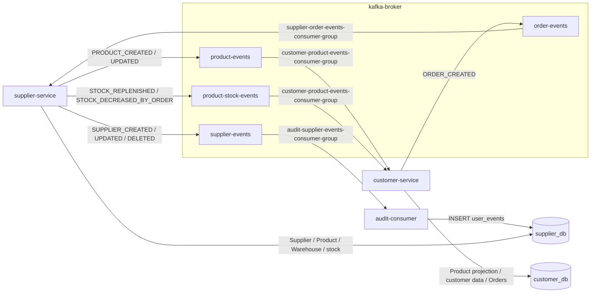
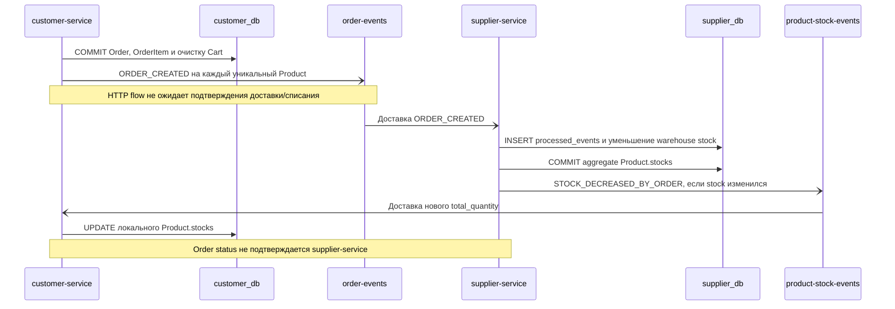

# Kafka Event Contract Specification AS IS

## 1. Назначение документа

Документ фиксирует фактический контракт Kafka-событий Marketplace-QA: топологию, producer и consumer, ключи, наблюдаемые JSON-структуры, типы событий, побочные эффекты, retry/offset behavior и ограничения текущей реализации.

Описание основано на `docker-compose.yml`, producer/consumer-коде трёх приложений и ранее созданных API/системных контрактах. Документ не определяет будущие события или целевую архитектуру.

## 2. Общая Kafka-топология

### 2.1. Инфраструктура

`kafka-broker` — единственный Kafka 4.2.0 container. Он одновременно выполняет роли broker и controller в KRaft. Bootstrap address внутри Compose — `kafka-broker:9092`. Replication factor внутренних служебных топиков установлен в 1.

`kafka-ui` подключается к тому же bootstrap address и предоставляет технический интерфейс на локальном порту `8080`. Собственных прикладных событий он не производит и не потребляет как доменный consumer.

`KAFKA_AUTO_CREATE_TOPICS_ENABLE=true`: прикладные топики создаются broker автоматически при обращении. Явного provisioning топиков, partition count, retention или прикладного replication factor в репозитории нет.

### 2.2. Прикладные топики

| Topic | Producer | Consumer | Consumer group |
|---|---|---|---|
| `supplier-events` | `supplier-service` | `audit-consumer` | `audit-supplier-events-consumer-group` |
| `product-events` | `supplier-service` | `customer-service` | `customer-product-events-consumer-group` |
| `product-stock-events` | `supplier-service` | `customer-service` | `customer-product-events-consumer-group` |
| `order-events` | `customer-service` | встроенный consumer `supplier-service` | `supplier-order-events-consumer-group` |

Customer consumer подписывается одним Consumer instance и одной group сразу на `product-events` и `product-stock-events`.

### 2.3. Общие consumer settings

Все три consumer используют:

- `auto.offset.reset=earliest`;
- `enable.auto.commit=false`;
- metadata refresh interval 5000 ms;
- ручной commit конкретного сообщения после возврата обработчика без исключения;
- до трёх попыток обработки одного полученного сообщения;
- паузу одну секунду между неуспешными попытками;
- повторный вход во внешний consume loop через пять секунд после общей ошибки.

После трёх неуспешных попыток сообщение логируется с текстом `dead letter`. Отдельного dead-letter topic и механизма переноса сообщения нет. Offset этого сообщения в данной ветке не коммитится, однако consumer loop продолжает работу; дальнейшее поведение повторной доставки зависит от позиции consumer и последующего restart/rebalance.

## 3. Общий формат событий

Все producer сериализуют сообщение как JSON bytes и добавляют `event_version=1`, если поле ещё не задано. Единой строгой schema, общей envelope-модели или schema registry в репозитории нет.

### 3.1. Наблюдаемые варианты envelope

Supplier и Product events имеют вложенный payload:

```json
{
  "event_type": "...",
  "payload": {},
  "event_version": 1
}
```

Stock events имеют прямые предметные поля:

```json
{
  "event_type": "...",
  "product_id": 1,
  "total_quantity": 10,
  "event_version": 1
}
```

Order events также имеют прямые поля и единственные содержат `event_id`:

```json
{
  "event_id": "UUID",
  "event_type": "ORDER_CREATED",
  "product_id": 1,
  "quantity": 2,
  "event_version": 1
}
```

### 3.2. Общие поля

- `event_type` — строка, определяющая ветку обработки.
- `event_version` — integer 1 у текущих producer. Consumer читают значение с default 1 и логируют его, но не валидируют и не ветвят обработку по версии.
- `payload` — используется только supplier/product event families.
- `event_id` — UUID string только в текущих `ORDER_CREATED`.
- Kafka key — строковое представление entity ID: supplier/product ID для соответствующих событий; product ID для stock/order events.

Top-level event timestamp, revision, sequence number и correlation с HTTP request отсутствуют. Вложенные entity payload могут содержать собственные timestamps, но они не являются общей metadata события.

## 4. Topic: `supplier-events`

### 4.1. Producer и consumer

- Producer: `supplier-service`.
- Consumer: отдельный процесс `audit-consumer`.
- Consumer group: `audit-supplier-events-consumer-group`.
- Key: supplier ID как строка.

### 4.2. Event types

- `SUPPLIER_CREATED`;
- `SUPPLIER_UPDATED`;
- `SUPPLIER_DELETED`.

### 4.3. Payload structure

| Поле | Содержание |
|---|---|
| `event_type` | Один из трёх типов выше |
| `payload.id` | Supplier ID |
| `payload.full_name` | Полное имя |
| `payload.phone_number` | Нормализованный телефон |
| `payload.email` | Email |
| `payload.birth_date` | Дата рождения в JSON-представлении |
| `payload.city` | Город |
| `payload.created_at` | Время создания в JSON-представлении |
| `payload.updated_at` | Время обновления в JSON-представлении |
| `event_version` | `1` |

`event_id` отсутствует.

### 4.4. Момент публикации

- `SUPPLIER_CREATED` — после commit INSERT и refresh Supplier.
- `SUPPLIER_UPDATED` — после успешного commit/refresh update; пустой update body также проходит publish path.
- `SUPPLIER_DELETED` — после commit DELETE; payload формируется из Supplier до удаления.

### 4.5. Consumer side effects

Audit consumer не фильтрует известные event types. Он читает `payload`, создаёт `SupplierEvent` и коммитит строку в таблицу `user_events` базы `supplier_db`:

- `event_type` из сообщения;
- supplier ID из `payload.id` в физическую колонку `user_id`;
- весь `payload` как JSON;
- `received_at` назначается БД.

После DB commit consumer вручную коммитит Kafka offset.

### 4.6. Delivery и ограничения

- Отдельной дедупликации нет; повторное сообщение создаёт ещё одну audit row.
- Supplier event не содержит `event_id`.
- Producer не ожидает delivery confirmation.
- Audit хранится в общей `supplier_db`, а не отдельном хранилище.
- Consumer ожидает наличие `payload` и `payload.id`; malformed message проходит retry, затем логируется как dead letter без отдельного топика.

## 5. Topic: `product-events`

### 5.1. Producer и consumer

- Producer: `supplier-service`.
- Consumer: daemon-thread внутри `customer-service`.
- Consumer group: `customer-product-events-consumer-group`.
- Key: product ID как строка.

### 5.2. Event types

Фактически публикуются:

- `PRODUCT_CREATED`;
- `PRODUCT_UPDATED`.

Customer consumer дополнительно содержит ветку `PRODUCT_DELETED`, но supplier-service её не публикует. Supplier DELETE Product архивирует запись и публикует `PRODUCT_UPDATED`.

### 5.3. Payload structure

| Поле | Содержание |
|---|---|
| `event_type` | `PRODUCT_CREATED` или `PRODUCT_UPDATED` |
| `payload.id` | Product ID |
| `payload.supplier_id` | Supplier owner ID |
| `payload.name` | Название |
| `payload.description` | Nullable описание |
| `payload.price` | Цена |
| `payload.stocks` | Агрегированный supplier stock на момент формирования |
| `payload.total_price` | Вычисленное `price × stocks` |
| `payload.is_active` | Active flag |
| `payload.is_archived` | Archived flag |
| `payload.created_at` | Время создания |
| `event_version` | `1` |

Customer projection сохраняет ID, name, description, price, stocks, flags и created_at. `supplier_id` и входной `total_price` не сохраняются; customer API рассчитывает total price заново.

### 5.4. Момент публикации

- После commit/refresh создания Product (`PRODUCT_CREATED`).
- После commit/refresh update Product (`PRODUCT_UPDATED`).
- После commit архивирования через DELETE (`PRODUCT_UPDATED`).

### 5.5. Consumer processing

Для `PRODUCT_CREATED` и `PRODUCT_UPDATED` customer-service выполняет PostgreSQL upsert по Product ID. Если все сравниваемые поля уже совпадают, DB write пропускается. После успешного/no-op handler outer loop коммитит offset.

Для `PRODUCT_DELETED` consumer пытается физически удалить локальную Product. Если FK из favorites, cart или order items вызывает `IntegrityError`, deletion откатывается, helper возвращает `False`, но исключение наружу не выходит; Kafka offset затем коммитится, а локальная Product остаётся.

Неизвестный `event_type` логируется как skipped; обработчик возвращается без исключения, поэтому offset также коммитится.

### 5.6. Затрагиваемые таблицы и ограничения

- `customer_db.products`: INSERT/UPDATE или попытка DELETE.
- Дедупликации по `event_id` нет; upsert даёт идемпотентный результат только для одинакового итогового payload.
- Нет revision/timestamp для защиты от более старого события, пришедшего после нового.
- Consumer default-значения для отсутствующих flags: active=true, archived=false.
- Обязательные payload fields не проверяются отдельной schema; ошибка ключа/формата проходит retry.

## 6. Topic: `product-stock-events`

### 6.1. Producer и consumer

- Producer: `supplier-service`, включая HTTP stock flows и order consumer flow.
- Consumer: тот же daemon-thread `customer-service`.
- Consumer group: `customer-product-events-consumer-group`.
- Key: product ID как строка.

### 6.2. Event types

- `STOCK_REPLENISHED`;
- `STOCK_DECREASED_BY_ORDER`.

Customer consumer для stock topic не ветвится по `event_type`: он применяет любое сообщение этого topic, если необходимые поля доступны.

### 6.3. Payload structure

| Поле | Содержание |
|---|---|
| `event_type` | Один из типов выше у текущего producer |
| `product_id` | Product ID |
| `total_quantity` | Новый supplier aggregate |
| `event_version` | `1` |

Consumer читает `total_quantity`; если оно отсутствует, использует fallback-поле `stocks`. Текущий supplier producer отправляет `total_quantity` и не отправляет `stocks`.

### 6.4. Момент публикации

`STOCK_REPLENISHED` публикуется:

- после установки warehouse stock и пересчёта Product;
- после удаления Warehouse и пересчёта каждого затронутого Product.

Название используется и когда итоговый aggregate уменьшается. При duplicate product IDs в одном restock request событие формируется только для первого вхождения, хотя последующие значения также коммитятся.

`STOCK_DECREASED_BY_ORDER` публикуется supplier order consumer после commit inventory changes, только если агрегированный stock фактически изменился.

### 6.5. Customer processing и snapshot fallback

Consumer ищет локальную Product:

- если Product есть и stock отличается, обновляет `products.stocks` и коммитит;
- если Product отсутствует или stock уже равен событию, helper возвращает `False`;
- при `False` выполняется полный HTTP `GET /products` supplier-service, upsert snapshot и попытка удалить stale local products;
- после snapshot consumer повторяет stock update.

Таким образом, snapshot fallback запускается не только для отсутствующего Product, но и для stock no-op. Если HTTP sync не удался, ошибка перехватывается внутри sync, после чего повторный update может остаться no-op; outer message handler всё равно завершается и offset коммитится.

### 6.6. Затрагиваемые таблицы и ограничения

- Основной effect: UPDATE `customer_db.products.stocks`.
- Snapshot fallback может INSERT/UPDATE/пытаться DELETE множество local Product.
- Нет event ID/deduplication.
- Нет проверки event type или non-negative total quantity на consumer boundary.
- Старое stock event может перезаписать более новое значение; revision/order guard отсутствует.
- Событие не содержит warehouse breakdown или причины/ссылки на Order.

## 7. Topic: `order-events`

### 7.1. Producer и consumer

- Producer: `customer-service`.
- Consumer: daemon-thread внутри `supplier-service`.
- Consumer group: `supplier-order-events-consumer-group`.
- Key: product ID как строка.
- Фактический тип: `ORDER_CREATED`.

### 7.2. Payload structure

| Поле | Содержание |
|---|---|
| `event_id` | Новый UUID string для одной product position event |
| `event_type` | `ORDER_CREATED` |
| `product_id` | Product ID |
| `quantity` | Агрегированное количество Product в Order |
| `event_version` | `1` |

Не передаются:

- `order_id`;
- `order_number`;
- `user_id`;
- unit price или total price.

Если один Order содержит несколько уникальных Product, customer-service публикует отдельное событие с отдельным event ID для каждого Product. Duplicate product IDs request body предварительно агрегируются.

### 7.3. Момент публикации

Customer-service сначала одной DB transaction создаёт `orders`/`order_items`, удаляет все cart items User и делает commit. Затем последовательно вызывает producer для каждой позиции. Между commit и публикациями нет общей транзакции.

### 7.4. Supplier processing

1. Consumer принимает только `event_type=ORDER_CREATED`. Другой type логируется как skipped, затем offset коммитится.
2. При наличии `event_id` supplier пытается INSERT UUID в `processed_events` через `ON CONFLICT DO NOTHING`.
3. Duplicate event ID откатывает текущую session и пропускается; offset коммитится.
4. Product и его `warehouse_products` читаются из `supplier_db`.
5. Warehouse rows сортируются по `warehouse_id`; quantity последовательно вычитается из них.
6. `products.stocks` пересчитывается как сумма warehouse rows.
7. Inventory changes и новый `ProcessedEvent` коммитятся одной DB transaction.
8. При фактическом изменении aggregate публикуется `STOCK_DECREASED_BY_ORDER`.
9. Outer loop коммитит offset, если обработчик не выбросил исключение.

### 7.5. Идемпотентность и partial decrease

UUID в `processed_events` обеспечивает дедупликацию текущих order events. Если `event_id` отсутствует, helper разрешает обработку без дедупликации.

Если Product или warehouse rows отсутствуют, либо stock не изменился, event ID всё равно коммитится в `processed_events`, handler возвращает skipped, а Kafka offset коммитится. Повторно это событие не применяется.

Если requested quantity превышает фактический stock, consumer вычитает всё доступное до нуля и не считает остаток запроса ошибкой. Это partial fulfillment относительно события: Order status в customer-service не меняется, результат с конкретным Order не связывается.

### 7.6. Затрагиваемые таблицы и ограничения

- `supplier_db.processed_events`: INSERT event ID.
- `supplier_db.warehouse_products`: UPDATE stock rows.
- `supplier_db.products`: UPDATE aggregate stock.
- Нет order-level entity/таблицы в supplier-service.
- Невозможно по event связать effect с customer Order.
- Нет confirmation/rejection event и обратного status flow.
- Producer failure после customer DB commit может оставить Order без опубликованного события; при нескольких positions возможна публикация только части набора.

## 8. Consumer processing model

### 8.1. Runtime placement

- Supplier order consumer запускается один раз daemon-thread внутри процесса `supplier-service` на FastAPI startup.
- Customer product/stock consumer запускается один раз daemon-thread внутри процесса `customer-service` на startup.
- `audit-consumer` — самостоятельный container/process без HTTP API; consume loop выполняется в main thread.

Флаг `_started` и process-local lock защищают только от повторного старта thread внутри одного процесса. Поведение при нескольких process/replicas определяется обычной Kafka consumer group semantics, но такая топология Compose не описана.

### 8.2. Retry и offset commit

Каждое доставленное сообщение обрабатывается максимум три раза в текущем poll iteration. После успешного возврата handler вызывается synchronous `consumer.commit(message=message)`. Commit выполняется и для логически skipped/no-op сообщений, если handler не выбросил исключение.

При exception:

1. ошибка логируется;
2. consumer ждёт одну секунду;
3. повторяет тот же handler до трёх раз;
4. после третьего failure пишет log `dead letter`;
5. offset сообщения в этой ветке не коммитится;
6. отдельное хранилище или topic для сообщения не используется.

Термин `dead letter` в реализации означает только log line. Он не означает, что сообщение перемещено или сохранено отдельно.

Если DB side effect завершён, но вызов `consumer.commit()` выбрасывает исключение, retry повторно вызывает handler. Последствия зависят от consumer: audit может добавить повторную строку, product upsert/stock assignment обычно сходятся к тому же состоянию, а order consumer защищён UUID в `processed_events`, если event ID присутствует.

## 9. Producer behavior

Оба producer имеют одинаковую базовую механику:

1. добавляют `event_version=1` через `setdefault`;
2. JSON-сериализуют payload (`default=str`);
3. вызывают `producer.produce(topic, key=..., value=...)`;
4. вызывают `producer.poll(0)`.

Delivery callback не передаётся. `flush()` и явное ожидание broker acknowledgment перед возвратом отсутствуют.

HTTP handlers публикуют события после DB commit. Следствия текущего порядка:

- producer exception может привести к HTTP 500 после уже сохранённого Supplier/Product/stock/Order;
- для Order к этому моменту cart уже очищена;
- повтор HTTP-запроса после 500 может создать повторный бизнес-effect;
- отсутствие synchronous exception не подтверждает фактическую доставку сообщения;
- HTTP success также не является delivery confirmation.

Supplier order consumer тоже публикует stock event после commit supplier inventory. Producer exception вызывает retry всего order message; благодаря `processed_events` следующая попытка увидит duplicate ID и пропустит inventory, после чего outer loop коммитит order offset. Повторная попытка при этом не перепубликует потерянный stock event.

## 10. Eventual consistency

Supplier-service и `supplier_db` являются Source of Truth для Supplier, Product, Warehouse и stock. Customer-service хранит локальную Product projection.

Проекция обновляется асинхронно:

- карточки/flags — через `product-events`;
- aggregates — через `product-stock-events`;
- полный snapshot — HTTP sync на startup и fallback в stock consumer.

Временный рассинхрон возможен:

- между supplier DB commit и обработкой product/stock event;
- между Order commit и supplier inventory decrease;
- между supplier inventory decrease и обновлением customer stock;
- после producer failure;
- при consumer retry, restart или malformed message;
- при невозможности удалить stale customer Product из-за FK.

События не имеют общей revision, source sequence или top-level occurred-at timestamp. Consumer не сравнивает версии состояния. Kafka key группирует события одной сущности внутри конкретного topic/partition, но product card и stock идут по разным топикам; общий порядок между ними кодом не устанавливается.

Допустимый lag/SLA не определён.

## 11. Mermaid-схемы

### 11.1. Kafka topology



### 11.2. Order event flow



## 12. QA Checklist

### Публикация и структура

- Проверить факт/отсутствие события для каждого HTTP/consumer flow.
- Проверить правильный topic и key.
- Проверить точный `event_type` и `event_version=1`.
- Проверить обязательные payload/direct fields и типы значений.
- Проверить, что supplier/product events вложены в `payload`, а stock/order используют direct fields.
- Проверить отсутствие непредусмотренных order fields (`order_id`, number, user, price).

### Consumer effects

- Сопоставить событие с изменением нужной таблицы.
- Проверить manual offset commit после processed, skipped и no-op messages.
- Проверить до трёх retry на malformed/transient failure.
- Проверить, что `dead letter` существует только в логах и отдельный topic не появляется.
- Проверить unknown event types и их commit behavior.

### Дубли и порядок

- Повторить supplier/product/stock event и наблюдать отсутствие общей event-ID дедупликации.
- Повторить `ORDER_CREATED` с тем же UUID и проверить одну inventory mutation.
- Отправить order event без event ID и зафиксировать отсутствие дедупликации.
- Проверить старые/новые события и отсутствие revision guard.

### Eventual consistency и order flow

- Измерить lag supplier commit → customer projection без предположения SLA.
- Проверить startup snapshot sync и stock fallback sync.
- Создать multi-product Order и проверить отдельное событие на каждый Product.
- Проверить достаточный, недостаточный, нулевой stock и отсутствие warehouse rows.
- Проверить цепочку `ORDER_CREATED` → inventory DB → `STOCK_DECREASED_BY_ORDER` → customer stock.
- Убедиться, что cancel Order не публикует Kafka event и не возвращает stock.
- Проверить, что архивирование Product публикует `PRODUCT_UPDATED`, а не `PRODUCT_DELETED`.

## 13. Known limitations

- Нет формальных JSON Schema, Avro, Protobuf, AsyncAPI или schema registry contracts.
- Нет отдельного dead-letter topic.
- Нет outbox между DB transaction и Kafka producer.
- Нет delivery callback/confirmation и `flush()` в producer path.
- Нет order confirmation/status events.
- Supplier, Product и stock events не имеют `event_id`.
- Дедупликация по event ID реализована только для order events.
- Нет top-level timestamp/revision для ordering state.
- Event version логируется, но не валидируется и не управляет compatibility.
- Product card и stock передаются по разным topics без общей ordering revision.
- Один broker; replication/resilience прикладного кластера не описаны.
- Auto topic creation включён; явные topic settings отсутствуют.
- Нет определённого SLA доставки/lag.
- Retry после post-commit stock producer failure может завершиться duplicate skip без повторной stock publication.
- Ошибка offset commit после DB commit может вызвать повторную обработку; общая дедупликация есть не у всех event families.
- Logical dead letter остаётся только записью в логах.

## 14. Open questions

1. Нужен ли единый event envelope для всех event families? Текущая реализация использует два формата.
2. Нужен ли `event_id` для всех событий и какая дедупликация ожидается? Сейчас ответ определён только для order events.
3. Нужен ли отдельный dead-letter mechanism/topic и какова его семантика? Текущий код этого не определяет.
4. Нужен ли outbox для согласования DB commit и публикации? Текущая реализация его не содержит.
5. Нужен ли order confirmation/rejection flow и как он связан со status? Текущего события нет.
6. Где и в каком формате должны храниться event schemas? В репозитории source of truth схем отсутствует.
7. Как должны обрабатываться partial stock decrease, отсутствующий Product/warehouse rows и потерянный stock event?
8. Каковы ожидаемые delivery, ordering, retention и lag guarantees?
9. Какие guarantees должны быть определены для future 2.0, из текущего кода установить невозможно.
