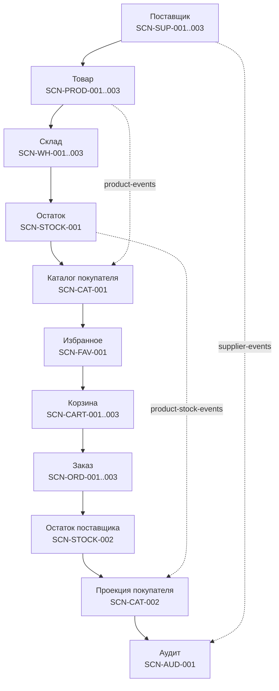

# Спецификация бизнес-сценариев AS IS

## 1. Назначение и границы

Документ описывает 21 фактический сквозной бизнес-сценарий Marketplace-QA. Он показывает взаимодействие API, сервисов, БД и Kafka без повторения полных контрактов. Сценарий считается завершённым на границе, которую реально реализует система; асинхронные продолжения отмечаются отдельно.

## 2. Сценарии

## Сценарий 1. Регистрация поставщика

### Идентификатор

`SCN-SUP-001`.

### Название

Регистрация поставщика.

### Цель

Создать Supplier и инициировать его аудит.

### Участники

- Инициатор: человек/тестировщик через Supplier API.
- Выполняет синхронную часть: `supplier-service` (`POST /suppliers`).
- Асинхронно завершает audit effect: `audit-consumer`.

### Предусловия

- Supplier-service, `supplier_db` и Kafka доступны.
- Email и нормализованный телефон ещё не заняты.
- Eventual consistency применяется только к появлению audit row.

### Основной сценарий

1. Инициатор отправляет обязательные данные Supplier.
2. Supplier-service проверяет длины, email, дату и формат телефона.
3. Телефон нормализуется в формат `+7XXXXXXXXXX`.
4. Сервис вставляет строку в `supplier_db.users` и делает commit.
5. Сервис формирует и ставит `SUPPLIER_CREATED` в `supplier-events`.
6. API возвращает HTTP 201 с ID и timestamps.
7. Audit-consumer позднее сохраняет payload в `supplier_db.user_events`.

### Альтернативные сценарии

- Номер с начальной `8` преобразуется в `+7`.
- Разделители в телефоне удаляются до проверки.

### Ошибки

`validation_error`, `supplier_conflict`, `internal_error`. Producer error возможен после commit Supplier.

### Kafka события

`SUPPLIER_CREATED`, topic `supplier-events`, key = Supplier ID.

### Изменяемые таблицы

Синхронно `supplier_db.users`; асинхронно `supplier_db.user_events`.

### Конечное состояние

Supplier сохранён. Audit row появляется eventual при успешной доставке/обработке.

### Связанные Business Rules

`BR-SUP-001`–`BR-SUP-003`, `BR-SUP-007`, `BR-AUD-001`–`BR-AUD-004`, `BR-CONS-003`, `BR-CONS-004`.

### QA Checklist

- Проверить normalization и unique conflicts.
- Сопоставить API row/event/audit payload.
- Проверить состояние DB при producer failure.

### Ограничения

Auth отсутствует; HTTP success не подтверждает audit delivery.

## Сценарий 2. Изменение поставщика

### Идентификатор

`SCN-SUP-002`.

### Название

Изменение поставщика.

### Цель

Изменить переданные Supplier fields и зафиксировать audit event.

### Участники

- Инициатор: человек/тестировщик.
- Синхронно: `supplier-service` (`PUT /suppliers/{supplier_id}`).
- Асинхронно: `audit-consumer`.

### Предусловия

- Supplier существует.
- Новые email/phone не конфликтуют.
- Audit часть eventual.

### Основной сценарий

1. Инициатор передаёт Supplier ID и подмножество полей.
2. Сервис находит строку `users`.
3. Переданные поля валидируются; phone при наличии нормализуется.
4. Только переданные значения присваиваются ORM entity.
5. Изменения коммитятся, Supplier обновляется из БД.
6. Публикуется `SUPPLIER_UPDATED` с полным итоговым состоянием.
7. API возвращает HTTP 200; audit-consumer позднее добавляет audit row.

### Альтернативные сценарии

- Пустой JSON проходит commit/publish path и возвращает текущее состояние.
- Непереданные поля сохраняются.

### Ошибки

`validation_error`, `supplier_not_found`, `supplier_conflict`, `internal_error`.

### Kafka события

`SUPPLIER_UPDATED` в `supplier-events`.

### Изменяемые таблицы

`supplier_db.users`; затем `user_events`.

### Конечное состояние

Supplier содержит итоговое partial-update state; audit отражает payload event.

### Связанные Business Rules

`BR-SUP-002`, `BR-SUP-003`, `BR-SUP-005`, `BR-SUP-007`, `BR-AUD-002`, `BR-CONS-004`.

### QA Checklist

- Обновить поля отдельно/вместе и пустым body.
- Проверить phone/email conflict и `updated_at`.
- Проверить event после commit.

### Ограничения

PUT фактически partial; явный null может дать integrity conflict. Event delivery не подтверждается.

## Сценарий 3. Удаление поставщика

### Идентификатор

`SCN-SUP-003`.

### Название

Удаление поставщика.

### Цель

Физически удалить Supplier без Product и сохранить audit snapshot.

### Участники

- Инициатор: человек/тестировщик.
- Синхронно завершает удаление: `supplier-service` (`DELETE /suppliers/{id}`).
- Асинхронно завершает аудит: `audit-consumer`.

### Предусловия

- Supplier существует.
- У Supplier нет ни active, ни inactive, ни archived Product.

### Основной сценарий

1. Инициатор отправляет DELETE с Supplier ID.
2. Сервис читает Supplier из `users`.
3. Сервис проверяет наличие любого `products.supplier_id`.
4. До удаления формируется публичный snapshot Supplier.
5. Строка Supplier удаляется и transaction коммитится.
6. Публикуется `SUPPLIER_DELETED` со snapshot.
7. Возвращается 204; audit-consumer сохраняет payload без FK на удалённую строку.

### Альтернативные сценарии

- При наличии archived Product удаление блокируется так же, как при active Product.

### Ошибки

`validation_error`, `supplier_not_found`, `supplier_has_products`, `internal_error`.

### Kafka события

`SUPPLIER_DELETED` в `supplier-events`.

### Изменяемые таблицы

DELETE `supplier_db.users`; асинхронный INSERT `user_events`. `products` только читается.

### Конечное состояние

Supplier отсутствует; audit snapshot может существовать без физической FK-связи.

### Связанные Business Rules

`BR-SUP-006`, `BR-SUP-007`, `BR-AUD-002`, `BR-AUD-005`, `BR-CONS-004`.

### QA Checklist

- Удалить Supplier без Product.
- Проверить блокировку active/archived Product.
- Проверить 204 без body, event и audit persistence.

### Ограничения

Producer failure может вернуть 500 после фактического удаления.

## Сценарий 4. Создание товара

### Идентификатор

`SCN-PROD-001`.

### Название

Создание товара.

### Цель

Создать Supplier Product с нулевым stock и инициировать customer projection.

### Участники

- Инициатор: человек/тестировщик через `POST /products` supplier-service.
- Синхронно завершает source creation: `supplier-service`.
- Асинхронно завершает projection: `customer-service` consumer.

### Предусловия

- Supplier существует.
- Product fields/flags валидны.
- Kafka/customer projection обновляются eventual.

### Основной сценарий

1. Инициатор отправляет supplier ID, name, price и optional fields.
2. Supplier-service проверяет существование Supplier.
3. Сервис trim-ит name, проверяет price и flags.
4. Product создаётся в `supplier_db.products` со `stocks=0`.
5. DB transaction коммитится, Product refresh выполняется.
6. Публикуется `PRODUCT_CREATED` в `product-events`.
7. API возвращает 201; customer consumer позднее upsert-ит `customer_db.products`.

### Альтернативные сценарии

- Не переданные flags получают active=true/archived=false.
- Snapshot sync может создать projection независимо от события.

### Ошибки

`validation_error`, `supplier_not_found`, `product_archived`, `internal_error`.

### Kafka события

`PRODUCT_CREATED`; key = Product ID.

### Изменяемые таблицы

`supplier_db.products`; eventual `customer_db.products`.

### Конечное состояние

Source Product существует с нулевым stock; projection может появиться с задержкой.

### Связанные Business Rules

`BR-PROD-001`–`BR-PROD-006`, `BR-PROD-010`, `BR-CAT-001`, `BR-CAT-005`, `BR-CAT-008`.

### QA Checklist

- Проверить Supplier/name/price/flags.
- Проверить stock 0 и event payload.
- Наблюдать lag до customer catalog.

### Ограничения

Нет synchronous подтверждения создания projection; producer вызывается post-commit.

## Сценарий 5. Изменение товара

### Идентификатор

`SCN-PROD-002`.

### Название

Изменение товара.

### Цель

Изменить переданные Product fields без изменения stock и синхронизировать projection.

### Участники

- Инициатор: человек/тестировщик.
- Source update: `supplier-service` (`PUT /products/{id}`).
- Projection update: `customer-service` consumer.

### Предусловия

- Product существует.
- Новый Supplier, если передан, существует.

### Основной сценарий

1. Инициатор передаёт Product ID и partial body.
2. Сервис загружает Product и optional нового Supplier.
3. Входные поля и итоговое сочетание flags проверяются.
4. Только переданные поля применяются; `stocks` не меняется.
5. Source row коммитится и refresh-ится.
6. Публикуется полный `PRODUCT_UPDATED`.
7. API возвращает 200; consumer eventual upsert-ит projection.

### Альтернативные сценарии

- Пустой body вызывает publish текущего состояния.
- Product разрешено перенести к другому существующему Supplier.

### Ошибки

`validation_error`, `product_not_found`, `supplier_not_found`, `product_archived`, `internal_error`.

### Kafka события

`PRODUCT_UPDATED` в `product-events`.

### Изменяемые таблицы

`supplier_db.products`; eventual `customer_db.products`.

### Конечное состояние

Карточка source/projection сходится eventual; warehouse rows/aggregate stock сохранены.

### Связанные Business Rules

`BR-PROD-002`–`BR-PROD-004`, `BR-PROD-006`, `BR-PROD-009`, `BR-PROD-010`, `BR-CAT-005`, `BR-CAT-008`.

### QA Checklist

- Проверить partial/pустой update и смену Supplier.
- Проверить неизменность stock.
- Проверить flag transitions и projection lag.

### Ограничения

Нет revision ordering; старое событие потенциально может перезаписать projection.

## Сценарий 6. Архивирование товара

### Идентификатор

`SCN-PROD-003`.

### Название

Архивирование товара.

### Цель

Перевести Product в inactive/archived без физического удаления.

### Участники

- Инициатор: человек/тестировщик.
- Source archive: `supplier-service` (`DELETE /products/{id}`).
- Projection archive: `customer-service` consumer.

### Предусловия

- Product существует.

### Основной сценарий

1. Инициатор вызывает DELETE Product.
2. Supplier-service загружает Product.
3. Сервис устанавливает `is_active=false`.
4. Сервис устанавливает `is_archived=true` и коммитит.
5. Формируется `PRODUCT_UPDATED`, а не delete event.
6. API возвращает 204 без body.
7. Customer consumer eventual обновляет flags local Product.

### Альтернативные сценарии

- Повторный DELETE повторно коммитит/публикует то же archive state.
- Existing Favorite/Cart/OrderItem сохраняются.

### Ошибки

`validation_error`, `product_not_found`, `internal_error`.

### Kafka события

`PRODUCT_UPDATED`; `PRODUCT_DELETED` не публикуется.

### Изменяемые таблицы

UPDATE `supplier_db.products`; eventual UPDATE `customer_db.products`. Warehouse rows не меняются.

### Конечное состояние

Product остаётся читаемым, но customer cart/order mutations блокируются после доставки flags.

### Связанные Business Rules

`BR-PROD-007`, `BR-PROD-008`, `BR-PROD-010`, `BR-CAT-003`, `BR-CART-002`, `BR-ORD-007`.

### QA Checklist

- Проверить row/stock сохранность и flags.
- Проверить event type и eventual customer state.
- Проверить Favorite, Cart read и новые cart/order operations.

### Ограничения

До синхронизации customer может временно разрешать операцию по stale flags.

## Сценарий 7. Создание склада

### Идентификатор

`SCN-WH-001`.

### Название

Создание склада.

### Цель

Создать Warehouse без stock rows.

### Участники

- Инициатор: человек/тестировщик.
- Выполняет и завершает: `supplier-service` (`POST /warehouses`).

### Предусловия

- Supplier DB доступна.
- Eventual consistency не применяется: Kafka flow отсутствует.

### Основной сценарий

1. Инициатор отправляет name, weekday_hours и address.
2. Supplier-service проверяет обязательность и длины.
3. Создаётся ORM Warehouse.
4. Выполняется INSERT в `supplier_db.warehouses`.
5. Transaction коммитится и row refresh-ится.
6. API возвращает 201 с ID/created_at.

### Альтернативные сценарии

- Warehouse с теми же name/address создаётся, поскольку uniqueness отсутствует.

### Ошибки

`validation_error`, `internal_error`.

### Kafka события

Не применяются.

### Изменяемые таблицы

`supplier_db.warehouses`.

### Конечное состояние

Warehouse существует; связанных `warehouse_products` нет.

### Связанные Business Rules

`BR-WH-001`, `BR-WH-002`, `BR-WH-006`.

### QA Checklist

- Проверить field boundaries и duplicate Warehouse.
- Проверить отсутствие stock rows/events.

### Ограничения

Формат schedule/address семантически не проверяется.

## Сценарий 8. Изменение склада

### Идентификатор

`SCN-WH-002`.

### Название

Изменение склада.

### Цель

Изменить описательные поля Warehouse без влияния на stock.

### Участники

- Инициатор: человек/тестировщик.
- Выполняет и завершает: `supplier-service` (`PUT /warehouses/{id}`).

### Предусловия

- Warehouse существует.
- Kafka/eventual flow отсутствует.

### Основной сценарий

1. Инициатор отправляет Warehouse ID и partial body.
2. Сервис загружает Warehouse.
3. Переданные поля проходят length validation.
4. Только переданные поля присваиваются.
5. Transaction коммитится и row refresh-ится.
6. API возвращает полное итоговое состояние.

### Альтернативные сценарии

- Пустой body возвращает текущее состояние.
- Duplicate name/address допускаются.

### Ошибки

`validation_error`, `warehouse_not_found`, `internal_error`.

### Kafka события

Не применяются.

### Изменяемые таблицы

`supplier_db.warehouses`; stock tables только остаются неизменными.

### Конечное состояние

Warehouse metadata обновлена; stock/aggregates прежние.

### Связанные Business Rules

`BR-WH-002`, `BR-WH-004`, `BR-WH-006`.

### QA Checklist

- Проверить partial/pустой update.
- Сравнить stock/aggregates до и после.
- Проверить отсутствие events.

### Ограничения

PUT имеет partial semantics; updated_at у Warehouse отсутствует.

## Сценарий 9. Удаление склада

### Идентификатор

`SCN-WH-003`.

### Название

Удаление склада.

### Цель

Удалить Warehouse, его stock rows и пересчитать Product aggregates.

### Участники

- Инициатор: человек/тестировщик.
- Source mutation: `supplier-service` (`DELETE /warehouses/{id}`).
- Projection update: `customer-service` stock consumer.

### Предусловия

- Warehouse существует.
- Eventual consistency применяется к customer stock.

### Основной сценарий

1. Сервис загружает Warehouse и все его WarehouseProduct rows.
2. Формируется множество затронутых Product IDs.
3. Rows WarehouseProduct и Warehouse удаляются одним commit.
4. Для каждого Product отдельным вызовом суммируются оставшиеся warehouse rows.
5. Каждый новый aggregate отдельно коммитится в `products.stocks`.
6. Для каждого затронутого Product публикуется `STOCK_REPLENISHED`.
7. API возвращает 204; customer consumer eventual обновляет projection stock.

### Альтернативные сценарии

- Пустой Warehouse удаляется без stock events.
- Product на других Warehouse сохраняет сумму оставшихся rows.

### Ошибки

`validation_error`, `warehouse_not_found`, `internal_error`; ошибка после первого commit не восстанавливает Warehouse.

### Kafka события

`STOCK_REPLENISHED` в `product-stock-events` на каждый affected Product.

### Изменяемые таблицы

DELETE `warehouse_products`, `warehouses`; UPDATE `supplier_db.products`; eventual UPDATE `customer_db.products`.

### Конечное состояние

Warehouse отсутствует; aggregates/projection сходятся при успешном полном продолжении.

### Связанные Business Rules

`BR-WH-005`, `BR-WH-006`, `BR-STOCK-004`, `BR-STOCK-009`, `BR-CONS-001`, `BR-CONS-006`.

### QA Checklist

- Проверить empty/nonempty Warehouse и несколько Product.
- Проверить multi-Warehouse aggregates.
- Инъецировать ошибку пересчёта/publish после delete commit.

### Ограничения

Операция состоит из нескольких commit и допускает partial state; event name используется при уменьшении.

## Сценарий 10. Пополнение остатков

### Идентификатор

`SCN-STOCK-001`.

### Название

Установка складских остатков.

### Цель

Установить абсолютные WarehouseProduct values и распространить aggregates.

### Участники

- Инициатор: человек/тестировщик через `POST /warehouses/{id}/stocks`.
- Source changes: `supplier-service`.
- Projection changes: `customer-service` stock consumer.

### Предусловия

- Warehouse существует; каждый обрабатываемый Product существует.
- Items непусты, stocks non-negative.
- Customer update eventual.

### Основной сценарий

1. Supplier-service проверяет Warehouse и input list.
2. Для очередного item проверяется Product.
3. Pair Warehouse–Product создаётся или получает абсолютный stock; выполняется commit.
4. Aggregate Product.stocks пересчитывается по всем Warehouse и отдельно коммитится.
5. При первом появлении Product ID формируются response item и `STOCK_REPLENISHED`.
6. Шаги 2–5 повторяются для остальных items.
7. API возвращает список; customer consumer eventual применяет `total_quantity`.

### Альтернативные сценарии

- Zero stock допустим.
- Inactive/archived Product обрабатывается.
- Duplicate Product ID: final DB отражает последнее, response/event — первое вхождение.

### Ошибки

`validation_error`, `warehouse_not_found`, `product_not_found`, `internal_error`.

### Kafka события

`STOCK_REPLENISHED` в `product-stock-events`.

### Изменяемые таблицы

`supplier_db.warehouse_products`, `supplier_db.products`; eventual `customer_db.products`.

### Конечное состояние

Каждый успешно обработанный pair сохранён; aggregate равен сумме rows. При поздней ошибке результат может быть частичным.

### Связанные Business Rules

`BR-STOCK-001`–`BR-STOCK-009`, `BR-CONS-001`, `BR-CONS-006`.

### QA Checklist

- Проверить absolute replace, zero/negative и несколько Warehouse.
- Проверить duplicate IDs, late invalid Product и partial commit.
- Сверить row/aggregate/event/projection.

### Ограничения

Request не атомарен; нет stock history; event delivery не подтверждается.

## Сценарий 11. Синхронизация каталога supplier → customer

### Идентификатор

`SCN-CAT-001`.

### Название

Синхронизация customer catalog.

### Цель

Привести local Product projection к supplier Product state доступными текущими механизмами.

### Участники

- Инициатор: startup `customer-service`, product event или stock fallback.
- Source предоставляет `supplier-service`.
- Завершает local update: `customer-service`.

### Предусловия

- Supplier Product state существует и доступен через Kafka или HTTP.
- `customer_db` доступна.
- Весь сценарий по определению eventual.

### Основной сценарий

1. Supplier-service коммитит Product change и публикует product event либо customer startup начинает snapshot.
2. Customer-service получает `PRODUCT_CREATED`/`PRODUCT_UPDATED` или вызывает Supplier `GET /products`.
3. Payload/snapshot преобразуется в local Product fields.
4. Customer-service сравнивает существующую projection.
5. Выполняется INSERT/UPDATE `customer_db.products` либо no-op.
6. При snapshot собираются actual supplier IDs.
7. Stale local Product пытаются физически удалить; FK conflict оставляет row и логируется.

### Альтернативные сценарии

- Consumer поддерживает `PRODUCT_DELETED`, но supplier его не публикует.
- Stock no-op/missing Product запускает тот же HTTP snapshot fallback.
- Недоступный Supplier HTTP snapshot логируется и завершается без update.

### Ошибки

Consumer retry/logging; HTTP API direct error клиенту отсутствует. Customer read может вернуть `product_not_found` до синхронизации.

### Kafka события

`PRODUCT_CREATED`, `PRODUCT_UPDATED`; поддерживаемый `PRODUCT_DELETED`; stock event может инициировать fallback.

### Изменяемые таблицы

`customer_db.products`; supplier tables только читаются через HTTP/event snapshot.

### Конечное состояние

Projection совпадает с обработанным состоянием, кроме пропущенных/переупорядоченных событий и stale rows, удерживаемых FK.

### Связанные Business Rules

`BR-CAT-001`–`BR-CAT-008`, `BR-CONS-001`, `BR-CONS-005`.

### QA Checklist

- Проверить event upsert и startup snapshot.
- Проверить no-op stock fallback и Supplier HTTP failure.
- Проверить stale delete с/без customer FK.
- Измерить lag без предположения SLA.

### Ограничения

Нет revision/order guard, межбазового FK или гарантированного SLA.

## Сценарий 12. Добавление товара в избранное

### Идентификатор

`SCN-FAV-001`.

### Название

Добавление Product в Favorite.

### Цель

Создать или вернуть уникальную связь User–Product.

### Участники

- Инициатор: человек/тестировщик.
- Выполняет и завершает: `customer-service` (`POST /favorites`).

### Предусловия

- User и local Product существуют.
- Eventual consistency влияет на наличие/содержание Product projection, но Kafka в самом действии нет.

### Основной сценарий

1. Инициатор передаёт user ID и product ID.
2. Customer-service проверяет User.
3. Сервис проверяет local Product.
4. Ищется существующая Favorite pair.
5. При отсутствии создаётся row и выполняется commit.
6. Текущий Product summary читается из projection.
7. API возвращает 201 с Favorite.

### Альтернативные сценарии

- Repeated POST возвращает existing row с тем же 201.
- Archived/inactive/zero-stock Product допускается.

### Ошибки

`validation_error`, `user_not_found`, `product_not_found`, `internal_error`.

### Kafka события

Не применяются.

### Изменяемые таблицы

INSERT `customer_db.favorites` только при первом вызове; `users`/`products` читаются.

### Конечное состояние

Существует не более одной Favorite pair; response summary отражает текущее local Product state.

### Связанные Business Rules

`BR-FAV-001`–`BR-FAV-004`, `BR-FAV-006`, `BR-CAT-008`.

### QA Checklist

- Проверить first/repeated POST и unique row.
- Проверить archived/inactive/zero stock.
- Изменить Product и проверить current summary.

### Ограничения

201 не различает create/existing; summary не исторический и может быть stale.

## Сценарий 13. Добавление товара в корзину

### Идентификатор

`SCN-CART-001`.

### Название

Добавление Product в Cart.

### Цель

Создать CartItem или увеличить его quantity.

### Участники

- Инициатор: человек/тестировщик.
- Выполняет: `customer-service` (`POST /cart`).
- Supplier-service в действии не участвует.

### Предусловия

- User/local Product существуют.
- Product not archived и active.
- Local stock достаточен; он может быть stale.

### Основной сценарий

1. Инициатор передаёт user ID, product ID, positive quantity.
2. Сервис проверяет User и local Product.
3. Проверяются archived, затем active flags.
4. Ищется CartItem pair.
5. Рассчитывается existing quantity + input quantity.
6. Итог сравнивается с local `Product.stocks`.
7. CartItem вставляется/обновляется и коммитится; возвращается 201 с текущей ценой.

### Альтернативные сценарии

- Для existing item POST увеличивает quantity.
- Ровно local stock допускается.

### Ошибки

`validation_error`, `user_not_found`, `product_not_found`, `product_archived`, `product_inactive`, `insufficient_stock`, `internal_error`.

### Kafka события

Не применяются.

### Изменяемые таблицы

INSERT/UPDATE `customer_db.cart_items`; Product/User читаются.

### Конечное состояние

CartItem содержит итоговую quantity; stock не зарезервирован/не уменьшен.

### Связанные Business Rules

`BR-CART-001`–`BR-CART-005`, `BR-CART-008`, `BR-CART-009`, `BR-CONS-005`.

### QA Checklist

- Проверить new/repeated add, boundary/excess stock.
- Проверить flags и error precedence.
- Сравнить local/supplier stock при lag.

### Ограничения

Проверка использует stale-capable projection; price не фиксируется.

## Сценарий 14. Изменение количества товара в корзине

### Идентификатор

`SCN-CART-002`.

### Название

Замена quantity CartItem.

### Цель

Установить новое положительное количество существующей позиции.

### Участники

- Инициатор: человек/тестировщик.
- Выполняет и завершает: `customer-service` (`PATCH /cart/{product_id}`).

### Предусловия

- User/Product/CartItem существуют.
- Product доступен по local flags/stock.

### Основной сценарий

1. Инициатор передаёт Product path, user ID и new quantity.
2. Сервис проверяет User и Product.
3. Проверяются flags Product.
4. Ищется CartItem pair.
5. New quantity сравнивается с local stock.
6. Quantity заменяется, `updated_at` обновляется при ORM update.
7. Commit завершается; API возвращает текущие Product/price/line total.

### Альтернативные сценарии

- Quantity можно уменьшить/увеличить до local stock.
- Для удаления quantity=0 не используется; требуется DELETE.

### Ошибки

`validation_error`, `user_not_found`, `product_not_found`, `product_archived`, `product_inactive`, `cart_item_not_found`, `insufficient_stock`, `internal_error`.

### Kafka события

Не применяются.

### Изменяемые таблицы

UPDATE `customer_db.cart_items`.

### Конечное состояние

CartItem содержит ровно переданное quantity; stock неизменен.

### Связанные Business Rules

`BR-CART-001`–`BR-CART-004`, `BR-CART-006`, `BR-CART-008`, `BR-CONS-005`.

### QA Checklist

- Проверить replace, а не increment.
- Проверить 0, stock boundary/excess.
- Проверить missing item и порядок Product errors.

### Ограничения

Local stock может устареть; операция не резервирует товар.

## Сценарий 15. Удаление товара из корзины

### Идентификатор

`SCN-CART-003`.

### Название

Удаление CartItem.

### Цель

Физически удалить связь User–Product из cart.

### Участники

- Инициатор: человек/тестировщик.
- Выполняет: `customer-service` (`DELETE /cart/{product_id}?user_id=`).

### Предусловия

- User и CartItem pair существуют.
- Product existence/flags не являются предусловием handler.

### Основной сценарий

1. Инициатор передаёт product ID и user ID.
2. Сервис проверяет User.
3. Сервис ищет CartItem pair.
4. Product row/flags/stock не читаются для решения.
5. CartItem удаляется.
6. DB transaction коммитится.
7. API возвращает 204 без body.

### Альтернативные сценарии

- Item archived/missing Product удаляется, если row CartItem существует и FK state это допускает.

### Ошибки

`validation_error`, `user_not_found`, `cart_item_not_found`, `internal_error`.

### Kafka события

Не применяются.

### Изменяемые таблицы

DELETE `customer_db.cart_items`.

### Конечное состояние

Pair отсутствует; stock не изменён.

### Связанные Business Rules

`BR-CART-007`, `BR-CART-008`, `BR-CUST-004`.

### QA Checklist

- Удалить/repeat delete.
- Проверить unknown User и archived Product item.
- Проверить 204 body и неизменность stock.

### Ограничения

Удалённая запись не возвращается; события отсутствуют.

## Сценарий 16. Создание заказа из корзины

### Идентификатор

`SCN-ORD-001`.

### Название

Создание Order из Cart.

### Цель

Зафиксировать Order по текущей cart и инициировать supplier stock decrease.

### Участники

- Инициатор: человек/тестировщик через `POST /orders` без непустых items.
- Синхронно завершает Order: `customer-service`.
- Асинхронно применяет stock: `supplier-service`; projection обновляет `customer-service`.

### Предусловия

- User существует, cart непуста.
- Все local Product существуют/доступны, local stock достаточен.
- Stock effects eventual.

### Основной сценарий

1. Customer-service проверяет User и выбирает CartItems.
2. Для каждой позиции проверяет Product flags и local stock.
3. Создаёт Order со status created и получает ID.
4. Создаёт OrderItems с quantity/current price/totals и формирует order number.
5. Удаляет все CartItems User.
6. Коммитит Order/Items/cart cleanup одной transaction.
7. Публикует `ORDER_CREATED` по каждому unique Product и возвращает 201.
8. Supplier/customer stock chain продолжается асинхронно.

### Альтернативные сценарии

- Missing, null и empty items одинаково выбирают cart.
- Multi-product cart создаёт несколько events.

### Ошибки

`validation_error`, `user_not_found`, `cart_is_empty`, `product_not_found`, `product_archived`, `product_inactive`, `insufficient_stock`, `internal_error`.

### Kafka события

`ORDER_CREATED`; downstream `STOCK_DECREASED_BY_ORDER` при фактическом supplier change.

### Изменяемые таблицы

INSERT `orders`/`order_items`, DELETE `cart_items`; eventual supplier inventory/`processed_events`, customer Product stock.

### Конечное состояние

Order создан и cart пуста до supplier confirmation; status остаётся created независимо от stock result.

### Связанные Business Rules

`BR-ORD-001`–`BR-ORD-004`, `BR-ORD-007`–`BR-ORD-014`, `BR-CONS-001`–`BR-CONS-005`.

### QA Checklist

- Проверить missing/null/empty items и empty cart.
- Проверить prices/number/status/cart cleanup.
- Проверить multi-product events и lag до stock update.
- Инъецировать producer failure после commit.

### Ограничения

HTTP 201 не подтверждает stock; producer failure может оставить Order без event.

## Сценарий 17. Создание заказа из body items

### Идентификатор

`SCN-ORD-002`.

### Название

Создание Order из явных items.

### Цель

Создать Order из переданного непустого списка независимо от состава cart.

### Участники

- Инициатор: человек/тестировщик.
- Синхронно: `customer-service` (`POST /orders`).
- Асинхронно: supplier order consumer и customer stock consumer.

### Предусловия

- User/local Products существуют; items непусты/валидны.
- Local stocks достаточны.

### Основной сценарий

1. Сервис принимает User и непустой items.
2. Duplicate product IDs агрегируются суммированием quantity.
3. Для агрегированных позиций проверяются existence/flags/local stock.
4. Создаются Order и по одному OrderItem на unique Product.
5. Фиксируются prices/totals, status и number.
6. Удаляется вся существующая cart User, даже не связанная с body items.
7. DB commit выполняется; затем публикуются `ORDER_CREATED` и возвращается 201.

### Альтернативные сценарии

- Body items имеют приоритет над непустой cart.
- Duplicate quantities могут после суммирования превысить local stock.

### Ошибки

`validation_error`, `user_not_found`, `product_not_found`, `product_archived`, `product_inactive`, `insufficient_stock`, `internal_error`.

### Kafka события

По одному `ORDER_CREATED` на aggregated unique Product.

### Изменяемые таблицы

`orders`, `order_items`, `cart_items`; downstream те же stock tables.

### Конечное состояние

Order отражает body items, вся прежняя cart очищена; supplier effect eventual.

### Связанные Business Rules

`BR-ORD-001`, `BR-ORD-002`, `BR-ORD-005`–`BR-ORD-014`, `BR-CONS-004`, `BR-CONS-006`.

### QA Checklist

- Проверить body priority и cart cleanup.
- Проверить duplicate aggregation/boundary.
- Сопоставить OrderItems и event count/payload.

### Ограничения

Публикация нескольких events может завершиться частично после единого DB commit.

## Сценарий 18. Отмена заказа

### Идентификатор

`SCN-ORD-003`.

### Название

Отмена Order.

### Цель

Изменить локальный status Order на cancelled.

### Участники

- Инициатор: человек/тестировщик.
- Выполняет и завершает: `customer-service` (`POST /orders/{id}/cancel`).
- Supplier-service не участвует.

### Предусловия

- User существует; Order принадлежит User, имеет number и status не cancelled.
- Eventual consistency/Kafka не применяются к cancel.

### Основной сценарий

1. Инициатор передаёт order ID и user ID.
2. Сервис проверяет User.
3. Ищет Order по ID, ownership и non-null number.
4. Проверяет, что status не cancelled.
5. Устанавливает status cancelled и коммитит.
6. Загружает OrderItems/current Product summaries.
7. Возвращает HTTP 200 с cancelled Order.

### Альтернативные сценарии

- Любой иной status, записанный вне API, также будет заменён на cancelled.

### Ошибки

`validation_error`, `user_not_found`, `order_not_found`, `order_already_cancelled`, `product_not_found`, `internal_error`. Product serialization error возможен после status commit.

### Kafka события

Не применяются.

### Изменяемые таблицы

UPDATE `customer_db.orders.status`; остальные таблицы не меняются.

### Конечное состояние

Order cancelled; stock/cart/items/totals прежние.

### Связанные Business Rules

`BR-ORD-010`, `BR-ORD-015`–`BR-ORD-017`, `BR-CUST-004`.

### QA Checklist

- Cancel/repeated cancel/foreign Order.
- Проверить отсутствие events/stock/cart restore.
- Проверить status при missing Product serialization.

### Ограничения

Нет cancelled timestamp, supplier notification или compensation.

## Сценарий 19. Обработка ORDER_CREATED supplier-service

### Идентификатор

`SCN-STOCK-002`.

### Название

Supplier-side применение Order event.

### Цель

Дедуплицировать событие и уменьшить warehouse stock.

### Участники

- Инициатор: Kafka delivery из `order-events`.
- Выполняет: daemon-thread `supplier-service`.
- Следующий consumer: `customer-service` через stock event.

### Предусловия

- Event доступен consumer group; payload parseable.
- Для полного decrease Product/warehouse rows и stock достаточны.
- Сценарий асинхронный/eventual относительно Order API.

### Основной сценарий

1. Supplier consumer получает `ORDER_CREATED`.
2. UUID резервируется в `processed_events`.
3. Product и WarehouseProduct rows загружаются по Warehouse ID.
4. Quantity последовательно вычитается из rows.
5. Aggregate Product.stocks пересчитывается.
6. ProcessedEvent и inventory changes коммитятся одной transaction.
7. При изменении публикуется `STOCK_DECREASED_BY_ORDER`; order offset коммитится.

### Альтернативные сценарии

- Duplicate UUID пропускается и offset коммитится.
- Missing Product/rows или unchanged stock фиксирует ProcessedEvent, но stock event не публикует.
- Insufficient stock даёт partial decrease до нуля без error.
- Unsupported event type пропускается с commit offset.

### Ошибки

Malformed/DB/producer exceptions retry до трёх раз. После исчерпания — log `dead letter` без отдельного topic.

### Kafka события

Вход: `ORDER_CREATED`; выход: `STOCK_DECREASED_BY_ORDER` при changed stock.

### Изменяемые таблицы

`supplier_db.processed_events`, `warehouse_products`, `products`.

### Конечное состояние

Event ID отмечен processed; доступный stock уменьшен. Customer Order status не изменён.

### Связанные Business Rules

`BR-STOCK-010`, `BR-STOCK-011`, `BR-ORD-013`, `BR-ORD-014`, `BR-CONS-007`.

### QA Checklist

- Проверить достаточный/partial/zero/missing rows.
- Повторить UUID и событие без UUID.
- Проверить producer failure после inventory commit.

### Ограничения

Нет Order ID/result; retry после post-commit stock publish failure может duplicate-skip без повторной публикации.

## Сценарий 20. Обновление customer stock после supplier события

### Идентификатор

`SCN-CAT-002`.

### Название

Применение stock event к customer projection.

### Цель

Записать supplier aggregate в local Product.stocks.

### Участники

- Инициатор: supplier-service producer в `product-stock-events`.
- Завершает local effect: customer consumer.
- Snapshot source при fallback: supplier-service HTTP API.

### Предусловия

- Stock event доставлен; customer DB доступна.
- Eventual consistency является основной моделью.

### Основной сценарий

1. Customer consumer получает stock event.
2. Берёт `product_id` и `total_quantity` либо fallback `stocks`.
3. Ищет local Product.
4. Если Product существует и value отличается, обновляет stock.
5. Commit сохраняет local aggregate.
6. Handler завершается, Kafka offset коммитится.
7. Последующие Customer reads используют новое значение.

### Альтернативные сценарии

- Missing Product или equal stock запускает HTTP snapshot sync.
- После snapshot stock update повторяется.
- Неуспешный HTTP snapshot логируется; handler всё равно может завершиться no-op и offset commit.

### Ошибки

Необработанные consumer errors retry до трёх раз; клиентского HTTP error нет.

### Kafka события

Вход: `STOCK_REPLENISHED` или `STOCK_DECREASED_BY_ORDER`; consumer фактически не ветвится по type.

### Изменяемые таблицы

UPDATE `customer_db.products`; snapshot может INSERT/UPDATE/пытаться DELETE другие Product.

### Конечное состояние

Projection отражает обработанный aggregate либо остаётся прежней при no-op/failure.

### Связанные Business Rules

`BR-CAT-007`, `BR-CAT-008`, `BR-CONS-001`, `BR-CONS-005`, `BR-STOCK-009`.

### QA Checklist

- Проверить changed/equal/missing Product.
- Проверить fallback `stocks` field.
- Проверить snapshot HTTP failure и offset behavior.
- Сопоставить supplier/customer aggregates после lag.

### Ограничения

Нет event type/range/revision validation; старое событие может перезаписать новое.

## Сценарий 21. Аудит supplier events

### Идентификатор

`SCN-AUD-001`.

### Название

Сохранение Supplier event в audit row.

### Цель

Сохранить payload Supplier mutation в `user_events`.

### Участники

- Инициатор: supplier-service producer.
- Транспорт: `supplier-events`.
- Завершает: отдельный процесс `audit-consumer`.

### Предусловия

- Supplier event доставлен; supplier DB доступна.
- Audit effect eventual относительно HTTP mutation.

### Основной сценарий

1. Audit consumer получает Kafka message.
2. JSON декодируется, читаются event type/version/payload.
3. Supplier ID берётся из `payload.id`.
4. Создаётся `SupplierEvent` с полным payload.
5. INSERT в `supplier_db.user_events` коммитится.
6. Consumer логирует обработку.
7. Kafka offset коммитится вручную.

### Альтернативные сценарии

- Duplicate delivery создаёт ещё одну row.
- Consumer технически сохраняет любой event type с ожидаемым payload shape.

### Ошибки

Decode/shape/DB errors retry до трёх раз; затем log `dead letter` без отдельного topic.

### Kafka события

Вход: `SUPPLIER_CREATED`, `SUPPLIER_UPDATED`, `SUPPLIER_DELETED`.

### Изменяемые таблицы

INSERT `supplier_db.user_events`.

### Конечное состояние

Audit row содержит payload и received_at; FK/deduplication отсутствуют.

### Связанные Business Rules

`BR-AUD-001`–`BR-AUD-006`, `BR-SUP-007`, `BR-CONS-001`.

### QA Checklist

- Проверить все три event type и payload.
- Проверить duplicate/retry/offset failure.
- Проверить audit after Supplier delete.

### Ограничения

Нет audit API, event ID, deduplication, отдельной DB или retention policy.

## 3. Карта сценариев

Карта показывает основной бизнес-маршрут. Аудит фактически относится только к событиям Supplier, но помещён в конец как наблюдающий результат изменений Supplier, а не как обязательный шаг каждого Order.

## 4. Основные пользовательские пути

### Поставщик начинает работу

1. `SCN-SUP-001` — создаётся Supplier.
2. `SCN-PROD-001` — создаётся Product с zero stock.
3. `SCN-WH-001` — создаётся Warehouse.
4. `SCN-STOCK-001` — задаётся stock.
5. `SCN-CAT-001`/`SCN-CAT-002` — Product/stock появляются в customer projection.
6. `SCN-AUD-001` — Supplier mutation сохраняется audit-consumer.

### Покупатель оформляет заказ

1. User создаётся через Customer Users API (отдельный сценарий регистрации User в заданный перечень не включён).
2. `SCN-CAT-001` — Product доступен в local catalog.
3. Optional `SCN-FAV-001` — Product добавляется в Favorite.
4. `SCN-CART-001`/`SCN-CART-002` — формируется Cart.
5. `SCN-ORD-001` — Order создаётся из Cart либо `SCN-ORD-002` из body.
6. `SCN-STOCK-002` — supplier consumer уменьшает доступный stock.
7. `SCN-CAT-002` — customer stock projection обновляется.

### Обновление каталога

1. `SCN-PROD-001`, `SCN-PROD-002` или `SCN-PROD-003` меняет source Product.
2. Product event публикуется после commit.
3. `SCN-CAT-001` upsert-ит projection.
4. Customer catalog read отражает доставленное состояние.

### Обновление остатков

1. `SCN-STOCK-001`, `SCN-WH-003` или `SCN-STOCK-002` меняет supplier aggregate.
2. Supplier публикует stock event.
3. `SCN-CAT-002` обновляет customer projection или запускает snapshot fallback.
4. Cart/Order checks далее используют обновлённый local stock.

## 5. Наиболее рискованные сценарии

| Сценарий | Факторы риска AS IS |
|---|---|
| `SCN-SUP-001..003` | DB commit до Kafka; audit eventual; HTTP 500 возможен после persisted mutation |
| `SCN-PROD-001..003` | Source/projection eventual; нет revision; post-commit publish failure |
| `SCN-WH-003` | Удаление коммитится до отдельных recalculation/publish; partial changes |
| `SCN-STOCK-001` | Несколько commit; duplicate IDs; partial request; DB/event/response могут различаться |
| `SCN-CAT-001` | Kafka + HTTP sync; stale rows из-за FK; отсутствует ordering guard |
| `SCN-CART-001..002` | Stock/flags проверяются по stale projection; reservation отсутствует |
| `SCN-ORD-001..002` | Order/cart commit до Kafka; несколько events; HTTP 201 не подтверждает stock |
| `SCN-ORD-003` | Status commit до response serialization; compensation отсутствует |
| `SCN-STOCK-002` | Idempotency + post-commit producer; partial stock decrease; нет Order correlation |
| `SCN-CAT-002` | No-op запускает snapshot; old stock event может перезаписать новое значение |
| `SCN-AUD-001` | Нет deduplication; offset commit failure может создать duplicate audit rows |

Главные повторяющиеся источники риска: eventual consistency, несколько commit, Kafka после DB commit, отсутствие delivery confirmation и частичные side effects.

## 6. Открытые вопросы сценариев

1. Какой момент считается завершением Order: HTTP 201, публикация event или supplier stock effect?
2. Как пользователь/оператор узнаёт о partial stock decrease или отсутствии warehouse rows?
3. Должен ли cancel компенсировать stock/cart и какой сценарий это инициирует?
4. Как трактовать безопасный retry HTTP после post-commit producer error?
5. Каков допустимый lag catalog/stock projection?
6. Должна ли последовательность «Favorite → Cart» быть обязательной? Текущий код делает Favorite optional и независимым.
7. Должен ли audit считаться завершением Supplier mutation? Текущий HTTP flow его не ожидает.
8. Как обрабатывать stale Product, который snapshot не может удалить из-за customer FK?
