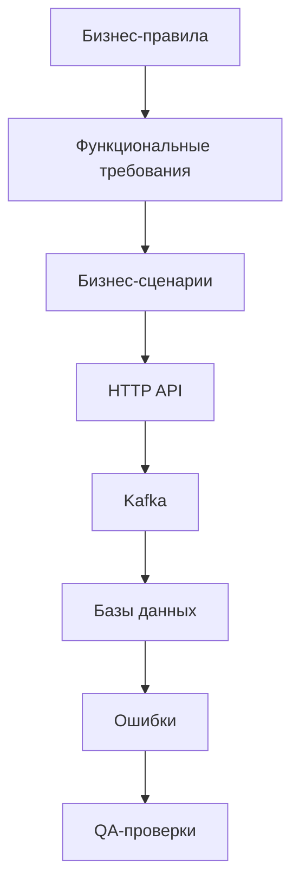

# Requirements Traceability Matrix AS IS

## 1. Назначение

RTM является центральной картой связи фактически реализованного поведения Marketplace-QA. Она позволяет пройти от бизнес-правила и функционального требования к сценарию, HTTP API, Kafka event, таблице, error code и QA-проверке, а также выполнить обратный impact analysis.

Источники: Business Rules Specification, Business Scenario Specification, Functional Requirements Specification, Supplier/Customer API Contracts, Error Contract, Kafka Event Contract и Data Contract. Матрица не создаёт новых требований и не меняет смысл источников.

## 2. Правила трассировки

- Одно FR может реализовывать несколько BR.
- Одно BR может участвовать в нескольких сценариях и FR.
- Один endpoint может реализовывать несколько FR.
- Одно Kafka event type может поддерживать несколько FR и сценариев.
- Одна таблица может изменяться несколькими API/consumer flows.
- `—` означает отсутствие прямой связи, а не отсутствие любой косвенной связи.
- Диапазон `001..003` включает все ID между границами.
- Priority берётся из существующих FR/BR и означает приоритет QA-проверки AS IS.

## 3. Общая схема трассировки

Стрелки показывают основной маршрут анализа, а не обязательную runtime-последовательность: consumer-сценарии могут начинаться с Kafka без HTTP API, а read-only API не используют Kafka.

## 4. Supplier Traceability Matrix

| Rule ID | FR | Scenario | API | Kafka Event | Database Table | Error | QA Priority |
|---|---|---|---|---|---|---|---|
| BR-SUP-001..003 | FR-SUP-001 | SCN-SUP-001 | POST `/suppliers` | SUPPLIER_CREATED | supplier `users`; `user_events` eventual | validation_error; supplier_conflict | High |
| BR-SUP-004 | FR-SUP-002 | SCN-SUP-001..003 | GET `/suppliers` | — | supplier `users` | internal_error | Medium |
| BR-SUP-004 | FR-SUP-003 | SCN-SUP-001..003 | GET `/suppliers/{id}` | — | supplier `users` | validation_error; supplier_not_found | Medium |
| BR-SUP-002,003,005 | FR-SUP-004 | SCN-SUP-002 | PUT `/suppliers/{id}` | SUPPLIER_UPDATED | supplier `users`; `user_events` eventual | validation_error; supplier_not_found; supplier_conflict | High |
| BR-SUP-006 | FR-SUP-005 | SCN-SUP-003 | DELETE `/suppliers/{id}` | SUPPLIER_DELETED | supplier `users`; read `products` | supplier_not_found; supplier_has_products | High |
| BR-SUP-007 | FR-SUP-006 | SCN-SUP-001..003 | Supplier mutations | SUPPLIER_CREATED/UPDATED/DELETED | source `users` | internal_error post-commit | High |
| BR-AUD-001..005 | FR-SUP-007 | SCN-AUD-001 | — | Supplier events | supplier `user_events` | consumer retry/log | High |

## 5. Product Traceability Matrix

| Rule ID | FR | Scenario | API | Kafka Event | Database Table | Error | QA Priority |
|---|---|---|---|---|---|---|---|
| BR-PROD-001..004,006 | FR-PROD-001 | SCN-PROD-001 | POST `/products` | PRODUCT_CREATED | supplier `products`, read `users` | validation_error; supplier_not_found; product_archived | High |
| BR-PROD-005 | FR-PROD-002 | SCN-PROD-001 | POST `/products` | PRODUCT_CREATED payload | supplier `products.stocks` | — | High |
| BR-PROD-007 | FR-PROD-003 | SCN-PROD-001..003 | GET `/products` Supplier | — | supplier `products` | internal_error | Medium |
| BR-PROD-007 | FR-PROD-004 | SCN-PROD-001..003 | GET `/products/{id}` Supplier | — | supplier `products` | product_not_found | Medium |
| BR-PROD-002..004,006,009 | FR-PROD-005 | SCN-PROD-002 | PUT `/products/{id}` | PRODUCT_UPDATED | supplier `products`, read `users` | product_not_found; supplier_not_found; product_archived | High |
| BR-PROD-008 | FR-PROD-006 | SCN-PROD-003 | DELETE `/products/{id}` | PRODUCT_UPDATED | supplier `products` | product_not_found; internal_error | High |
| BR-PROD-006 | FR-PROD-007 | SCN-PROD-001,002 | POST/PUT Product | — | supplier `products` | product_archived | High |
| BR-PROD-010 | FR-PROD-008 | SCN-PROD-001..003 | Product mutations | PRODUCT_CREATED/UPDATED | source `products` | internal_error post-commit | High |
| BR-CAT-001,005,008 | FR-PROD-009 | SCN-CAT-001 | — | PRODUCT_CREATED/UPDATED | customer `products` | consumer retry/log | High |

## 6. Warehouse Traceability Matrix

| Rule ID | FR | Scenario | API | Kafka Event | Database Table | Error | QA Priority |
|---|---|---|---|---|---|---|---|
| BR-WH-001,002 | FR-WH-001 | SCN-WH-001 | POST `/warehouses` | — | supplier `warehouses` | validation_error; internal_error | Medium |
| BR-WH-003 | FR-WH-002 | SCN-WH-001..003 | GET `/warehouses` | — | supplier `warehouses` | internal_error | Medium |
| BR-WH-003 | FR-WH-003 | SCN-WH-001..003 | GET `/warehouses/{id}` | — | supplier `warehouses` | warehouse_not_found | Medium |
| BR-WH-004 | FR-WH-004 | SCN-WH-002 | PUT `/warehouses/{id}` | — | supplier `warehouses` | validation_error; warehouse_not_found; internal_error | High |
| BR-WH-005 | FR-WH-005 | SCN-WH-003 | DELETE `/warehouses/{id}` | — напрямую | `warehouses`, `warehouse_products` | warehouse_not_found; internal_error | High |
| BR-WH-005,006; BR-STOCK-004,009 | FR-WH-006 | SCN-WH-003 | DELETE Warehouse | STOCK_REPLENISHED | supplier/customer `products` | internal_error post-commit | High |

## 7. Stock Traceability Matrix

| Rule ID | FR | Scenario | API | Kafka Event | Database Table | Error | QA Priority |
|---|---|---|---|---|---|---|---|
| BR-STOCK-001..003 | FR-STOCK-001 | SCN-STOCK-001 | POST `/warehouses/{id}/stocks` | STOCK_REPLENISHED | `warehouse_products`, supplier `products` | validation_error; warehouse_not_found; product_not_found | High |
| BR-STOCK-004 | FR-STOCK-002 | SCN-STOCK-001,002; SCN-WH-003 | Stock API/consumers | Stock events | `warehouse_products`, supplier `products` | internal_error | High |
| BR-STOCK-005 | FR-STOCK-003 | SCN-STOCK-001 | Stock API | STOCK_REPLENISHED | `warehouse_products` composite PK | — | High |
| BR-STOCK-009 | FR-STOCK-004 | SCN-STOCK-001,002; SCN-WH-003 | Stock-producing flows | STOCK_REPLENISHED; STOCK_DECREASED_BY_ORDER | supplier `products` | internal_error post-commit | High |
| BR-STOCK-010 | FR-STOCK-005 | SCN-STOCK-002 | — | ORDER_CREATED | `processed_events`, `warehouse_products`, `products` | consumer retry/log | High |
| BR-STOCK-011; BR-CONS-007 | FR-STOCK-006 | SCN-STOCK-002 | — | ORDER_CREATED; optional STOCK_DECREASED_BY_ORDER | supplier inventory | нет business error | High |
| BR-CAT-007,008 | FR-STOCK-007 | SCN-CAT-002 | Supplier GET `/products` fallback | Stock events | customer `products` | consumer retry/log | High |

## 8. Customer Traceability Matrix

| Rule ID | FR | Scenario | API | Kafka Event | Database Table | Error | QA Priority |
|---|---|---|---|---|---|---|---|
| BR-CUST-001,002 | FR-CUST-001 | Не выделен; предусловие customer-сценариев | POST `/users` | — | customer `users` | validation_error; user_conflict | High |
| BR-CUST-005 | FR-CUST-002 | Не выделен | GET `/users` | — | customer `users` | internal_error | Medium |
| BR-CUST-005 | FR-CUST-003 | Не выделен | GET `/users/{id}` | — | customer `users` | user_not_found | Medium |
| BR-CUST-003,004 | FR-CUST-004 | SCN-FAV-001; SCN-CART-001..003; SCN-ORD-001..003 | Favorites/Cart/Orders | — | User FKs в customer DB | user_not_found; order_not_found | High |

## 9. Catalog Traceability Matrix

| Rule ID | FR | Scenario | API | Kafka Event | Database Table | Error | QA Priority |
|---|---|---|---|---|---|---|---|
| BR-CAT-001..004 | FR-CAT-001 | SCN-CAT-001 | GET `/products` Customer | — | customer `products` | internal_error | Medium |
| BR-CAT-001,003 | FR-CAT-002 | SCN-CAT-001 | GET `/products/{id}` Customer | — | customer `products` | product_not_found | Medium |
| BR-CAT-005 | FR-CAT-003 | SCN-CAT-001 | — | PRODUCT_CREATED/UPDATED; поддержка PRODUCT_DELETED | customer `products` | consumer retry/log | High |
| BR-CAT-007 | FR-CAT-004 | SCN-CAT-002 | — | STOCK_REPLENISHED/STOCK_DECREASED_BY_ORDER | customer `products` | consumer retry/log | High |
| BR-CAT-006,007 | FR-CAT-005 | SCN-CAT-001,002 | Supplier GET `/products` | Stock event может инициировать fallback | customer `products` | failure логируется | High |
| BR-CAT-008; BR-CONS-001,005 | FR-CAT-006 | SCN-CAT-001,002 | Customer catalog/cart/order APIs | Product/stock events | supplier/customer `products` | stale-state business errors | High |

## 10. Favorite Traceability Matrix

| Rule ID | FR | Scenario | API | Kafka Event | Database Table | Error | QA Priority |
|---|---|---|---|---|---|---|---|
| BR-FAV-001,002 | FR-FAV-001 | SCN-FAV-001 | POST `/favorites` | — | `favorites`, read `users/products` | user_not_found; product_not_found | High |
| BR-FAV-002,003 | FR-FAV-002 | SCN-FAV-001 | POST `/favorites` | — | `favorites` UNIQUE pair | internal_error race | Medium |
| BR-FAV-006 | FR-FAV-003 | SCN-FAV-001 | GET `/favorites` | — | `favorites`, `products` | user_not_found; product_not_found | Medium |
| BR-FAV-005 | FR-FAV-004 | SCN-FAV-001 | DELETE `/favorites/{product_id}` | — | `favorites` | user_not_found; favorite_not_found | Medium |
| BR-FAV-004 | FR-FAV-005 | SCN-FAV-001 | POST `/favorites` | — | `favorites`, Product flags | — | Medium |
| BR-FAV-006 | FR-FAV-006 | SCN-FAV-001 | Favorite responses | — | customer `products` | product_not_found | Medium |

## 11. Cart Traceability Matrix

| Rule ID | FR | Scenario | API | Kafka Event | Database Table | Error | QA Priority |
|---|---|---|---|---|---|---|---|
| BR-CART-009,010 | FR-CART-001 | SCN-CART-001..003 | GET `/cart` | — | `cart_items`, `products` | user_not_found; product_not_found | High |
| BR-CART-001..004 | FR-CART-002 | SCN-CART-001 | POST `/cart` | — | `cart_items`, read `users/products` | validation; not-found; archived/inactive/stock | High |
| BR-CART-005 | FR-CART-003 | SCN-CART-001 | POST `/cart` | — | `cart_items` | insufficient_stock | High |
| BR-CART-006 | FR-CART-004 | SCN-CART-002 | PATCH `/cart/{product_id}` | — | `cart_items` | cart_item_not_found; conflicts | High |
| BR-CART-007 | FR-CART-005 | SCN-CART-003 | DELETE `/cart/{product_id}` | — | `cart_items` | user_not_found; cart_item_not_found | Medium |
| BR-CART-002 | FR-CART-006 | SCN-CART-001,002 | POST/PATCH Cart | — | read customer `products` | product_archived; product_inactive | High |
| BR-CART-004,008; BR-CONS-005 | FR-CART-007 | SCN-CART-001,002 | POST/PATCH Cart | — | read customer `products.stocks` | insufficient_stock | High |
| BR-CART-009 | FR-CART-008 | SCN-CART-001,002 | Cart responses | — | `cart_items`, `products.price` | product_not_found | High |

## 12. Order Traceability Matrix

| Rule ID | FR | Scenario | API | Kafka Event | Database Table | Error | QA Priority |
|---|---|---|---|---|---|---|---|
| BR-ORD-001..004,007,008 | FR-ORD-001 | SCN-ORD-001 | POST `/orders` | ORDER_CREATED после commit | `users`, `cart_items`, `products`, `orders`, `order_items` | cart_is_empty; product/user/stock errors | High |
| BR-ORD-002,005,007,008 | FR-ORD-002 | SCN-ORD-002 | POST `/orders` | ORDER_CREATED | `orders`, `order_items`, DELETE `cart_items` | product/user/stock errors | High |
| BR-ORD-003,004 | FR-ORD-003 | SCN-ORD-001 | POST `/orders` | ORDER_CREATED при success | `cart_items` | cart_is_empty | High |
| BR-ORD-006 | FR-ORD-004 | SCN-ORD-002 | POST `/orders` | Один ORDER_CREATED на Product | `order_items` | insufficient_stock после sum | High |
| BR-ORD-009 | FR-ORD-005 | SCN-ORD-001,002 | POST/GET Orders | — | `orders`, `order_items` | internal_error | High |
| BR-ORD-010 | FR-ORD-006 | SCN-ORD-001..003 | GET/cancel Orders | — | `order_items`, customer `products` | product_not_found | High |
| BR-ORD-011 | FR-ORD-007 | SCN-ORD-001,002 | POST `/orders` | — | `orders.order_number` | internal_error | High |
| BR-ORD-011 | FR-ORD-008 | SCN-ORD-001,002 | POST `/orders` | — | `orders.status` | internal_error | High |
| BR-ORD-005,012 | FR-ORD-009 | SCN-ORD-001,002 | POST `/orders` | До ORDER_CREATED | DELETE `cart_items` | internal_error post-commit | High |
| BR-ORD-013 | FR-ORD-010 | SCN-ORD-001,002; SCN-STOCK-002 | POST `/orders` | ORDER_CREATED | source `orders/order_items` | internal_error post-commit | High |
| BR-CUST-004; BR-ORD-010 | FR-ORD-011 | SCN-ORD-001..003 | GET `/orders`, GET `/orders/{id}` | — | `orders`, `order_items`, `products` | user_not_found; order_not_found; product_not_found | Medium |
| BR-ORD-015 | FR-ORD-012 | SCN-ORD-003 | POST `/orders/{id}/cancel` | — | UPDATE `orders.status` | order_not_found; order_already_cancelled | High |
| BR-ORD-016 | FR-ORD-013 | SCN-ORD-003 | Cancel API | — | только `orders.status` | — | High |
| BR-ORD-017 | FR-ORD-014 | SCN-ORD-003 | Cancel API | Отсутствует cancel event | `orders` | — | High |
| BR-ORD-014; BR-CONS-007 | FR-ORD-015 | SCN-ORD-001,002; SCN-STOCK-002 | POST `/orders` | ORDER_CREATED без confirmation | customer/supplier order-stock data | — | High |

## 13. Audit Traceability Matrix

| Rule ID | FR | Scenario | API | Kafka Event | Database Table | Error | QA Priority |
|---|---|---|---|---|---|---|---|
| BR-AUD-001 | FR-AUD-001 | SCN-AUD-001 | — | Supplier events | — до handler effect | retry/log dead letter | High |
| BR-AUD-002,003,005 | FR-AUD-002 | SCN-AUD-001 | — | Supplier events | supplier `user_events` | DB/shape retry | High |
| BR-AUD-004,006 | FR-AUD-003 | SCN-AUD-001 | — | Duplicate Supplier event | `user_events` duplicate rows | — | Medium |

## 14. Cross-service Traceability Matrix

| Rule ID | FR | Scenario | API | Kafka Event | Database Table | Error | QA Priority |
|---|---|---|---|---|---|---|---|
| BR-CONS-001; BR-CAT-005,007 | FR-CONS-001 | SCN-CAT-001,002 | Supplier/Customer Products | Product/stock events | supplier/customer `products` | stale-state errors | High |
| BR-AUD-001 + consumer implementation | FR-CONS-002 | SCN-CAT-001,002; SCN-STOCK-002; SCN-AUD-001 | — | Все consumer topics | side-effect tables | retry/log dead letter | High |
| BR-CONS-002..004 | FR-CONS-003 | Kafka-producing scenarios | Mutating APIs | Все published events | source DB tables | internal_error post-commit | High |
| BR-CONS-004,006 | FR-CONS-004 | Post-commit scenarios | Mutating APIs | Publish/consumer continuation | ранее committed tables | internal_error или post-commit 404 | High |

## 15. Reverse Traceability

### API → Requirements

| Endpoint | FR | BR | Scenario |
|---|---|---|---|
| Supplier `GET /health` | — | — | — |
| Supplier `POST /suppliers` | FR-SUP-001,006,007 | BR-SUP-001..003,007; BR-AUD-001..005 | SCN-SUP-001; SCN-AUD-001 |
| Supplier `GET /suppliers` | FR-SUP-002 | BR-SUP-004 | SCN-SUP-001..003 |
| Supplier `GET /suppliers/{id}` | FR-SUP-003 | BR-SUP-004 | SCN-SUP-001..003 |
| Supplier `PUT /suppliers/{id}` | FR-SUP-004,006,007 | BR-SUP-002,003,005,007; BR-AUD-001..005 | SCN-SUP-002; SCN-AUD-001 |
| Supplier `DELETE /suppliers/{id}` | FR-SUP-005,006,007 | BR-SUP-006,007; BR-AUD-001..005 | SCN-SUP-003; SCN-AUD-001 |
| Supplier `POST /products` | FR-PROD-001,002,008,009 | BR-PROD-001..006,010; BR-CAT-001,005,008 | SCN-PROD-001; SCN-CAT-001 |
| Supplier `GET /products` | FR-PROD-003; FR-CAT-005 | BR-PROD-007; BR-CAT-006,007 | SCN-PROD-001..003; SCN-CAT-001,002 |
| Supplier `GET /products/{id}` | FR-PROD-004 | BR-PROD-007 | SCN-PROD-001..003 |
| Supplier `PUT /products/{id}` | FR-PROD-005,007,008,009 | BR-PROD-002..004,006,009,010; BR-CAT-005,008 | SCN-PROD-002; SCN-CAT-001 |
| Supplier `DELETE /products/{id}` | FR-PROD-006,008,009 | BR-PROD-008,010; BR-CAT-005,008 | SCN-PROD-003; SCN-CAT-001 |
| Supplier `POST /warehouses` | FR-WH-001 | BR-WH-001,002 | SCN-WH-001 |
| Supplier `GET /warehouses` | FR-WH-002 | BR-WH-003 | SCN-WH-001..003 |
| Supplier `GET /warehouses/{id}` | FR-WH-003 | BR-WH-003 | SCN-WH-001..003 |
| Supplier `PUT /warehouses/{id}` | FR-WH-004 | BR-WH-004 | SCN-WH-002 |
| Supplier `DELETE /warehouses/{id}` | FR-WH-005,006; FR-STOCK-002,004,007 | BR-WH-005,006; BR-STOCK-004,009; BR-CAT-007,008 | SCN-WH-003; SCN-CAT-002 |
| Supplier `POST /warehouses/{id}/stocks` | FR-STOCK-001..004,007 | BR-STOCK-001..005,009; BR-CAT-007,008 | SCN-STOCK-001; SCN-CAT-002 |
| Customer `GET /health` | — | — | — |
| Customer `POST /users` | FR-CUST-001 | BR-CUST-001,002 | Не выделен |
| Customer `GET /users` | FR-CUST-002 | BR-CUST-005 | Не выделен |
| Customer `GET /users/{id}` | FR-CUST-003 | BR-CUST-005 | Не выделен |
| Customer `GET /products` | FR-CAT-001,006 | BR-CAT-001..004,008; BR-CONS-001,005 | SCN-CAT-001,002 |
| Customer `GET /products/{id}` | FR-CAT-002,006 | BR-CAT-001,003,008; BR-CONS-001,005 | SCN-CAT-001,002 |
| Customer `POST /favorites` | FR-CUST-004; FR-FAV-001,002,005,006 | BR-CUST-003,004; BR-FAV-001..004,006 | SCN-FAV-001 |
| Customer `GET /favorites` | FR-CUST-004; FR-FAV-003,006 | BR-CUST-003,004; BR-FAV-006 | SCN-FAV-001 |
| Customer `DELETE /favorites/{product_id}` | FR-CUST-004; FR-FAV-004 | BR-CUST-003,004; BR-FAV-005 | SCN-FAV-001 |
| Customer `GET /cart` | FR-CUST-004; FR-CART-001,008 | BR-CUST-003,004; BR-CART-009,010 | SCN-CART-001..003 |
| Customer `POST /cart` | FR-CUST-004; FR-CART-002,003,006,007,008 | BR-CUST-003,004; BR-CART-001..005,008,009; BR-CONS-005 | SCN-CART-001 |
| Customer `PATCH /cart/{product_id}` | FR-CUST-004; FR-CART-004,006,007,008 | BR-CUST-003,004; BR-CART-001..004,006,008,009; BR-CONS-005 | SCN-CART-002 |
| Customer `DELETE /cart/{product_id}` | FR-CUST-004; FR-CART-005 | BR-CUST-003,004; BR-CART-007,008 | SCN-CART-003 |
| Customer `POST /orders` | FR-CUST-004; FR-ORD-001..010,015; FR-CONS-003,004 | BR-CUST-003,004; BR-ORD-001..014; BR-CONS-002..007 | SCN-ORD-001,002; SCN-STOCK-002 |
| Customer `GET /orders` | FR-CUST-004; FR-ORD-005,006,011 | BR-CUST-003,004; BR-ORD-009,010 | SCN-ORD-001..003 |
| Customer `GET /orders/{id}` | FR-CUST-004; FR-ORD-005,006,011 | BR-CUST-003,004; BR-ORD-009,010 | SCN-ORD-001..003 |
| Customer `POST /orders/{id}/cancel` | FR-CUST-004; FR-ORD-006,012..014 | BR-CUST-003,004; BR-ORD-010,015..017 | SCN-ORD-003 |

### Kafka → Requirements

| Topic / event | FR | BR | Scenario |
|---|---|---|---|
| `supplier-events / SUPPLIER_CREATED` | FR-SUP-006,007; FR-AUD-001..003 | BR-SUP-007; BR-AUD-001..006 | SCN-SUP-001; SCN-AUD-001 |
| `supplier-events / SUPPLIER_UPDATED` | FR-SUP-006,007; FR-AUD-001..003 | BR-SUP-007; BR-AUD-001..006 | SCN-SUP-002; SCN-AUD-001 |
| `supplier-events / SUPPLIER_DELETED` | FR-SUP-006,007; FR-AUD-001..003 | BR-SUP-007; BR-AUD-001..006 | SCN-SUP-003; SCN-AUD-001 |
| `product-events / PRODUCT_CREATED` | FR-PROD-008,009; FR-CAT-003; FR-CONS-001..003 | BR-PROD-010; BR-CAT-001,005,008; BR-CONS-001..004 | SCN-PROD-001; SCN-CAT-001 |
| `product-events / PRODUCT_UPDATED` | FR-PROD-008,009; FR-CAT-003; FR-CONS-001..003 | BR-PROD-010; BR-CAT-001,005,008; BR-CONS-001..004 | SCN-PROD-002,003; SCN-CAT-001 |
| `product-events / PRODUCT_DELETED` — только consumer support | FR-CAT-003 | BR-CAT-005 | SCN-CAT-001 alternative |
| `product-stock-events / STOCK_REPLENISHED` | FR-WH-006; FR-STOCK-004,007; FR-CAT-004..006; FR-CONS-001..003 | BR-WH-006; BR-STOCK-009; BR-CAT-006..008; BR-CONS-001..004 | SCN-WH-003; SCN-STOCK-001; SCN-CAT-002 |
| `product-stock-events / STOCK_DECREASED_BY_ORDER` | FR-STOCK-004,006,007; FR-CAT-004,006; FR-CONS-001..003 | BR-STOCK-009,011; BR-CAT-007,008; BR-CONS-001..007 | SCN-STOCK-002; SCN-CAT-002 |
| `order-events / ORDER_CREATED` | FR-STOCK-005,006; FR-ORD-010,015; FR-CONS-002..004 | BR-STOCK-010,011; BR-ORD-013,014; BR-CONS-002..007 | SCN-ORD-001,002; SCN-STOCK-002 |

### Database → Requirements

| Database table | FR | BR | Scenario |
|---|---|---|---|
| supplier `users` | FR-SUP-001..005; FR-PROD-001,005 | BR-SUP-001..006; BR-PROD-002 | SCN-SUP-001..003; SCN-PROD-001,002 |
| supplier `products` | FR-SUP-005; FR-PROD-001..008; FR-WH-006; FR-STOCK-002,004..006 | BR-SUP-006; BR-PROD-001..010; BR-WH-005,006; BR-STOCK-004,009..011 | SCN-SUP-003; SCN-PROD-001..003; SCN-WH-003; SCN-STOCK-001,002 |
| supplier `warehouses` | FR-WH-001..005; FR-STOCK-001 | BR-WH-001..005; BR-STOCK-003 | SCN-WH-001..003; SCN-STOCK-001 |
| supplier `warehouse_products` | FR-WH-005,006; FR-STOCK-001..006 | BR-WH-005; BR-STOCK-001..011 | SCN-WH-003; SCN-STOCK-001,002 |
| supplier `processed_events` | FR-STOCK-005,006 | BR-STOCK-010,011 | SCN-STOCK-002 |
| supplier `user_events` | FR-SUP-007; FR-AUD-002,003 | BR-AUD-002..005 | SCN-AUD-001 |
| customer `users` | FR-CUST-001..004; FR-FAV-001,003,004; FR-CART-001,002,004,005; FR-ORD-001,002,011,012 | BR-CUST-001..005 и dependent existence rules | Favorite/Cart/Order scenarios |
| customer `products` | FR-PROD-009; FR-STOCK-007; FR-CAT-001..006; FR-FAV-003,005,006; FR-CART-001,002,006..008; FR-ORD-001..006,011 | BR-CAT-001..008 и dependent rules | SCN-CAT-001,002; Favorite/Cart/Order scenarios |
| customer `favorites` | FR-FAV-001..006; FR-CUST-004 | BR-FAV-001..006; BR-CUST-004 | SCN-FAV-001 |
| customer `cart_items` | FR-CART-001..005,008; FR-ORD-001..003,009,013 | BR-CART-001..010; BR-ORD-002..005,012,016 | SCN-CART-001..003; SCN-ORD-001..003 |
| customer `orders` | FR-ORD-001..015; FR-CUST-004 | BR-ORD-001..017; BR-CUST-004 | SCN-ORD-001..003 |
| customer `order_items` | FR-ORD-001..006,009,011,013 | BR-ORD-001..012,016 | SCN-ORD-001..003 |

### Error → Requirements

| Error code | FR | BR | Scenario |
|---|---|---|---|
| `validation_error` | Все input-bearing Supplier/Customer FR | Input validation BR всех доменов | Все API-сценарии с входом |
| `internal_error` | FR-CONS-003,004 и mutating/event FR | BR-CONS-003,004,006 | Post-commit и DB/Kafka scenarios |
| `supplier_not_found` | FR-SUP-003,004,005; FR-PROD-001,005 | BR-SUP-004..006; BR-PROD-002 | SCN-SUP-002,003; SCN-PROD-001,002 |
| `supplier_conflict` | FR-SUP-001,004 | BR-SUP-003 | SCN-SUP-001,002 |
| `supplier_has_products` | FR-SUP-005 | BR-SUP-006 | SCN-SUP-003 |
| `product_not_found` | Product detail/mutation, Stock, Catalog, Favorite, Cart, Order FR | BR-PROD-002,007..009; dependent product-existence BR | Product/Stock/Catalog/Favorite/Cart/Order scenarios |
| `product_archived` | FR-PROD-001,005,007; FR-CART-002,006; FR-ORD-001,002 | BR-PROD-006; BR-CART-002; BR-ORD-007 | Product create/update; Cart/Order scenarios |
| `warehouse_not_found` | FR-WH-003..006; FR-STOCK-001 | BR-WH-003..005; BR-STOCK-003 | SCN-WH-002,003; SCN-STOCK-001 |
| `user_not_found` | FR-CUST-003,004; Favorite/Cart/Order FR | BR-CUST-004; existence BR | Customer domain scenarios |
| `user_conflict` | FR-CUST-001 | BR-CUST-002 | User create path без отдельного SCN |
| `favorite_not_found` | FR-FAV-004 | BR-FAV-005 | SCN-FAV-001 |
| `cart_item_not_found` | FR-CART-004,005 | BR-CART-006,007 | SCN-CART-002,003 |
| `cart_is_empty` | FR-ORD-001,003 | BR-ORD-003,004 | SCN-ORD-001 |
| `insufficient_stock` | FR-CART-002,003,004,007; FR-ORD-001..004 | BR-CART-004; BR-ORD-006,008; BR-CONS-005 | Cart/Order create scenarios |
| `product_inactive` | FR-CART-002,004,006; FR-ORD-001,002 | BR-CART-002; BR-ORD-007 | Cart/Order mutation scenarios |
| `order_not_found` | FR-CUST-004; FR-ORD-011,012 | BR-CUST-004; BR-ORD-015 | SCN-ORD-003 и Order reads |
| `order_already_cancelled` | FR-ORD-012 | BR-ORD-015 | SCN-ORD-003 |

## 16. Coverage Analysis

Подсчёт выполнен по явным ID/ссылкам текущих документов. «API использует Kafka» означает прямую публикацию из HTTP flow; «изменяет БД» — FR с явным INSERT/UPDATE/DELETE в acceptance; «eventual» — FR, результат которого проходит асинхронную или межбазовую границу.

| Метрика | Покрыто | Всего | Результат |
|---|---:|---:|---:|
| Business Rules имеют хотя бы один FR | 90 | 93 | 96,8% |
| FR имеют формальный Scenario ID | 72 | 75 | 96,0% |
| Scenarios имеют участвующий HTTP API | 19 | 21 | 90,5% |
| HTTP API endpoints прямо публикуют Kafka event | 9 | 34 | 26,5% |
| FR прямо предусматривают изменение БД | 43 | 75 | 57,3% |
| FR используют eventual consistency | 14 | 75 | 18,7% |
| FR используют/проверяют Kafka behavior | 23 | 75 | 30,7% |
| FR включают несколько сервисов | 22 | 75 | 29,3% |

Прямо публикующие endpoint: Supplier create/update/delete Supplier; create/update/delete Product; delete Warehouse; stock update; Customer create Order.

Eventual-набор: `FR-SUP-007`, `FR-PROD-009`, `FR-STOCK-005..007`, `FR-CAT-003..006`, `FR-ORD-015`, `FR-AUD-001..003`, `FR-CONS-001`.

Kafka-набор: `FR-SUP-006,007`, `FR-PROD-008,009`, `FR-WH-006`, `FR-STOCK-004..007`, `FR-CAT-003..006`, `FR-ORD-010,014,015`, `FR-AUD-001..003`, `FR-CONS-001..004`.

DB-mutating FR по доменам: Supplier 4, Product 5, Warehouse 4, Stock 6, Customer 1, Catalog 3, Favorite 3, Cart 4, Order 10, Audit 2, Cross-service 1.

## 17. Coverage Gaps

### Business Rules без отдельного FR

| Rule ID | Причина наблюдаемого gap |
|---|---|
| `BR-STOCK-006` | Duplicate Product IDs и расхождение first response/event с final DB зафиксированы как ограничение Stock API, но отдельный FR не создан |
| `BR-STOCK-007` | Неатомарность multi-item stock request зафиксирована как техническая граница/ограничение |
| `BR-STOCK-008` | Restock inactive/archived Product зафиксирован в limitation `FR-STOCK-001`, но не как самостоятельный FR |

### FR без формального Scenario ID

| FR | Gap |
|---|---|
| `FR-CUST-001` | В заданном каталоге 21 сценария не был выделен сценарий создания User |
| `FR-CUST-002` | Не выделен сценарий чтения списка User |
| `FR-CUST-003` | Не выделен сценарий чтения User по ID |

### Scenarios без HTTP API

| Scenario | Причина |
|---|---|
| `SCN-STOCK-002` | Инициируется Kafka `ORDER_CREATED`, выполняется supplier consumer |
| `SCN-AUD-001` | Инициируется Kafka supplier event, выполняется audit-consumer |

Это consumer-сценарии, поэтому отсутствие API является характеристикой реализации, а не дефектом покрытия.

### API без FR

- Supplier `GET /health`.
- Customer `GET /health`.

Оба endpoint описаны API overview, но отдельные FR для health в существующем FRS отсутствуют. RTM не создаёт их задним числом.

### Kafka, tables и errors

- Kafka event type/consumer contract без FR не найден: все 9 строк reverse Kafka связаны хотя бы с одним FR.
- Таблица без FR не найдена: все 12 таблиц имеют прямую или dependent trace.
- Подтверждённый response error code без FR не найден: все 17 уникальных codes связаны с требованиями/валидацией.

## 18. QA Impact

### Изменился endpoint

1. Найти endpoint в `API → Requirements`.
2. Получить набор FR и BR.
3. Перейти к связанным SCN для end-to-end проверки.
4. По прямой матрице определить tables, events и errors.
5. Перезапустить QA checks из соответствующих API/FR/Scenario документов.

Пример: изменение Customer `POST /orders` затрагивает `FR-ORD-001..010,015`, ownership/consistency FR, Order rules, два create-сценария, `order-events` и пять customer tables.

### Изменилось Business Rule

1. Найти Rule ID в доменной таблице.
2. Определить все FR, которые реализуют правило.
3. Найти сценарии и endpoint/event/table effects.
4. Обновить позитивные, негативные и межсервисные проверки.

Пример: изменение `BR-CART-004` влияет на cart add/update, Order availability через related stock behavior и проверки `insufficient_stock`.

### Изменилось Kafka event

1. Найти type в `Kafka → Requirements`.
2. Проверить producer FR и consumer FR.
3. Пройти связанные сценарии и DB side effects.
4. Проверить key, payload, version, retry/commit, duplicate и lag.

Пример: изменение `ORDER_CREATED` затрагивает Order publication, supplier inventory, processed events, partial decrease и customer stock continuation.

### Изменилась таблица или error code

- Для таблицы reverse mapping показывает читающие/пишущие FR и сценарии.
- Для error code mapping показывает endpoint-контексты и negative paths.
- После изменения проверяется как прямой контракт, так и downstream serialization/event behavior.

## 19. Open Questions

1. Следует ли считать limitation-only Rule покрытым FR, если limitation упомянут в FR, но не является самостоятельной формулировкой? В расчёте использовано только явное Related BR.
2. Нужны ли отдельные сценарии для User create/list/detail? Текущий Scenario Contract их не содержит.
3. Должны ли health endpoints иметь FR или оставаться только техническими API-контрактами?
4. Считать ли consumer-сценарий «покрытым API» через upstream endpoint, который когда-то создал событие? В расчёте учитывался только участвующий в самом сценарии API.
5. Должно ли поддерживаемое, но не публикуемое `PRODUCT_DELETED` считаться полноценным событием покрытия? RTM показывает его отдельной consumer-only строкой.
6. Как классифицировать отсутствие события (`FR-ORD-014`) в метрике Kafka: здесь оно считается Kafka-related requirement, но не producer behavior.
7. Какую гранулярность использовать для future automated RTM: ranges (`001..003`) или только явные ID? Текущая матрица допускает ranges для читаемости.
