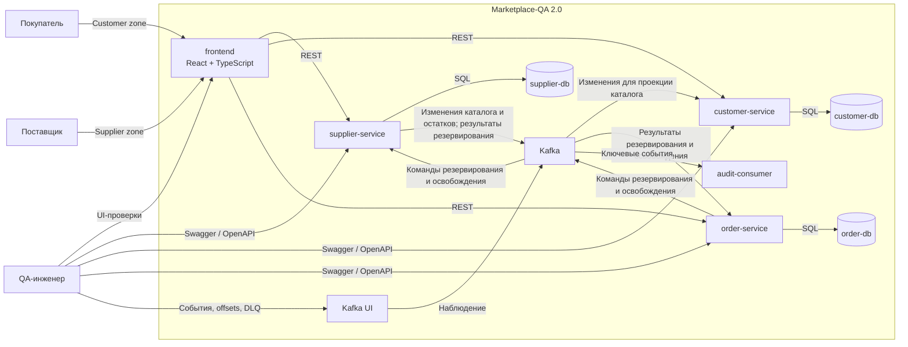
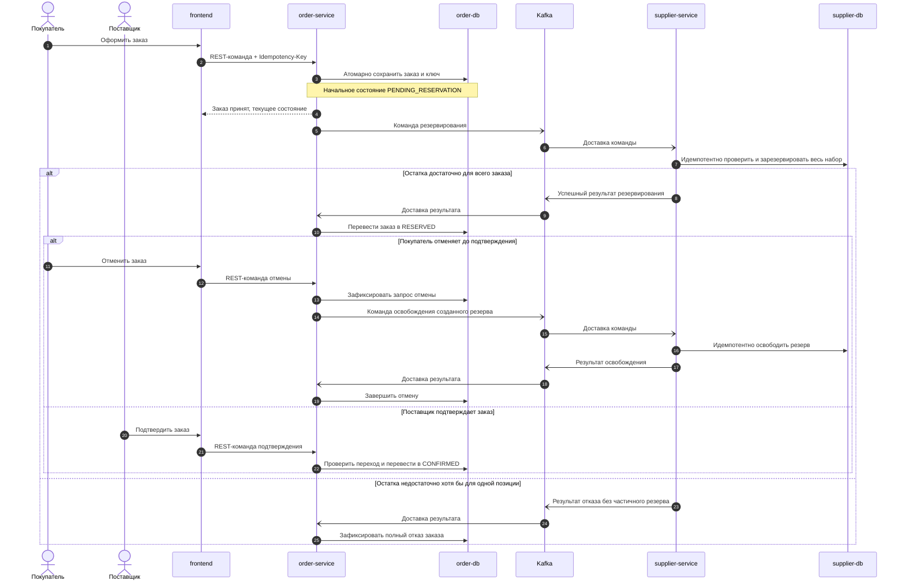

# Marketplace-QA 2.0: видение и архитектурные принципы

## 0. Статус и основание документа

Документ открывает этап проектирования Marketplace-QA 2.0 и задаёт рамки для последующих требований, ADR, API- и event-контрактов, модели данных и тестовой стратегии. Он не является спецификацией реализации и не вводит конкретные endpoint, таблицы, топики или имена событий.

Основание анализа:

- AS IS-документация из `docs/requirements`, подготовленная для состояния `fix2_11.04` на коммите `265cd8c166fd703c4c35db0c6439029655a5c05b`;
- исходный код `supplier-service`, `customer-service` и `audit-consumer`;
- `docker-compose.yml`, Dockerfile, зависимости и корневой `README.md`;
- целевой контекст Marketplace-QA 2.0, зафиксированный в постановке архитектурного этапа.

В документе используются три типа утверждений:

- **Подтверждённый факт AS IS** — наблюдаемое поведение текущей реализации или свойство, уже зафиксированное в AS IS-документации.
- **Решение TO BE** — принцип или граница Marketplace-QA 2.0, принимаемые данным документом.
- **Открытый вопрос** — решение, которое нельзя безопасно принять без отдельной проработки, ADR или уточнения требований.

Подробные AS IS endpoint, структуры данных, события, бизнес-правила и трассировка здесь намеренно не повторяются. Их источником остаётся комплект `docs/requirements`.

## 1. Назначение Marketplace-QA 2.0

**Решение TO BE.** Marketplace-QA 2.0 — локально разворачиваемый учебный e-commerce стенд для системной практики Middle Manual QA. Стенд должен позволять проверять не только отдельные REST-операции, но и сквозные пользовательские сценарии, межсервисную согласованность, асинхронные процессы и диагностируемое поведение при отказах.

Система моделирует взаимодействие поставщика и покупателя вокруг каталога, складских остатков, корзины и заказа. Она должна оставаться достаточно компактной для самостоятельного запуска и изучения, но включать характерные для реального e-commerce свойства:

- web-интерфейс и прямое тестирование REST API;
- несколько backend-сервисов с явными зонами ответственности;
- отдельные PostgreSQL-хранилища;
- Kafka и асинхронные процессы;
- управляемую eventual consistency;
- резервирование и возврат остатков;
- идемпотентность HTTP-команд и обработки сообщений;
- retry и настоящий DLQ;
- correlation ID и структурированные логи;
- формальные тестовые артефакты и CI/CD;
- воспроизводимые end-to-end сценарии.

Marketplace-QA 2.0 остаётся учебным стендом, а не попыткой построить production-маркетплейс полного масштаба.

## 2. Проблемы AS IS, которые решает версия 2.0

| Подтверждённый факт AS IS | Проблема для учебного стенда | Направление TO BE |
|---|---|---|
| Заказ и его позиции принадлежат `customer-service`; отдельного владельца order-домена нет | Жизненный цикл заказа смешан с customer-функциями и почти не моделируется | Выделить `order-service` и `order-db` |
| Публичный API создаёт заказ в состоянии `created` и переводит его в `cancelled`; полноценная state machine и ограничение статусов в БД отсутствуют | Нельзя полноценно тестировать резервирование, подтверждение, отказ и компенсацию | Ввести явный жизненный цикл заказа; точную state machine зафиксировать отдельно |
| Создание заказа публикует отдельные сообщения по товарным позициям, не содержащие идентификатор заказа | Нельзя надёжно сопоставить результат складской обработки с заказом целиком | Координацию выполнять на уровне заказа с устойчивой бизнес-корреляцией |
| Supplier consumer при обработке order event уменьшает остаток и при дефиците может списать только доступную часть | Возможен частичный эффект без результата для заказа | Для MVP обеспечить атомарное бизнес-решение «весь заказ зарезервирован» либо «весь заказ отклонён» |
| Supplier-side результат не подтверждает и не отклоняет заказ | Клиент видит созданный заказ, но его фактическое исполнение неизвестно | Возвращать результат резервирования в `order-service` и отражать его в состоянии заказа |
| Отмена меняет только локальный статус заказа и не возвращает stock | Нельзя тестировать компенсацию и корректность остатков | Отмена до подтверждения инициирует освобождение подтверждённых резервов |
| Проверка доступности при создании заказа использует потенциально устаревшую customer-проекцию | Предварительная проверка может не совпасть с фактическим остатком | Считать supplier-контур источником окончательного решения о резервировании |
| Идемпотентность есть только у части обработки Kafka-сообщений через `processed_events` | Повтор HTTP-запроса может создать новый бизнес-эффект | Обязать создание заказа поддерживать `Idempotency-Key`; обеспечить идемпотентных consumers |
| После трёх ошибок сообщение только помечается текстом `dead letter` в логе | Poison message нельзя изолировать, исследовать и безопасно переиграть | Ввести физический DLQ и формальные правила retry/replay |
| Между commit БД и Kafka нет надёжной связки; producer не подтверждает доставку | Возможны сохранённые изменения без доставленного события | Выбрать и реализовать надёжный механизм публикации отдельным ADR |
| События имеют разные envelope, не везде содержат event ID, revision и бизнес-корреляцию | Сложно тестировать совместимость, дубли, порядок и причинность | Определить единый минимальный event envelope и схемы событий |
| Логи текстовые; сквозной correlation ID, централизованные правила полей и redaction отсутствуют | Диагностика межсервисного сценария требует ручного сопоставления | Ввести structured logs и сквозную корреляцию |
| Таблицы создаются и частично меняются при старте; версионированных миграций нет | Нельзя воспроизводимо тестировать обновление схем и CI/CD | Перейти к версионированным миграциям |
| Автоматические тесты и CI-конфигурация отсутствуют | Нет стабильного регрессионного контура и проверяемого quality gate | Добавить уровни автопроверок и CI/CD для сборки, контрактов и E2E |
| Пользователь работает только через API-инструменты | Нельзя демонстрировать frontend-to-backend и UI/E2E проверки | Добавить единый React + TypeScript frontend |

## 3. Цели проекта

**Решения TO BE.**

1. Создать реалистичный, но ограниченный e-commerce контур с двумя бизнес-ролями.
2. Сделать заказ самостоятельным доменом с наблюдаемым асинхронным жизненным циклом.
3. Реализовать резервирование нескольких позиций по правилу all-or-nothing для заказа в границах MVP.
4. Сделать повторы HTTP-запросов и Kafka-сообщений предсказуемыми и проверяемыми.
5. Дать QA-инженеру инструменты для проверки REST, Kafka, PostgreSQL, frontend и сквозных сценариев.
6. Обеспечить диагностируемость каждого сквозного запроса через correlation ID и structured logs.
7. Сделать ошибки доставки и обработки сообщений видимыми через retry, DLQ и контролируемое восстановление.
8. Обеспечить воспроизводимый локальный запуск через Docker Compose.
9. Зафиксировать контракты и требования так, чтобы их можно было связать с тестами и результатами CI.
10. Сохранить понятность проекта: каждый существенный механизм должен иметь учебную ценность и доступный тестовый oracle.

## 4. Не-цели проекта

**Решения TO BE.** В Marketplace-QA 2.0 MVP не входят:

- полноценная регистрация и управление учётными записями;
- JWT, OAuth, RBAC и production-grade авторизация;
- оплата и интеграция с платёжными системами;
- доставка и интеграция с логистическими системами;
- возврат товара после получения;
- промокоды и сложное ценообразование;
- отзывы, рекомендации и персонализация;
- административная панель;
- частичная комплектация заказа;
- production-grade дизайн frontend;
- Kubernetes и многорегиональное развёртывание;
- Elasticsearch/Kibana;
- сложный distributed tracing;
- доказательство production SLA, высокой доступности или горизонтального масштабирования;
- полная модель marketplace с расчётами между несколькими поставщиками.

Отсутствие функции в MVP не запрещает её будущую проработку, но она не должна усложнять контракты первой версии без отдельного решения.

## 5. Целевая аудитория проекта

Основная аудитория:

- Middle Manual QA, которому нужен стенд для системного, интеграционного и end-to-end тестирования;
- QA-инженер, отрабатывающий анализ требований, тест-дизайн, работу с API, SQL, Kafka и логами;
- кандидат, демонстрирующий практические навыки на собеседовании или в портфолио.

Дополнительная аудитория:

- начинающий automation QA, которому нужен стабильный контракт для API- и E2E-автотестов;
- разработчик или аналитик, изучающий границы сервисов, eventual consistency и обработку отказов;
- наставник, формирующий учебные задания и дефекты вокруг одного воспроизводимого стенда.

Стенд должен оставаться полезным как через frontend, так и без него: REST API, Swagger/OpenAPI, Kafka UI, БД и логи являются самостоятельными поверхностями тестирования.

## 6. Пользовательские роли

### 6.1. Поставщик

Поставщик управляет своими товарами, складами и остатками, наблюдает за заказами, ожидающими предусмотренного бизнес-действия, и подтверждает заказ в допустимом состоянии.

Полноценной авторизации в MVP нет. Роль и тестовый субъект выбираются в интерфейсе, поэтому разделение зон является учебным UX-механизмом, а не security boundary.

### 6.2. Покупатель

Покупатель просматривает локальную проекцию каталога, работает с избранным и корзиной, создаёт заказ, наблюдает изменение его состояния и отменяет заказ до подтверждения.

### 6.3. QA-инженер как технический актор

QA-инженер не является отдельной бизнес-ролью, но взаимодействует со всеми тестовыми поверхностями:

- UI обеих зон;
- REST API и OpenAPI;
- PostgreSQL в пределах учебного окружения;
- Kafka UI, сообщения, consumer groups и DLQ;
- логи сервисов и correlation ID;
- CI/CD и отчёты тестов.

## 7. Основные пользовательские возможности

### 7.1. Возможности поставщика

- создание и изменение данных поставщика в рамках сохранённого supplier-домена;
- управление товарами и их активностью/архивированием;
- управление складами и фактическими остатками;
- просмотр релевантной информации о заказе или резерве в объёме, который будет определён отдельным контрактом;
- подтверждение заказа, находящегося в разрешённом состоянии;
- наблюдение результата своих действий через UI, API, события и логи.

### 7.2. Возможности покупателя

- выбор тестового покупателя без полноценного входа;
- чтение customer-проекции каталога;
- работа с избранным и корзиной;
- оформление заказа из согласованного источника позиций;
- безопасный повтор создания заказа с `Idempotency-Key`;
- просмотр текущего состояния заказа;
- отмена заказа до подтверждения;
- наблюдение промежуточного асинхронного состояния, а не ложного мгновенного успеха.

### 7.3. Возможности QA-инженера

- выполнить happy path и негативные бизнес-сценарии;
- проверить расхождение source of truth и проекции во время допустимого lag;
- повторить HTTP-команду и Kafka-сообщение;
- вызвать временную и постоянную ошибку обработки;
- проследить retry, попадание в DLQ и согласованный replay;
- сопоставить UI, REST-ответ, состояние БД, события и логи по одному correlation ID;
- запустить автоматические проверки и получить однозначный результат CI.

## 8. Архитектурные принципы

**Решения TO BE.**

1. **Явные доменные границы.** Сервис владеет бизнес-решениями и данными своего домена, а не является технической прослойкой над общей БД.
2. **Database per service.** Доменный сервис не читает и не изменяет таблицы другого доменного сервиса напрямую.
3. **Источник истины определён для каждого вида данных.** Проекция не используется как окончательный oracle там, где решение принадлежит source of truth.
4. **Асинхронность видима пользователю и тестировщику.** Длительный межсервисный процесс отражается состоянием, а не маскируется синхронным ответом.
5. **At-least-once допускается, повторный бизнес-эффект — нет.** Consumers и команды проектируются идемпотентными.
6. **Отказы являются частью контракта.** Retry, DLQ, компенсация и восстановление проектируются вместе с happy path.
7. **Наблюдаемость встроена по умолчанию.** Correlation ID, event ID, business ID и structured logs появляются в базовых контрактах.
8. **Контракт прежде реализации.** API, события, состояния, ошибки и владение данными фиксируются до написания сервисов.
9. **Миграции вместо неявного изменения схемы при старте.** Версия БД должна быть воспроизводимой.
10. **Учебная проверяемость важнее инфраструктурной сложности.** Каждый механизм должен давать понятный сценарий и oracle для QA.
11. **MVP ограничивает предметную область, а не качество контрактов.** Отсутствие оплаты или auth не оправдывает неявные состояния, потерю событий или недиагностируемые ошибки.
12. **Совместимость развивается явно.** Версии API и событий, правила изменения контрактов и поддерживаемый период фиксируются до несовместимых изменений.

## 9. Разделение ответственности сервисов

| Компонент | Ответственность TO BE | Не должен отвечать за |
|---|---|---|
| `supplier-service` | Поставщики, товары, склады, фактические и зарезервированные остатки, атомарная проверка и обработка резервирования, освобождение резерва | Жизненный цикл заказа, корзина покупателя, customer-проекция |
| `customer-service` | Пользователи, локальная проекция каталога, избранное, корзина, customer-side чтение каталога | Авторитетное решение о наличии товара, состояние заказа, складские резервы |
| `order-service` | Создание заказа, order state machine, `Idempotency-Key`, координация резервирования, отмена, инициирование освобождения резерва | Прямое изменение supplier stock, хранение корзины, редактирование каталога |
| `audit-consumer` | Чтение согласованного набора ключевых событий, неизменяемый аудит и журналирование результатов обработки | Управление бизнес-состоянием заказа или остатков |
| `frontend` | Представление Customer/Supplier зон, выбор тестового пользователя, вызов REST API, отображение состояний и ошибок | Бизнес-оркестрация, прямой доступ к Kafka/БД, самостоятельное принятие решения о доступности |
| Kafka | Доставка команд и событий между сервисами | Хранение текущего бизнес-состояния и замена доменных БД |
| Kafka UI | Техническое наблюдение за Kafka в локальном стенде | Бизнес-интерфейс для конечной роли |

Физическое размещение audit-данных и точная граница подтверждения заказа требуют отдельных решений. До их принятия нельзя добавлять audit-таблицы в чужую доменную схему или переносить бизнес-логику подтверждения между сервисами.

## 10. Владение данными

**Решения TO BE.**

- `supplier-db` хранит авторитетные данные supplier-домена, включая состояние фактического и зарезервированного количества.
- `customer-db` хранит customer-домен и локальную проекцию каталога.
- `order-db` хранит заказ, его позиции и snapshot необходимых для истории заказа значений, состояние процесса, данные HTTP-идемпотентности и техническую информацию координации.
- `audit-consumer` владеет логической моделью аудита; выбор физического хранилища не закрепляется этим документом.
- Межбазовые foreign key не используются.
- Идентификаторы из другого домена хранятся только как внешние бизнес-ссылки, необходимые владельцу данных.
- Сервис не предоставляет другому сервису доступ к своей БД как интеграционный контракт.
- Денормализованные проекции обновляются событиями и всегда помечаются как производные данные.
- Исторический заказ не должен становиться нечитаемым из-за последующего изменения или архивирования товара.
- Денежные значения и правила округления должны получить отдельный точный контракт; сохранение текущего `float` не принимается автоматически как решение TO BE.
- Изменения схем выполняются версионированными миграциями и проверяются на пустой и обновляемой БД.
- Для идемпотентных и асинхронных операций должны быть определены retention и cleanup технических записей.

## 11. Взаимодействие через REST и Kafka

### 11.1. REST

REST используется:

- frontend для пользовательских команд и чтения;
- QA-инженером для прямого тестирования сервисов;
- для синхронной валидации и ответа там, где результат принадлежит одному сервису;
- для чтения текущего состояния процесса по его владельцу.

Принципы REST:

- frontend обращается только к опубликованным REST API и не соединяется с БД или Kafka;
- mutating-команда направляется сервису — владельцу изменяемого бизнес-состояния;
- HTTP-ответ создания асинхронного процесса сообщает факт принятия/создания и текущее состояние, но не обещает завершения резервирования;
- ошибки имеют единый envelope и стабильные машинные коды;
- correlation ID принимается извне либо создаётся на входе и возвращается клиенту;
- точные URL, payload, статусы и error codes задаются отдельной API-спецификацией.

### 11.2. Kafka

Kafka используется:

- для команд резервирования и освобождения резерва;
- для результата supplier-side обработки;
- для распространения изменений каталога и остатков в customer-проекцию;
- для событий жизненного цикла заказа и аудита;
- для сценариев retry, DLQ и replay.

Принципы Kafka:

- команда выражает просьбу конкретному владельцу выполнить действие; событие фиксирует уже произошедший факт;
- каждое сообщение имеет уникальный event/message ID, тип, версию, время возникновения, correlation ID, causation ID и бизнес-идентификатор;
- key выбирается по агрегату, для которого требуется порядок; точное правило партиционирования фиксируется отдельно;
- payload проверяется по формальной схеме до бизнес-обработки;
- неизвестная или неподдерживаемая версия не должна молча подтверждаться как успешно обработанная;
- offset фиксируется только после устойчивого завершения эффекта либо после контролируемого перемещения сообщения в DLQ;
- названия топиков, типов сообщений и полей не определяются данным документом.

### 11.3. Контекст TO BE

Стрелки Kafka на контекстной диаграмме обозначают логические семейства сообщений, а не утверждённые топики или event types. Хранилище аудита намеренно не показано: его выбор является открытым архитектурным решением.

### 11.4. Взаимодействие сервисов в основном сценарии

Диаграмма закрепляет причинно-следственный поток, но не полную state machine. Промежуточные состояния отмены, семантика подтверждения резерва и точные контракты сообщений должны быть определены ADR и спецификациями.

## 12. Eventual consistency

**Решения TO BE.**

- Supplier-контур является source of truth для доступного и зарезервированного количества.
- Customer-каталог остаётся локальной проекцией и может временно отставать.
- `order-service` является source of truth для текущего состояния заказа.
- Пользовательский интерфейс показывает промежуточное состояние заказа и допускает обновление/повторное чтение.
- Предварительная проверка customer-проекции улучшает UX, но не заменяет supplier-side резервирование.
- Успешным резервированием считается только подтверждённый supplier-side результат для полного набора позиций.
- При отказе не должно оставаться частичного резерва; если процесс технически состоит из нескольких шагов, он обязан завершиться компенсацией.
- Повторная доставка сообщения, рестарт consumer или повторный HTTP-запрос не должны менять итоговый бизнес-результат.
- Для каждой проекции определяются правило порядка, способ обнаружения пропуска и способ восстановления/пересборки.
- Допустимый lag и timeout бизнес-процесса должны стать измеримыми NFR, а не формулировкой «небольшая задержка».
- Состояние «результат пока неизвестен» не преобразуется автоматически в бизнес-отказ без формального timeout/reconciliation правила.
- Ручное изменение БД не считается штатным способом восстановления согласованности.

## 13. Идемпотентность

### 13.1. HTTP-создание заказа

**Решения TO BE.**

- Создание заказа требует заголовок `Idempotency-Key`.
- Ключ проверяется в контексте согласованного субъекта и операции; точный scope фиксируется в ADR.
- Первый принятый запрос атомарно связывает ключ, fingerprint нормализованного тела и созданный заказ.
- Повтор с тем же ключом и тем же нормализованным телом возвращает существующий заказ и не запускает повторное резервирование.
- Повтор с тем же ключом и другим телом возвращает конфликт и не изменяет существующий заказ.
- Параллельные запросы с одним ключом должны сходиться к одному результату.
- Техническая ошибка ответа после успешного commit не должна превращать безопасный retry клиента в новый заказ.
- Срок хранения ключа, правила canonicalization тела и представление повторного ответа определяются отдельно.

### 13.2. Kafka-обработка

- У каждого сообщения есть уникальный ID.
- Consumer атомарно связывает дедупликацию с доменным эффектом либо использует эквивалентную устойчивую схему.
- Идемпотентность определяется бизнес-операцией, а не только совпадением конечного payload.
- Освобождение уже освобождённого резерва и повтор результата не создают новый эффект.
- Retention дедупликационных записей не может быть меньше максимально допустимого окна replay без явно принятого риска.
- HTTP idempotency key, event ID, correlation ID и business ID имеют разные назначения и не подменяют друг друга.

## 14. Обработка ошибок

**Решения TO BE.**

### 14.1. REST-ошибки

- Все сервисы используют согласованный error envelope.
- Машинный код стабилен, сообщение пригодно для человека, технические детали и stack trace клиенту не раскрываются.
- Бизнес-конфликт, ошибка валидации, отсутствие ресурса, временная недоступность и внутренняя ошибка различаются.
- Ответ содержит correlation ID.
- После ошибки клиент должен понимать, безопасен ли повтор; для создания заказа безопасный повтор опирается на тот же `Idempotency-Key`.

### 14.2. Ошибки Kafka-обработки

- Бизнес-отказ, например недостаточный остаток, является штатным результатом и не проходит технический retry.
- Временные ошибки БД, сети или broker обрабатываются ограниченным retry с backoff.
- Невалидное сообщение, неподдерживаемая версия и исчерпавшая retry техническая ошибка попадают в физический DLQ с исходным payload и диагностическими metadata.
- Перемещение в DLQ должно быть наблюдаемым и не приводить к бесконечной блокировке partition.
- Replay выполняется контролируемо, сохраняет исходную корреляцию и остаётся идемпотентным.
- Число попыток, backoff, DLQ-топология, retention и процедура replay задаются отдельным решением.

### 14.3. Ошибки бизнес-процесса заказа

- Техническая неопределённость не должна молча превращаться в `CONFIRMED`.
- Недостаточный остаток отклоняет заказ целиком.
- Отмена считается завершённой только после выполнения необходимых компенсаций либо после явного состояния, показывающего незавершённость процесса.
- Гонки «резервирование — отмена — подтверждение» разрешаются state machine и атомарными переходами.
- Для зависшего процесса предусматривается диагностируемое reconciliation-правило.

## 15. Наблюдаемость

**Решения TO BE.**

- Все приложения пишут структурированные JSON-логи.
- Входящий correlation ID принимается, валидируется и распространяется; при отсутствии создаётся новый.
- Correlation ID возвращается в REST-ответе и переносится в Kafka metadata/envelope.
- Для релевантных записей логов обязательны: timestamp, level, service, environment, message, correlation ID, operation, outcome; при наличии также event ID, causation ID, order ID и entity ID.
- Логи фиксируют начало и итог значимой операции, переход состояния, попытку retry, DLQ и replay.
- Секреты, полные персональные данные и произвольный raw payload не журналируются без redaction.
- Формат времени и timezone единообразны.
- Liveness отличает живой процесс, readiness — способность обслужить необходимые зависимости.
- Kafka UI остаётся учебным инструментом для topics, consumer groups, offsets и lag.
- Минимальные метрики процесса должны позволять увидеть ошибки, retry, DLQ, lag и длительность резервирования; точный набор и способ отображения определяются отдельно.
- Сложный distributed tracing не входит в MVP; сквозная диагностика строится на корреляции и структурированных логах.

## 16. Тестируемость

**Решения TO BE.**

1. Каждый бизнес-переход имеет предусловия, команду, ожидаемое состояние, побочные эффекты и отрицательные проверки.
2. API, event schema, state machine и правила владения данными являются версионируемыми test oracles.
3. Подготавливаются детерминированные seed-данные и способ вернуть стенд в известное состояние.
4. Время, генерация идентификаторов и retry-настройки должны быть управляемыми настолько, насколько это нужно для воспроизводимых тестов.
5. Проверки разделяются на:
   - unit-тесты доменных правил;
   - API/component tests каждого сервиса;
   - contract tests REST и Kafka;
   - integration tests с PostgreSQL и Kafka;
   - end-to-end tests через UI и API;
   - fault-injection сценарии retry, DLQ, replay и компенсации.
6. Обязательны сценарии дублей, нарушения порядка в допустимых границах, рестарта consumer и ошибки между DB commit и публикацией.
7. E2E-проверка заказа сопоставляет UI/REST, `order-db`, supplier-остатки, Kafka и логи.
8. Частичный резерв в MVP проверяется как недопустимое конечное состояние.
9. RTM связывает цели, требования, бизнес-правила, контракты и тесты.
10. CI запускает быстрые проверки на каждое изменение и полный интеграционный/E2E контур по согласованному триггеру.
11. Тестовые hooks не должны обходить публичную бизнес-логику; технические средства fault injection должны быть явно отделены от production-like API.

## 17. Разработка frontend

**Решения TO BE.**

- Один frontend на React + TypeScript содержит зоны Customer и Supplier.
- Полноценной авторизации нет; тестовый пользователь/роль выбираются явно.
- Frontend работает только через REST API.
- UI не читает Kafka и БД и не принимает авторитетные решения о состоянии заказа или остатка.
- Бизнес-правила исполняются backend-сервисом; client-side validation улучшает UX, но не является единственной защитой.
- Асинхронные состояния, повторное чтение, задержка проекции и технические ошибки отображаются явно.
- Повтор отправки заказа использует тот же `Idempotency-Key`, пока пользователь повторяет одну и ту же операцию.
- UI должен предоставлять устойчивые селекторы и предсказуемые состояния для E2E-тестов.
- API client, error mapping и correlation ID обрабатываются единообразно.
- Production-grade визуальный дизайн, сложный state management и frontend microservices не являются целью MVP.
- Способ маршрутизации запросов к трём API, CORS и конфигурация окружений определяются до реализации frontend.

## 18. Границы MVP

| Входит в MVP | Не входит в MVP |
|---|---|
| Существующие `supplier-service`, `customer-service`, `audit-consumer` | Переписывание всех сервисов без необходимости |
| Новый `order-service` и `order-db` | Оплата, доставка, post-delivery returns |
| Один React + TypeScript frontend | Production-grade UI и полноценная auth |
| Customer и Supplier зоны с выбором тестового пользователя | Админ-панель и сложная ролевая модель |
| Каталог, избранное, корзина | Промокоды, отзывы, рекомендации |
| Заказ, резервирование, подтверждение, полный отказ, отмена до подтверждения | Частичная комплектация |
| `Idempotency-Key` при создании заказа | Универсальная HTTP-идемпотентность всех endpoint без отдельной потребности |
| Kafka-команды/события, retry, DLQ, replay-сценарий | Многоbrokerная production Kafka и Schema Registry как обязательная платформа |
| Eventual consistency и восстановление проекций | Distributed transaction |
| Correlation ID, structured logs, базовые health/readiness | Сложный distributed tracing и полноценный observability stack |
| Версионированные миграции | Автоматическая поддержка всех исторических неописанных схем |
| Тестовая документация, RTM, CI/CD, API и E2E tests | Kubernetes |
| Локальный Docker Compose | Production deployment |

## 19. AS IS → TO BE

| Область | AS IS, подтверждённый факт | TO BE, направление |
|---|---|---|
| Состав | Два HTTP-сервиса, audit consumer, две БД, Kafka, Kafka UI | Добавить `order-service`, `order-db`, frontend |
| Владелец заказа | `customer-service` | `order-service` |
| Жизненный цикл | Публичный API использует `created` / `cancelled`; полная state machine не задана | `PENDING_RESERVATION` → `RESERVED` → `CONFIRMED` либо полный отказ; отмена до подтверждения |
| Работа с остатком | Списание после order event | Явный резерв, подтверждение результата и освобождение при отмене |
| Недостаточный остаток | Возможен частичный supplier-side эффект | All-or-nothing на уровне заказа |
| Финальная проверка stock | Customer-проекция | Supplier source of truth |
| Отмена | Локальная смена статуса | Координируемая компенсация резерва |
| HTTP-идемпотентность заказа | Не реализована | Обязательный `Idempotency-Key` |
| Kafka-дедупликация | Только часть order events | Устойчивые ID и идемпотентность каждого критичного consumer |
| DB/Kafka gap | Возможна потеря публикации после commit | Надёжный механизм публикации/обработки |
| Retry/DLQ | Три попытки и log line | Формальный retry и физический DLQ |
| Event contracts | Несколько envelope, формальных схем нет | Версионируемый envelope и схемы |
| Аудит | Только supplier events, запись в `supplier-db` | Ключевые события всех доменов; физическое хранение решить отдельно |
| Наблюдаемость | Обычные текстовые логи, correlation отсутствует | JSON logs, сквозной correlation, readiness и базовые метрики |
| Схема БД | `create_all` и runtime `ALTER TABLE` | Версионированные миграции |
| Пользовательский интерфейс | Только API-инструменты | Один React + TypeScript frontend |
| Проверки | Автотесты и CI отсутствуют | Контрактные, интеграционные и E2E проверки в CI/CD |

## 20. Риски и компромиссы

| Риск или компромисс | Последствие | Архитектурная реакция |
|---|---|---|
| Асинхронный заказ сложнее текущего списания | Больше состояний, гонок и тестовых сценариев | Сначала утвердить state machine и инварианты |
| All-or-nothing при нескольких товарах и/или поставщиках | Возможны частичные технические шаги и компенсации | Ограничить MVP или спроектировать координацию отдельным ADR |
| Локальная проекция каталога отстаёт | UI может показывать устаревший stock | Показывать асинхронность; финальное решение оставлять supplier-service |
| At-least-once создаёт дубли | Повторные резервы, освобождения или audit-записи | Inbox/deduplication и идемпотентные бизнес-команды |
| DB/Kafka dual write | Потерянные или несогласованные события | Выбрать durable publication pattern |
| Физический DLQ может стать «кладбищем сообщений» | Ошибки копятся без восстановления | Процедура triage, retention, replay и метрики |
| Correlation ID без дисциплины полей не помогает | Логи остаются несопоставимыми | Общий logging contract и автоматические проверки |
| Отсутствие auth упрощает подмену ролей | Нельзя трактовать зоны UI как защиту | Явно считать это учебным ограничением и не делать security-выводов |
| Общая audit DB с доменным сервисом нарушает ownership | Связность схем и неясный владелец | Решить хранение аудита до изменения модели |
| Слишком много production-паттернов перегрузят стенд | Учебный проект станет трудно запускать | Включать только механизмы с прямой QA-ценностью |
| Сохранение старых контрактов любой ценой | TO BE наследует неоднозначности AS IS | Явно определить совместимость и допустимые breaking changes |
| Frontend может начать оркестрировать сервисы | Бизнес-процесс станет зависеть от UI | Все переходы и компенсации оставлять backend-владельцам |

## 21. Архитектурные решения, требующие отдельного ADR

1. Полная state machine заказа: состояния, переходы, терминальные состояния и правила повторных команд.
2. Поддержка multi-supplier заказа в MVP либо ограничение одного заказа одним поставщиком.
3. Модель резерва: доступное/зарезервированное количество, складское распределение, конкурентные обновления и момент окончательного списания.
4. Семантика действия поставщика «подтвердить заказ» и его связь с supplier-резервом.
5. Координация all-or-nothing и компенсация при нескольких позициях.
6. Надёжная публикация после DB transaction: outbox или другой паттерн.
7. Consumer idempotency/inbox, границы атомарности и retention дедупликации.
8. Scope `Idempotency-Key`, canonical request fingerprint, TTL и повтор HTTP-ответа.
9. Kafka topology: команды против событий, топики, keys, partitions и ordering guarantees.
10. Единый event envelope, формат схем, versioning и compatibility policy.
11. Retry/backoff, физический DLQ, retention, triage и безопасный replay.
12. Разрешение гонок резервирования, отмены и подтверждения; timeout/reconciliation.
13. Владение ценой, состав snapshot заказа, денежный тип, валюта и округление.
14. Физическое хранилище аудита и границы доступа `audit-consumer`.
15. Восстановление customer-проекции: replay, snapshot, revision и reconciliation.
16. REST-границы сервисов: проверка пользователя, источник позиций заказа и очистка корзины.
17. API versioning, общий error contract и правила backward compatibility.
18. Correlation/causation propagation и общий structured logging contract.
19. Стратегия миграций и переход данных AS IS → TO BE.
20. Liveness/readiness, минимальные метрики и критерии диагностируемости.
21. Локальная CI/CD-топология, quality gates и управление тестовыми данными.

## 22. Открытые вопросы

### 22.1. Бизнес и границы MVP

1. Может ли один заказ содержать товары нескольких поставщиков? Если да, кто и когда подтверждает заказ целиком?
2. Что именно означает подтверждение поставщиком: фиксацию продажи, готовность к отгрузке или только согласие после автоматического резерва?
3. Какое конечное состояние и пользовательский текст используются при недостаточном остатке?
4. Разрешена ли отмена в `PENDING_RESERVATION`, и должна ли она ждать результат уже отправленной команды резервирования?
5. Что происходит, если подтверждение поставщика и отмена покупателя приходят конкурентно?
6. Из какого источника создаётся заказ в MVP: только из корзины, только из переданных позиций или из обоих вариантов?
7. Когда очищается корзина: при принятии заказа, успешном резервировании или подтверждении?
8. Нужны ли лимиты на число позиций, количество единиц и сумму заказа?

### 22.2. Данные и контракты

9. Какие поля товара сохраняются как неизменяемый snapshot в заказе?
10. Какая валюта, денежный тип и правило округления принимаются?
11. Нужен ли `supplier_id` в customer-проекции для UI и order-команд?
12. Как определяется scope `Idempotency-Key`: покупатель, операция, глобальный ключ или их комбинация?
13. Как долго хранятся idempotency-, inbox/outbox-, audit- и DLQ-записи?
14. Какие API AS IS сохраняются совместимыми, а какие могут быть заменены в 2.0?
15. Как мигрировать существующие заказы `customer-db` при переносе владения в `order-service`?

### 22.3. Kafka и отказоустойчивость

16. Какой максимальный допустимый lag для каталога, резервирования и завершения отмены?
17. Каков timeout ожидания результата резервирования и что происходит после него?
18. Какая ordering guarantee нужна для изменений товара, stock и резервов?
19. Где хранятся формальные схемы событий и как они проверяются в CI?
20. Кто имеет право инициировать DLQ replay и как предотвращается повтор устаревшей команды?
21. Как обнаруживать и восстанавливать потерянные или зависшие процессы без ручного изменения БД?

### 22.4. Наблюдаемость и эксплуатация

22. Нужно ли отдельное хранилище аудита или допустима выделенная схема/таблицы в одной из существующих БД?
23. Какие поля считаются персональными и подлежат маскированию в логах и audit payload?
24. Какие минимальные метрики и пороги должны стать test oracle?
25. Какая среда CI используется и должен ли полный Compose-контур подниматься для каждого pull request?
26. Какой набор seed-данных является базовым и как выполняется безопасный reset стенда?

Открытый вопрос не должен молча превращаться в реализацию по умолчанию. Перед началом соответствующего изменения он либо закрывается ADR/спецификацией, либо явно исключается из MVP.

## 23. Критерии готовности архитектурного этапа

Архитектурный этап готов к передаче в реализацию, когда выполнены все обязательные условия:

- утверждены границы MVP и явно отмечены отложенные функции;
- согласованы владельцы доменов и данных для всех четырёх backend-компонентов;
- утверждена полная state machine заказа, включая резервирование, отказ, подтверждение, отмену, timeout и гонки;
- определены инварианты stock и all-or-nothing;
- закрыт вопрос multi-supplier заказа для MVP;
- описаны REST-контракты трёх сервисов без логики, зависящей от frontend;
- описаны Kafka-команды и события, envelope, schemas, keys, ordering и compatibility;
- принято решение по надёжной публикации и идемпотентной обработке;
- полностью определён контракт `Idempotency-Key`;
- утверждены retry, DLQ, replay и reconciliation;
- согласованы концептуальные модели `supplier-db`, `customer-db`, `order-db` и хранения аудита;
- подготовлен план версионированных миграций и перехода от AS IS;
- определены общий error contract, correlation ID и structured logging contract;
- определены измеримые NFR для lag, timeout и базовой готовности сервисов;
- подготовлены frontend boundaries и API integration rules;
- составлены TO BE бизнес-правила, сценарии, функциональные требования и RTM;
- подготовлена тестовая стратегия с contract, integration, E2E и failure-сценариями;
- определены CI/CD quality gates и управление тестовыми данными;
- все блокирующие открытые вопросы закрыты, а неблокирующие имеют владельца, срок или явное решение об исключении;
- архитектурные документы непротиворечивы, а их термины согласованы с глоссарием.

Готовность архитектурного этапа не означает наличие реализации. Написание `order-service`, frontend, миграций и изменение существующих сервисов начинается только после выполнения достаточного набора этих критериев и отдельной постановки на разработку.
