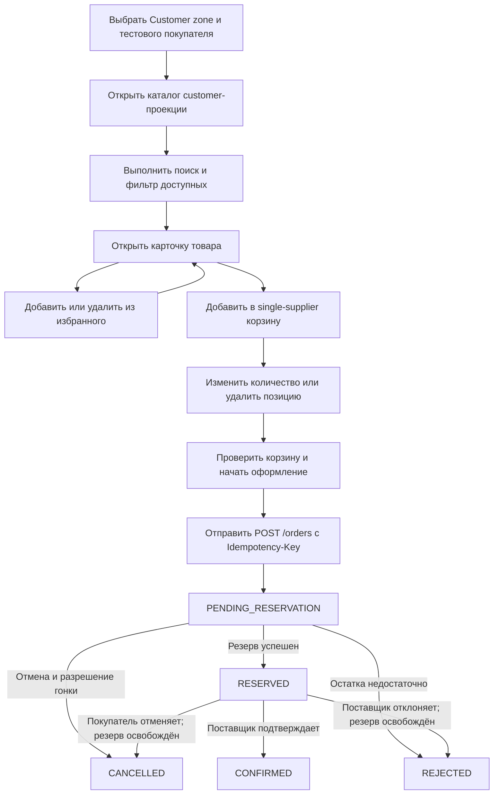
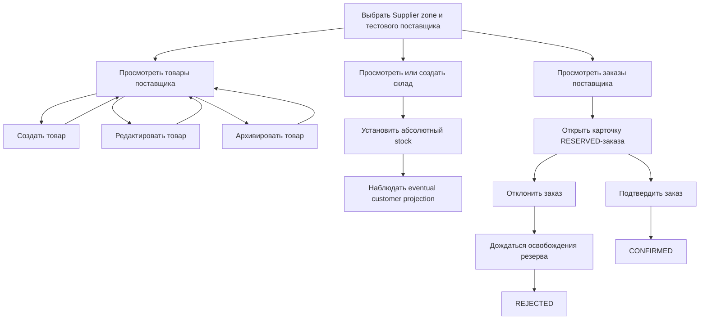
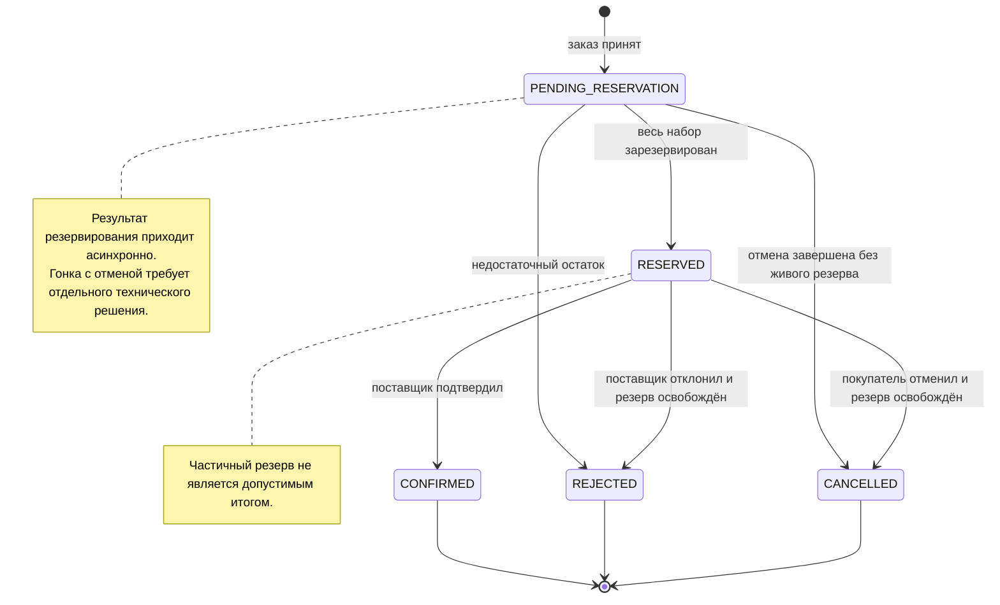

# Marketplace-QA 2.0: границы MVP, роли и пользовательские сценарии

## 1. Назначение документа

Документ определяет точный функциональный состав MVP Marketplace-QA 2.0: роли, доступные им возможности, минимальные страницы frontend, основные и негативные пользовательские сценарии, бизнес-состояния заказа и зависимости между функциями.

Документ развивает принципы из [`01-vision-and-architecture-principles.md`](01-vision-and-architecture-principles.md), но не повторяет архитектурное видение целиком и не является спецификацией API, Kafka-событий или физической модели данных.

Источники:

- **AS IS:** документы из `docs/requirements`, описывающие фактические API, бизнес-правила, сценарии, Kafka-контракты и данные текущей системы;
- **TO BE:** решения Marketplace-QA 2.0, принятые в первом архитектурном документе и в настоящем MVP scope.

Правила интерпретации:

- формулировка **«AS IS»** означает подтверждённое текущее поведение;
- формулировка **«решение MVP»** означает целевое функциональное требование, которого может ещё не быть в коде;
- frontend URL в этом документе являются целевыми маршрутами UI;
- точные новые backend endpoint, payload, таблицы, топики и event types здесь не утверждаются;
- `POST /orders` и `Idempotency-Key` упоминаются как заданный целевой контракт создания заказа, но его полная API-спецификация должна быть подготовлена отдельно.

## 2. Границы MVP

### 2.1. Функциональный контур

**Решение MVP.** В состав стенда входят:

- существующий `supplier-service`;
- существующий `customer-service`;
- существующий `audit-consumer`;
- новый `order-service`;
- `supplier-db`, `customer-db`, новый `order-db`;
- Kafka и Kafka UI;
- один новый сервис `frontend`;
- локальный запуск через Docker Compose;
- публичные REST API, Swagger/OpenAPI, Kafka-события, structured logs и correlation ID;
- предсказуемые seed-данные и повторяемые сценарии для QA.

MVP покрывает:

- публикацию, изменение и архивирование товара;
- создание склада и установку складского остатка;
- eventual-синхронизацию товара и агрегированного остатка в customer-проекцию;
- каталог, поиск, фильтрацию доступных товаров, избранное и корзину;
- создание заказа из корзины;
- HTTP-идемпотентность создания заказа;
- асинхронное резервирование всех позиций заказа;
- полный успех или полный отказ резервирования;
- подтверждение либо отклонение зарезервированного заказа поставщиком;
- отмену покупателем до `CONFIRMED`;
- освобождение резерва при отмене или отклонении после резервирования;
- аудит ключевых бизнес-событий;
- сопоставление frontend, REST, БД, Kafka и логов.

Технологический профиль `frontend`:

- React;
- TypeScript;
- Vite;
- React Router;
- простой CSS или CSS Modules;
- без тяжёлой UI-библиотеки;
- без production-grade дизайна;
- без полноценной авторизации;
- с выбором тестового пользователя и переключением Customer/Supplier зон;
- взаимодействие только через публичные REST API.

### 2.2. Решение по multi-supplier заказам

Рассмотрены два варианта.

| Область | Товары разных поставщиков в одном заказе | Один заказ принадлежит одному поставщику |
|---|---|---|
| `order-service` | Должен хранить несколько supplier-part, агрегировать их результаты и определять общий итог | Координирует один supplier-контур и один итог заказа |
| Резервирование | Требует независимых резервов у нескольких поставщиков и компенсации уже успешных частей при одном отказе | Один поставщик атомарно проверяет все позиции своего заказа |
| Подтверждение | Нужны несколько подтверждений и правило, когда весь заказ становится `CONFIRMED` | Есть один субъект подтверждения и один переход |
| Отклонение | Один поставщик может отклонить свою часть после успеха остальных | Отклонение относится ко всему заказу |
| Отмена | Требует fan-out освобождения резервов и агрегации ответов | Требует одного согласованного освобождения полного резерва |
| Frontend | Должен показывать части заказа, разные статусы и несколько поставщиков | Показывает один заказ, одного поставщика и один статус |
| Идемпотентность | Охватывает набор дочерних процессов и частично завершённые fan-out команды | Охватывает один order aggregate |
| Тестирование | Существенно больше гонок, комбинаций частичного успеха и компенсаций | Сохраняет ключевые проверки Kafka, retry, idempotency и eventual consistency без распределённой комплектации |
| Учебная ценность | Высокая, но смещает MVP к сложной saga | Достаточна для Middle Manual QA и лучше соответствует ограничению all-or-nothing |

**Решение MVP:** один заказ принадлежит одному поставщику, но может содержать несколько товаров этого поставщика.

Дополнительное UX- и бизнес-ограничение MVP: одна корзина одновременно содержит товары только одного поставщика. Первый товар определяет поставщика корзины; попытка добавить товар другого поставщика отклоняется понятным бизнес-конфликтом. После очистки корзины покупатель может формировать заказ другого поставщика.

Обоснование:

- all-or-nothing остаётся локальным бизнес-решением одного `supplier-service`;
- у заказа есть единственный поставщик, уполномоченный подтвердить или отклонить его;
- отмена требует одного компенсационного процесса;
- не нужны дочерние заказы, частичные статусы и межпоставщицкая saga;
- сохраняются все целевые учебные темы: несколько позиций, Kafka, eventual consistency, идемпотентность, retry, DLQ, correlation ID и аудит.

Зависимость от AS IS: supplier Product уже содержит `supplier_id`, но customer Product projection его не сохраняет. Для реализации решения MVP связь товара с поставщиком должна стать доступна `customer-service`, корзине и `order-service` через отдельное TO BE-решение по данным и контрактам. Это не считается существующим AS IS-полем customer-каталога.

## 3. Роли

### 3.1. Покупатель

Покупатель выбирает тестового пользователя, читает customer-проекцию каталога, работает с избранным и корзиной, оформляет и отслеживает заказ, отменяет его до `CONFIRMED`.

### 3.2. Поставщик

Поставщик выбирает тестового поставщика, управляет товарами, складами и остатками, просматривает относящиеся к нему заказы и принимает решение по заказу в `RESERVED`.

### 3.3. QA-инженер

QA-инженер — технический пользователь стенда. Он использует Customer- и Supplier-зоны, прямые REST-вызовы, PostgreSQL, Kafka UI, логи и аудит для проверки функциональных и отказных сценариев.

QA-инженер не является администратором системы и не получает отдельную admin-зону или бизнес-права.

### 3.4. Ограничение ролей

Полноценной аутентификации и авторизации в MVP нет. Выбор роли и тестового субъекта:

- управляет контекстом frontend;
- передаёт идентификатор пользователя или поставщика в рамках будущего публичного контракта;
- не является security boundary;
- не доказывает, что backend защищён от подмены идентификатора.

## 4. Матрица ролей и возможностей

| Роль | Возможность | Канал | Сервис-владелец |
|---|---|---|---|
| Покупатель | Выбрать тестового покупателя | Frontend + REST | `frontend`, `customer-service` |
| Покупатель | Просмотреть каталог и карточку товара | Frontend + REST | `customer-service` |
| Покупатель | Искать товар по названию | Frontend над полученной проекцией | `frontend`; данные — `customer-service` |
| Покупатель | Фильтровать доступные товары | Frontend над полученной проекцией | `frontend`; данные — `customer-service` |
| Покупатель | Добавить/удалить товар из избранного | Frontend + REST | `customer-service` |
| Покупатель | Просмотреть корзину | Frontend + REST | `customer-service` |
| Покупатель | Добавить товар и изменить количество | Frontend + REST | `customer-service` |
| Покупатель | Оформить заказ с `Idempotency-Key` | Frontend + REST | `order-service` |
| Покупатель | Просмотреть список и карточку заказов | Frontend + REST | `order-service` |
| Покупатель | Отменить заказ до `CONFIRMED` | Frontend + REST | `order-service` |
| Поставщик | Выбрать тестового поставщика | Frontend + REST | `frontend`, `supplier-service` |
| Поставщик | Просмотреть свои товары | Frontend + REST | `supplier-service` |
| Поставщик | Создать и редактировать товар | Frontend + REST | `supplier-service` |
| Поставщик | Архивировать товар | Frontend + REST | `supplier-service` |
| Поставщик | Просмотреть и создать склад | Frontend + REST | `supplier-service` |
| Поставщик | Установить остаток товара на складе | Frontend + REST | `supplier-service` |
| Поставщик | Просмотреть свои заказы и карточку заказа | Frontend + REST | `order-service` |
| Поставщик | Подтвердить зарезервированный заказ | Frontend + REST | `order-service` |
| Поставщик | Отклонить зарезервированный заказ | Frontend + REST | `order-service`; освобождение — `supplier-service` |
| QA-инженер | Использовать обе frontend-зоны | Frontend | `frontend` |
| QA-инженер | Вызывать публичные API напрямую | REST / Swagger | Владелец соответствующего API |
| QA-инженер | Повторять создание заказа с одним ключом | REST | `order-service` |
| QA-инженер | Сопоставлять доменные данные | SQL read в учебном окружении | Владелец соответствующей БД |
| QA-инженер | Наблюдать сообщения, offsets, lag и DLQ | Kafka UI | Kafka и consumer-владельцы |
| QA-инженер | Искать сквозной correlation ID | Structured logs | Все приложения |
| QA-инженер | Проверять аудит ключевых событий | Предусмотренный audit read path или SQL read | `audit-consumer` |
| QA-инженер | Восстанавливать известный набор тестовых данных | Документированная seed/reset-команда | Локальная инфраструктура стенда |

## 5. Customer capabilities

### 5.1. Выбор пользователя

- Frontend загружает доступных тестовых покупателей.
- Пользователь выбирается до выполнения customer-действий.
- Выбор сохраняется только как локальный контекст UI в пределах согласованного UX.
- При смене пользователя frontend заново загружает избранное, корзину и заказы.

### 5.2. Каталог и карточка товара

**AS IS:** customer catalog читает локальную проекцию и возвращает active, inactive и archived товары без поиска и фильтрации; проекция может отставать от supplier source of truth.

**Решение MVP:**

- каталог строится только по данным публичного REST API `customer-service`;
- поиск выполняется по названию товара без учёта регистра над уже загруженным MVP-каталогом;
- фильтр «Доступные» оставляет товары с `is_active=true`, `is_archived=false` и локальным `stocks>0`;
- фильтрация является представлением customer-проекции, а не гарантией успешного резервирования;
- карточка показывает основные данные товара, локальный агрегированный остаток и доступность;
- archived/inactive товар может оставаться доступным по прямому UI-маршруту для QA, но действия покупки блокируются backend.

Для MVP поиск и фильтрация выполняются на frontend. Это не вводит несуществующие AS IS query parameters. Переход к server-side поиску или пагинации находится вне текущего scope.

### 5.3. Избранное

- Покупатель добавляет товар в избранное и удаляет его.
- Повторное добавление не должно создавать визуальный дубль.
- Избранное не резервирует stock и не добавляет товар в корзину автоматически.
- Недоступный товар может оставаться видимым в избранном с соответствующим состоянием.

### 5.4. Корзина

- Добавление создаёт позицию или увеличивает её количество.
- Изменение количества заменяет текущее значение.
- Количество должно быть положительным.
- Проверка доступности по customer-проекции остаётся предварительной.
- Корзина не резервирует stock.
- В корзине разрешены несколько товаров одного поставщика.
- Добавление товара другого поставщика в непустую корзину отклоняется.
- Покупатель может удалить позицию и полностью очистить корзину последовательным удалением позиций; отдельная bulk-команда не утверждается этим документом.

### 5.5. Оформление и просмотр заказа

- Оформление начинается из непустой корзины.
- Все позиции корзины должны принадлежать одному поставщику.
- Frontend создаёт и повторно использует один `Idempotency-Key` для одной пользовательской попытки оформления.
- После принятия заказа покупатель видит `PENDING_RESERVATION`.
- Состояние обновляется повторным REST-чтением; frontend не читает Kafka.
- Покупатель видит список заказов и карточку с позициями, поставщиком, итоговой суммой, текущим статусом и доступными действиями.
- Точный порядок очистки корзины относительно создания заказа и надёжный контракт между `customer-service` и `order-service` остаются отдельным архитектурным решением.

## 6. Supplier capabilities

### 6.1. Выбор поставщика

- Frontend загружает список тестовых поставщиков.
- Выбранный `supplier_id` задаёт UI-контекст для товара и списка заказов.
- Из-за отсутствия auth этот контекст не является проверкой полномочий.

### 6.2. Товары

- Поставщик просматривает только товары с выбранным `supplier_id`.
- Создаёт товар с обязательными данными и начальным нулевым stock.
- Редактирует разрешённые поля без изменения складского остатка.
- Архивирует товар без физического удаления.
- Archived и inactive товары остаются видимыми в Supplier-зоне для QA и истории.

AS IS Supplier Product уже содержит `supplier_id`, поэтому фильтрация списка выбранного поставщика возможна над публичным ответом. Отдельный backend filter endpoint этим документом не вводится.

### 6.3. Склады и остатки

- Поставщик просматривает существующие склады.
- Создаёт склад.
- Устанавливает абсолютное количество товара на складе, а не delta-пополнение.
- Видит успешный REST-результат source-операции отдельно от последующей customer-синхронизации.
- Не может через изменение остатка нарушить инвариант уже созданного резерва; точная конкурентная модель фиксируется отдельно.

**AS IS-ограничение:** Warehouse не содержит `supplier_id` и фактически не принадлежит конкретному поставщику. В MVP страница складов использует общий список `supplier-service`. Добавление supplier ownership для складов является открытым решением по модели данных, а не подтверждённым текущим свойством.

### 6.4. Заказы

- Поставщик видит заказы, у которых `supplier_id` совпадает с выбранным поставщиком.
- В списке доступны все основные бизнес-статусы; действия показываются только там, где разрешены.
- В карточке видны позиции, количества, snapshot цены и причина отклонения в согласованном представлении.
- Из `RESERVED` поставщик может:
  - подтвердить заказ, переведя его в `CONFIRMED`;
  - отклонить заказ; после освобождения резерва итогом становится `REJECTED`.
- Повторная или конфликтующая команда не создаёт повторного stock-эффекта.

Точные supplier-facing order endpoint являются предполагаемыми TO BE-контрактами и будут определены в API-спецификации `order-service`.

## 7. QA capabilities

QA-инженер должен иметь возможность:

1. Выбрать разных покупателей и поставщиков без ручной правки frontend.
2. Выполнить happy path публикации товара, синхронизации, заказа и подтверждения.
3. Создать нулевой или недостаточный supplier stock публичным API.
4. Наблюдать промежуток между source-изменением и customer-проекцией.
5. Повторить `POST /orders` с тем же `Idempotency-Key` и тем же телом.
6. Повторить тот же ключ с изменённым телом и получить конфликт.
7. Сопоставить один заказ по order ID, correlation ID и message/event ID.
8. Проверить отсутствие частичного резерва при недостатке одной позиции.
9. Отменить `PENDING_RESERVATION` и `RESERVED` заказы и проверить отсутствие живого резерва.
10. Попытаться отменить `CONFIRMED` и получить бизнес-конфликт.
11. Подтвердить и отклонить заказ от имени тестового поставщика.
12. Вызвать повторную обработку сообщения и проверить идемпотентность.
13. Наблюдать retry, физический DLQ и контролируемый replay после появления соответствующего механизма.
14. Проверить записи аудита по ключевым событиям.
15. Сравнить frontend, REST-ответы, строки трёх БД, Kafka и structured logs.
16. Перезапустить стенд и восстановить известные seed-данные документированной процедурой.

QA-функции не требуют admin-панели. Доступ к Kafka UI, БД и логам является технической возможностью локального стенда.

## 8. Страницы минимального frontend

Все URL ниже — **TO BE-маршруты frontend**, а не утверждения о существующих backend endpoint. В колонке «Вызываемый backend» указан владелец требуемой публичной REST-возможности.

| URL | Роль | Назначение | Основные действия | Вызываемый backend | Состояние loading | Состояние empty | Состояние error |
|---|---|---|---|---|---|---|---|
| `/` | Все | Выбор зоны и тестового субъекта | Выбрать Customer/Supplier и пользователя | `customer-service`, `supplier-service` | Индикатор загрузки списков | Нет тестовых пользователей или поставщиков | Сообщение загрузки, retry, correlation ID |
| `/customer/catalog` | Покупатель | Каталог customer-проекции | Поиск, фильтр доступных, открыть карточку, добавить в избранное/корзину | `customer-service` | Skeleton/индикатор списка | Каталог пуст либо поиск ничего не нашёл | Сообщение, retry, correlation ID |
| `/customer/products/:productId` | Покупатель | Карточка товара | Просмотр, добавить в избранное/корзину | `customer-service` | Индикатор карточки | Товар не найден в проекции | Ошибка чтения или действия, correlation ID |
| `/customer/favorites` | Покупатель | Избранное | Открыть товар, удалить, добавить в корзину | `customer-service` | Индикатор списка | Избранное пусто | Ошибка чтения/изменения, retry |
| `/customer/cart` | Покупатель | Корзина | Изменить количество, удалить, перейти к оформлению | `customer-service` | Загрузка корзины и блокировка изменяемой строки | Корзина пуста | Ошибка позиции/остатка/поставщика, correlation ID |
| `/customer/checkout` | Покупатель | Подтверждение состава заказа | Проверить позиции и сумму, отправить заказ, безопасно повторить | `customer-service`, `order-service` | Создание заказа; повтор не генерирует новый ключ | Корзина пуста | Validation, mixed-supplier, idempotency conflict или service error |
| `/customer/orders` | Покупатель | Список заказов | Открыть карточку, увидеть статусы | `order-service` | Индикатор списка | Заказов нет | Ошибка чтения, retry, correlation ID |
| `/customer/orders/:orderId` | Покупатель | Карточка заказа | Обновить состояние, отменить в допустимом статусе | `order-service` | Загрузка/обновление состояния | Заказ не найден | Конфликт перехода или техническая ошибка |
| `/supplier/products` | Поставщик | Товары выбранного поставщика | Открыть создание/редактирование, архивировать | `supplier-service` | Индикатор списка/действия | У поставщика нет товаров | Ошибка чтения/действия, correlation ID |
| `/supplier/products/new` | Поставщик | Создание товара | Заполнить и отправить форму | `supplier-service` | Отправка формы | Не применяется | Field errors или service error |
| `/supplier/products/:productId/edit` | Поставщик | Редактирование товара | Изменить разрешённые поля | `supplier-service` | Загрузка/отправка формы | Товар не найден | Validation, ownership-context или service error |
| `/supplier/warehouses` | Поставщик | Склады и остатки | Просмотреть/создать склад, установить stock товара | `supplier-service` | Загрузка списка/операции | Складов нет | Validation, product/warehouse not found или service error |
| `/supplier/orders` | Поставщик | Заказы выбранного поставщика | Фильтровать по статусу, открыть карточку | `order-service` | Индикатор списка | Подходящих заказов нет | Ошибка чтения, retry, correlation ID |
| `/supplier/orders/:orderId` | Поставщик | Карточка заказа | Подтвердить или отклонить `RESERVED` | `order-service` | Загрузка/выполнение команды | Заказ не найден или не относится к поставщику | Конфликт статуса, компенсационная или техническая ошибка |

Общие требования к страницам:

- выбор зоны и тестового субъекта доступен в общей шапке;
- mutation-кнопка блокируется на время одного выполняемого запроса;
- повтор после сетевой неопределённости создания заказа использует прежний `Idempotency-Key`;
- error state показывает понятное сообщение и correlation ID, если он получен;
- frontend не показывает действие, запрещённое текущим статусом, но backend всё равно обязан валидировать переход;
- отсутствие данных отличается от ошибки загрузки;
- асинхронное бизнес-состояние отличается от HTTP loading.

## 9. Навигационная карта frontend

```text
/
├── Customer zone
│   ├── /customer/catalog
│   │   └── /customer/products/:productId
│   ├── /customer/favorites
│   ├── /customer/cart
│   │   └── /customer/checkout
│   └── /customer/orders
│       └── /customer/orders/:orderId
└── Supplier zone
    ├── /supplier/products
    │   ├── /supplier/products/new
    │   └── /supplier/products/:productId/edit
    ├── /supplier/warehouses
    └── /supplier/orders
        └── /supplier/orders/:orderId
```

Переключение зоны возвращает пользователя на стартовую страницу выбранной зоны. Смена тестового субъекта сбрасывает открытый entity context, чтобы не показывать данные предыдущего пользователя как данные нового.

## 10. Пользовательские сценарии

### 10.1. Каталог сценариев MVP

Все ID ниже являются **TO BE scenario ID** и не заменяют AS IS `SCN-*`.

Приоритеты:

- `P0` — обязательный сценарий приёмки MVP;
- `P1` — обязательная пользовательская/QA-возможность, не блокирующая базовый order happy path по отдельности.

| ID | Название | Предусловия | Основной результат | Участвующие сервисы | Характер | Приоритет MVP |
|---|---|---|---|---|---|---|
| `MVP-SCN-PROD-001` | Публикация товара | Выбран Supplier; валидные данные | Source Product создан с нулевым stock | frontend, `supplier-service`, `supplier-db` | Синхронный + последующая публикация | P0 |
| `MVP-SCN-CAT-001` | Синхронизация товара | Source Product создан/изменён | Customer projection сходится с обработанным product state | `supplier-service`, Kafka, `customer-service`, две БД | Асинхронный | P0 |
| `MVP-SCN-STOCK-001` | Изменение остатка | Есть Warehouse и Product | Абсолютный складской stock и aggregate обновлены | frontend, `supplier-service`, `supplier-db` | Синхронный + последующая публикация | P0 |
| `MVP-SCN-CAT-002` | Синхронизация остатка | Source aggregate изменён | Customer projection получает новый aggregate | `supplier-service`, Kafka, `customer-service` | Асинхронный | P0 |
| `MVP-SCN-CAT-003` | Поиск и фильтр каталога | Customer projection загружена | Показано клиентское подмножество без изменения backend state | frontend, `customer-service` | Синхронное REST-чтение + client-side | P1 |
| `MVP-SCN-FAV-001` | Работа с избранным | Выбран User; Product есть в projection | Favorite добавлена/удалена без stock effect | frontend, `customer-service`, `customer-db` | Синхронный | P1 |
| `MVP-SCN-CART-001` | Добавление и изменение корзины | Product доступен; Supplier совпадает с корзиной | Позиция создана/обновлена; stock не резервируется | frontend, `customer-service`, `customer-db` | Синхронный | P0 |
| `MVP-SCN-ORD-001` | Создание заказа | Непустая single-supplier cart; новый key | Один Order создан в `PENDING_RESERVATION` | frontend, `customer-service`, `order-service`, `order-db` | Синхронное принятие + асинхронное продолжение | P0 |
| `MVP-SCN-IDEM-001` | Безопасный повтор создания | Ранее принят тот же key и то же тело | Возвращён тот же Order без новой команды резервирования | frontend, `order-service`, `order-db` | Синхронный | P0 |
| `MVP-SCN-IDEM-002` | Конфликт ключа | Тот же key, изменённое тело | Конфликт; существующий Order не изменён | frontend, `order-service`, `order-db` | Синхронный | P0 |
| `MVP-SCN-RES-001` | Успешное резервирование | Всем позициям хватает supplier stock | Весь набор зарезервирован; Order становится `RESERVED` | `order-service`, Kafka, `supplier-service`, две БД | Асинхронный | P0 |
| `MVP-SCN-RES-002` | Отказ из-за остатка | Хотя бы одной позиции не хватает | Резерв отсутствует для всех позиций; Order становится `REJECTED` | `order-service`, Kafka, `supplier-service` | Асинхронный | P0 |
| `MVP-SCN-ORD-002` | Подтверждение поставщиком | Order `RESERVED`; выбран его Supplier | Order становится `CONFIRMED` | frontend, `order-service`, `order-db` | Синхронная команда; возможные async effects определяются ADR | P0 |
| `MVP-SCN-ORD-003` | Отмена до результата резерва | Order `PENDING_RESERVATION` | Итог `CANCELLED`, живого резерва нет | frontend, `order-service`, Kafka, `supplier-service` | Смешанный, с разрешением гонки | P0 |
| `MVP-SCN-ORD-004` | Отмена зарезервированного заказа | Order `RESERVED` | Резерв освобождён; затем Order `CANCELLED` | frontend, `order-service`, Kafka, `supplier-service` | Асинхронная компенсация | P0 |
| `MVP-SCN-ORD-005` | Отклонение поставщиком | Order `RESERVED`; выбран его Supplier | Резерв освобождён; затем Order `REJECTED` | frontend, `order-service`, Kafka, `supplier-service` | Асинхронная компенсация | P0 |
| `MVP-SCN-CONS-001` | Наблюдение eventual consistency | Source и projection доступны | QA фиксирует временное расхождение и последующую сходимость | frontend, supplier/customer REST, Kafka, две БД | Асинхронный | P0 |
| `MVP-SCN-AUD-001` | Аудит ключевого события | Событие опубликовано и доставлено | Audit record доступна для проверки и корреляции | Kafka, `audit-consumer`, audit storage | Асинхронный | P0 |
| `MVP-SCN-QA-001` | Восстановление seed-данных | Локальный стенд доступен | После документированного reset получено известное состояние | Docker Compose, БД, seed-механизм | Технический | P1 |

### 10.2. Customer user-flow



### 10.3. Supplier user-flow



## 11. Альтернативные и негативные сценарии

| ID | Условие | Ожидаемый результат MVP | Проверяемые поверхности |
|---|---|---|---|
| `MVP-ALT-001` | Каталог или поиск не содержит товаров | Empty state, не error | Frontend, customer REST |
| `MVP-ALT-002` | Product archived/inactive | Товар можно наблюдать для QA, но нельзя добавить в cart/order | Frontend, customer REST |
| `MVP-ALT-003` | Локальный stock равен нулю | «Доступные» скрывает товар; backend блокирует покупку | Frontend, customer REST |
| `MVP-ALT-004` | Добавление товара другого Supplier в непустую cart | Бизнес-конфликт; cart не изменяется | Frontend, `customer-service`, `customer-db` |
| `MVP-ALT-005` | Quantity неположительное или больше local stock | Validation/stock conflict; cart не изменяется | Customer REST, БД |
| `MVP-ALT-006` | Projection stale и показывает завышенный stock | Cart может пройти предварительную проверку, но supplier reservation отклоняет заказ целиком | Customer/supplier REST, Kafka, БД |
| `MVP-ALT-007` | Пустая cart при checkout | Заказ не создаётся; понятный empty/validation result | Frontend, customer/order REST |
| `MVP-ALT-008` | Тот же key и то же тело | Тот же order ID; нет нового order/reservation effect | Order REST, `order-db`, Kafka |
| `MVP-ALT-009` | Тот же key и другое тело | Idempotency conflict; исходный Order неизменен | Order REST, `order-db` |
| `MVP-ALT-010` | Недостаток одной из нескольких позиций | `REJECTED`; ни одна позиция не остаётся зарезервированной | Kafka, supplier/order DB |
| `MVP-ALT-011` | Повтор reservation/release message | Повторный бизнес-эффект отсутствует | Kafka, inbox/deduplication, stock |
| `MVP-ALT-012` | Покупатель отменяет `PENDING_RESERVATION` одновременно с успешным reserve | Единственный итог `CANCELLED`; поздний резерв освобождён | Order state, Kafka, stock, logs |
| `MVP-ALT-013` | Покупатель отменяет `RESERVED` | До итогового `CANCELLED` резерв должен быть освобождён | Order/supplier REST, Kafka, БД |
| `MVP-ALT-014` | Покупатель отменяет `CONFIRMED` | Бизнес-конфликт; статус и stock не меняются | Order REST, `order-db` |
| `MVP-ALT-015` | Поставщик подтверждает не `RESERVED` | Бизнес-конфликт; переход отсутствует | Supplier UI, Order REST |
| `MVP-ALT-016` | Поставщик отклоняет `RESERVED` | Резерв освобождён; итог `REJECTED` | Order REST, Kafka, supplier/order DB |
| `MVP-ALT-017` | Сообщение временно не обрабатывается | Ограниченный retry; состояние диагностируется по логам/correlation ID | Kafka, structured logs |
| `MVP-ALT-018` | Retry исчерпан | Сообщение попадает в физический DLQ и доступно для контролируемого replay | Kafka UI, DLQ, logs |
| `MVP-ALT-019` | Audit consumer отстаёт | Бизнес-операция не откатывается; audit появляется eventual | Kafka, audit storage |
| `MVP-ALT-020` | Тестовый субъект не выбран | Бизнес-страницы требуют выбора; запрос не отправляется | Frontend |

## 12. Статусы и переходы заказа

### 12.1. Бизнес-статусы MVP

| Статус | Смысл | Допустимые пользовательские действия |
|---|---|---|
| `PENDING_RESERVATION` | Заказ создан, итог supplier-резервирования ещё неизвестен | Покупатель может запросить отмену; остальные действия недоступны |
| `RESERVED` | Все позиции полностью зарезервированы | Поставщик может подтвердить/отклонить; покупатель может отменить |
| `CONFIRMED` | Поставщик подтвердил заказ | В MVP пользовательских переходов больше нет |
| `REJECTED` | Заказ полностью отклонён из-за stock либо решения поставщика; живого резерва нет | Только просмотр |
| `CANCELLED` | Отмена завершена; живого резерва нет | Только просмотр |

`CONFIRMED`, `REJECTED` и `CANCELLED` — терминальные бизнес-состояния MVP.

### 12.2. State diagram



### 12.3. Технические промежуточные состояния

Обязательный публичный список MVP ограничен пятью статусами выше. Процессы отмены и supplier rejection могут требовать отдельного устойчивого технического состояния наподобие «ожидается освобождение резерва», а timeout резервирования — отдельного состояния обработки ошибки.

Настоящий документ не добавляет такие статусы самовольно. Необходимость, видимость в публичном API и правила восстановления должны быть закреплены отдельным ADR/state-machine решением. Инвариант при этом обязателен: `CANCELLED` или `REJECTED` после ранее успешного резерва публикуются как итог только когда живого резерва больше нет.

## 13. Правила отмены

1. Покупатель может запросить отмену только до `CONFIRMED`.
2. Для `PENDING_RESERVATION` order-service обязан разрешить гонку с уже отправленной reservation command.
3. Если reserve ещё не создавался, итогом становится `CANCELLED` без stock effect.
4. Если reserve создан до или во время отмены, он освобождается идемпотентной командой.
5. Для `RESERVED` переход в итоговый `CANCELLED` требует подтверждённого освобождения всего резерва.
6. После `CONFIRMED` отмена в MVP запрещена.
7. Повторная отмена `CANCELLED` не запускает новую компенсацию; точный HTTP-результат задаётся API-контрактом.
8. Отмена `REJECTED` не имеет бизнес-эффекта.
9. Отмена не реализует возврат после получения, оплату или доставку.
10. Correlation ID связывает REST-команду отмены, release message, supplier effect и итоговый переход.

## 14. Правила резервирования

1. Резервированием владеет `supplier-service`; order state координирует `order-service`.
2. Команда относится к одному order ID, одному supplier ID и полному набору позиций.
3. Все Product принадлежат одному Supplier.
4. Резерв создаётся только для active и not archived Product.
5. Все quantities положительные.
6. Supplier source of truth, а не customer projection, принимает окончательное решение.
7. Достаточность проверяется для всего набора.
8. При недостатке хотя бы одной позиции итог — полный отказ без остаточного резерва.
9. Успех означает резерв всех позиций и только после него допускает `RESERVED`.
10. Повторная команда с тем же business/message identity не увеличивает резерв.
11. Release освобождает весь относящийся к заказу резерв и является идемпотентным.
12. Ручное изменение складского stock не может сделать физический остаток меньше уже зарезервированного количества.
13. Порядок выбора складов, блокировки строк, модель `available/reserved` и конкурентные обновления требуют отдельного ADR.
14. Частичная комплектация и частичный supplier result не входят в MVP.

## 15. Правила идемпотентности

### 15.1. HTTP

1. `POST /orders` требует `Idempotency-Key`.
2. Для MVP предлагаемый scope ключа — операция создания заказа в контексте выбранного `user_id`.
3. Первый запрос атомарно связывает key, fingerprint нормализованного тела и один Order.
4. Тот же key и то же тело возвращают тот же Order с тем же ID.
5. Повтор не создаёт новую order row, не очищает корзину повторно и не публикует новую reservation command.
6. Тот же key и другое тело возвращают конфликт.
7. Параллельные запросы с одним key сходятся к одному Order.
8. После сетевой ошибки frontend повторяет ту же пользовательскую попытку с прежним key.
9. Новая осознанная попытка пользователя получает новый key.
10. Возвращается ли в повторном ответе текущая или исходная representation заказа, точный HTTP status, canonicalization и TTL ключа определяются отдельным API/ADR-контрактом.

### 15.2. Kafka

- Reservation, release и result messages имеют устойчивую identity.
- Consumer-дедупликация атомарно связана с бизнес-эффектом.
- Повтор события состояния заказа не создаёт повторной audit/business mutation.
- Окно хранения deduplication records покрывает допустимый replay.
- `Idempotency-Key`, message ID, correlation ID и order ID не подменяют друг друга.

## 16. Правила eventual consistency

1. `supplier-service` и `supplier-db` — source of truth товара и stock.
2. `customer-service` читает локальную проекцию, которая может временно отставать.
3. Публикация/изменение товара и stock не обязаны быть видны в Customer-зоне к моменту supplier REST-ответа.
4. Поиск и фильтр работают по текущей customer-проекции.
5. Предварительная cart-проверка не гарантирует reserve success.
6. `order-service` — source of truth статуса заказа.
7. После `POST /orders` frontend показывает `PENDING_RESERVATION` и обновляет состояние через REST polling/refresh.
8. Frontend не читает Kafka и не вычисляет новый статус самостоятельно.
9. Audit появляется eventual и не является условием HTTP-успеха бизнес-команды.
10. QA может наблюдать временное расхождение, но система должна иметь определяемый путь к сходимости.
11. Допустимый lag, polling interval, timeout резервирования и восстановление пропущенной проекции остаются измеримыми NFR/open decisions.

## 17. Ограничения MVP

- Одна корзина и один заказ относятся к одному поставщику.
- Один заказ может содержать несколько товаров.
- Заказ исполняется целиком.
- Только пять бизнес-статусов обязательны публично.
- Полноценная auth отсутствует.
- Выбор тестового пользователя не является security boundary.
- Customer search/filter выполняются на frontend над загруженным списком.
- Frontend использует REST polling/ручное обновление, а не WebSocket/SSE.
- Warehouse ownership поставщиком пока не определён; AS IS склады общие.
- Сложная saga между поставщиками отсутствует.
- Kafka, PostgreSQL и приложения запускаются локально в single-instance Compose topology.
- UI оптимизирован для тестируемости, а не production-grade UX.
- Технический доступ QA к БД, Kafka UI и логам допустим только как свойство учебного стенда.

## 18. Что не входит в MVP

- администратор и admin-панель;
- регистрация, пароль, JWT, OAuth и RBAC;
- оплата;
- доставка;
- отмена после `CONFIRMED`;
- возврат товара после получения;
- частичная комплектация;
- split order и multi-supplier order;
- несколько корзин одного покупателя;
- промокоды, скидочные кампании и бонусы;
- отзывы и рейтинги;
- рекомендации;
- сложный server-side search, faceting и полнотекстовый индекс;
- production-grade UI kit и дизайн-система;
- WebSocket/SSE как обязательный канал;
- мобильное приложение;
- Kubernetes;
- Elasticsearch/Kibana;
- сложный distributed tracing;
- production SLA и high-availability topology.

## 19. Зависимости между функциями

| Функция | Обязательные зависимости | Что блокирует готовность |
|---|---|---|
| Выбор тестового пользователя | Списки Customer/Supplier, frontend context | Нет предсказуемых seed users |
| Supplier product list | Product содержит supplier ID | Нельзя выделить товары выбранного Supplier |
| Customer single-supplier cart | `supplier_id` доступен в customer projection | AS IS projection отбрасывает supplier ID |
| Поиск/фильтр | Customer catalog list | Не определены доступность и empty state |
| Checkout | Непустая валидная cart, выбран User, стабильная price/item representation | Не определён источник позиций и очистка cart |
| Создание заказа | `order-service`, `order-db`, Idempotency contract | Нет атомарной связи key → request → Order |
| Reservation | Order identity, supplier identity, полный item set, supplier stock model | Нет all-or-nothing и consumer idempotency |
| Supplier order list | Order хранит supplier association и item snapshot | Нельзя фильтровать/показывать заказ поставщика |
| Confirmation | `RESERVED`, один Supplier, state transition validation | Не определена семантика финализации резерва |
| Buyer cancellation | Order state machine, release flow, race handling | Возможен `CANCELLED` с живым резервом |
| Supplier rejection | Release flow и reason model | Возможен `REJECTED` с живым резервом |
| Eventual catalog | Product/stock events, ordering/recovery rule | Проекция может не сойтись после пропуска/переупорядочивания |
| Аудит | Согласованный список key events, event ID/correlation ID, audit storage | QA не может однозначно найти запись |
| Correlation | REST middleware, Kafka propagation, log contract | Сквозной сценарий нельзя сопоставить |
| Seed/reset | Версионированные миграции и детерминированный dataset | Сценарии невоспроизводимы |

## 20. Критерии готовности MVP scope

Scope считается готовым для детализации требований и контрактов, когда:

- подтверждены три роли и отсутствие администратора;
- утверждено ограничение «одна корзина и один заказ — один поставщик»;
- подтверждено, что заказ может содержать несколько товаров;
- согласован состав Customer- и Supplier-страниц;
- для каждой страницы определены loading, empty и error states;
- утверждены пять публичных бизнес-статусов и допустимые переходы;
- принято решение о технических состояниях отмены/компенсации либо документирован способ обойтись без них;
- описан supplier-side all-or-nothing reserve invariant;
- закрыты гонки reserve/cancel/confirm/reject на уровне state machine;
- зафиксирован контракт same key/same body и same key/different body;
- определён источник item set при checkout и порядок очистки cart;
- `supplier_id` доступен проекции, корзине и заказу в согласованном контракте;
- определено, как поставщик получает и фильтрует свои заказы;
- определён список key events для аудита и способ audit read;
- определены seed/reset процедура и базовый dataset;
- каждый P0-сценарий имеет будущие acceptance criteria и трассировку к API, Kafka и данным;
- все оставшиеся вопросы либо закрыты, либо явно назначены следующему ADR/документу.

Готовность scope не разрешает начинать реализацию автоматически. Следующими артефактами должны стать детальные бизнес-правила, state machine/ADR, API- и Kafka-контракты, модель данных и тестовая трассировка.

## 21. Открытые вопросы

1. Нужен ли отдельный публичный технический статус для ожидания release при cancel/reject?
2. Как разрешается гонка отмены `PENDING_RESERVATION` с поздним успешным reservation result?
3. Что именно означает `CONFIRMED` для stock: фиксацию продажи, перевод резерва в окончательное списание или только supplier approval?
4. Должен ли supplier manual rejection быть разрешён только из `RESERVED`?
5. Какой reason model различает недостаточный stock, решение поставщика и технический отказ?
6. Как `supplier_id` добавляется в customer projection и версионируется ли существующий product event?
7. Остаётся ли Warehouse общим или получает supplier ownership?
8. Как backend обеспечивает single-supplier cart: новое поле/проверка проекции или проверка при каждой mutation?
9. Кто и как передаёт cart item set в `order-service` без переноса бизнес-оркестрации во frontend?
10. Когда очищается cart: после принятия Order, после `RESERVED` или после `CONFIRMED`?
11. Что происходит с cart при `REJECTED` и `CANCELLED`?
12. Какие Product/price/name fields сохраняются snapshot в `order-db`?
13. Какая валюта, денежный тип и правило округления используются?
14. Возвращает ли idempotent replay исходную или текущую representation Order?
15. Каковы canonicalization и TTL `Idempotency-Key`?
16. Нужна ли пагинация списков товаров и заказов при базовом seed dataset?
17. Какой REST polling interval используется для order status и когда frontend прекращает polling?
18. Какие key events обязан сохранять `audit-consumer`?
19. Где физически хранится audit и каким способом QA читает его?
20. Каковы lag SLA для каталога, stock, reservation result и audit?
21. Как устроены retry, DLQ и безопасный replay?
22. Какой точный состав seed-данных и процедура reset?
23. Какие frontend-действия доступны archived/inactive товарам в Supplier-зоне кроме просмотра?
