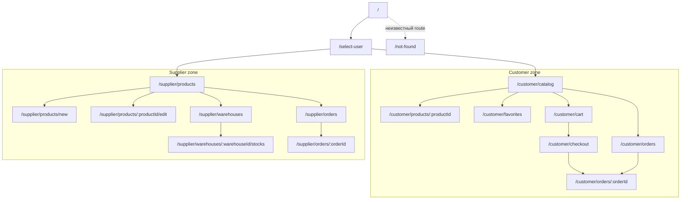

# Marketplace-QA 2.0: функциональные требования к frontend

## 0. Статус, границы и правила чтения документа

Документ определяет функциональные требования к минимальному frontend Marketplace-QA 2.0. Он предназначен для последующей реализации и тестирования, но не создаёт техническую реализацию, UI-макеты, CSS, backend-контракты или новые бизнес-функции.

Источники:

- архитектурные решения TO BE из `docs/to-be/01-vision-and-architecture-principles.md`;
- MVP scope, роли и сценарии из `docs/to-be/02-mvp-scope-roles-and-user-scenarios.md`;
- подтверждённые AS IS API-контракты из `docs/requirements/api`;
- AS IS error contract, business rules, business scenarios, data contract и Kafka event contract;
- фактические Pydantic- и SQLAlchemy-модели, HTTP handlers и Kafka consumers `supplier-service` и `customer-service`.

В документе используются следующие метки:

- **AS IS** — контракт или поведение уже существует и подтверждено кодом и AS IS-документацией;
- **TO BE** — требуемое поведение Marketplace-QA 2.0, которого может ещё не быть в реализации;
- **предполагаемый TO BE API** — необходимая frontend возможность, но точный URL, payload, HTTP status и error codes ещё должны быть утверждены отдельной API-спецификацией;
- **открытый вопрос** — решение не должно выбираться разработчиком frontend самостоятельно.

Все URL вида `/customer/...` и `/supplier/...` являются маршрутами frontend. Они не являются backend endpoint.

Подтверждённые ограничения AS IS, влияющие на frontend:

- customer Product projection не содержит `supplier_id`;
- customer catalog возвращает active, inactive и archived товары без поиска, фильтров и пагинации;
- Warehouse не содержит `supplier_id`, а `GET /warehouses` возвращает общий список складов без stock details;
- `POST /warehouses/{warehouse_id}/stocks` устанавливает абсолютные остатки и не является атомарным для нескольких items;
- отдельного публичного чтения Warehouse–Product stock rows нет;
- cart AS IS не ограничена одним поставщиком, не хранит цену и не резервирует stock;
- order AS IS принадлежит `customer-service`, имеет только фактические статусы `created`/`cancelled`, не поддерживает `Idempotency-Key` и не возвращает результат supplier-side обработки;
- общий AS IS error envelope имеет форму `{"error":{"code":"...","message":"..."}}`, но не содержит correlation ID;
- frontend в AS IS отсутствует.

## 1. Назначение документа

Документ должен позволить реализовать минимальный интерфейс без самостоятельного выбора бизнес-поведения. Он фиксирует:

- маршруты и доступность страниц по выбранной тестовой роли;
- данные, действия и состояния каждой страницы;
- frontend-валидацию без подмены backend-валидации;
- отображение синхронных и асинхронных результатов;
- UX для eventual consistency;
- безопасный повтор создания заказа с `Idempotency-Key`;
- наблюдаемые состояния и селекторы для ручного и E2E-тестирования;
- границу между существующими AS IS API и ещё не утверждёнными TO BE API.

## 2. Принципы frontend

- **FR-FE-001.** Frontend должен быть одним отдельным сервисом с Customer- и Supplier-зонами.
- **FR-FE-002.** Frontend должен взаимодействовать с системой только через публичные REST API.
- **FR-FE-003.** Frontend не должен читать PostgreSQL, Kafka или Kafka UI.
- **FR-FE-004.** Frontend не должен самостоятельно выполнять доменный переход заказа или изменять остаток без backend-команды.
- **FR-FE-005.** Клиентская валидация должна дополнять, но не заменять серверную валидацию.
- **FR-FE-006.** Асинхронное бизнес-состояние должно отображаться отдельно от состояния выполнения HTTP-запроса.
- **FR-FE-007.** Временное расхождение source of truth и customer-проекции не должно отображаться как гарантированный дефект или мгновенный успех синхронизации.
- **FR-FE-008.** Для неизвестного backend-поля или статуса frontend должен использовать безопасное нейтральное представление без самостоятельного преобразования состояния.

Технологические решения TO BE: React, TypeScript, Vite, React Router, простой CSS или CSS Modules, без тяжёлой UI-библиотеки и production-grade дизайна. Этот документ не определяет структуру исходного кода.

## 3. Пользовательские роли

### 3.1. Покупатель

Покупатель выбирает предзагруженного тестового User, просматривает customer-проекцию каталога, работает с избранным и single-supplier корзиной, оформляет заказ, следит за его состоянием и отменяет заказ до `CONFIRMED`.

### 3.2. Поставщик

Поставщик выбирает предзагруженного тестового Supplier, управляет своими товарами, использует общий список складов в рамках текущего MVP-ограничения, меняет остатки и принимает решение по своему `RESERVED`-заказу.

### 3.3. QA-инженер

QA-инженер не является отдельной бизнес-ролью и не получает admin-зону. Он использует обе frontend-зоны и технические поверхности стенда для проверки UI, REST, Kafka, БД, логов и correlation ID.

- **FR-FE-009.** Frontend должен предоставлять выбор контекста `Customer` или `Supplier` без аутентификации.
- **FR-FE-010.** Customer-действия должны выполняться только при выбранном тестовом User.
- **FR-FE-011.** Supplier-действия должны выполняться только при выбранном тестовом Supplier.
- **FR-FE-012.** Выбор роли или субъекта не должен обозначаться в UI как проверка полномочий.
- **FR-FE-013.** QA-инженер должен иметь возможность последовательно использовать обе зоны без отдельной учётной записи.

## 4. Выбор тестового пользователя

### 4.1. Источники и сохранение контекста

- **AS IS:** `GET /users` customer-service возвращает `items`, `count`, а User содержит `id`, `full_name`, `email`, `created_at`.
- **AS IS:** `GET /suppliers` supplier-service возвращает `items`, `count`, а Supplier содержит `id`, `full_name`, `phone_number`, `email`, `birth_date`, `city`, timestamps.
- **TO BE:** списки должны быть наполнены фиксированными seed-данными; точный состав seed dataset задаётся отдельно.

- **FR-FE-014.** `/select-user` должен загрузить списки тестовых User и Supplier соответствующими публичными list API.
- **FR-FE-015.** Элемент выбора должен показывать стабильный ID и человекочитаемое имя каждого субъекта.
- **FR-FE-016.** Подтверждение выбора User должно переводить на `/customer/catalog`.
- **FR-FE-017.** Подтверждение выбора Supplier должно переводить на `/supplier/products`.
- **FR-FE-018.** Смена субъекта должна сбрасывать данные сущности, открытой в контексте предыдущего субъекта.
- **FR-FE-019.** После смены User frontend должен заново запросить favorites, cart и orders при открытии соответствующих страниц.
- **FR-FE-020.** После смены Supplier frontend должен заново запросить products и orders при открытии соответствующих страниц.
- **FR-FE-021.** Способ сохранения выбранного субъекта после reload должен быть единообразным для обеих ролей и не содержать секретов.

**Открыто:** сохраняется ли выбранный субъект в `sessionStorage`, `localStorage` или только в памяти. До решения reload страницы без восстановимого контекста должен вести на `/select-user`, а не выполнять запрос с отсутствующим ID.

### 4.2. Acceptance criteria: выбор тестового пользователя

#### AC-FE-001

**Given** открыта `/select-user`, списки тестовых пользователей успешно загружены

**When** пользователь выбирает Customer и User с фиксированным ID и подтверждает выбор

**Then** frontend сохраняет выбранный UI-контекст, открывает `/customer/catalog` и показывает выбранные роль, ID и имя.

## 5. Общая структура приложения

Frontend включает:

- общий `AppLayout`;
- стартовую страницу выбора зоны;
- страницу выбора тестового субъекта;
- Customer layout и вложенные Customer routes;
- Supplier layout и вложенные Supplier routes;
- страницу not found;
- единый слой представления ошибок и correlation ID;
- единый механизм отображения HTTP loading и асинхронных бизнес-процессов.

Данные роли и субъекта являются UI-контекстом. Авторитетные Product, cart, order и stock state всегда повторно читаются из backend.

## 6. Маршрутизация

### 6.1. Таблица маршрутов

В колонке «Backend» указан владелец данных, а не frontend proxy URL.

| Маршрут | Роль | Страница | Назначение | Backend | Доступные действия |
|---|---|---|---|---|---|
| `/` | Все | Стартовая | Выбрать Customer или Supplier | Нет обязательного вызова | Выбрать зону, перейти к выбору субъекта |
| `/select-user` | Все | Выбор субъекта | Выбрать тестового User или Supplier | `customer-service`, `supplier-service` | Загрузить список, выбрать, подтвердить, повторить загрузку |
| `/customer/*` | Customer | Customer layout/guard | Общая зона покупателя | По дочернему route | Навигация; при отсутствии User — redirect |
| `/customer/catalog` | Customer | Каталог | Читать customer-проекцию | `customer-service` | Искать, фильтровать, перелистывать, открыть, добавить |
| `/customer/products/:productId` | Customer | Карточка товара | Читать один Product projection | `customer-service` | Выбрать quantity, favorite/cart |
| `/customer/favorites` | Customer | Избранное | Управлять Favorites | `customer-service` | Открыть, удалить, добавить в cart |
| `/customer/cart` | Customer | Корзина | Управлять single-supplier cart | `customer-service` | Изменить quantity, удалить, очистить, checkout |
| `/customer/checkout` | Customer | Checkout | Создать заказ из корзины | `customer-service`, `order-service` | Проверить snapshot, отправить, безопасно повторить |
| `/customer/orders` | Customer | Заказы покупателя | Читать заказы User | `order-service` | Обновить, перелистать, открыть |
| `/customer/orders/:orderId` | Customer | Карточка заказа | Читать и отменять заказ | `order-service` | Обновить, отменить в допустимом статусе |
| `/supplier/*` | Supplier | Supplier layout/guard | Общая зона поставщика | По дочернему route | Навигация; при отсутствии Supplier — redirect |
| `/supplier/products` | Supplier | Товары поставщика | Управлять source Products | `supplier-service` | Создать, редактировать, архивировать, перейти к складам |
| `/supplier/products/new` | Supplier | Создание товара | Создать source Product | `supplier-service` | Валидировать, отправить, повторить |
| `/supplier/products/:productId/edit` | Supplier | Редактирование товара | Изменить допустимые Product fields | `supplier-service` | Сохранить, архивировать после подтверждения |
| `/supplier/warehouses` | Supplier | Склады | Читать общий список и создавать Warehouse | `supplier-service` | Создать, открыть stocks |
| `/supplier/warehouses/:warehouseId/stocks` | Supplier | Остатки склада | Читать и устанавливать абсолютный stock | `supplier-service` | Изменить stock, повторно загрузить |
| `/supplier/orders` | Supplier | Заказы поставщика | Читать заказы выбранного Supplier | `order-service` | Фильтровать, обновить, открыть |
| `/supplier/orders/:orderId` | Supplier | Карточка заказа | Подтвердить/отклонить `RESERVED` | `order-service` | Подтвердить, отклонить, обновить |
| `/not-found` | Все | Not found | Сообщить о неизвестном UI route | Нет | Вернуться на старт или в текущую зону |

### 6.2. Правила маршрутизации

- **FR-FE-022.** `/` должен позволять выбрать одну из двух зон и перейти на `/select-user` с выбранным типом субъекта.
- **FR-FE-023.** Customer route без выбранного User должен перенаправлять на `/select-user`.
- **FR-FE-024.** Supplier route без выбранного Supplier должен перенаправлять на `/select-user`.
- **FR-FE-025.** Route с невалидным положительным integer entity ID должен показывать validation/not-found UI без backend-запроса.
- **FR-FE-026.** Неизвестный frontend route должен приводить на `/not-found`.
- **FR-FE-027.** Переключение Customer → Supplier должно вести на `/supplier/products` после выбора Supplier.
- **FR-FE-028.** Переключение Supplier → Customer должно вести на `/customer/catalog` после выбора User.
- **FR-FE-029.** Breadcrumbs должны отражать фактический route и предоставлять переход только к доступным родительским страницам.

### 6.3. Mermaid: навигация приложения



### 6.4. Общие страницы

#### Стартовая страница

| Атрибут | Требование |
|---|---|
| ID | `FR-FE-022` |
| Маршрут / роль | `/`; все |
| Назначение | Объяснить назначение стенда и выбрать Customer или Supplier |
| Предусловия | Нет |
| Источник данных / API | Статический frontend content; backend-запрос не обязателен |
| Поля | Название стенда, краткое описание, две роли, предупреждение об отсутствии auth |
| Действия | Выбрать Customer или Supplier |
| Бизнес-ограничения | Выбор является UI-контекстом, а не авторизацией |
| Loading / empty / error | Не применяются при отсутствии backend-вызова |
| Success | Выбран тип субъекта для `/select-user` |
| После reload | Страница открывается заново без доменных запросов |
| Навигация после успеха | `/select-user` с выбранным типом субъекта |
| Негативные сценарии | Неизвестный сохранённый role value игнорируется |
| QA-точки | Обе роли доступны; ни одна не названа login/auth |

#### Страница выбора субъекта

| Атрибут | Требование |
|---|---|
| ID | `FR-FE-014`–`FR-FE-021` |
| Маршрут / роль | `/select-user`; все |
| Назначение | Выбрать фиксированный тестовый User или Supplier |
| Предусловия | Выбран тип субъекта либо он выбирается на странице |
| Источник данных | User list customer-service; Supplier list supplier-service |
| API | **AS IS** `GET /users`, `GET /suppliers` |
| Поля | Role, subject ID, full name; дополнительные read-only идентифицирующие поля |
| Действия | Загрузить, выбрать, подтвердить, повторить неуспешное чтение |
| Бизнес-ограничения | Нет регистрации; выбор не доказывает полномочия |
| Loading | Независимый индикатор списка выбранного типа |
| Empty | Нет seed subjects выбранного типа; confirm недоступен |
| Error | Ошибка соответствующего list API с retry |
| Success | Role/subject видны в общем layout |
| После reload | Согласно ещё не утверждённой persistence policy |
| Навигация после успеха | Customer → catalog; Supplier → products |
| Негативные сценарии | Субъект исчез между list и дальнейшим read; API одного типа недоступен |
| QA-точки | Фиксированные IDs, empty/error, смена субъекта, reset старого context |

#### Страница not found

| Атрибут | Требование |
|---|---|
| ID | `FR-FE-026` |
| Маршрут / роль | `/not-found`; все |
| Назначение | Обработать неизвестный frontend route |
| Предусловия | Router не сопоставил URL |
| Источник данных / API | Статический frontend content; backend-запрос отсутствует |
| Поля | Исходный безопасно отображённый path и пояснение |
| Действия | Вернуться на `/` или старт текущей выбранной зоны |
| Бизнес-ограничения | Не используется вместо backend entity 404 |
| Loading / empty / error | Не применяются |
| Success | Пользователь получает доступные recovery links |
| После reload | Остаётся not-found для неизвестного URL |
| Навигация после действия | На выбранную пользователем безопасную страницу |
| Негативные сценарии | Отсутствующий Product/Order остаётся entity error на своём route |
| QA-точки | Unknown route, сохранение роли, отсутствие лишнего backend request |

## 7. Общие UI-компоненты

Таблица описывает назначение, минимальные входные данные и наблюдаемое поведение. Она не задаёт React props или техническую реализацию.

| ID | Компонент | Назначение | Входные данные | Ожидаемое поведение |
|---|---|---|---|---|
| `FR-FE-030` | `AppLayout` | Общий каркас | роль, субъект, навигация, page content | Показывает шапку, текущий контекст, основную область и уведомления |
| `FR-FE-031` | `RoleSwitcher` | Переключение зон | текущая роль, доступные роли | Запрашивает смену роли и не выдаёт её за аутентификацию |
| `FR-FE-032` | `TestUserSelector` | Выбор субъекта | list items, selected ID, loading/error | Показывает ID+имя, запрещает confirm без выбора |
| `FR-FE-033` | `Navigation` | Навигация зоны | роль, текущий route, пункты | Показывает только пункты текущей зоны и текущий активный пункт |
| `FR-FE-034` | `Breadcrumbs` | Путь к странице | ordered route segments | Делает родительские элементы ссылками, текущий — текстом |
| `FR-FE-035` | `DataTable` | Табличные списки | columns, rows, row key, actions | Имеет headers, стабильный row key, keyboard-доступные действия |
| `FR-FE-036` | `ProductCard` | Краткое представление товара | ID, name, price, stock, supplier, flags | Не скрывает недоступность и блокирует недопустимое добавление |
| `FR-FE-037` | `OrderStatusBadge` | Показ статуса заказа | status | Использует текст вместе с визуальным оформлением; неизвестный статус показывается нейтрально |
| `FR-FE-038` | `LoadingState` | HTTP loading | operation label | Показывается в области операции и сообщает доступное имя операции |
| `FR-FE-039` | `EmptyState` | Валидный пустой результат | title, description, optional action | Не использует оформление ошибки |
| `FR-FE-040` | `ErrorState` | Ошибка чтения/страницы | category, message, correlation ID, retryability | Показывает retry только для безопасного действия |
| `FR-FE-041` | `ConfirmDialog` | Подтверждение значимого действия | action, entity, consequences | Требует явного confirm/cancel и возвращает фокус инициатору |
| `FR-FE-042` | `Toast/Notification` | Результат mutation | severity, message, correlation ID | Не является единственным местом длительной business error |
| `FR-FE-043` | `Pagination` | Разбиение клиентского списка | current page, total pages, page size | Сохраняет filters при переходе и блокирует несуществующие страницы |
| `FR-FE-044` | `QuantityInput` | Положительное целое quantity | value, min, local max, disabled, error | Не принимает дробь/ноль; показывает, что local max не гарантирует reserve |
| `FR-FE-045` | `FormField` | Поле и ошибки | label, value, required, hint, field error | Связывает label/error с control и сохраняет value после server error |
| `FR-FE-046` | `CorrelationIdBlock` | Диагностика | correlation ID, source | Показывается только при наличии ID и позволяет скопировать точное значение |
| `FR-FE-047` | `AsyncOperationStatus` | Асинхронный бизнес-процесс | state, last update, message, refresh action | Не смешивается с HTTP spinner и не обещает мгновенную сходимость |

## 8. Общие состояния страниц

- **FR-FE-048.** Первая загрузка страницы должна иметь явное loading-состояние.
- **FR-FE-049.** Пустой успешный list response должен иметь отдельное empty-состояние.
- **FR-FE-050.** Ошибка первой загрузки должна заменять область данных на `ErrorState`, сохраняя доступную навигацию.
- **FR-FE-051.** Ошибка mutation должна сохранять последние успешно загруженные данные страницы.
- **FR-FE-052.** Успешная mutation должна отражаться после ответа backend либо после обязательного повторного чтения.
- **FR-FE-053.** Stale/eventual состояние должно иметь информационный текст и действие refresh, если пользователь может проверить сходимость.
- **FR-FE-054.** Во время mutation должна блокироваться только конфликтующая команда и повторная отправка той же формы.
- **FR-FE-055.** Reload entity page должен повторно читать entity из backend, а не считать кэш авторитетным.

### 8.1. Матрица страниц и UI-состояний

| Страница | Loading | Empty | Error | Success | Stale/eventual consistency |
|---|---|---|---|---|---|
| Стартовая | Не применяется | Не применяется | Не применяется | Выбор Customer/Supplier доступен | Не применяется |
| Выбор субъекта | Списки загружаются независимо | Нет User/Supplier | Ошибка конкретного списка + retry | Субъект выбран | Не применяется |
| Customer catalog | Индикатор списка | Нет товаров / нет результатов filter | Ошибка каталога | Карточки и pagination | Banner о проекции; manual refresh |
| Customer product | Индикатор карточки | Не применяется | 404 или read error | Product fields/actions | Данные могли измениться после открытия |
| Favorites | Индикатор списка | Избранное пусто | Read/mutation error | Список Favorites | Flags/stock/price из текущей проекции |
| Cart | Индикатор списка/строки | Корзина пуста | Read/mutation error | Позиции и totals | Price/stock могли измениться |
| Checkout | Snapshot загружается | Корзина пуста | Read/create error | Order принят | `PENDING_RESERVATION` после принятия |
| Customer orders | Индикатор списка | Заказов нет | Read error | Список заказов | Статусы обновляются чтением |
| Customer order | Индикатор/refresh | Не применяется | 404/conflict/read error | Order snapshot/status | Pending reserve/cancel/reject |
| Supplier products | Индикатор списка/action | Товаров нет | Read/mutation error | Таблица Product | Customer projection обновится позже |
| Product create | Submit progress | Не применяется | Field/form error | Product создан | Customer ещё может не видеть Product |
| Product edit | Initial load/submit | Не применяется | 404/conflict/error | Текущие поля | Customer может видеть старую версию |
| Warehouses | Индикатор списка/create | Складов нет | Read/create error | Общий список складов | Не применяется |
| Warehouse stocks | Initial load/row submit | Нет stock rows | Read/update error | Stock rows | Customer aggregate обновится позже |
| Supplier orders | Индикатор списка | Заказов нет по filter | Read error | Заказы Supplier | Новый статус может прийти позже |
| Supplier order | Индикатор/command | Не применяется | 404/conflict/error | Order/status/actions | Release после reject асинхронен |
| Not found | Не применяется | Не применяется | Не используется как server error | Пояснение и ссылки | Не применяется |

## 9. Общие правила отображения ошибок

### 9.1. Правила

- **FR-FE-056.** Frontend должен сначала классифицировать ошибку по HTTP status, наличию ответа и согласованному error envelope.
- **FR-FE-057.** Подтверждённые AS IS `error.code` должны отображаться без изменения их машинного значения в диагностических деталях.
- **FR-FE-058.** Неизвестный `error.code` должен отображаться как неизвестная серверная ошибка с исходным correlation ID, если он доступен.
- **FR-FE-059.** Field-level error должен показываться у поля только при однозначной связи server details с этим полем.
- **FR-FE-060.** Form-level business error должен оставаться видимым до изменения формы, повторной отправки или явного закрытия пользователем.
- **FR-FE-061.** Network error и timeout не должны утверждать, что mutation не выполнилась.
- **FR-FE-062.** Для unsafe mutation обычный retry должен быть доступен только при определённой стратегии повтора.
- **FR-FE-063.** Correlation ID должен показываться в page error, form error или notification, если backend его вернул.

### 9.2. Frontend error mapping

| Категория | HTTP-статус | Источник | UI-представление | Действие пользователя |
|---|---:|---|---|---|
| Validation error | 400 AS IS; точный TO BE контракт уточняется | Request schema/business input | Field errors, иначе form error; введённые данные сохранены | Исправить данные и отправить снова |
| Business error | 400/409 | Доменное правило | Постоянный form/page message; известный code в деталях | Исправить состояние или вернуться |
| Not found | 404 | Entity отсутствует или скрыта ownership check | Entity not found; без пустой таблицы | Вернуться к списку/обновить |
| Conflict | 409 | Статус, stock, single-supplier, idempotency | Conflict message с сохранением текущих данных | Обновить данные; для order key — следовать отдельному правилу |
| Unauthorized | 401, зарезервировано TO BE | Будущий security contract | Session/access message | Вернуться к выбору субъекта; не имитировать login |
| Forbidden | 403, зарезервировано TO BE | Будущий security contract | Access denied | Вернуться в разрешённую зону |
| Server error | 500 | Необработанная server error | ErrorState/notification + correlation ID | Безопасно обновить чтение; mutation — по правилам операции |
| Network error | Нет HTTP response | Browser/network | Сообщение «результат неизвестен» для mutation | Проверить соединение; повторить безопасно |
| Timeout | Нет завершённого response | Client timeout | Отдельное timeout message | Read — retry; order create — тот же key |
| Unavailable dependency | 502/503/504, предполагаемый TO BE | Gateway/service dependency | Временная недоступность + retry policy | Повторить чтение; mutation — только безопасным способом |
| Unknown error | Любой непредусмотренный результат | Client/server/protocol | Нейтральная ошибка без выдуманного объяснения | Обновить/вернуться; передать correlation ID QA |

Подтверждённые AS IS codes, которые могут вернуть используемые в MVP Supplier/Customer endpoint вне AS IS order API: `validation_error`, `internal_error`, `supplier_not_found`, `product_not_found`, `product_archived`, `warehouse_not_found`, `user_not_found`, `product_inactive`, `favorite_not_found`, `cart_item_not_found`, `insufficient_stock`. Коды `cart_is_empty`, `order_not_found` и `order_already_cancelled` подтверждены только для текущего AS IS order API `customer-service` и не считаются автоматически применимыми к TO BE `order-service`. Single-supplier, idempotency, новые order statuses, confirm/reject/release и dependency errors требуют отдельного TO BE error catalogue; конкретные новые codes здесь не задаются.

## 10. Customer-зона

### 10.1. Каталог

| Атрибут | Требование |
|---|---|
| ID | `FR-FE-064`–`FR-FE-072` |
| Маршрут / роль | `/customer/catalog`; Customer |
| Назначение | Просмотр текущей customer-проекции |
| Предусловия | Выбран User |
| Источник данных | Customer Product projection; не supplier source of truth |
| API | **AS IS** `GET /products` customer-service; TO BE response должен дополнительно предоставлять `supplier_id` |
| Поля | ID, name, краткое description, price, aggregate stock, Supplier ID, optional Supplier name, active/archive availability |
| Действия | Поиск, availability filter, pagination, открыть, favorite, cart |
| Ограничения | Поиск/filter/pagination выполняются после загрузки полного MVP-списка; local stock не гарантирует reserve |
| После reload | Повторный `GET /products`, затем восстановление допустимых search/filter/page параметров |
| Навигация | Product → карточка; cart/favorites → соответствующие страницы |
| Негативные сценарии | Пустой список, нет результатов, stale stock/price/flags, mutation conflict |
| QA-точки | Поиск case-insensitive, filter, boundary page, flags, stale projection, stable selectors |

- **FR-FE-064.** Каталог должен показывать все Product, возвращённые customer API, без скрытого удаления archived/inactive записей из исходного результата.
- **FR-FE-065.** Поиск должен фильтровать загруженный список по подстроке `name` без учёта регистра.
- **FR-FE-066.** Фильтр «Доступные» должен оставлять строки с `is_active=true`, `is_archived=false` и local `stocks>0`.
- **FR-FE-067.** Каждая карточка должна показывать цену без придуманного символа валюты до утверждения currency contract.
- **FR-FE-068.** Каждая карточка должна показывать local aggregate stock и Supplier ID; имя Supplier показывается только если его предоставляет утверждённый публичный контракт.
- **FR-FE-069.** Добавление в cart должно быть заблокировано для archived, inactive или zero-stock Product по текущей projection.
- **FR-FE-070.** Добавление в Favorite должно оставаться доступным для archived, inactive и zero-stock Product.
- **FR-FE-071.** Каталог должен использовать клиентскую пагинацию по 20 элементов после применения поиска и фильтра.
- **FR-FE-072.** После ручного refresh каталог должен заново запросить projection и сохранить search/filter, сбросив номер страницы, если он стал недопустимым.

Loading: `LoadingState` вместо списка. Empty: отдельно «каталог пуст» и «нет результатов поиска». Error: page `ErrorState` с безопасным retry. Success: список, count текущего результата и pagination. Stale: информационный текст, что остаток и цена являются projection.

### 10.2. Карточка товара

| Атрибут | Требование |
|---|---|
| ID | `FR-FE-073`–`FR-FE-081` |
| Маршрут / роль | `/customer/products/:productId`; Customer |
| Назначение | Подробный просмотр Product projection |
| Предусловия | Выбран User; `productId` — positive integer |
| Источник данных | Customer Product projection |
| API | **AS IS** `GET /products/{product_id}`; Favorite/cart AS IS API с TO BE single-supplier проверкой cart |
| Поля | ID, name, description, price, stock, Supplier ID, optional Supplier name, active/archive availability |
| Действия | Quantity, favorite add/remove, cart add, refresh |
| Ограничения | Local stock предварителен; archived/inactive нельзя купить |
| После reload | Повторное чтение Product и favorite/cart relation при необходимости |
| Навигация | Назад в catalog; после add cart — остаться с notification или открыть cart явной ссылкой |
| Негативные сценарии | 404, archive после открытия, stock/price change, insufficient stock, other supplier conflict |
| QA-точки | Invalid ID, exact local max, flags changed after opening, double click |

- **FR-FE-073.** Карточка должна показывать Product response и Supplier ID из TO BE projection; имя Supplier показывается только при наличии в утверждённом публичном response.
- **FR-FE-074.** `QuantityInput` должен принимать только integer от 1 до текущего local stock включительно.
- **FR-FE-075.** Cart action должен быть недоступен, если Product unavailable по текущим flags или local stock.
- **FR-FE-076.** Перед отправкой cart mutation frontend должен использовать выбранный User ID и показанный Product ID.
- **FR-FE-077.** После business conflict frontend должен повторно загрузить Product и cart.
- **FR-FE-078.** Если reload возвращает `product_not_found`, страница должна показать not-found state и ссылку в catalog.
- **FR-FE-079.** Если Product стал archived после открытия, server error должен заменить доступное cart action на archived state после refresh.
- **FR-FE-080.** Favorite state не должен визуально дублироваться после повторного AS IS `POST /favorites`.
- **FR-FE-081.** Успешное добавление в cart должно показать фактическую quantity позиции из server response.

#### AC-FE-002: добавление товара в корзину

**Given** выбран User, cart пуста, Product active, not archived, имеет `supplier_id` и local stock не меньше выбранного количества

**When** покупатель добавляет Product в cart

**Then** frontend отправляет одну cart mutation, показывает quantity из ответа и не сообщает о резервировании stock.

#### AC-FE-003: запрет второго поставщика

**Given** cart содержит Product Supplier A

**When** покупатель пытается добавить Product Supplier B

**Then** frontend не заменяет существующую cart, показывает business conflict и после повторного чтения cart содержит только позиции Supplier A.

### 10.3. Избранное

| Атрибут | Требование |
|---|---|
| ID | `FR-FE-082`–`FR-FE-087` |
| Маршрут / роль | `/customer/favorites`; Customer |
| Назначение | Читать и изменять Favorites выбранного User |
| Предусловия | Выбран User |
| Источник данных | customer-service Favorites + текущие Product summaries |
| API | **AS IS** `GET /favorites?user_id=`, `DELETE /favorites/{product_id}?user_id=`, `POST /cart` |
| Поля | Favorite ID, Product ID/name/price/stock/flags, Supplier ID из TO BE projection |
| Действия | Открыть Product, удалить Favorite, добавить в cart |
| Ограничения | Favorite не резервирует stock; unavailable Product остаётся видимым |
| После reload | Повторный Favorites read |
| Навигация | Product detail; cart после явного действия пользователя |
| Негативные сценарии | Favorite удалён параллельно, Product unavailable/missing, cart supplier conflict |
| QA-точки | Empty, repeat delete, archived/inactive/zero stock, current summary |

- **FR-FE-082.** Favorites page должна показывать один визуальный элемент на каждую Favorite из server response.
- **FR-FE-083.** Archived/inactive/zero-stock Product должен оставаться видимым с недоступным cart action.
- **FR-FE-084.** Удаление Favorite должно блокировать только удаляемую строку до завершения запроса.
- **FR-FE-085.** После успешного delete строка должна исчезнуть без изменения cart.
- **FR-FE-086.** `favorite_not_found` при delete должен привести к повторному чтению списка и сообщению о уже отсутствующей записи.
- **FR-FE-087.** Cart conflict из Favorites должен сохранять Favorite и текущую cart.

Loading: list loading. Empty: «В избранном нет товаров». Error: list error или row-level mutation error. Success: текущие Product summaries. Stale: значения отражают customer projection, а не supplier source.

### 10.4. Корзина

| Атрибут | Требование |
|---|---|
| ID | `FR-FE-088`–`FR-FE-099` |
| Маршрут / роль | `/customer/cart`; Customer |
| Назначение | Управлять единственной single-supplier cart |
| Предусловия | Выбран User |
| Источник данных | customer-service Cart и текущая Product projection |
| API | **AS IS** `GET /cart?user_id=`, `PATCH /cart/{product_id}`, `DELETE /cart/{product_id}?user_id=`; single-supplier validation — TO BE evolution |
| Поля | Product, Supplier, quantity, current unit price, line total, total count, cart total |
| Действия | Replace quantity, удалить, очистить последовательными DELETE, checkout |
| Ограничения | Только один Supplier; quantity positive; cart не резервирует stock |
| После reload | Повторный cart read; незавершённое локальное редактирование не считается сохранённым |
| Навигация | Product detail; checkout только для непустой валидной cart |
| Негативные сценарии | Price/stock/flags change, item missing, partial clear, supplier conflict |
| QA-точки | POST increment vs PATCH replace, totals, exact stock boundary, mixed supplier rejection |

- **FR-FE-088.** Cart должна показывать один Supplier для всех позиций и считать mixed-supplier server response нарушением TO BE-инварианта.
- **FR-FE-089.** Каждая строка должна показывать current projected unit price, quantity и line total из server response.
- **FR-FE-090.** Cart total должен отображаться из server response, а не использоваться как авторитетный order snapshot.
- **FR-FE-091.** Изменение quantity должно использовать replace-semantics AS IS `PATCH`, а не increment.
- **FR-FE-092.** Quantity 0 должно предлагаться как отдельное delete action, а не отправляться в PATCH.
- **FR-FE-093.** Успешный PATCH должен заменить строку и totals значениями из ответа или последующего cart read.
- **FR-FE-094.** Удаление позиции должно использовать явное действие и AS IS DELETE.
- **FR-FE-095.** «Очистить корзину» должно требовать confirmation и удалить текущие позиции последовательными AS IS DELETE, поскольку bulk endpoint не подтверждён.
- **FR-FE-096.** При ошибке в середине очистки frontend должен повторно загрузить cart и показать реально оставшиеся позиции.
- **FR-FE-097.** Checkout action должен быть недоступен для пустой cart.
- **FR-FE-098.** Если current price отличается от ранее показанной, frontend должен выделить обновившуюся цену после reload без сохранения старой цены как гарантии.
- **FR-FE-099.** Если quantity стала больше local stock или Product стал unavailable, frontend должен показать проблему строки и запретить переход к checkout до server-валидного состояния.

#### AC-FE-004: изменение количества

**Given** cart содержит Product quantity 2 и current local stock 5

**When** покупатель вводит 4 и сохраняет

**Then** frontend отправляет PATCH с quantity 4, показывает quantity и totals из backend и не интерпретирует действие как добавление ещё четырёх единиц.

### 10.5. Checkout

| Атрибут | Требование |
|---|---|
| ID | `FR-FE-100`–`FR-FE-112` |
| Маршрут / роль | `/customer/checkout`; Customer |
| Назначение | Проверить состав и безопасно создать один Order |
| Предусловия | Выбран User; cart непуста; все позиции одного Supplier |
| Источник данных | Свежий cart read для preview; Order response — `order-service` |
| API | **AS IS** `GET /cart?user_id=`; **предполагаемый TO BE** `POST /orders` с `Idempotency-Key` |
| Поля | Supplier, Products, quantities, текущие projected prices для preview, line totals, total, key operation state |
| Действия | Вернуться в cart, создать Order, безопасно повторить неопределённую попытку |
| Ограничения | Frontend не резервирует stock и не оркестрирует Kafka; all-or-nothing решает backend |
| После reload | Cart читается заново; восстановление незавершённого key — открытый вопрос |
| Навигация | Успех → `/customer/orders/:orderId`; validation → cart; conflict остаётся на checkout |
| Негативные сценарии | Empty/mixed cart, changed price/stock, double click, network error, idempotency conflict |
| QA-точки | Один key, same body retry, different body conflict, cart cleanup moment |

- **FR-FE-100.** При открытии checkout frontend должен заново запросить cart.
- **FR-FE-101.** Preview должен показывать Supplier, Product IDs/names, quantities, текущие projected prices и total.
- **FR-FE-102.** Preview должен обозначать, что окончательный snapshot и reserve result определяются backend.
- **FR-FE-103.** Frontend должен запретить submit пустой или mixed-supplier cart.
- **FR-FE-104.** Frontend должен создать один `Idempotency-Key` до первой отправки одной checkout attempt.
- **FR-FE-105.** Submit должен блокироваться сразу после начала первой отправки.
- **FR-FE-106.** Успешный ответ должен содержать Order ID и текущее состояние, достаточные для перехода в карточку.
- **FR-FE-107.** После принятия нового Order frontend должен перейти в его карточку и показать полученное от backend состояние `PENDING_RESERVATION`.
- **FR-FE-108.** Network error/timeout должен сохранять key и неизменённый request fingerprint для retry.
- **FR-FE-109.** Idempotency conflict должен показываться как отдельный conflict без автоматической генерации нового key.
- **FR-FE-110.** Frontend не должен очищать cart отдельной последовательностью после Order response без утверждённого backend-контракта.
- **FR-FE-111.** После успешного Order response frontend должен перечитать cart и показать фактический результат принятой политики очистки.
- **FR-FE-112.** Изменение cart после подготовки checkout должно требовать возврата в cart и новой осознанной attempt с новым key.

Точный источник item set для `order-service` и момент очистки cart остаются открытыми. Frontend не должен сам передавать доверенные price/total или координировать customer-service и order-service как бизнес-сагу.

#### AC-FE-005: checkout

**Given** свежая непустая cart содержит несколько Products одного Supplier

**When** покупатель один раз нажимает «Оформить заказ»

**Then** frontend создаёт один key, отправляет одну TO BE order command, блокирует повторный submit и после принятого ответа открывает карточку полученного Order.

#### AC-FE-006: повтор с Idempotency-Key

**Given** первая order command завершилась network error и HTTP-результат неизвестен

**When** покупатель выбирает retry без изменения cart snapshot

**Then** frontend повторяет то же тело с тем же `Idempotency-Key` и не создаёт вторую параллельную отправку.

### 10.6. Список заказов

| Атрибут | Требование |
|---|---|
| ID | `FR-FE-113`–`FR-FE-119` |
| Маршрут / роль | `/customer/orders`; Customer |
| Назначение | Читать Orders выбранного User |
| Предусловия | Выбран User |
| Источник данных | `order-service` source of truth |
| API | **Предполагаемый TO BE** `GET /orders?user_id={userId}` |
| Поля | Order ID, created at, Supplier, total, current status |
| Действия | Refresh, pagination, открыть detail |
| Ограничения | Frontend не выводит status из Kafka/customer cart |
| После reload | Повторный list read |
| Навигация | Order row → customer order detail |
| Негативные сценарии | User/order API unavailable, unknown status, status changes between reads |
| QA-точки | Ownership filter, ordering, empty, all five statuses, unknown status |

- **FR-FE-113.** Список должен показывать только Orders, возвращённые для выбранного User.
- **FR-FE-114.** Каждая строка должна показывать ID, creation time, Supplier, total и `OrderStatusBadge`.
- **FR-FE-115.** Неизвестный status должен показываться исходным значением с нейтральным badge.
- **FR-FE-116.** Refresh должен повторять order list read без изменения User.
- **FR-FE-117.** Empty response должен показывать «Заказов нет» и ссылку в catalog.
- **FR-FE-118.** Список должен использовать pagination metadata будущего API либо клиентскую пагинацию по 20 строк до утверждения server pagination.
- **FR-FE-119.** Строка должна открывать detail по стабильному Order ID.

### 10.7. Карточка заказа покупателя

| Атрибут | Требование |
|---|---|
| ID | `FR-FE-120`–`FR-FE-131` |
| Маршрут / роль | `/customer/orders/:orderId`; Customer |
| Назначение | Наблюдать Order и отменить до `CONFIRMED` |
| Предусловия | Выбран User; valid Order ID |
| Источник данных | `order-service` source of truth |
| API | **Предполагаемые TO BE** `GET /orders/{orderId}?user_id=`, `POST /orders/{orderId}/cancel` |
| Поля | ID, created at, Supplier, item snapshots, quantities, prices, total, status, reason, optional history/correlation ID |
| Действия | Refresh; cancel в `PENDING_RESERVATION` или `RESERVED` |
| Ограничения | Cancel после `CONFIRMED` запрещён; итог `CANCELLED` после reserve требует release |
| После reload | Повторный Order read; polling возобновляется только по правилам async state |
| Навигация | Назад в orders/catalog |
| Негативные сценарии | 404, conflict race, late reserve, reject reason, cancel technical uncertainty |
| QA-точки | Snapshot vs current Product, status transitions, button gating, polling stop, correlation ID |

- **FR-FE-120.** Карточка должна показывать Order item snapshot отдельно от текущей Product projection.
- **FR-FE-121.** Для каждой позиции должны отображаться Product identity/name snapshot, quantity, unit price snapshot и line total из утверждённого order contract.
- **FR-FE-122.** Карточка должна показывать Supplier, total и текущий business status из order API.
- **FR-FE-123.** `PENDING_RESERVATION` должен сопровождаться `AsyncOperationStatus`, а не бесконечным HTTP spinner.
- **FR-FE-124.** Cancel action должен отображаться только для `PENDING_RESERVATION` и `RESERVED`.
- **FR-FE-125.** Cancel должен требовать confirmation с пояснением, что release может завершиться асинхронно.
- **FR-FE-126.** Во время cancel command frontend должен блокировать повторный cancel и сохранять последний прочитанный business status.
- **FR-FE-127.** `REJECTED` должен показывать reason, если backend его предоставил, либо нейтральный текст об отсутствии детали.
- **FR-FE-128.** `CANCELLED` должен показывать завершённый результат отмены и не предлагать повторный cancel.
- **FR-FE-129.** Status history должна отображаться только при наличии утверждённого массива history в response.
- **FR-FE-130.** Correlation ID должен отображаться только при наличии в response body/header согласно будущему contract.
- **FR-FE-131.** Manual refresh должен быть доступен во всех статусах и повторять только GET.

#### AC-FE-007: отмена RESERVED-заказа

**Given** order API возвращает Order в `RESERVED`

**When** покупатель подтверждает cancel

**Then** frontend отправляет одну cancel command, показывает выполняющуюся компенсацию отдельно от HTTP loading и показывает `CANCELLED` только после соответствующего состояния из order API.

## 11. Supplier-зона

### 11.1. Список товаров

| Атрибут | Требование |
|---|---|
| ID | `FR-FE-132`–`FR-FE-141` |
| Маршрут / роль | `/supplier/products`; Supplier |
| Назначение | Читать и управлять Products выбранного Supplier |
| Предусловия | Выбран Supplier |
| Источник данных | `supplier-service` source of truth |
| API | **AS IS** `GET /products`, `DELETE /products/{product_id}`; фильтр Supplier выполняется frontend |
| Поля | ID, name, price, aggregate stock, active, archived, created at |
| Действия | Create, edit, archive, перейти к warehouses |
| Ограничения | AS IS list без pagination/filter; Product другого Supplier не показывается |
| После reload | Повторный list read и filter по selected Supplier ID |
| Навигация | New/edit; warehouses |
| Негативные сценарии | Empty, product missing, archive repeat, event publish failure after commit |
| QA-точки | Supplier filter, flags, aggregate, archive not delete, customer lag |

- **FR-FE-132.** Страница должна отфильтровать AS IS Product list по `supplier_id` выбранного Supplier.
- **FR-FE-133.** Строка должна показывать ID, name, price, aggregate `stocks`, active и archived flags.
- **FR-FE-134.** Archived и inactive Product должны оставаться видимыми.
- **FR-FE-135.** Create action должен вести на `/supplier/products/new`.
- **FR-FE-136.** Edit action должен быть доступен только для Product выбранного Supplier.
- **FR-FE-137.** Archive action должен требовать confirmation и называть действие архивированием.
- **FR-FE-138.** После AS IS HTTP 204 archive frontend должен перечитать supplier Product list.
- **FR-FE-139.** После archive frontend должен показать сообщение, что Customer projection может обновиться позднее.
- **FR-FE-140.** Aggregate stock не должен редактироваться на Product list.
- **FR-FE-141.** Клиентская pagination по 20 строк должна применяться после Supplier filter.

### 11.2. Создание товара

| Атрибут | Требование |
|---|---|
| ID | `FR-FE-142`–`FR-FE-150` |
| Маршрут / роль | `/supplier/products/new`; Supplier |
| Назначение | Создать Product с initial stock 0 |
| Предусловия | Выбран Supplier |
| Источник данных | Form input + selected Supplier; результат supplier-service |
| API | **AS IS** `POST /products` |
| Поля | name required, description optional, price required; `supplier_id` из контекста |
| Действия | Submit, cancel |
| Ограничения | Stock не входит в create; initial stock 0; active=true/archived=false |
| После reload | Пустая форма; черновик не считается сохранённым |
| Навигация | Успех → `/supplier/products/:productId/edit`; cancel → list |
| Негативные сценарии | Validation, unknown Supplier, active+archived conflict, server/network error |
| QA-точки | Required, trim, length, price boundary, one submit, initial stock, event lag |

- **FR-FE-142.** Form должна принимать name, optional description и price.
- **FR-FE-143.** Frontend должен подставлять selected `supplier_id` и не позволять редактировать его в create form.
- **FR-FE-144.** Frontend должен не отправлять `stocks` в create body.
- **FR-FE-145.** Submit должен быть disabled при невалидных required fields.
- **FR-FE-146.** Во время submit повторный submit должен быть disabled.
- **FR-FE-147.** Server field/form error должен сохранять все введённые значения.
- **FR-FE-148.** Успешный response должен показывать Product ID и source `stocks=0`.
- **FR-FE-149.** После успеха frontend должен перейти на edit route созданного Product.
- **FR-FE-150.** После успеха frontend должен показать eventual message о Customer projection.

#### AC-FE-008: создание товара

**Given** выбран Supplier, заполнены валидные обязательные name и price, а optional description имеет допустимое значение

**When** поставщик отправляет форму один раз

**Then** frontend отправляет один AS IS `POST /products` с selected supplier ID без stock, открывает edit route response Product и показывает source stock 0.

### 11.3. Редактирование и архивирование товара

| Атрибут | Требование |
|---|---|
| ID | `FR-FE-151`–`FR-FE-160` |
| Маршрут / роль | `/supplier/products/:productId/edit`; Supplier |
| Назначение | Изменить разрешённые поля source Product |
| Предусловия | Выбран Supplier; Product принадлежит ему |
| Источник данных | supplier-service Product |
| API | **AS IS** `GET /products/{product_id}`, `PUT /products/{product_id}`, `DELETE /products/{product_id}` |
| Поля | Editable: name, description, price, is_active; read-only: ID, supplier, stock, created_at; archive отдельным action |
| Действия | Save, archive, cancel |
| Ограничения | UI не предлагает смену Supplier; stock меняется только на stock page |
| После reload | Повторный Product read; unsaved input теряется после confirmation browser navigation |
| Навигация | Успех остаётся на edit или возвращает в list явной кнопкой |
| Негативные сценарии | 404, Product другого Supplier, stale form, flags conflict, post-commit event error |
| QA-точки | Partial update, immutable fields, stock unchanged, archive semantics, customer lag |

- **FR-FE-151.** До показа формы frontend должен загрузить Product по ID.
- **FR-FE-152.** Product с другим `supplier_id` должен показывать ownership-context error и не предоставлять mutation actions.
- **FR-FE-153.** ID, selected Supplier, aggregate stock и created timestamp должны быть read-only.
- **FR-FE-154.** MVP edit form не должна предоставлять AS IS возможность сменить `supplier_id`.
- **FR-FE-155.** Save body должен содержать только изменяемые поля, выбранные формой.
- **FR-FE-156.** Server response после save должен заменить показанные source fields.
- **FR-FE-157.** При server conflict введённые значения должны сохраниться рядом с server message.
- **FR-FE-158.** Отсутствие revision/version в AS IS должно быть явно признано: frontend не должен утверждать, что stale-write conflict обнаружен.
- **FR-FE-159.** Archive должен выполняться только после `ConfirmDialog`.
- **FR-FE-160.** После archive route должен перейти в Product list и показать eventual message.

### 11.4. Архивирование товара: последствия

Архивирование — AS IS `DELETE /products/{id}`, который устанавливает `is_active=false`, `is_archived=true` и не удаляет Product или WarehouseProduct rows.

- Архивированный Product остаётся видимым Supplier и в Customer favorites/history.
- Для новых cart/order mutations он должен быть недоступен после сходимости projection.
- До доставки projection update Customer может временно видеть старые flags.
- Frontend не должен обещать немедленное исчезновение Product из Customer-зоны.

### 11.5. Склады

| Атрибут | Требование |
|---|---|
| ID | `FR-FE-161`–`FR-FE-168` |
| Маршрут / роль | `/supplier/warehouses`; Supplier |
| Назначение | Читать общий AS IS список Warehouse и создавать Warehouse |
| Предусловия | Выбран Supplier как UI-контекст |
| Источник данных | supplier-service source |
| API | **AS IS** `GET /warehouses`, `POST /warehouses` |
| Поля | ID, name, weekday_hours, address, created_at |
| Действия | Create inline/modal, открыть stock page |
| Ограничения | Warehouse AS IS не имеет supplier ownership; список общий |
| После reload | Повторный Warehouse list read |
| Навигация | Warehouse → `/supplier/warehouses/:warehouseId/stocks` |
| Негативные сценарии | Empty, validation, duplicate allowed AS IS, unavailable service |
| QA-точки | Required lengths, duplicate name/address, global-list notice |

- **FR-FE-161.** Страница должна показывать все Warehouses из AS IS list response.
- **FR-FE-162.** Страница должна явно сообщать, что Warehouses общие в текущем MVP и не фильтруются по selected Supplier.
- **FR-FE-163.** Create form должна содержать name, weekday hours и address.
- **FR-FE-164.** Submit должен быть disabled при нарушении известных AS IS length constraints.
- **FR-FE-165.** Успешно созданный Warehouse должен появиться после list refresh.
- **FR-FE-166.** Empty state должен предлагать create action.
- **FR-FE-167.** Страница не должна утверждать уникальность name/address, поскольку AS IS её не проверяет.
- **FR-FE-168.** Каждая строка должна предоставлять переход к stock page.

### 11.6. Остатки склада

| Атрибут | Требование |
|---|---|
| ID | `FR-FE-169`–`FR-FE-179` |
| Маршрут / роль | `/supplier/warehouses/:warehouseId/stocks`; Supplier |
| Назначение | Читать Warehouse–Product rows и устанавливать абсолютный stock |
| Предусловия | Выбран Supplier; Warehouse существует |
| Источник данных | supplier-service source of truth |
| API | **Предполагаемый TO BE** `GET /warehouses/{warehouseId}/stocks`; **AS IS** `POST /warehouses/{warehouse_id}/stocks` для записи |
| Поля | Warehouse, Products выбранного Supplier, stock на Warehouse, aggregate stock |
| Действия | Изменить абсолютный stock одной позиции, refresh |
| Ограничения | Integer `>=0`; не delta; UI отправляет один item, чтобы не скрывать AS IS non-atomic batch |
| После reload | Повторный TO BE stock read |
| Навигация | Назад в Warehouses/Products |
| Негативные сценарии | Warehouse/Product missing, negative/fraction, concurrent reserve, post-commit event failure |
| QA-точки | 0, absolute replace, aggregate across Warehouses, customer lag, archived Product |

- **FR-FE-169.** Страница должна загрузить Warehouse details и stock rows через публичное read API.
- **FR-FE-170.** До появления утверждённого stock read API страница не считается реализуемой по публичным REST API.
- **FR-FE-171.** Страница должна показывать только Products selected Supplier, но не заявлять ownership самого Warehouse.
- **FR-FE-172.** Stock input должен принимать integer `>=0`.
- **FR-FE-173.** UI должен обозначать ввод как новое абсолютное значение, а не величину пополнения.
- **FR-FE-174.** Одна user mutation должна отправлять один Product item в AS IS stock endpoint.
- **FR-FE-175.** Submit должен блокироваться до результата одного stock request.
- **FR-FE-176.** Успешный response должен обновить source aggregate данными backend.
- **FR-FE-177.** После успеха должна показываться информация, что Customer projection обновится асинхронно.
- **FR-FE-178.** При error после возможного commit frontend должен повторно прочитать source stock до предложения новой mutation.
- **FR-FE-179.** Archived/inactive Product может получить stock AS IS; UI должен показывать flags и не утверждать его доступность покупателю.

#### AC-FE-009: изменение остатка

**Given** открыт существующий Warehouse и Product selected Supplier имеет stock 3 на этом Warehouse

**When** поставщик вводит 7 и сохраняет

**Then** frontend отправляет один item со `stocks=7`, показывает source response и отдельное сообщение о последующем eventual обновлении Customer-каталога.

### 11.7. Список заказов поставщика

| Атрибут | Требование |
|---|---|
| ID | `FR-FE-180`–`FR-FE-187` |
| Маршрут / роль | `/supplier/orders`; Supplier |
| Назначение | Читать Orders выбранного Supplier |
| Предусловия | Выбран Supplier |
| Источник данных | `order-service` source of truth |
| API | **Предполагаемый TO BE** `GET /orders?supplier_id={supplierId}&status={optional}` |
| Поля | ID, created at, total, status |
| Действия | Filter status, refresh, pagination, открыть detail |
| Ограничения | Только Orders одного Supplier; actions не выполняются из списка |
| После reload | Повторный list read; filter можно восстановить из URL |
| Навигация | Row → Supplier order detail |
| Негативные сценарии | Empty filter, stale status, unavailable order-service, unknown status |
| QA-точки | Supplier filter, five statuses, filter reset, empty, pagination |

- **FR-FE-180.** Backend request должен включать selected Supplier identity по утверждённому TO BE contract.
- **FR-FE-181.** Frontend должен показывать только Orders, возвращённые для selected Supplier.
- **FR-FE-182.** Строка должна содержать ID, creation time, total и status.
- **FR-FE-183.** Status filter должен поддерживать пять MVP business statuses и значение «Все».
- **FR-FE-184.** Empty result после filter должен отличаться от отсутствия Orders вообще.
- **FR-FE-185.** Refresh должен сохранять selected Supplier и status filter.
- **FR-FE-186.** Pagination должна использовать server metadata либо client page size 20.
- **FR-FE-187.** Confirm/reject actions должны быть доступны только в detail.

### 11.8. Карточка заказа поставщика

| Атрибут | Требование |
|---|---|
| ID | `FR-FE-188`–`FR-FE-200` |
| Маршрут / роль | `/supplier/orders/:orderId`; Supplier |
| Назначение | Просмотреть Order и принять решение из `RESERVED` |
| Предусловия | Выбран Supplier; Order относится к нему |
| Источник данных | `order-service`; reserve result — supplier-side process |
| API | **Предполагаемые TO BE** detail read, `POST /orders/{orderId}/confirm`, `POST /orders/{orderId}/reject` |
| Поля | ID, Buyer reference if allowed, item snapshots, reserved quantity, prices, total, status, rejection reason, correlation ID |
| Действия | Confirm/reject только из `RESERVED`, refresh |
| Ограничения | Один Supplier; no partial; reject release завершает до итогового `REJECTED` |
| После reload | Повторный order read; незавершённое действие определяется backend state |
| Навигация | Назад в Supplier orders |
| Негативные сценарии | Foreign Order/404, conflict status, double submit, concurrent buyer cancel, release delay |
| QA-точки | Button gating, snapshots, all quantities reserved, repeat/parallel commands, reason, async release |

- **FR-FE-188.** Detail request должен включать selected Supplier identity по утверждённому TO BE contract.
- **FR-FE-189.** Product items должны показывать snapshot price, ordered quantity и reserved quantity.
- **FR-FE-190.** UI должен трактовать любой response с частичным резервом позиций как нарушение TO BE-контракта, а не как поддерживаемое бизнес-состояние.
- **FR-FE-191.** Confirm и reject actions должны отображаться только при status `RESERVED`.
- **FR-FE-192.** Confirm должен требовать `ConfirmDialog`.
- **FR-FE-193.** Reject должен требовать непустую после trim reason.
- **FR-FE-194.** После начала confirm/reject обе конфликтующие кнопки должны быть disabled.
- **FR-FE-195.** Успешный confirm response должен приводить к повторному чтению Order.
- **FR-FE-196.** Успешная reject command должна показывать освобождение резерва как асинхронное, если итоговый `REJECTED` ещё не возвращён.
- **FR-FE-197.** Frontend должен показывать `REJECTED` только после соответствующего state из order API.
- **FR-FE-198.** Conflict из-за concurrent cancel/status change должен сохранять reason и инициировать refresh.
- **FR-FE-199.** Повторное подтверждение `CONFIRMED` не должно быть доступно через UI.
- **FR-FE-200.** Correlation ID результата команды должен быть доступен QA при наличии в contract.

#### AC-FE-010: подтверждение заказа поставщиком

**Given** выбран Supplier-владелец и detail API возвращает `RESERVED` Order

**When** поставщик подтверждает действие в dialog

**Then** frontend отправляет одну confirm command, блокирует confirm/reject и после refresh показывает `CONFIRMED` только из ответа order API.

#### AC-FE-011: отклонение заказа поставщиком

**Given** выбран Supplier-владелец и detail API возвращает `RESERVED` Order

**When** поставщик вводит непустую reason и подтверждает reject

**Then** frontend отправляет одну reject command, показывает освобождение резерва как незавершённый процесс и отображает `REJECTED` только после подтверждённого состояния backend.

## 12. Формы и валидации

### 12.1. Общие правила

- **FR-FE-201.** Required field должен иметь текстовую отметку и ошибку при пустом значении.
- **FR-FE-202.** String validation должна применяться к trimmed value там, где AS IS schema или TO BE rule требует непустое значение.
- **FR-FE-203.** Entity ID из route/context/body должен быть positive integer.
- **FR-FE-204.** Price должен быть конечным numeric value больше нуля; максимальная величина и decimal scale остаются частью money/API contract.
- **FR-FE-205.** Cart quantity должен быть integer больше нуля и не выше текущего local stock на момент отправки.
- **FR-FE-206.** Warehouse stock должен быть integer не меньше нуля.
- **FR-FE-207.** Submit должен быть disabled, пока form имеет известную client error или выполняется её mutation.
- **FR-FE-208.** Server error не должен очищать введённые пользователем значения.
- **FR-FE-209.** Повторная отправка после исправления validation error должна создавать новый обычный request, кроме order checkout с отдельным idempotency rule.

### 12.2. Таблица форм и валидаций

| Форма | Поле | Тип / обязательность | Client constraints | Server/source contract | Ошибка |
|---|---|---|---|---|---|
| Выбор субъекта | role | enum, required | `Customer` или `Supplier` | UI context | Form-level |
| Выбор субъекта | subject ID | integer, required | `>0`, существует в loaded list | AS IS list APIs | Form/page |
| Search | name query | string, optional | case-insensitive substring; empty = all | Client-side MVP | Нет server field error |
| Product create/edit | name | string, required | trim; 1–255 | AS IS Product schema | Field-level |
| Product create/edit | description | string/null, optional | max 1000 | AS IS Product schema | Field-level |
| Product create/edit | price | number, required | finite, `>0`; scale open | AS IS float `gt=0`; TO BE money open | Field/form |
| Product edit | is_active | boolean, optional | Не допускает active archived state | AS IS business rule | Form-level conflict |
| Warehouse create | name | string, required | 2–255 | AS IS Warehouse schema | Field-level |
| Warehouse create | weekday_hours | string, required | 2–255 | AS IS Warehouse schema | Field-level |
| Warehouse create | address | string, required | 5–500 | AS IS Warehouse schema | Field-level |
| Cart/Product | quantity | integer, required | `1..local stock` | AS IS schema/check; projection stale-capable | Field/business |
| Warehouse stock | stocks | integer, required | `>=0` | AS IS stock schema | Field-level |
| Checkout | Idempotency-Key | generated string | Не редактируется пользователем | TO BE order contract | Form-level conflict |
| Supplier reject | reason | string, required | trim и не пусто; max open | TO BE reason model не утверждён | Field/form |

AS IS validation errors объединены в один `error.message` и не имеют structured details array. Поэтому frontend не должен пытаться ненадёжно разбирать произвольный message на field errors; до появления TO BE details он показывает такой ответ как form-level error.

## 13. Правила работы с асинхронными операциями

- **FR-FE-210.** Каждый HTTP request должен иметь видимый loading indicator в области действия.
- **FR-FE-211.** Mutation button должна блокироваться до response/error/timeout этой mutation.
- **FR-FE-212.** Frontend не должен автоматически повторять mutation без видимой индикации пользователю.
- **FR-FE-213.** Read retry может выполняться только по явному действию либо документированному polling механизму.
- **FR-FE-214.** Polling должен использовать только GET source-of-truth API.
- **FR-FE-215.** Polling Order должен прекращаться при `CONFIRMED`, `REJECTED` или `CANCELLED`.
- **FR-FE-216.** Polling error должен остановить текущий цикл, сохранить последний state и предоставить manual retry.
- **FR-FE-217.** Exact polling interval, backoff и максимальная длительность должны быть конфигурируемыми и утверждены как NFR до реализации.

HTTP loading отвечает на вопрос «выполняется ли запрос». `AsyncOperationStatus` отвечает на вопрос «завершился ли бизнес-процесс». Например, завершившийся `POST /orders` не завершает резервирование.

## 14. Правила eventual consistency в UI

- **FR-FE-218.** После создания Product Supplier UI должен показать source success и сообщение, что Customer projection может появиться позже.
- **FR-FE-219.** После изменения price Supplier UI должен не утверждать, что Customer уже видит новую цену.
- **FR-FE-220.** После изменения stock Supplier UI должен показывать source result отдельно от customer synchronization message.
- **FR-FE-221.** Customer catalog должен помечать stock/price как данные текущей projection и предоставлять refresh.
- **FR-FE-222.** После принятия Order карточка должна показывать `PENDING_RESERVATION` до другого state от order-service.
- **FR-FE-223.** После cancel `RESERVED` Order UI должен показывать незавершённость release, пока backend не вернул итоговый state.
- **FR-FE-224.** После supplier reject Customer UI может временно показывать прежний state и должен обновлять его только чтением order-service.
- **FR-FE-225.** После cancel/reject frontend не должен увеличивать отображаемый Customer stock самостоятельно.

Если backend не предоставляет отдельный synchronization status, frontend показывает только информационное сообщение и время последнего чтения. Он не рисует фиктивный процент прогресса.

#### AC-FE-012: отображение eventual consistency

**Given** Supplier source mutation успешно завершилась, а Customer projection ещё возвращает старое значение

**When** QA открывает обе зоны

**Then** Supplier UI показывает source success, Customer UI показывает своё текущее projected значение с информацией о возможной задержке, а после refresh и сходимости показывает новое server value.

### 14.1. Mermaid: Supplier stock → Kafka → Customer UI

```mermaid
sequenceDiagram
    autonumber
    actor SupplierUser as Поставщик
    actor Buyer as Покупатель
    participant UI as frontend
    participant Supplier as supplier-service
    participant SupplierDB as supplier-db
    participant Kafka as Kafka
    participant Customer as customer-service
    participant CustomerDB as customer-db

    SupplierUser->>UI: Установить абсолютный stock
    UI->>Supplier: POST /warehouses/{warehouseId}/stocks
    Supplier->>SupplierDB: Сохранить stock и пересчитать aggregate
    Supplier-->>UI: Source response
    UI-->>SupplierUser: Source сохранён; projection обновится позже
    Supplier-)Kafka: Логическое событие изменения stock
    Kafka-)Customer: Доставка изменения
    Customer->>CustomerDB: Обновить Product projection

    Buyer->>UI: Открыть или обновить каталог
    UI->>Customer: GET /products
    Customer->>CustomerDB: Прочитать текущую projection
    Customer-->>UI: Projected Product list
    UI-->>Buyer: Показать текущее значение и время чтения
```

Диаграмма использует существующий AS IS write/read path, но название и schema stock event для TO BE должны быть утверждены отдельно.

## 15. Правила работы с Idempotency-Key

- **FR-FE-226.** Key должен генерироваться до первой order create отправки.
- **FR-FE-227.** Key должен сохраняться вместе с fingerprint неизменённого checkout request на всё время одной attempt.
- **FR-FE-228.** Double click не должен создавать второй HTTP request.
- **FR-FE-229.** Retry после network error/timeout должен повторять тот же request с тем же key.
- **FR-FE-230.** Простой retry не должен генерировать новый key.
- **FR-FE-231.** Осознанное создание нового Order после завершённой/отброшенной attempt должно генерировать новый key.
- **FR-FE-232.** Изменение состава/quantity перед повтором должно завершать старую attempt и требовать нового key.
- **FR-FE-233.** Same-key/different-body conflict должен сохранять текущие данные и предлагать открыть существующий Order только если response надёжно содержит его identity.
- **FR-FE-234.** Восстановление key после reload остаётся открытым решением и не должно реализовываться случайным client storage.

### 15.1. Mermaid: оформление заказа с Idempotency-Key

```mermaid
sequenceDiagram
    autonumber
    actor Buyer as Покупатель
    participant UI as frontend
    participant Customer as customer-service
    participant Order as order-service
    participant OrderDB as order-db
    participant Kafka as Kafka
    participant Supplier as supplier-service

    Buyer->>UI: Открыть checkout
    UI->>Customer: GET /cart?user_id={userId}
    Customer-->>UI: Single-supplier cart snapshot
    UI->>UI: Создать key и request fingerprint
    Buyer->>UI: Подтвердить оформление
    UI->>Order: POST /orders + Idempotency-Key
    Order->>OrderDB: Атомарно сохранить key, fingerprint и Order

    alt HTTP response получен
        Order-->>UI: Order ID + PENDING_RESERVATION
        UI-->>Buyer: Открыть карточку заказа
    else HTTP response потерян
        Note over UI,Order: Клиент не получил результат первой отправки
        UI-->>Buyer: Результат неизвестен; доступен безопасный retry
        Buyer->>UI: Повторить
        UI->>Order: То же тело + тот же Idempotency-Key
        Order->>OrderDB: Найти ранее созданный Order
        Order-->>UI: Тот же Order ID
        UI-->>Buyer: Открыть карточку заказа
    end

    Order-)Kafka: Одна команда резервирования полного набора
    Kafka-)Supplier: Доставить команду

    loop Пока бизнес-результат не терминальный
        UI->>Order: GET Order
        Order-->>UI: Текущий status
    end
```

Точная передача item set из cart в `order-service` намеренно не показана: это открытый backend contract, и frontend не должен становиться его оркестратором.

## 16. Требования к тестируемости frontend

- **FR-FE-235.** Ключевые интерактивные и статусные элементы должны иметь стабильные `data-testid`.
- **FR-FE-236.** Test ID не должен зависеть от переводимого текста, CSS class или позиции элемента.
- **FR-FE-237.** Entity row/card test ID должен включать стабильный backend entity ID.
- **FR-FE-238.** Loading, empty, error, success и async states должны иметь разные selectors.
- **FR-FE-239.** Correlation ID должен быть доступен как текст, а не только tooltip.
- **FR-FE-240.** Hidden automatic mutation retry запрещён.
- **FR-FE-241.** Business error должен сохраняться до явного действия пользователя.
- **FR-FE-242.** Test users должны показывать фиксированные IDs из seed dataset.
- **FR-FE-243.** UI должен позволять выбрать quantity выше фактического supplier stock при stale завышенной projection только через подготовленный QA-сценарий, чтобы backend мог воспроизвести `insufficient stock` reserve result.
- **FR-FE-244.** Single-supplier conflict должен быть воспроизводим добавлением Product другого Supplier в непустую cart.
- **FR-FE-245.** Idempotent retry должен быть воспроизводим через доступное пользователю retry action после неопределённого результата.
- **FR-FE-246.** Async order и projection screens должны показывать время последнего успешного чтения.

### 16.1. Таблица QA selectors

| Экран | Элемент | Рекомендуемый `data-testid` | Назначение |
|---|---|---|---|
| App | Текущая роль | `current-role` | Проверка UI-контекста |
| App | Текущий субъект | `current-subject` | ID и имя |
| App | Переключатель роли | `role-switcher` | Смена Customer/Supplier зоны |
| Select user | Список | `test-user-list` | Loaded/empty |
| Select user | Выбор роли | `select-role-{role}` | Customer/Supplier context |
| Select user | Option | `test-user-{id}` | Стабильный seed ID |
| Select user | Confirm | `select-user-submit` | Переход |
| Catalog | Page | `customer-catalog-page` | Route ready |
| Catalog | Search | `catalog-search` | Поиск |
| Catalog | Available filter | `catalog-available-filter` | Filter |
| Catalog | Product card | `product-card-{id}` | Entity |
| Product | Quantity | `product-quantity` | Boundary checks |
| Product | Add cart | `add-to-cart-{id}` | Mutation |
| Product | Favorite | `favorite-toggle-{id}` | Mutation |
| Favorites | Empty | `favorites-empty` | Empty state |
| Cart | Row | `cart-item-{productId}` | Entity |
| Cart | Quantity | `cart-quantity-{productId}` | Replace quantity |
| Cart | Remove | `cart-remove-{productId}` | Delete |
| Cart | Clear | `cart-clear` | Multi-delete UX |
| Cart | Checkout | `cart-checkout` | Navigation |
| Checkout | Submit | `checkout-submit` | Double-click/idempotency |
| Checkout | Retry | `checkout-retry` | Повтор с тем же `Idempotency-Key` |
| Checkout | Error | `checkout-error` | Persistent business error |
| Orders | Row | `order-row-{orderId}` | Entity |
| Order | Status | `order-status` | State transition |
| Order | Async status | `order-async-status` | Pending process |
| Order | Cancel | `order-cancel` | Allowed transition |
| Order | Refresh | `order-refresh` | Повторное REST-чтение |
| Supplier products | Row | `supplier-product-{id}` | Owner filter |
| Product form | Name | `product-name` | Validation |
| Product form | Price | `product-price` | Validation |
| Product form | Submit | `product-submit` | Duplicate submit |
| Product edit | Archive | `product-archive` | Confirmation |
| Warehouses | Row | `warehouse-row-{id}` | Entity |
| Warehouses | Create | `warehouse-create` | Form |
| Stocks | Row | `stock-row-{productId}` | Entity |
| Stocks | Input | `stock-input-{productId}` | Absolute stock |
| Stocks | Submit | `stock-submit-{productId}` | Mutation |
| Supplier orders | Status filter | `supplier-order-status-filter` | Filter |
| Supplier order | Confirm | `supplier-order-confirm` | Transition |
| Supplier order | Reject | `supplier-order-reject` | Transition |
| Supplier order | Reason | `supplier-reject-reason` | Validation |
| Common | Loading | `{screen}-loading` | HTTP loading |
| Common | Empty | `{screen}-empty` | Empty |
| Common | Error | `{screen}-error` | Error |
| Common | Correlation ID | `correlation-id` | Сквозная диагностика |
| Common | Refresh | `{screen}-refresh` | Explicit retry/read |

## 17. Требования к доступности и удобству

- **FR-FE-247.** Все интерактивные элементы должны быть доступны с клавиатуры в логическом порядке.
- **FR-FE-248.** Каждый form control должен иметь связанный текстовый label.
- **FR-FE-249.** Ошибка поля должна быть программно связана с соответствующим control.
- **FR-FE-250.** После submit с validation errors фокус должен переходить к первой ошибке либо к form error summary.
- **FR-FE-251.** Status нельзя различать только цветом; рядом должен быть текст.
- **FR-FE-252.** Loading и async status должны иметь текстовое описание операции.
- **FR-FE-253.** Confirm dialog должен удерживать keyboard focus и возвращать его инициирующему элементу после закрытия.
- **FR-FE-254.** Success/error notification должна быть доступна assistive technologies и не исчезать до возможности прочитать бизнес-ошибку.
- **FR-FE-255.** Таблицы должны иметь заголовки колонок, а action control — доступное имя с entity context.

## 18. Нефункциональные ограничения frontend

- **FR-FE-256.** Frontend должен использовать React, TypeScript, Vite и React Router.
- **FR-FE-257.** Стили должны использовать простой CSS или CSS Modules без обязательной тяжёлой UI-библиотеки.
- **FR-FE-258.** Frontend не должен требовать JWT, registration или password flow.
- **FR-FE-259.** Frontend должен запускаться в локальном Docker Compose после отдельного этапа реализации.
- **FR-FE-260.** API base URLs должны задаваться конфигурацией окружения, а не быть зашиты в page logic.
- **FR-FE-261.** CORS/proxy routing для трёх API должен быть утверждён до реализации и не должен менять публичные backend semantics.
- **FR-FE-262.** Минимально поддерживаемый browser set должен быть определён до E2E acceptance; production cross-browser matrix не входит в MVP.
- **FR-FE-263.** Гарантируемый объём MVP-каталога ограничивается полным list response и клиентской pagination; server-side search/faceting не входят в этот этап.

## 19. Что не входит в MVP

- полноценная регистрация, login, password reset, JWT, OAuth и RBAC;
- admin-зона;
- оплата и платёжные формы;
- доставка и выбор адреса доставки;
- отмена после `CONFIRMED`;
- возвраты после получения;
- partial reservation, partial fulfillment и split order;
- multi-supplier cart или order;
- несколько корзин одного User;
- промокоды, бонусы, скидочные кампании;
- отзывы, рейтинги и рекомендации;
- production-grade дизайн-система;
- WebSocket/SSE как обязательный канал обновления;
- frontend-доступ к Kafka, БД или внутренним service endpoint;
- скрытая оркестрация резервирования/компенсации на frontend;
- собственная frontend admin/fault-injection панель.

## 20. Предполагаемые TO BE API и открытые вопросы

### 20.1. Реестр необходимых backend-возможностей

Таблица не утверждает точные URL. Candidate URL приведены для трассировки и должны быть заменены утверждённой API-спецификацией.

| Потребность frontend | Состояние | Candidate contract | Владелец | Что требуется определить |
|---|---|---|---|---|
| Customer Product с Supplier | Эволюция AS IS | `GET /products`, `GET /products/{id}` + `supplier_id` | `customer-service` | Versioning projection/response |
| Single-supplier cart | Эволюция AS IS | Существующие `/cart` mutations | `customer-service` | Проверка Supplier и error contract |
| Checkout Order create | Предполагаемый TO BE | `POST /orders` + `Idempotency-Key` | `order-service` | Body/source cart, status, replay response |
| Customer Order list | Предполагаемый TO BE | `GET /orders?user_id=` | `order-service` | Filter, fields, pagination |
| Customer Order detail | Предполагаемый TO BE | `GET /orders/{id}?user_id=` | `order-service` | Snapshots, reason, history, correlation |
| Customer cancel | Предполагаемый TO BE | `POST /orders/{id}/cancel` | `order-service` | Identity, async response, conflict |
| Warehouse stock rows read | Предполагаемый TO BE | `GET /warehouses/{id}/stocks` | `supplier-service` | Response rows and aggregate |
| Supplier Order list | Предполагаемый TO BE | `GET /orders?supplier_id=&status=` | `order-service` | Ownership filter, pagination |
| Supplier Order detail | Предполагаемый TO BE | `GET /orders/{id}` + Supplier context | `order-service` | Visibility and snapshots |
| Supplier confirm | Предполагаемый TO BE | `POST /orders/{id}/confirm` | `order-service` | Preconditions, response, idempotency |
| Supplier reject | Предполагаемый TO BE | `POST /orders/{id}/reject` | `order-service` | Reason model, release progress |
| Correlation ID | Предполагаемый общий TO BE | Request/response header и error field | Все API | Header name, validation, propagation |
| Structured field errors | Предполагаемый общий TO BE | Error `details` | Все API | Schema and stable codes |

Подтверждённые AS IS endpoint, которые frontend может использовать без утверждения их как окончательных TO BE: User/Supplier list, supplier Product CRUD/archive, Warehouse list/create, stock write, customer Product reads, Favorites и Cart operations. Их совместимость с 2.0 должна быть подтверждена будущей API-спецификацией.

### 20.2. Открытые вопросы

1. Где сохраняется выбранная тестовая роль/субъект и каков reload behavior?
2. Какой versioned contract добавляет `supplier_id` в customer Product projection?
3. Кто передаёт item set из cart в `order-service`, чтобы frontend не стал оркестратором?
4. Когда cart очищается: при принятии Order, после `RESERVED` или иначе?
5. Что происходит с cart после `REJECTED` или `CANCELLED`?
6. Какой полный Product snapshot хранится и возвращается Order?
7. Какая валюта, money type, decimal scale и rounding rule используются?
8. Какой exact scope, format, TTL и persistence у `Idempotency-Key`?
9. Восстанавливается ли незавершённый key после browser reload?
10. Возвращает idempotent replay исходную или текущую Order representation?
11. Какие public technical states нужны на время cancel/reject release?
12. Какой reason model используется для stock reject и Supplier reject?
13. Возвращается ли status history, и если да, какие поля она содержит?
14. Каким response header/body field frontend получает correlation ID?
15. Какой read API возвращает Warehouse–Product stock rows?
16. Остаются ли Warehouses общими или получают Supplier ownership?
17. Разрешено ли редактирование archived Product и какие поля доступны?
18. Каковы pagination contract и максимальный seed volume списков?
19. Каков polling interval/backoff/timeout для Order и когда UI сообщает о зависшем процессе?
20. Какой единый TO BE error envelope и catalogue используется тремя API?
21. Какой minimum browser set входит в E2E acceptance?
22. Какие API base URLs, CORS и local proxy rules используются?

## 21. Критерии готовности frontend-требований

Frontend-требования готовы к реализации, когда:

- все обязательные routes и guards утверждены;
- Customer- и Supplier-страницы имеют loading, empty, error, success и stale/async правила;
- утверждён способ выбора и сохранения тестового субъекта;
- утверждён `supplier_id` в customer projection и single-supplier cart contract;
- утверждён Order API для Customer и Supplier;
- закрыты источник checkout items и момент очистки cart;
- утверждены Order snapshot, reason и status/history representations;
- утверждены cancel/confirm/reject semantics и промежуточные состояния;
- утверждён полный `Idempotency-Key` contract, включая reload behavior;
- утверждён Warehouse stock read API;
- утверждены общий TO BE error envelope, correlation ID и retryability rules;
- определены polling NFR и поведение зависшего процесса;
- утверждены money/currency/rounding rules;
- seed dataset содержит фиксированные User/Supplier/Product/Warehouse/stock сценарии;
- по каждому ключевому экрану согласованы стабильные selectors;
- двенадцать обязательных Given/When/Then acceptance criteria трассируются к функциональным требованиям;
- Mermaid-диаграммы согласованы с REST-only frontend boundary и eventual consistency;
- отсутствуют требования к auth, payment, delivery, partial fulfillment и другим функциям вне MVP;
- backend и frontend разработчики не должны принимать открытые бизнес-решения непосредственно в коде.
