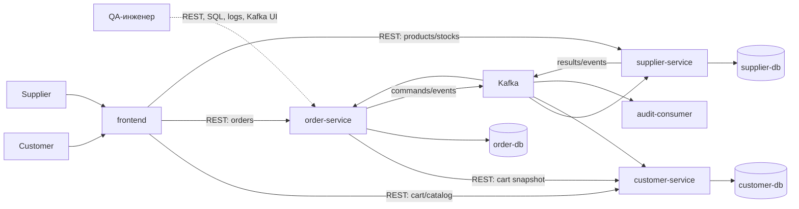
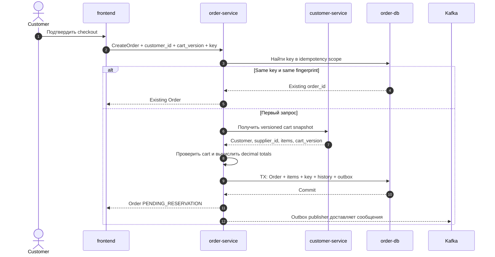
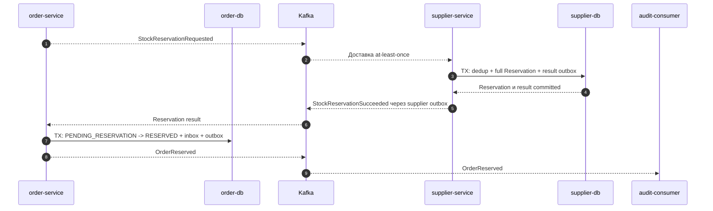
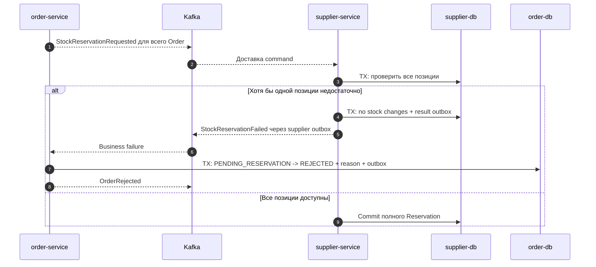
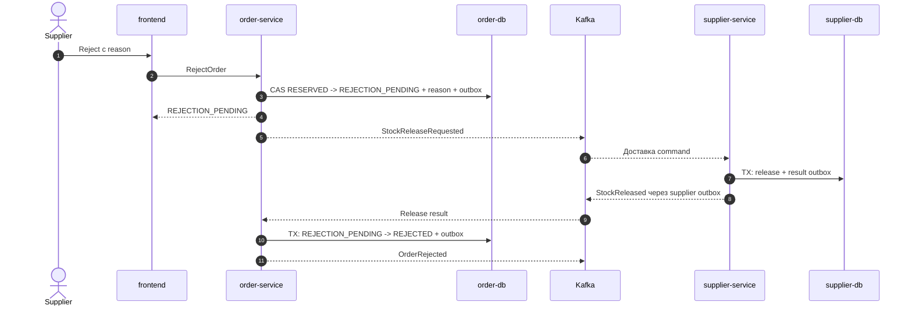
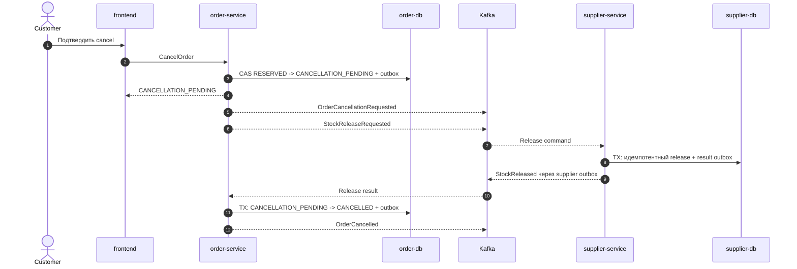
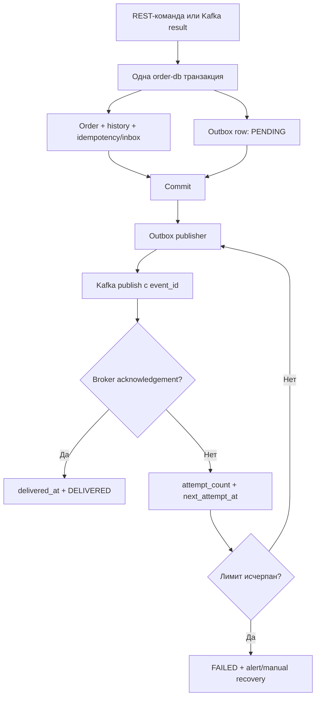

# Marketplace-QA 2.0: архитектура order-service

## 0. Статус и правила чтения документа

Документ определяет архитектурные границы `order-service` для MVP Marketplace-QA 2.0. Это архитектурная спецификация, а не описание готовой реализации. Упомянутые здесь команды, события, статусы, внутренние записи и candidate REST-взаимодействия являются **решениями TO BE**, если явно не указано иное. Окончательные URL, JSON-схемы, Kafka topic names, event envelope и error contract должны быть зафиксированы отдельными спецификациями.

Основание:

- [`01-vision-and-architecture-principles.md`](01-vision-and-architecture-principles.md);
- [`02-mvp-scope-roles-and-user-scenarios.md`](02-mvp-scope-roles-and-user-scenarios.md);
- [`03-frontend-functional-requirements.md`](03-frontend-functional-requirements.md);
- AS IS-контракты [заказов](../requirements/api/11_orders_api.md), [корзины](../requirements/api/10_cart_api.md), [ошибок](../requirements/api/12_error_contract.md), [данных](../requirements/data/01_data_contract_as_is.md) и [Kafka-событий](../requirements/events/01_kafka_event_contract_as_is.md);
- AS IS [бизнес-правила](../requirements/business/01_business_rules_as_is.md) и [бизнес-сценарии](../requirements/scenarios/01_business_scenarios_as_is.md);
- текущий код моделей, REST-операций, producer и consumer в `customer-service` и `supplier-service`.

Краткая граница между состояниями системы:

- **Подтверждённый факт AS IS:** `customer-service` владеет таблицами заказа, создаёт заказ сразу в статусе `created`, очищает корзину в той же транзакции и после commit публикует по одному `ORDER_CREATED` на уникальный товар. Сообщение не содержит `order_id`.
- **Подтверждённый факт AS IS:** supplier consumer последовательно уменьшает остатки по складам; при недостатке может уменьшить только доступную часть и не публикует результат обработки для заказа. Отмена меняет только статус в `customer-service` и не освобождает stock.
- **Решение TO BE:** AS IS-модель не переносится как целевая. `order-service` и `order-db` становятся владельцами заказа; `supplier-service` атомарно резервирует полный набор позиций или не резервирует ничего; состояние согласуется через Kafka.

## 1. Назначение order-service

`order-service` является самостоятельным доменным сервисом заказов. Он принимает команды Customer и Supplier, сохраняет неизменяемый snapshot заказа, управляет жизненным циклом, координирует резервирование и освобождение stock, обеспечивает HTTP-идемпотентность и публикует факты изменения заказа.

Сервис предоставляет проверяемую границу между синхронным принятием команды и асинхронным бизнес-результатом. Успешный ответ на создание означает, что заказ устойчиво принят в `PENDING_RESERVATION`, но не означает, что stock уже зарезервирован.

## 2. Причины выделения отдельного сервиса

AS IS смешивает данные пользователя, корзины, customer-проекции и заказа в одном сервисе, а складская обработка не может вернуть целостный результат заказа. Выделение order bounded context позволяет:

- сделать жизненный цикл заказа единственным и наблюдаемым;
- изолировать транзакции заказа от customer- и supplier-хранилищ;
- моделировать резерв, компенсацию, retry, DLQ и race conditions;
- привязать все позиции и события к устойчивому `order_id`;
- безопасно развивать order API без передачи владения корзиной или stock.

### Ключевое решение: отдельный order-service

- **Decision:** выделить один `order-service` с отдельной `order-db`.
- **Context:** жизненный цикл заказа имеет собственные инварианты, отказоустойчивость и темп изменений.
- **Alternatives:** оставить заказ в `customer-service`; перенести заказ в `supplier-service`; построить общий backend-монолит.
- **Consequences:** появляется межсервисная согласованность и операционная стоимость ещё одного сервиса, но владение состоянием и тестовые oracle становятся однозначными.

## 3. Ответственность order-service

`order-service` отвечает за:

- создание и чтение заказов для Customer и Supplier;
- проверку customer/supplier ownership в пределах test-user context;
- неизменяемые позиции, цены и сумму принятого заказа;
- статус и историю переходов;
- координацию резервирования и release без прямого изменения stock;
- команды confirm, reject и cancel;
- `Idempotency-Key`, request fingerprint и результат первого создания;
- transactional outbox, inbox/deduplication для входящих событий и reconciliation;
- propagation correlation metadata;
- order-level логи и метрики.

## 4. Что не входит в ответственность order-service

`order-service` не должен:

- хранить или редактировать корзину, избранное и пользователя;
- определять актуальную карточку товара или текущую цену каталога;
- менять строки остатков и складские резервы напрямую;
- допускать товары нескольких поставщиков в одном заказе;
- выполнять частичную комплектацию;
- реализовывать оплату, доставку, refund или authentication;
- становиться шлюзом для всех Customer/Supplier API;
- обещать exactly-once доставку end-to-end.

## 5. Границы bounded context

Внутри order bounded context находятся агрегат `Order`, его `OrderItem`, история статусов, состояние orchestration, idempotency record и outbox. Граница транзакции не выходит за `order-db`.

Идентификаторы `customer_id`, `supplier_id` и `product_id` являются внешними ссылками без межбазовых foreign key. Достоверность пользователя и корзины подтверждает `customer-service`; товар, supplier ownership и фактический stock подтверждает `supplier-service`.

### Ключевое решение: один поставщик в заказе

- **Decision:** один Order и исходная cart version содержат товары ровно одного Supplier.
- **Context:** атомарное резервирование нескольких независимых supplier-контуров потребовало бы saga с более сложной компенсацией и допускающими частичный прогресс состояниями.
- **Alternatives:** multi-supplier Order; разбиение checkout на несколько Order; отдельный child-order на Supplier.
- **Consequences:** all-or-nothing ограничено одной supplier-транзакцией; Customer должен удалить товары другого Supplier либо начать новую корзину. Multi-supplier остаётся вне MVP.

## 6. Роль order-service как source of truth

`order-service` — единственный source of truth для текущего статуса заказа, причины order-level отказа, snapshot позиций и истории переходов. `customer-service`, `supplier-service`, frontend и `audit-consumer` не могут самостоятельно менять или вычислять статус заказа.

Supplier reservation остаётся source of truth в `supplier-service`. Несовпадение order status и supplier reservation допустимо только в явно наблюдаемом промежуточном окне eventual consistency и должно устраняться обработкой событий или reconciliation.

## 7. Взаимодействующие компоненты

### 7.1. Таблица ответственности сервисов

| Компонент | Ответственность в order-сценарии | Запрещённая подмена ответственности |
|---|---|---|
| `frontend` | Отправляет REST-команды, показывает текущий status и промежуточные состояния | Не передаёт доверенный item set и не оркестрирует Kafka |
| `customer-service` | Владеет Customer, корзиной и customer-проекцией; отдаёт серверный cart snapshot | Не создаёт и не переводит Order |
| `order-service` | Владеет Order и orchestration | Не изменяет stock/cart напрямую |
| `supplier-service` | Владеет товаром, складом, остатком и Reservation; выполняет all-or-nothing | Не назначает status заказа |
| `audit-consumer` | Неизменяемо регистрирует выбранные события | Не участвует в принятии бизнес-решения |
| Kafka | Доставляет команды и события at-least-once | Не заменяет domain database |
| `order-db` | Хранит order aggregate и технические записи order-service | Не хранит текущую корзину или stock |
| `supplier-db` | Хранит товары, склады, остатки и Reservation | Не хранит авторитетный Order |
| `customer-db` | Хранит Customer, cart, favorites и customer product projection | Не хранит авторитетный Order |

### 7.2. Mermaid component diagram

Диаграмма показывает логические направления. Она не утверждает URL, topic names и физическое audit-хранилище.

### 7.3. Таблица синхронных REST и асинхронных Kafka-взаимодействий

| Инициатор → получатель | Канал | Когда используется | Что означает успех | Что не означает успех |
|---|---|---|---|---|
| Frontend → `customer-service` | REST | Каталог, cart, тестовый Customer | Текущий ответ customer-домена | Актуальность supplier stock |
| Frontend → `supplier-service` | REST | Product/warehouse/stock Supplier | Принятие supplier-команды | Изменение status Order |
| Frontend → `order-service` | REST | Create/read/cancel/confirm/reject | Команда устойчиво принята либо чтение выполнено | Завершение последующего reserve/release |
| `order-service` → `customer-service` | REST | Получение server-side cart snapshot | Получена конкретная cart version | Фактическая доступность stock |
| `order-service` → Kafka → `supplier-service` | Kafka | Reserve/release commands | Broker принял сообщение | Consumer уже выполнил business effect |
| `supplier-service` → Kafka → `order-service` | Kafka | Reservation/release results | Result доставлен at-least-once | Отсутствие duplicate |
| `order-service` → Kafka → Customer/audit projections | Kafka | Order lifecycle facts | Event доступен consumers | Все проекции уже согласованы |

## 8. Владение данными

### 8.1. Таблица owned/non-owned data

| Данные | Владелец | Что хранит order-service | Комментарий |
|---|---|---|---|
| `Order` | `order-service` | Да | Aggregate root и текущий status |
| `OrderItem` | `order-service` | Да | Неизменяемая позиция заказа |
| `OrderStatusHistory` | `order-service` | Да | Переход, причина, время, actor/correlation |
| `OrderIdempotencyRecord` | `order-service` | Да | Scope, key, fingerprint, состояние, `order_id`, сохранённый результат |
| `OrderOutboxEvent` | `order-service` | Да | Событие до подтверждённой публикации |
| `OrderInboxRecord` | `order-service` | Да | Дедупликация устойчиво обработанных входящих событий |
| Product snapshot | `order-service` | Да | ID, имя, цена и суммы на момент принятия |
| Supplier snapshot | `order-service` | Только `supplier_id` | `supplier_name` в MVP не фиксируется |
| Reservation | `supplier-service` | Только reference и orchestration state | Фактический резерв принадлежит `supplier-db` |
| Rejection reason | `order-service` | Да | Нормализованная order-level причина и источник |
| Correlation metadata | Сервис, создающий запись/сообщение | Да, для order-записей | Исходный correlation распространяется, но не означает владение trace |
| Актуальное описание товара | `supplier-service`; customer имеет проекцию | Нет | Snapshot не становится текущим каталогом |
| Актуальная цена каталога | `supplier-service`; customer имеет проекцию | Нет | Заказ хранит историческую цену |
| Фактические/зарезервированные остатки | `supplier-service` | Нет | Только результат и reservation reference |
| Корзина | `customer-service` | Нет | Читается как versioned snapshot |
| Избранное | `customer-service` | Нет | Не участвует в заказе |
| Пользователь | `customer-service` | Нет | В Order хранится только `customer_id` |
| Склады | `supplier-service` | Нет | Order не выбирает склад в MVP |

## 9. Данные, которыми order-service не владеет

Актуальные описание и цена товара, текущий stock, cart, favorites, users и warehouses не копируются в `order-db` как изменяемые справочники. Snapshot заказа является историческим фактом и не синхронизируется при последующих изменениях каталога.

Прямые SQL-запросы между `order-db`, `customer-db` и `supplier-db` запрещены. Проверка внешних данных выполняется через утверждённый REST-контракт или события соответствующего владельца.

## 10. Команды order-service

Имена ниже — архитектурные команды, не утверждённые endpoint names. «События» означают записи outbox, создаваемые в той же транзакции, если команда меняет состояние.

### 10.1. Таблица команд order-service

| Команда | Инициатор | Входные данные | Предусловия / допустимые статусы | Синхронный результат | Асинхронный результат | Возможные ошибки | Изменяемые данные | Публикуемые события |
|---|---|---|---|---|---|---|---|---|
| `CreateOrder` | Customer через frontend/API | `customer_id`, ожидаемая `cart_version`, `Idempotency-Key`, correlation | Customer существует; фактическая cart version совпадает, snapshot непустой и single-supplier | Новый Order `PENDING_RESERVATION` или idempotent replay | Reservation result меняет status | Validation, stale/empty/multi-supplier cart, dependency unavailable, idempotency conflict | Order, items, history, idempotency, outbox | `OrderCreated`, `StockReservationRequested` |
| `GetCustomerOrders` | Customer | `customer_id`, filter/page | Test Customer context; любой status | Только заказы Customer | Нет | Validation, internal | Нет | Нет |
| `GetCustomerOrder` | Customer | `customer_id`, `order_id` | Order принадлежит Customer; любой status | Order snapshot/current status | Нет | Not found; foreign order скрывается как not found | Нет | Нет |
| `CancelOrder` | Customer | IDs, correlation | `PENDING_RESERVATION`, `RESERVED`; повтор допустим в cancel states | Текущий Order в `CANCELLATION_PENDING`/`CANCELLED` | Release приводит к `CANCELLED` | Not found, conflict, internal | Order, history, outbox | `OrderCancellationRequested`, `StockReleaseRequested`; затем `OrderCancelled` |
| `GetSupplierOrders` | Supplier | `supplier_id`, filter/page | Test Supplier context; любой status | Только заказы Supplier | Нет | Validation, internal | Нет | Нет |
| `GetSupplierOrder` | Supplier | `supplier_id`, `order_id` | Order относится к Supplier; любой status | Order snapshot/current status | Нет | Not found; foreign order скрывается как not found | Нет | Нет |
| `ConfirmOrder` | Supplier | IDs, correlation | `RESERVED`; replay в `CONFIRMED` | `CONFIRMED` или idempotent current representation | Supplier финализирует reservation по событию | Not found, conflict, internal | Order, history, outbox | `OrderConfirmed` |
| `RejectOrder` | Supplier | IDs, обязательная reason, correlation | `RESERVED`; replay в reject states | `REJECTION_PENDING` или current representation | Release приводит к `REJECTED` | Validation, not found, conflict | Order, reason, history, outbox | `StockReleaseRequested`; затем `OrderRejected` |
| `RetryReservation` | Scheduler/reconciliation | `order_id`, operation/event reference | Только `PENDING_RESERVATION`, retryable technical failure, attempt limit не исчерпан | Принята/пропущена как duplicate | Повторная доставка той же логической команды | Conflict, retry exhausted | Attempt metadata, outbox | `StockReservationRequested` с тем же operation ID |
| `ProcessReservationResult` | Kafka consumer | Event envelope и result | `PENDING_RESERVATION`; late result в `CANCELLATION_PENDING`/`FAILED` обрабатывается компенсационно; duplicate/stale не меняет status | Offset после атомарной обработки/outbox | `RESERVED`, `REJECTED` или компенсационный release | Invalid event, version unsupported, technical failure | Inbox, Order, history, outbox | `OrderReserved`, `OrderRejected` либо `StockReleaseRequested` |
| `ProcessReleaseResult` | Kafka consumer | Event envelope и result | `CANCELLATION_PENDING`/`REJECTION_PENDING`; matching late result для `FAILED` release phase восстанавливает intended target; duplicate в terminal status не меняет Order | Offset после атомарной обработки/outbox | `CANCELLED` или `REJECTED` | Invalid event, version unsupported, technical failure | Inbox, Order, history, outbox | `OrderCancelled` или `OrderRejected` |

Read-команды не публикуют domain events. Точное HTTP-кодирование команд и пагинация остаются предметом order API contract.

## 11. Основные Kafka-события

Все названия в этом разделе — **предполагаемый TO BE event vocabulary**, а не существующий AS IS contract. Команды адресованы исполнителю; события сообщают уже состоявшийся факт. Один event envelope должен включать как минимум `event_id`, `event_type`, `event_version`, occurred time, `order_id`, correlation и causation metadata.

### 11.1. Таблица архитектурных Kafka-событий

| Сообщение | Вид | Публикует | Основной получатель | Архитектурное назначение |
|---|---|---|---|---|
| `OrderCreated` | Domain event | `order-service` | `customer-service`, `audit-consumer` | Заказ устойчиво принят; customer может условно очистить использованный cart snapshot |
| `StockReservationRequested` | Command | `order-service` | `supplier-service` | Атомарно зарезервировать весь item set |
| `StockReservationSucceeded` | Integration event | `supplier-service` | `order-service`, audit | Полный резерв создан; содержит reservation reference |
| `StockReservationFailed` | Integration event | `supplier-service` | `order-service`, audit | Бизнес-отказ без частичного эффекта |
| `OrderReserved` | Domain event | `order-service` | audit и будущие проекции | Order перешёл в `RESERVED` |
| `OrderConfirmed` | Domain event | `order-service` | `supplier-service`, audit | Supplier подтвердил Order; резерв можно финализировать без повторного списания |
| `OrderRejected` | Domain event | `order-service` | Customer-проекции/audit | Order окончательно отклонён после необходимого release |
| `OrderCancellationRequested` | Domain event | `order-service` | audit | Customer начал отмену |
| `StockReleaseRequested` | Command | `order-service` | `supplier-service` | Идемпотентно освободить reserve или подтвердить no-op |
| `StockReleased` | Integration event | `supplier-service` | `order-service`, audit | Reserve освобождён либо отсутствовал |
| `OrderCancelled` | Domain event | `order-service` | Customer-проекции/audit | Отмена завершена |
| `OrderReservationTimedOut` | Domain event | `order-service` | audit | В deadline не получен устойчивый reservation result |
| `OrderProcessingFailed` | Domain event | `order-service` | audit/operations | Оркестрация перешла в `FAILED` после невосстановимой ошибки |

Business failure `StockReservationFailed` не направляется в DLQ. Это штатный результат supplier-проверки, который должен содержать машиночитаемую категорию без раскрытия внутренней схемы stock.

## 12. Основной жизненный цикл заказа

### 12.1. Таблица статусов заказа

| Статус TO BE | Назначение | Разрешённые дальнейшие направления | Терминальный |
|---|---|---|---|
| `PENDING_RESERVATION` | Order принят, reservation result ожидается | `RESERVED`, `REJECTED`, `CANCELLATION_PENDING`, `FAILED` | Нет |
| `RESERVED` | Весь item set зарезервирован | `CONFIRMED`, `REJECTION_PENDING`, `CANCELLATION_PENDING`, `FAILED` | Нет |
| `CONFIRMED` | Supplier подтвердил заказ | Нет в MVP | Да |
| `REJECTION_PENDING` | Supplier reject принят, release ещё не подтверждён | `REJECTED`, `FAILED` | Нет |
| `REJECTED` | Бизнес-отказ завершён; частичного резерва нет | Нет | Да |
| `CANCELLATION_PENDING` | Cancel принят, отсутствие/освобождение резерва подтверждается | `CANCELLED`, `FAILED` | Нет |
| `CANCELLED` | Cancel завершён и reserve отсутствует | Нет | Да |
| `FAILED` | Оркестрация не смогла безопасно достичь бизнес-результата | Контролируемая reconciliation; для release failure — только сохранённый intended terminal status | Да для обычного UI flow, операционно требует разбора |

`REJECTION_PENDING` добавлен как минимальный технический статус: без него `REJECTED` мог бы отображаться до подтверждённого release, что противоречит all-or-nothing и требованиям frontend. Детальная state machine, guards и полный каталог transition reasons должны быть отдельным документом.

Общие ограничения:

- cancel разрешён только до `CONFIRMED`;
- confirm/reject разрешены Supplier только из `RESERVED`;
- терминальный status не меняется из-за позднего или повторного события;
- переход сравнивает ожидаемый status и `version`;
- любая смена status добавляет `OrderStatusHistory`.

## 13. Создание заказа

`CreateOrder` выполняется в два этапа.

Синхронный этап:

1. `order-service` валидирует test Customer context, correlation header и `Idempotency-Key`.
2. До чтения корзины сервис ищет существующую idempotency record. Найденный same-key/same-fingerprint возвращает связанный Order, не перечитывая изменившуюся корзину.
3. Для первого запроса сервис синхронно получает от `customer-service` versioned server-side cart snapshot.
4. Проверяет совпадение ожидаемой и фактической `cart_version`, непустой item set, положительные quantities, один `supplier_id` для всех строк и уникальность product.
5. Формирует неизменяемый Order snapshot и вычисляет деньги decimal-арифметикой.
6. В одной транзакции `order-db` сохраняет Order в `PENDING_RESERVATION`, items, history, idempotency result и outbox-записи `OrderCreated`/`StockReservationRequested`.
7. Возвращает frontend устойчивый `order_id`, current representation, `PENDING_RESERVATION` и correlation ID.

Асинхронный этап:

1. Outbox publisher доставляет сообщения в Kafka.
2. `customer-service`, получив `OrderCreated`, идемпотентно и условно очищает только использованную версию корзины. Если корзина уже изменена, новые строки не удаляются.
3. `supplier-service` принимает одну reservation command для всего заказа.
4. Результат меняет Order на `RESERVED` или `REJECTED`; техническая неопределённость остаётся видимой до timeout/reconciliation.

Успешное создание Order не зависит от мгновенного очищения cart. Поэтому повторное отображение старой корзины в коротком eventual-consistency окне возможно, но повторный checkout той же `cart_version` блокируется order-side unique constraint.

### 13.1. Mermaid sequence diagram создания заказа

## 14. Источник позиций заказа

### 14.1. Сравнение вариантов

| Вариант | Доверие к данным | Сложность | Связанность | Тестируемость | Риск рассинхронизации | Идемпотентность |
|---|---|---|---|---|---|---|
| A. Frontend отправляет items | Низкое: клиент может подменить supplier, price, quantity | Низкая | Низкая backend-связанность | Легко отправлять негативные payload, но сложнее доказать серверный источник | Высокий между UI cart и body | Fingerprint прост, но защищает недоверенный body |
| B. `order-service` читает cart у `customer-service` | Высокое для Customer context и отображённой цены | Средняя | Синхронная зависимость на checkout | Хорошие contract/failure/race сценарии | Управляется versioned snapshot | Key проверяется до повторного чтения; snapshot identity фиксируется |
| C. `customer-service` создаёт command | Высокое | Средняя/высокая | Order orchestration начинается вне владельца Order | Усложняет наблюдение sync result | Средний | Нужна межсервисная дедупликация до появления Order |
| D. `order-service` читает cart snapshot из события | Высокое после доставки | Высокая | Асинхронная проекция cart в order-domain | Много сценариев stale/missing snapshot | Высокий без сложного version protocol | Требует корреляции нескольких независимых потоков |

### 14.2. Ключевое решение: server-side cart snapshot

- **Decision:** для MVP выбран вариант B — `order-service` синхронно получает неизменяемый versioned cart snapshot из `customer-service`; frontend не передаёт авторитетный item set.
- **Context:** cart уже принадлежит `customer-service`, а создание Order должно дать синхронный `order_id` и не доверять browser payload.
- **Alternatives:** A, C и D из таблицы.
- **Consequences:** checkout зависит от доступности `customer-service`, поэтому нужны короткий timeout и bounded retry. Взамен source items, customer ownership, single-supplier и snapshot version проверяются на сервере.

Минимальный candidate cart snapshot должен включать монотонную `cart_version`, `customer_id`, единый `supplier_id`, строки с `product_id`, `product_name`, `supplier_id`, `quantity`, `unit_price`, валютой и временем/версией проекции. `cart_version` увеличивается `customer-service` при каждой успешной cart mutation. Точная схема и URL не утверждаются этим документом.

## 15. Snapshot заказа

Неизменяемые поля:

| Уровень | Поле | Правило |
|---|---|---|
| Order | `customer_id` | Внешний ID Customer на момент создания |
| Order | `supplier_id` | Один ID для всего заказа |
| Order | `cart_version` | Защита от повторного заказа той же версии cart |
| OrderItem | `product_id` | Внешний ID Product |
| OrderItem | `product_name` | Имя из принятого server-side snapshot |
| OrderItem | `quantity` | Положительное целое |
| OrderItem | `unit_price` | Цена из customer cart projection, принятая Order |
| OrderItem | `line_total` | Округлённое `unit_price × quantity` |
| Order/Item | `currency` | В MVP фиксированное `RUB` |
| Order | `total_amount` | Сумма сохранённых `line_total` |
| Supplier | `supplier_name` | Не фиксируется в MVP; UI показывает `supplier_id` |

Money в TO BE хранится и вычисляется как decimal, рекомендуемый SQL-тип — `NUMERIC(19,2)`. Float запрещён. Каждая строка округляется до двух знаков по `HALF_UP`, затем `total_amount` вычисляется как сумма уже округлённых строк. Negative/zero price и currency, отличная от `RUB`, отклоняются на границе cart snapshot до создания.

Для MVP фиксируется цена, которую Customer получил в server-side customer-проекции и подтвердил на checkout. `supplier-service` при резервировании повторно проверяет владение Product, активность и stock, но не заменяет сохранённую цену текущей ценой каталога. Риск stale customer-проекции является осознанным компромиссом eventual consistency и должен быть проверяемым.

### Ключевое решение: immutable order snapshot

- **Decision:** Order хранит минимальный неизменяемый Product snapshot и только `supplier_id`, без supplier name.
- **Context:** исторический Order должен читаться после редактирования/архивации Product без синхронного вызова каталога.
- **Alternatives:** всегда читать текущий каталог; копировать полный Product/Supplier; хранить только IDs.
- **Consequences:** часть данных дублируется и может отличаться от текущего каталога, зато история стабильна. Переименование Supplier не отражается в Order; это осознанный MVP-компромисс.

## 16. Резервирование остатков

`order-service` инициирует резерв через `StockReservationRequested`; `supplier-service` выполняет его и единолично владеет stock/Reservation.

Правила:

- command содержит полный набор позиций одного Supplier, `order_id`, уникальный reservation operation ID и expected quantities;
- `supplier-service` проверяет product ownership, доступность и активность, затем в одной `supplier-db` транзакции либо создаёт полный Reservation, либо не меняет ни одной позиции;
- защита от отрицательного available stock реализуется транзакционной блокировкой/условным обновлением supplier-side; точная схема — отдельный ADR supplier inventory;
- повтор команды с тем же operation ID возвращает тот же business result без второго резерва;
- недостаточный stock хотя бы одной строки даёт `StockReservationFailed`, не технический retry;
- transient DB/broker failure повторяется по policy; invalid event уходит в DLQ;
- отсутствие результата до reservation deadline приводит к `OrderReservationTimedOut`, `FAILED` и защитному `StockReleaseRequested`;
- поздний success после cancel/timeout не воскрешает Order: order-service запрашивает release, а stale transition игнорирует.

### 16.1. Mermaid sequence diagram успешного резервирования

### 16.2. Mermaid sequence diagram недостаточного остатка

## 17. Подтверждение поставщиком

`ConfirmOrder` допустим только для Supplier-владельца и Order в `RESERVED`.

- Первый успешный запрос условно меняет `RESERVED` на `CONFIRMED` и пишет `OrderConfirmed` в outbox.
- Повтор Supplier той же команды для уже `CONFIRMED` возвращает current Order без нового события.
- Запрос в другом status возвращает conflict.
- Одновременные confirm/cancel разрешаются сравнением `version`: ровно один переход выигрывает.
- `supplier-service` использует `OrderConfirmed`, чтобы идемпотентно финализировать Reservation. В MVP это не означает второе уменьшение available stock.
- Customer видит `CONFIRMED` только из order API; после него cancel запрещён.

## 18. Отклонение поставщиком

`RejectOrder` допустим только из `RESERVED` и требует непустую нормализованную reason с ограниченной длиной. Причина становится частью Order, но внутренние supplier/SQL details не раскрываются.

Первый запрос переводит Order в `REJECTION_PENDING` и создаёт `StockReleaseRequested`. Только `StockReleased` переводит его в `REJECTED` и создаёт `OrderRejected`. Frontend показывает release как незавершённый асинхронный процесс, а не как итоговый reject.

Повтор reject в `REJECTION_PENDING`/`REJECTED` возвращает current Order без нового release; другая reason при повторе является conflict. Reject, проигравший concurrent cancel, не перезаписывает cancellation intent.

### 18.1. Mermaid sequence diagram reject и stock release

## 19. Отмена покупателем

Cancel разрешён из `PENDING_RESERVATION` и `RESERVED`, потому что бизнес-подтверждение ещё не состоялось. После `CONFIRMED` отмена запрещена: payment/refund/returns не входят в MVP, а обратный переход нарушил бы терминальность подтверждения.

- Из `PENDING_RESERVATION` Order переходит в `CANCELLATION_PENDING`; release command является идемпотентным no-op, если Reservation ещё нет. Supplier должен сохранить cancellation/release intent так, чтобы поздняя reservation command не создала новый reserve.
- Из `RESERVED` Order также переходит в `CANCELLATION_PENDING` и ждёт полного release.
- Только `StockReleased` переводит Order в `CANCELLED`.
- Повтор cancel в `CANCELLATION_PENDING` или `CANCELLED` возвращает current Order.
- Cancel из `CONFIRMED`, `REJECTED` или `FAILED` возвращает conflict.
- Результат concurrent confirm/reject определяется первым успешным conditional update.

### 19.1. Mermaid sequence diagram отмены RESERVED-заказа

## 20. Idempotency-Key

Область ключа: `(customer_id, operation_type=CreateOrder, idempotency_key)`. Ключ обязателен для create, непрозрачен для сервиса и ограничен разумной длиной. Один и тот же текст ключа другого Customer не конфликтует.

Логический create payload MVP содержит `customer_id` и ожидаемую `cart_version`; item set и цены в него не входят. Request fingerprint — SHA-256 от canonical JSON этого нормализованного payload: UTF-8, сортировка ключей, отсутствие незначащего whitespace и явное числовое представление. Полученный server-side cart snapshot в fingerprint не включается: same-key replay должен найти запись до повторного чтения уже изменившейся cart. Уникальность `(customer_id, cart_version)` защищается отдельно.

`OrderIdempotencyRecord` имеет состояния `IN_PROGRESS`, `COMPLETED`, `FAILED_RETRYABLE`; хранит fingerprint, `order_id`, исходный HTTP status и достаточно response data для безопасного replay. Order, key и initial result фиксируются в одной транзакции.

Поведение:

- same key + same fingerprint возвращает тот же `order_id` и current Order representation; рекомендуемый replay status — `200`, первый create — `201`;
- same key + different fingerprint возвращает idempotency conflict (`409` на уровне candidate API);
- два concurrent same-key запроса сходятся на unique constraint; проигравший читает запись победителя;
- два разных ключа для одного `customer_id` и `cart_version` не создают два Order;
- после network error клиент повторяет то же тело с тем же key;
- обычный retry не генерирует новый key и не запускает вторую reservation operation;
- запись хранится 24 часа после `COMPLETED`; `IN_PROGRESS` не удаляется вслепую, а перед cleanup проходит reconciliation.

### Ключевое решение: persistence idempotency

- **Decision:** хранить ключ и fingerprint в `order-db`, связав их с Order транзакционно; MVP TTL — 24 часа после завершения.
- **Context:** ответ может потеряться после commit, а процесс переживает restart.
- **Alternatives:** in-memory cache; Redis; уникальность только по cart version; client-side защита от double click.
- **Consequences:** БД становится устойчивым oracle и поддерживает concurrent retry; требуется cleanup job и ADR для окончательного TTL/canonicalization.

## 21. Надёжная публикация событий

Обычный `database commit`, за которым следует непосредственный Kafka publish, оставляет окно потери: commit уже успешен, а процесс или broker недоступен. AS IS имеет именно раздельные действия и не ждёт delivery acknowledgement.

Transactional outbox сохраняет business state и сообщение в одной локальной транзакции. Отдельный publisher выбирает недоставленные записи, публикует их с устойчивым `event_id`, ждёт broker acknowledgement и заполняет `delivered_at`. Ошибка увеличивает `attempt_count`, сохраняет категорию/текст, вычисляет `next_attempt_at`; исчерпание policy переводит запись в `FAILED` и поднимает наблюдаемый сигнал.

Consumers используют inbox/dedup по `event_id` и атомарно сохраняют business effect с обработанным ID. Delivery остаётся at-least-once: crash между broker acknowledgement и `delivered_at` создаст duplicate. Exactly-once end-to-end не обещается.

Граница требует симметричной надёжности от `supplier-service`: Reservation/release effect, dedup record и result outbox должны фиксироваться одной `supplier-db` транзакцией. Точная supplier outbox schema не входит в этот документ, но результат нельзя публиковать по небезопасной схеме «commit, затем fire-and-forget publish». `customer-service` также должен обрабатывать `OrderCreated` с deduplication и conditional cart version check.

### Ключевое решение: transactional outbox

- **Decision:** использовать transactional outbox в `order-db`.
- **Context:** Order transition и соответствующее сообщение не должны расходиться при падении процесса.
- **Alternatives:** commit + direct publish; Kafka transaction без общей транзакции с PostgreSQL; distributed transaction.
- **Consequences:** устраняется окно безвозвратной потери после commit, но добавляются publisher, lag, cleanup и duplicates у consumer.

### 21.1. Mermaid flowchart transactional outbox

## 22. Retry

### 22.1. Таблица retry/DLQ policy

| Операция | Что считается retryable | Policy MVP | Что не повторяется автоматически | После исчерпания |
|---|---|---|---|---|
| REST `order-service` → cart snapshot | Network, timeout, 5xx | 3 попытки всего; backoff 200/500 ms; короткий per-attempt timeout | 4xx, empty/multi-supplier/invalid cart | Dependency unavailable, Order не создан |
| Kafka consumer | Transient DB/broker dependency | 3 попытки всего; backoff 1/5 s; attempt в metadata | Business failure, unsupported schema как retryable | Сообщение в physical DLQ |
| Outbox publisher | Broker/network unavailable | До 10 попыток; backoff 1/2/4/8/16/30 s, затем 30 s | Отмена business transition | Outbox `FAILED`, alert и controlled republish |
| Reservation reconciliation | Временная неопределённость до deadline | Повтор той же operation до 3 отправок, только `PENDING_RESERVATION` | Business insufficient stock; новый operation ID | Reservation timeout |
| Release reconciliation | Временная неопределённость до deadline | Повтор того же release operation до 3 отправок | Повторный business effect | Release timeout/`FAILED` |

Attempt count сохраняется устойчиво. Бесконечный retry запрещён. Business error завершает ветку процесса и не маскируется техническим retry.

## 23. DLQ

В DLQ попадает входящее Kafka-сообщение, которое:

- не проходит envelope/schema validation;
- имеет неподдерживаемую `event_version`;
- вызывает non-retryable техническую ошибку;
- исчерпало consumer retry.

DLQ envelope сохраняет исходные key/payload/headers, `original_topic`, partition/offset, `original_event_id`, reason/error category, stack-safe diagnostic, `attempt_count`, `correlation_id`, first/last failure time и consumer identity. Секреты и персональные данные редактируются.

Manual replay создаёт новый replay metadata, но сохраняет original event ID и correlation/causation. Consumer deduplication гарантирует, что уже выполненный side effect не повторится. Недостаточный stock и другие business outcomes в DLQ не отправляются.

Outbox `FAILED` не является входящим poison message и хранится в `order-db`; его controlled republish использует тот же `event_id`.

## 24. Timeout

MVP-предложение:

- reservation deadline — 30 секунд от первой подтверждённой публикации request;
- release deadline — 30 секунд от первой подтверждённой публикации release;
- frontend polling/UX timeout определяется frontend/API спецификацией и не меняет серверный deadline.

Reservation timeout атомарно переводит ещё ожидающий Order из `PENDING_RESERVATION` в `FAILED`, фиксирует `RESERVATION_TIMEOUT`, публикует `OrderReservationTimedOut`, `OrderProcessingFailed` и защитный `StockReleaseRequested`. Автоматический новый резерв после этого запрещён; controlled recovery возможен только после reconciliation фактического supplier state.

Release timeout переводит `CANCELLATION_PENDING` или `REJECTION_PENDING` в `FAILED` с сохранением intended terminal status и публикует `OrderProcessingFailed`. Повтор release с тем же operation ID разрешён процедуре reconciliation. Matching late `StockReleased` может завершить такой `FAILED` в сохранённый `CANCELLED` или `REJECTED`; произвольный переход из `FAILED` запрещён.

Frontend показывает `PENDING_*` как незавершённый процесс, а persisted `FAILED` — как технически не завершённый бизнес-результат с correlation ID и возможностью refresh, но без кнопки создать скрытый повтор side effect. Точное имя публичного status/operation field остаётся частью будущего API contract.

## 25. Race conditions

### 25.1. Таблица race conditions и способов защиты

| Race | Риск | Защита | Ожидаемый результат |
|---|---|---|---|
| Два concurrent checkout с разными keys | Два Order из одной cart version | Unique `(customer_id, cart_snapshot_id/version)` | Один Order; второй получает existing/conflict без второго reserve |
| Два запроса с одним key | Две записи/два события | Unique idempotency scope + transaction | Один winner; loser читает его result |
| Confirm и cancel одновременно | Два терминальных направления | `version` + conditional transition из `RESERVED` | Ровно один переход; второй conflict |
| Reject и cancel одновременно | Два release intent/reasons | `version`, единый active operation | Ровно одно intended terminal state |
| Reservation success после timeout | Воскрешение `FAILED`, утечка reserve | Status/version guard + compensating release | Status не меняется; reserve освобождается |
| Release success после повторного request | Повторное увеличение stock | Supplier idempotency по release operation | Один release effect; Order transition один раз |
| Повторное Kafka-событие | Повтор transition/outbox | Inbox unique `event_id` | Duplicate acknowledged/ignored |
| События не по порядку | Stale transition | Partition key `order_id`, aggregate version, expected status | Stale event ignored и logged |
| Обновление устаревшей версией | Lost update | `WHERE id=? AND version=?` | Zero rows → reload/conflict/re-evaluate |

## 26. Concurrency control

### 26.1. Сравнение

| Подход | Плюсы | Минусы | Решение |
|---|---|---|---|
| Pessimistic locking | Простая сериализация внутри короткой TX | Блокировки, deadlocks, хуже для долгих async процессов | Не основной механизм order-service |
| Optimistic locking | Нет блокировки между сообщениями, явный conflict | Нужны version/retry rules | Выбран |
| Version field | Явно выявляет stale write и помогает event ordering | Требует инкремента каждого update | Обязателен |
| Conditional update без version | Прост для отдельных статусов | Слабее диагностирует несколько видов изменения | Используется вместе с version/status guard |

### 26.2. Ключевое решение: optimistic locking

- **Decision:** каждый Order имеет integer `version`; переход выполняется conditional update по `id`, expected `version` и expected status.
- **Context:** REST-команды и Kafka-results приходят конкурентно, а транзакция не может держать lock в ожидании внешнего события.
- **Alternatives:** глобальный mutex, distributed lock, pessimistic row lock, status-only update.
- **Consequences:** проигравший обязан перечитать Order и определить idempotent success, stale event или conflict; тесты получают воспроизводимый race oracle.

Supplier-side атомарность inventory может отдельно применять row locks/conditional stock update и не определяется этим решением.

## 27. Event ordering

Kafka partition key для всех order-scoped commands/events — строковый `order_id`. Это сохраняет порядок сообщений одного заказа внутри одного topic/partition. Общего порядка между заказами нет; порядок между разными topics также не гарантируется.

Envelope содержит schema/event version, а order domain event — `aggregate_version`. Consumer:

- проверяет поддерживаемую event version;
- отклоняет невозможный future aggregate version в retry/DLQ по категории;
- игнорирует уже обработанный или stale aggregate version;
- не полагается только на arrival order;
- сохраняет original key/version при replay.

Точная topic topology и стратегия совместимости схем остаются Kafka contract/ADR.

## 28. Correlation ID и trace context

Candidate REST header — `X-Correlation-ID`. `order-service` принимает валидный UUID, а при отсутствии или невалидном значении генерирует новый UUID и всегда возвращает фактически использованный ID в response header.

ID передаётся в downstream REST, Kafka headers и payload. Для каждого нового сообщения создаётся `event_id`; `causation_id` ссылается на породившую команду/событие. Initial correlation и correlation каждого перехода записываются в Order metadata/history/outbox и structured logs.

Если frontend прислал W3C `traceparent`, сервис валидирует и непрозрачно передаёт его дальше. Платформа distributed tracing в MVP отсутствует; correlation ID остаётся основным учебным средством сквозного поиска.

## 29. Ошибки

Документ задаёт категории, но не окончательные codes/envelope:

| Категория | Пример | HTTP-направление / async handling |
|---|---|---|
| Validation | Пустой key/reason, invalid quantity | 4xx без retry |
| Business | Empty cart, multi-supplier, insufficient stock | 4xx либо domain result; stock failure не DLQ |
| Conflict | Status изменён конкурентно | 409 candidate + current status |
| Not found | Order не существует/не принадлежит actor | 404 без раскрытия чужого ресурса |
| Dependency unavailable | Cart API/DB/broker недоступен | 503 candidate или async retry |
| Timeout | Reservation/release deadline | Domain `FAILED` + observable reason |
| Internal | Неожиданная ошибка | 500 category, без внутренних details |
| Duplicate/idempotency conflict | Same key/different fingerprint | 409 candidate, без изменения Order |

Response должен позволять найти correlation ID и понять, безопасен ли retry. Названия AS IS error codes не переносятся автоматически; единый TO BE error contract будет отдельным документом.

## 30. Наблюдаемость

Каждая входящая команда, transition, consumer attempt и outbox attempt пишет structured log с применимыми полями:

`timestamp`, `level`, `service`, `operation`, `order_id`, `customer_id`, `supplier_id`, `event_id`, `correlation_id`, `causation_id`, `status_before`, `status_after`, `order_version`, `attempt`, `duration_ms`, `outcome`, `error_category`.

Payload, idempotency key, персональные данные и stack trace не логируются целиком. Key может логироваться только как безопасный hash.

Базовые метрики:

- count созданных заказов;
- reservation success/failure count и latency;
- cancelled, rejected, confirmed и failed order count;
- retry count по operation/error category;
- DLQ count;
- pending/failed outbox count и outbox lag;
- count idempotent replay/conflict;
- duration Order в промежуточных status.

Health не считается заменой business metrics. QA должен иметь возможность связать REST response, Order history, Kafka event и log по `order_id`/correlation.

## 31. Безопасность и ограничения

Отсутствие auth — осознанное ограничение стенда, а не основание доверять browser:

- frontend `user_id`/`supplier_id` является test-user context и валидируется;
- Customer read/cancel обязательно фильтруется одновременно по `order_id` и `customer_id`;
- Supplier read/confirm/reject фильтруется по `order_id` и `supplier_id`;
- чужой ресурс не раскрывается отличающимся ответом;
- item set, supplier ownership и money не принимаются как авторитетные из frontend;
- IDOR для Customer и Supplier входит в обязательные негативные сценарии;
- production-grade authentication/authorization этим документом не имитируются.

## 32. Предположения о развёртывании

MVP разворачивает отдельные контейнеры `order-service` и `order-db` вместе с Kafka. `order-service` не использует schema auto-create:

- versioned migrations выполняются отдельным контролируемым шагом;
- seed создаёт воспроизводимых тестовых субъектов/данные через владельцев доменов и не маскирует миграцию;
- liveness подтверждает живой процесс без требования доступности всех dependencies;
- readiness проверяет `order-db` и способность начать работу с Kafka publisher/consumer; `customer-service` может отражаться как degraded dependency, точная политика открыта;
- graceful shutdown прекращает приём новых команд, завершает текущие DB transactions, останавливает polling и безопасно закрывает producer;
- restart не теряет idempotency, inbox и pending outbox.

## 33. Что сознательно не входит в MVP

- payment;
- delivery;
- partial fulfillment/reservation;
- multi-supplier cart/order;
- refund/returns after receipt;
- registration, authentication, JWT/RBAC;
- distributed tracing platform;
- Kubernetes;
- exactly-once guarantee;
- production-grade availability/scaling;
- public command для обычного пользователя `RetryReservation`.

## 34. Открытые вопросы

1. Каковы окончательные URL, request/response schema и pagination order API?
2. Как выглядит versioned cart snapshot contract и как `customer-service` хранит/выдаёт `cart_version`?
3. Восстанавливаются ли позиции в новой cart version после rejected/cancelled Order или корзина остаётся очищенной?
4. Следует ли отдавать `REJECTION_PENDING` и `FAILED` как публичные статусы либо отображать отдельный operation state?
5. Каков окончательный catalogue rejection/failure reasons?
6. Как supplier reservation распределяется по складам и финализируется после `OrderConfirmed`?
7. Нужен ли read/reconciliation API состояния Reservation?
8. Утверждаются ли предложенные 30-секундные deadlines и retry intervals NFR-тестами?
9. Достаточен ли TTL idempotency 24 часа и как обрабатывается cleanup зависших `IN_PROGRESS`?
10. Как canonicalize create payload и ограничить формат/длину `Idempotency-Key`?
11. Какие topics используются для commands, results, domain events и DLQ?
12. Каковы retention, replay permissions и runbook для DLQ/outbox `FAILED`?
13. Какой event schema registry/versioning mechanism нужен учебному стенду?
14. Где физически хранится audit и какие события считаются обязательными?
15. Какая readiness policy применяется при недоступном `customer-service`?

## 35. Кандидаты Architecture Decision Record

| ADR-кандидат | Решение в этом документе | Что требуется закрепить |
|---|---|---|
| Выделение `order-service` | Принято | Границы и migration path от AS IS |
| Источник cart/order items | Вариант B | Cart snapshot API/version/clear protocol |
| Transactional outbox | Принято | Schema, polling/locking, cleanup, recovery |
| Optimistic locking | Принято | Version semantics и conflict behavior |
| `Idempotency-Key` storage | PostgreSQL, scope Customer+operation, TTL 24 h | Canonicalization, cleanup, exact replay HTTP |
| Single-supplier order | Принято для MVP | Enforcement points и future compatibility |
| Order snapshot | Product minimum + `supplier_id`, RUB decimal | Поля, scale, rounding in contracts |
| Cancellation semantics | Pending status + confirmed release | Late result/reconciliation protocol |
| Supplier Reservation model | Принцип принят, детали открыты | Warehouse allocation, locking, finalization |
| Kafka topology/order | `order_id` key | Topics, partitions, retention, schemas |
| Retry/DLQ | Bounded policies предложены | Exact timings, tooling и replay runbook |
| Public technical statuses | Набор предложен | API/UI representation |

## 36. Каталог архитектурных требований

Требования ниже являются нормативной, атомарной и проверяемой частью документа.

- **AR-ORD-001.** `order-service` должен быть единственным владельцем текущего статуса Order.
- **AR-ORD-002.** `order-service` должен использовать отдельную `order-db`.
- **AR-ORD-003.** `order-service` не должен выполнять прямые SQL-запросы в `customer-db`.
- **AR-ORD-004.** `order-service` не должен выполнять прямые SQL-запросы в `supplier-db`.
- **AR-ORD-005.** Frontend должен взаимодействовать с `order-service` только через REST.
- **AR-ORD-006.** Order должен принадлежать ровно одному `customer_id`.
- **AR-ORD-007.** Order должен принадлежать ровно одному `supplier_id`.
- **AR-ORD-008.** Все OrderItem должны относиться к `supplier_id` своего Order.
- **AR-ORD-009.** Order должен содержать не менее одной позиции.
- **AR-ORD-010.** Partial reservation должен считаться нарушением контракта.
- **AR-ORD-011.** `customer-service` должен оставаться владельцем корзины.
- **AR-ORD-012.** `supplier-service` должен оставаться владельцем фактического stock.
- **AR-ORD-013.** `supplier-service` должен оставаться владельцем Reservation.
- **AR-ORD-014.** Order должен хранить только внешний `customer_id`, а не копию User.
- **AR-ORD-015.** Order должен хранить только внешний `supplier_id`, а не изменяемую копию Supplier.
- **AR-ORD-016.** OrderItem должен быть неизменяемым после создания.
- **AR-ORD-017.** Каждая смена status должна создавать OrderStatusHistory.
- **AR-ORD-018.** История должна хранить status before и status after.
- **AR-ORD-019.** История должна хранить время и correlation ID перехода.
- **AR-ORD-020.** Read-команда не должна создавать domain event.
- **AR-ORD-021.** `CreateOrder` должен требовать `Idempotency-Key`.
- **AR-ORD-022.** `CreateOrder` должен проверять существующую idempotency record до повторного чтения cart.
- **AR-ORD-023.** Для первого create `order-service` должен получать cart snapshot у `customer-service`.
- **AR-ORD-024.** Frontend item set не должен считаться авторитетным источником позиций.
- **AR-ORD-025.** Cart snapshot должен содержать монотонную `cart_version`.
- **AR-ORD-026.** Каждая позиция cart snapshot должна содержать `supplier_id`.
- **AR-ORD-027.** Create должен отклонять пустой cart snapshot.
- **AR-ORD-028.** Create должен отклонять cart snapshot с несколькими Supplier.
- **AR-ORD-029.** Create должен отклонять неположительную quantity.
- **AR-ORD-030.** Create должен отклонять duplicate product rows в cart snapshot.
- **AR-ORD-031.** Одна `cart_version` одного Customer не должна создавать два Order.
- **AR-ORD-032.** Первый принятый Order должен иметь status `PENDING_RESERVATION`.
- **AR-ORD-033.** Успешный create response не должен означать успешный reserve.
- **AR-ORD-034.** Create transaction должна атомарно сохранять Order и OrderItem.
- **AR-ORD-035.** Create transaction должна атомарно сохранять idempotency record.
- **AR-ORD-036.** Create transaction должна атомарно сохранять initial history.
- **AR-ORD-037.** Create transaction должна атомарно сохранять outbox records.
- **AR-ORD-038.** `OrderCreated` должен ссылаться на `order_id`.
- **AR-ORD-039.** `StockReservationRequested` должен содержать полный item set одного Order.
- **AR-ORD-040.** Очистка cart не должна быть условием успешного create response.
- **AR-ORD-041.** `customer-service` должен очищать только использованную cart version.
- **AR-ORD-042.** Изменённая после snapshot корзина не должна очищаться целиком старым событием.
- **AR-ORD-043.** Product snapshot должен хранить `product_id`.
- **AR-ORD-044.** Product snapshot должен хранить `product_name`.
- **AR-ORD-045.** Product snapshot должен хранить `quantity`.
- **AR-ORD-046.** Product snapshot должен хранить `unit_price`.
- **AR-ORD-047.** Product snapshot должен хранить `line_total`.
- **AR-ORD-048.** Order snapshot должен хранить `total_amount`.
- **AR-ORD-049.** Order snapshot должен хранить currency `RUB`.
- **AR-ORD-050.** `supplier_name` не должен быть обязательным snapshot-полем MVP.
- **AR-ORD-051.** Money не должен храниться или вычисляться как float.
- **AR-ORD-052.** Money должен иметь scale два десятичных знака.
- **AR-ORD-053.** `line_total` должен округляться `HALF_UP`.
- **AR-ORD-054.** `total_amount` должен быть суммой сохранённых `line_total`.
- **AR-ORD-055.** Reservation command должен иметь уникальный operation ID.
- **AR-ORD-056.** Kafka partition key order-scoped сообщения должен быть `order_id`.
- **AR-ORD-057.** Supplier должен обрабатывать полный reservation item set в одной DB transaction.
- **AR-ORD-058.** Недостаток одной позиции не должен изменять stock ни одной позиции заказа.
- **AR-ORD-059.** Supplier не должен допускать отрицательный available stock.
- **AR-ORD-060.** Повтор reservation operation не должен создавать второй reserve.
- **AR-ORD-061.** Reservation success должен содержать reservation reference.
- **AR-ORD-062.** Insufficient stock должен публиковаться как business result.
- **AR-ORD-063.** Business reservation failure не должен попадать в DLQ.
- **AR-ORD-064.** Успешный reservation result должен переводить ожидающий Order в `RESERVED`.
- **AR-ORD-065.** Неуспешный business reservation result должен переводить ожидающий Order в `REJECTED`.
- **AR-ORD-066.** Late reservation success не должен менять terminal Order.
- **AR-ORD-067.** Late reservation success должен инициировать идемпотентный release.
- **AR-ORD-068.** Confirm должен быть допустим только из `RESERVED`.
- **AR-ORD-069.** Confirm должен проверять Supplier ownership.
- **AR-ORD-070.** Первый confirm должен переводить Order в `CONFIRMED`.
- **AR-ORD-071.** Повтор confirm для `CONFIRMED` не должен публиковать второе `OrderConfirmed`.
- **AR-ORD-072.** Confirm из несовместимого status должен возвращать conflict.
- **AR-ORD-073.** Cancel после `CONFIRMED` должен быть запрещён.
- **AR-ORD-074.** Reject должен быть допустим только из `RESERVED`.
- **AR-ORD-075.** Reject должен требовать непустую normalized reason.
- **AR-ORD-076.** Reject должен сначала переводить Order в `REJECTION_PENDING`.
- **AR-ORD-077.** `REJECTED` после Supplier reject должен устанавливаться только после `StockReleased`.
- **AR-ORD-078.** Cancel должен быть допустим из `PENDING_RESERVATION`.
- **AR-ORD-079.** Cancel должен быть допустим из `RESERVED`.
- **AR-ORD-080.** Первый cancel должен переводить Order в `CANCELLATION_PENDING`.
- **AR-ORD-081.** `CANCELLED` должен устанавливаться только после `StockReleased`.
- **AR-ORD-082.** Release отсутствующего Reservation должен завершаться идемпотентным success/no-op.
- **AR-ORD-083.** Повтор cancel в cancel state не должен создавать второй release effect.
- **AR-ORD-084.** Confirm/cancel race должен завершаться ровно одним успешным переходом.
- **AR-ORD-085.** Reject/cancel race должен завершаться ровно одним intended terminal direction.
- **AR-ORD-086.** Каждый Order должен иметь целочисленное поле `version`.
- **AR-ORD-087.** Status transition должен проверять expected version.
- **AR-ORD-088.** Status transition должен проверять expected current status.
- **AR-ORD-089.** Устаревшая запись не должна перезаписывать новую Order version.
- **AR-ORD-090.** Same-key concurrency должна разрешаться unique constraint.
- **AR-ORD-091.** Idempotency scope должен включать `customer_id` и operation type.
- **AR-ORD-092.** Idempotency record должна хранить request fingerprint.
- **AR-ORD-093.** Same key и same fingerprint должны возвращать существующий `order_id`.
- **AR-ORD-094.** Same key и different fingerprint не должны изменять существующий Order.
- **AR-ORD-095.** Replay после network error должен быть безопасен с тем же key.
- **AR-ORD-096.** Обычный retry не должен создавать новый reservation operation.
- **AR-ORD-097.** Completed idempotency record должна храниться минимум 24 часа в MVP.
- **AR-ORD-098.** `IN_PROGRESS` idempotency record не должна удаляться без reconciliation.
- **AR-ORD-099.** Business data и outbox record должны фиксироваться одной transaction.
- **AR-ORD-100.** Outbox publisher должен ждать broker acknowledgement.
- **AR-ORD-101.** Outbox record должна хранить status и `attempt_count`.
- **AR-ORD-102.** Успешно доставленная outbox record должна хранить `delivered_at`.
- **AR-ORD-103.** Повтор outbox publish должен использовать тот же `event_id`.
- **AR-ORD-104.** Consumer должен дедуплицировать сообщения по `event_id`.
- **AR-ORD-105.** Consumer effect и inbox record должны фиксироваться атомарно.
- **AR-ORD-106.** Система должна документировать delivery как at-least-once.
- **AR-ORD-107.** Система не должна заявлять exactly-once end-to-end.
- **AR-ORD-108.** Технический retry должен иметь конечный attempt limit.
- **AR-ORD-109.** Consumer retry должен сохранять attempt count.
- **AR-ORD-110.** Consumer должен перемещать исчерпавшее retry сообщение в physical DLQ.
- **AR-ORD-111.** DLQ message должна сохранять original payload и headers.
- **AR-ORD-112.** DLQ message должна сохранять original topic и event ID.
- **AR-ORD-113.** DLQ message должна сохранять reason, attempt count и correlation ID.
- **AR-ORD-114.** Manual replay не должен повторять уже выполненный business effect.
- **AR-ORD-115.** Reservation timeout MVP должен составлять 30 секунд.
- **AR-ORD-116.** Release timeout MVP должен составлять 30 секунд.
- **AR-ORD-117.** Reservation timeout должен публиковать `OrderReservationTimedOut`.
- **AR-ORD-118.** Исчерпанная оркестрация должна публиковать `OrderProcessingFailed`.
- **AR-ORD-119.** `FAILED` должен сохранять failure phase и intended terminal status, если применимо.
- **AR-ORD-120.** Frontend не должен автоматически создавать новый Order после timeout.
- **AR-ORD-121.** Event envelope должен содержать `event_id`.
- **AR-ORD-122.** Event envelope должен содержать `event_type` и `event_version`.
- **AR-ORD-123.** Order domain event должен содержать `aggregate_version`.
- **AR-ORD-124.** Consumer должен игнорировать уже применённый stale event.
- **AR-ORD-125.** Общий порядок событий разных Order не должен предполагаться.
- **AR-ORD-126.** `order-service` должен принимать или генерировать correlation ID для каждого REST-request.
- **AR-ORD-127.** Использованный correlation ID должен возвращаться frontend.
- **AR-ORD-128.** Correlation ID должен передаваться в downstream REST.
- **AR-ORD-129.** Correlation ID должен передаваться в Kafka headers и payload.
- **AR-ORD-130.** Structured log перехода должен содержать status before и status after.
- **AR-ORD-131.** Structured log обработки должен содержать order, actor, event, correlation, attempt, duration и error category, когда поля применимы.
- **AR-ORD-132.** Raw `Idempotency-Key` не должен записываться в логи.
- **AR-ORD-133.** Customer read/cancel должен проверять `customer_id` ownership.
- **AR-ORD-134.** Supplier read/confirm/reject должен проверять `supplier_id` ownership.
- **AR-ORD-135.** Чужой Order должен возвращаться без раскрытия факта его существования.
- **AR-ORD-136.** Health API должен предоставлять отдельную liveness-проверку без зависимости от доступности всех внешних сервисов.
- **AR-ORD-137.** Health API должен предоставлять readiness-проверку доступности `order-db`.
- **AR-ORD-138.** Schema `order-db` должна изменяться versioned migrations.
- **AR-ORD-139.** Graceful shutdown должен прекращать получение новых сообщений до закрытия consumer.
- **AR-ORD-140.** Restart не должен терять pending outbox, inbox или idempotency state.
- **AR-ORD-141.** Supplier reservation/release effect и соответствующий result outbox должны фиксироваться одной `supplier-db` transaction.
- **AR-ORD-142.** Обработка `OrderCreated` при очистке cart должна быть идемпотентной по `event_id`.
- **AR-ORD-143.** Обработка `OrderConfirmed` при финализации Reservation не должна повторно уменьшать available stock.
- **AR-ORD-144.** Matching `StockReleased` для `FAILED` release phase должен завершать Order только в сохранённый intended terminal status.

## 37. Критерии готовности архитектуры order-service

Архитектура готова к переходу к state machine/API/event/data design, когда:

- утверждены или вынесены в ADR все решения раздела 35;
- для каждого перехода будущей state machine существует владелец команды/result;
- cart snapshot и supplier Reservation имеют согласованные boundary contracts;
- API и Kafka-спецификации могут трассировать каждый `AR-ORD`;
- тестовая стратегия покрывает idempotency, all-or-nothing, race, retry, DLQ, timeout и IDOR;
- ни один зависимый документ не трактует candidate URL/event name как существующий AS IS contract.
