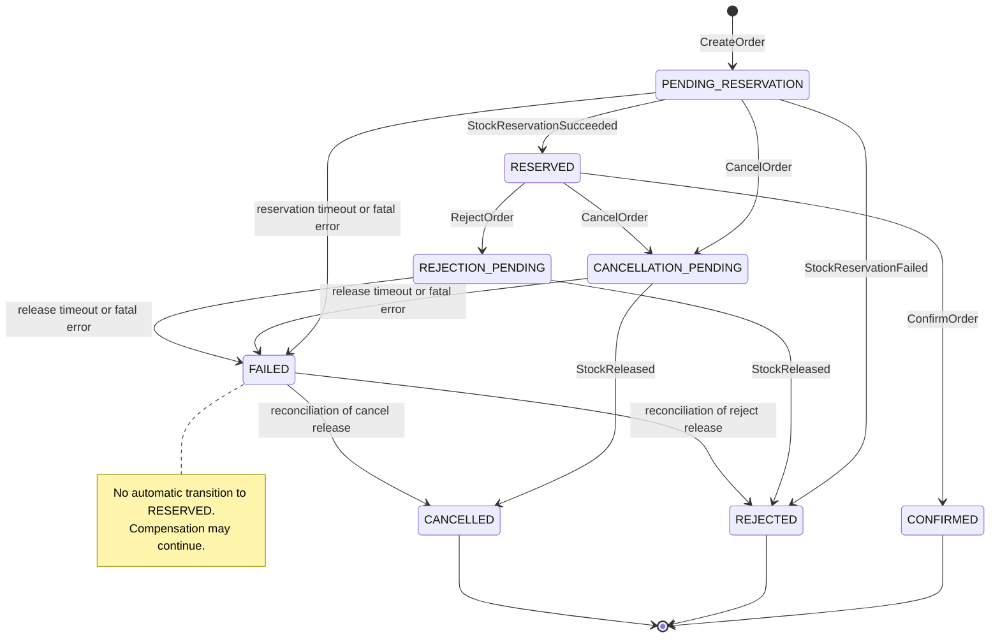
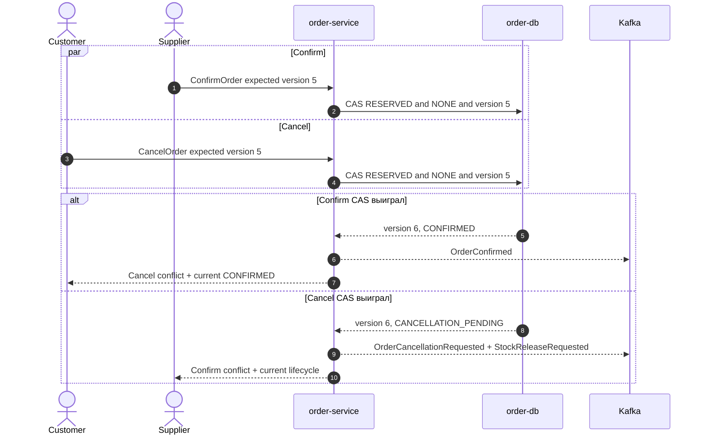
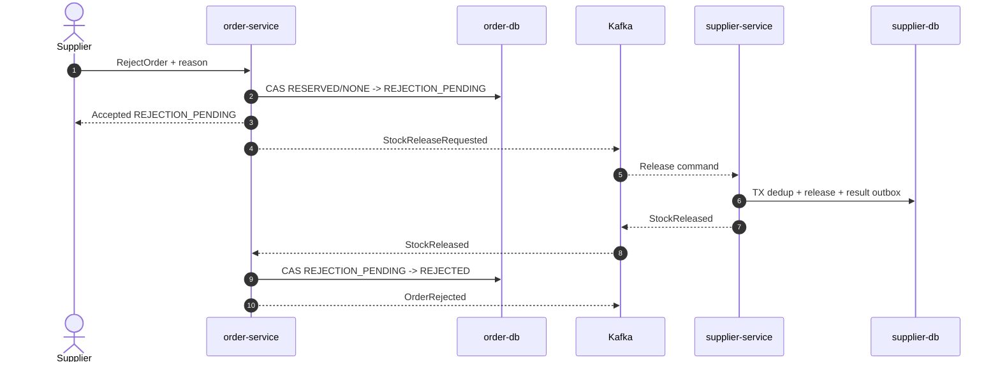
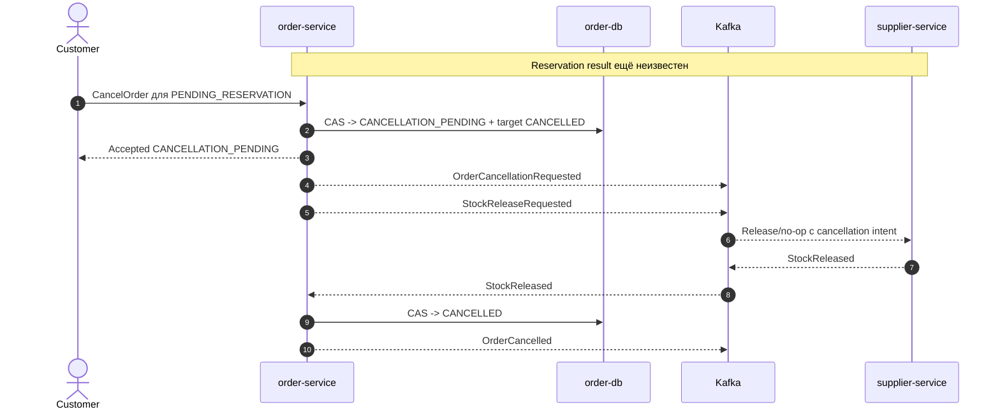
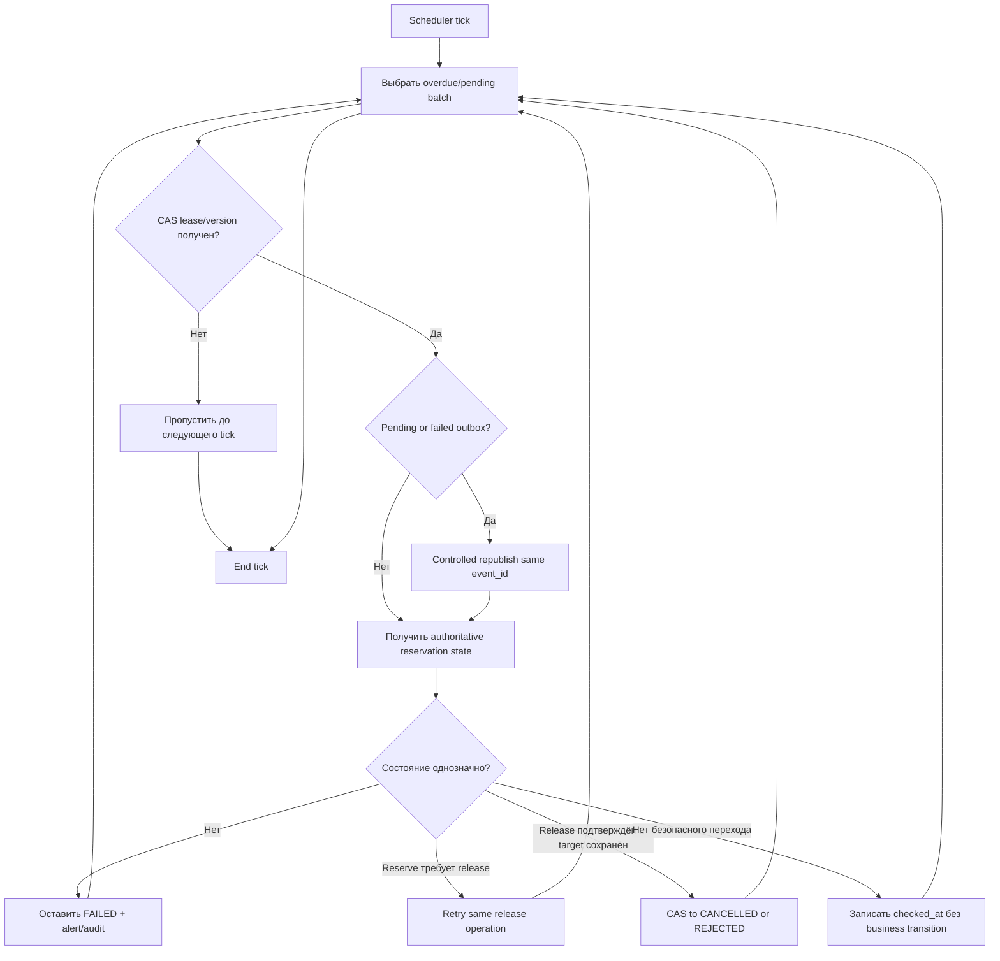

# Marketplace-QA 2.0: state machine заказа

## 0. Статус документа и граница AS IS / TO BE

Документ детализирует жизненный цикл Order из [`04-order-service-architecture.md`](04-order-service-architecture.md). Это **решение TO BE**, а не описание существующей реализации и не окончательный REST/Kafka contract. Имена команд и событий являются архитектурным словарём; URL, payload, topic и error codes определяются отдельно.

Основание:

- [`01-vision-and-architecture-principles.md`](01-vision-and-architecture-principles.md);
- [`02-mvp-scope-roles-and-user-scenarios.md`](02-mvp-scope-roles-and-user-scenarios.md);
- [`03-frontend-functional-requirements.md`](03-frontend-functional-requirements.md);
- [`04-order-service-architecture.md`](04-order-service-architecture.md);
- AS IS-контракты [заказов](../requirements/api/11_orders_api.md), [корзины](../requirements/api/10_cart_api.md), [ошибок](../requirements/api/12_error_contract.md), [данных](../requirements/data/01_data_contract_as_is.md), [Kafka](../requirements/events/01_kafka_event_contract_as_is.md), [бизнес-правила](../requirements/business/01_business_rules_as_is.md) и [сценарии](../requirements/scenarios/01_business_scenarios_as_is.md);
- код Order/Cart, producer и stock consumer в `customer-service` и `supplier-service`.

**Подтверждённый факт AS IS:** Order имеет свободный строковый статус `created`/`cancelled`; cancel не возвращает stock; `ORDER_CREATED` публикуется по каждой позиции без `order_id`; supplier consumer может списать доступную часть; после трёх ошибок существует только запись `dead letter` в логе.

**Решение TO BE:** AS IS-переходы не наследуются. Order-level reserve выполняется all-or-nothing, все изменения проходят однозначную state machine, а доставка остаётся at-least-once с дедупликацией.

## 1. Назначение state machine

State machine задаёт единственный ответ на вопросы:

- какая команда или событие допустимы в текущем состоянии;
- какие поля меняются атомарно;
- какое следующее состояние и side effects возникают;
- что происходит при duplicate, late, out-of-order и concurrent input;
- когда frontend видит промежуточный, бизнес-терминальный или технически неопределённый результат.

Детальная схема данных, endpoint и Kafka envelope не входят в этот документ.

## 2. Принципы модели состояний

1. Состояние Order — это согласованный набор полей, а не произвольная строка.
2. Публичный бизнес-статус не подменяется техническим состоянием операции.
3. Frontend получает вычисленный `lifecycle_status` от `order-service` и не собирает его сам.
4. Фактический Reservation принадлежит `supplier-service`; order-side `reservation_state` — только проекция.
5. Переход выполняется одной транзакцией `order-db` вместе с history, inbox/idempotency и outbox.
6. Каждый изменяющий переход использует optimistic locking.
7. Duplicate не является переходом и не увеличивает `version`.
8. Бизнес-отказ не считается технической ошибкой.
9. Терминальный бизнес-статус не откатывается обычным событием.
10. Компенсация может выполняться после терминального статуса, не меняя бизнес-результат.

## 3. Источник истины по статусу заказа

`order-service` является source of truth для:

- `business_status`;
- `operation_state`;
- вычисленного `lifecycle_status`;
- order-side `reservation_state`;
- `pending_terminal_status`, failure metadata и `version`.

`supplier-service` является source of truth для фактического Reservation и stock. При расхождении order-side проекция помечается `UNKNOWN`, а reconciliation запрашивает/получает авторитетный supplier result; прямое чтение `supplier-db` запрещено.

Kafka, frontend, `customer-service` и `audit-consumer` не меняют состояние Order самостоятельно.

## 4. Слои состояния и достаточность базового набора

### 4.1. Решение

Базовых семи названий достаточно для основных ветвей, но безопасный Supplier reject требует ещё одного промежуточного технического состояния `REJECTION_PENDING`. Оно не добавляется в бизнес-статус: хранится как `operation_state` и становится публичным вычисленным `lifecycle_status`.

Слои:

| Слой | Значения MVP | Назначение |
|---|---|---|
| `business_status` | `PENDING_RESERVATION`, `RESERVED`, `CONFIRMED`, `REJECTED`, `CANCELLED` | Публичное бизнес-состояние |
| `operation_state` | `NONE`, `CANCELLATION_PENDING`, `REJECTION_PENDING`, `FAILED` | Техническая операция поверх business status |
| `reservation_state` | `REQUESTED`, `RESERVED`, `NOT_RESERVED`, `RELEASE_REQUESTED`, `RELEASED`, `UNKNOWN` | Order-side проекция supplier Reservation |
| `pending_terminal_status` | `NULL`, `CANCELLED`, `REJECTED` | Цель незавершённого release/recovery |
| `lifecycle_status` | Восемь значений из таблицы статусов | Детерминированное представление для REST/frontend |

Правило вычисления: если `operation_state != NONE`, `lifecycle_status` равен ему; иначе равен `business_status`. Frontend не вычисляет это правило локально.

`REJECTION_PENDING` необходим: перевод в `REJECTED` до `StockReleased` ложно утверждал бы отсутствие активного резерва. Новые business statuses не требуются.

Это уточняет плоскую таблицу статусов архитектуры 04: упомянутые там `CANCELLATION_PENDING`, `REJECTION_PENDING` и `FAILED` сохраняют прежнюю семантику, но физически относятся к `operation_state`. Поэтому решение совместимо с пятью публичными business statuses из документа 02. REST detail может отдавать и business, и lifecycle values; business-фильтры списков остаются пятизначными.

### 4.2. Ключевое решение

- **Decision:** разделить business, operation и reservation state; добавить только `REJECTION_PENDING`.
- **Context:** cancel/reject должны быть видимы во время release, а `FAILED` не является бизнес-исходом.
- **Alternatives:** один плоский enum; немедленный `REJECTED`; отдельный saga-сервис.
- **Consequences:** модель содержит несколько согласуемых полей, зато business outcome, техническая обработка и stock-проекция не смешиваются.

### 4.3. Полный перечень lifecycle-статусов

#### 4.3.1. Таблица статусов

| `lifecycle_status` | Поля состояния | Категория / публичность | Терминальный | Customer actions | Supplier actions | Фоновые операции | Допустимые исходящие | Запрещённые направления |
|---|---|---|---:|---|---|---|---|---|
| `PENDING_RESERVATION` | business=PENDING; operation=NONE; reservation=REQUESTED/UNKNOWN | Публичный business | Нет | Read, Cancel | Только read | Publish/retry reserve, timeout watch | `RESERVED`, `REJECTED`, `CANCELLATION_PENDING`, `FAILED` | Confirm, Reject, direct Cancelled |
| `RESERVED` | business=RESERVED; operation=NONE; reservation=RESERVED | Публичный business | Нет | Read, Cancel | Read, Confirm, Reject | Нет обязательной операции | `CONFIRMED`, `CANCELLATION_PENDING`, `REJECTION_PENDING` | Direct Rejected/Cancelled без release; technical HTTP error не меняет status |
| `CONFIRMED` | business=CONFIRMED; operation=NONE; reservation=RESERVED | Публичный business | Да | Read | Read; duplicate Confirm через API допустим идемпотентно | Идемпотентная supplier finalization | Нет business transition | Cancel, Reject, Failed из обычного события |
| `REJECTED` | business=REJECTED; operation=NONE; reservation=NOT_RESERVED/RELEASED | Публичный business | Да | Read | Read; same-reason duplicate Reject идемпотентен | Нет; возможен audit replay | Нет business transition | Confirm, Cancel, Reserved |
| `CANCELLATION_PENDING` | business сохраняет PENDING/RESERVED; operation=CANCELLATION_PENDING; reservation=RELEASE_REQUESTED/UNKNOWN; target=CANCELLED | Публичный technical | Нет | Read; duplicate Cancel | Только read | Publish/retry release, timeout watch | `CANCELLED`, `FAILED` | Confirm, Reject, Reserved |
| `CANCELLED` | business=CANCELLED; operation=NONE; reservation=RELEASED | Публичный business | Да | Read; duplicate Cancel | Read | Только компенсация late reserve | Нет business transition | Reserved, Confirmed, Rejected |
| `REJECTION_PENDING` | business=RESERVED; operation=REJECTION_PENDING; reservation=RELEASE_REQUESTED/UNKNOWN; target=REJECTED | Публичный technical | Нет | Read | Read; same-reason duplicate Reject | Publish/retry release, timeout watch | `REJECTED`, `FAILED` | Confirm, Cancel, direct Rejected без release |
| `FAILED` | business сохраняется; operation=FAILED; reservation может быть UNKNOWN/RESERVED/RELEASE_REQUESTED; target optional | Публичный technical | Для обычного UI flow | Read/refresh | Read | Reconciliation и безопасная compensation | Только `CANCELLED`/`REJECTED` для сохранённой release target | Automatic Reserved/Confirmed, произвольная смена target |

## 5. Полный перечень команд

Имена ниже логические и не утверждают endpoint или consumer handler.

### 5.1. Таблица команд

| Команда | Инициатор | Исходное состояние | Проверки | Цель | Синхронный результат | Асинхронный результат | Ошибки | Идемпотентное поведение |
|---|---|---|---|---|---|---|---|---|
| `CreateOrder` | Customer | Order отсутствует | Customer/cart version, non-empty, single Supplier, key/fingerprint | `PENDING_RESERVATION` | Created/accepted Order | Reserve result | Validation, dependency, idempotency conflict | Same key/body возвращает тот же Order |
| `CancelOrder` | Customer | `PENDING_RESERVATION`/`RESERVED` | Ownership, operation=NONE, expected version | `CANCELLATION_PENDING` | Accepted/current Order | Release → `CANCELLED` | Not found, conflict | Pending/Cancelled повтор без нового release |
| `ConfirmOrder` | Supplier | `RESERVED` | Ownership, operation=NONE, expected version | `CONFIRMED` | Success/current Order | Supplier finalization | Not found, conflict | Повтор в Confirmed без нового event |
| `RejectOrder` | Supplier | `RESERVED` | Ownership, operation=NONE, reason, expected version | `REJECTION_PENDING` | Accepted/current Order | Release → `REJECTED` | Validation, not found, conflict | Same reason повтор без нового release |
| `RetryReservation` | Scheduler/reconciliation | `PENDING_RESERVATION` | Same operation ID, retryable cause, attempt/deadline | Без смены | Internal accepted/skipped | Повтор reserve command | Exhausted/conflict | Один outbox effect на attempt; supplier dedup |
| `RetryRelease` | Scheduler/reconciliation | `CANCELLATION_PENDING`/`REJECTION_PENDING`; controlled `FAILED` | Same release ID, target, retryable cause | Без смены либо recovery target после result | Internal accepted/skipped | Повтор release command | Exhausted/conflict | Supplier dedup не повторяет stock effect |
| `ProcessReservationSucceeded` | Kafka consumer | `PENDING_RESERVATION`; late states — compensation | Envelope, order/operation/event ID, expected version | `RESERVED` либо без business change + release | Offset после transaction | `OrderReserved` или release | Invalid/version/technical | Inbox duplicate — no-op |
| `ProcessReservationFailed` | Kafka consumer | `PENDING_RESERVATION` | Business reason, no partial effect, IDs/version | `REJECTED` | Offset после transaction | `OrderRejected` | Invalid/version/technical | Duplicate — no-op/current |
| `ProcessReservationTimeout` | Scheduler | `PENDING_RESERVATION` | Deadline, expected version, no accepted result | `FAILED` | Internal transition | Timeout/failure events + protective release | Stale/conflict | Повтор после transition — no-op |
| `ProcessReleaseSucceeded` | Kafka consumer | Cancel/reject pending; matching release-recovery `FAILED` | IDs, target, event ID, expected version | `CANCELLED`/`REJECTED` | Offset после transaction | Terminal event | Invalid/version/target conflict | Duplicate release — no-op |
| `ProcessReleaseFailed` | Worker/consumer | Cancel/reject pending | Technical category, attempt/deadline | Без смены; при exhaustion `FAILED` | Retry scheduled/error recorded | Retry или failure | Invalid/non-retryable | Same failure event не увеличивает attempt дважды |
| `ProcessReleaseTimeout` | Scheduler | Cancel/reject pending | Deadline, expected version, no success | `FAILED` | Internal transition | Release-timeout/failure events | Stale/conflict | Повтор после transition — no-op |
| `MarkProcessingFailed` | Internal policy/reconciliation | `PENDING_RESERVATION`, `CANCELLATION_PENDING`, `REJECTION_PENDING` | Irrecoverable technical cause активной phase, expected version | `FAILED` | Failure recorded | `OrderProcessingFailed`; compensation when needed | Conflict if stable/terminal/stale | Same failure identity — no-op |

## 6. События, влияющие на state machine

События не являются полным Kafka contract. `OrderCreated`, `OrderReserved` и другие order-факты создаются через order outbox; supplier results должны быть устойчиво связаны с supplier-side effect.

### 6.1. Таблица событий

| Событие | Producer | Смысл | Ожидаемый переход/эффект |
|---|---|---|---|
| `OrderCreated` | `order-service` | Order принят и сохранён | Уже выполнен `[*] → PENDING_RESERVATION`; customer может очистить cart version |
| `StockReservationRequested` | `order-service` | Команда полного reserve | Status не меняется; supplier обрабатывает all-or-nothing |
| `StockReservationSucceeded` | `supplier-service` | Полный Reservation существует | Pending → Reserved; в late state — release |
| `StockReservationFailed` | `supplier-service` | Business failure без частичного эффекта | Pending → Rejected |
| `OrderReserved` | `order-service` | Order стал Reserved | Информирование проекций/audit |
| `OrderConfirmed` | `order-service` | Supplier подтвердил Order | Reserved → Confirmed уже выполнен; supplier finalizes |
| `OrderRejected` | `order-service` | Business rejection окончателен | Pending → Rejected либо RejectionPending → Rejected |
| `OrderCancellationRequested` | `order-service` | Customer начал cancel | Pending/Reserved → CancellationPending уже выполнен |
| `StockReleaseRequested` | `order-service` | Идемпотентно освободить/подтвердить отсутствие reserve | Status pending до result |
| `StockReleased` | `supplier-service` | Reserve освобождён или подтверждён no-op | Pending operation → Cancelled/Rejected; recovery по target |
| `OrderCancelled` | `order-service` | Cancel завершён | CancellationPending → Cancelled уже выполнен |
| `OrderReservationTimedOut` | `order-service` | Reservation deadline истёк | Pending → Failed |
| `OrderReleaseTimedOut` | `order-service` | Release deadline истёк | Cancel/Reject pending → Failed |
| `OrderProcessingFailed` | `order-service` | Невосстановимая/исчерпанная active technical phase | Pending reservation/release operation → Failed |

## 7. Полная transition matrix

Таблица содержит изменяющие переходы и важные не изменяющие состояния. `From`/`To` — вычисленный `lifecycle_status`.

| From | Trigger | Command/Event | Preconditions | To | Side effects | Published event | Idempotency rule |
|---|---|---|---|---|---|---|---|
| `[*]` | HTTP create | `CreateOrder` | Valid key/cart/version/single supplier | `PENDING_RESERVATION` | Save snapshot, business/operation/reservation state, history, idempotency, outbox, deadline | `OrderCreated`, `StockReservationRequested` | Same key/body returns existing |
| `PENDING_RESERVATION` | Supplier success | `ProcessReservationSucceeded` / `StockReservationSucceeded` | Matching order/operation, unseen event, expected version | `RESERVED` | reservation=RESERVED, history, inbox, outbox | `OrderReserved` | Duplicate no-op |
| `PENDING_RESERVATION` | Supplier business failure | `ProcessReservationFailed` / `StockReservationFailed` | Matching operation; proof of no partial reserve | `REJECTED` | reservation=NOT_RESERVED, reason, history, inbox/outbox | `OrderRejected` | Duplicate no-op |
| `PENDING_RESERVATION` | Customer cancel | `CancelOrder` | Owner, operation=NONE, expected version | `CANCELLATION_PENDING` | operation pending, target Cancelled, reservation=RELEASE_REQUESTED, release deadline/outbox | `OrderCancellationRequested`, `StockReleaseRequested` | Repeat returns current |
| `PENDING_RESERVATION` | Retry policy | `RetryReservation` | Retryable, within limit/deadline | `PENDING_RESERVATION` | New outbox attempt with same operation ID | `StockReservationRequested` | Supplier dedup |
| `PENDING_RESERVATION` | Deadline | `ProcessReservationTimeout` | Deadline passed, no result, expected version | `FAILED` | reservation=UNKNOWN, failure data, protective release outbox | `OrderReservationTimedOut`, `OrderProcessingFailed`, `StockReleaseRequested` | Repeat no-op |
| `RESERVED` | Supplier confirm | `ConfirmOrder` | Owner, operation=NONE, expected version | `CONFIRMED` | History/outbox; reservation remains allocated | `OrderConfirmed` | Repeat Confirmed no-op |
| `RESERVED` | Supplier reject | `RejectOrder` | Owner, operation=NONE, reason, expected version | `REJECTION_PENDING` | operation pending, target Rejected, release deadline/outbox | `StockReleaseRequested` | Same reason returns current |
| `RESERVED` | Customer cancel | `CancelOrder` | Owner, operation=NONE, expected version | `CANCELLATION_PENDING` | operation pending, target Cancelled, release deadline/outbox | `OrderCancellationRequested`, `StockReleaseRequested` | Repeat returns current |
| `CANCELLATION_PENDING` | Supplier release result | `ProcessReleaseSucceeded` / `StockReleased` | Matching release/target, unseen event, expected version | `CANCELLED` | business=Cancelled, operation=None, reservation=Released, history/inbox/outbox | `OrderCancelled` | Duplicate no-op |
| `CANCELLATION_PENDING` | Retryable release error | `ProcessReleaseFailed` | Attempt limit/deadline не исчерпаны | `CANCELLATION_PENDING` | Сохранить error category/attempt, запланировать retry | Нет | Same failure event не увеличивает attempt дважды |
| `CANCELLATION_PENDING` | Retry policy | `RetryRelease` | Retryable, limit/deadline | `CANCELLATION_PENDING` | Outbox attempt, same release ID | `StockReleaseRequested` | Supplier dedup |
| `CANCELLATION_PENDING` | Deadline/exhaustion | `ProcessReleaseTimeout`/`MarkProcessingFailed` | No release success, expected version | `FAILED` | Preserve target Cancelled, reservation=UNKNOWN, failure history/outbox | `OrderReleaseTimedOut`, `OrderProcessingFailed` | Repeat no-op |
| `REJECTION_PENDING` | Supplier release result | `ProcessReleaseSucceeded` / `StockReleased` | Matching release/target, unseen event, expected version | `REJECTED` | business=Rejected, operation=None, reservation=Released, reason/history/inbox/outbox | `OrderRejected` | Duplicate no-op |
| `REJECTION_PENDING` | Retryable release error | `ProcessReleaseFailed` | Attempt limit/deadline не исчерпаны | `REJECTION_PENDING` | Сохранить error category/attempt, запланировать retry | Нет | Same failure event не увеличивает attempt дважды |
| `REJECTION_PENDING` | Retry policy | `RetryRelease` | Retryable, limit/deadline | `REJECTION_PENDING` | Outbox attempt, same release ID | `StockReleaseRequested` | Supplier dedup |
| `REJECTION_PENDING` | Deadline/exhaustion | `ProcessReleaseTimeout`/`MarkProcessingFailed` | No release success, expected version | `FAILED` | Preserve target Rejected, reservation=UNKNOWN, failure history/outbox | `OrderReleaseTimedOut`, `OrderProcessingFailed` | Repeat no-op |
| `FAILED` | Controlled reconciliation | `ProcessReleaseSucceeded` / `StockReleased` | Failure phase=release, matching target/release ID | `CANCELLED`/`REJECTED` | Clear failure operation, reservation=Released, history/outbox | Target terminal event | Duplicate no-op |
| `FAILED` | Controlled release retry | `RetryRelease` | Failure phase=release, matching target, authoritative check разрешает | `FAILED` | Reissue same logical release; сохранить technical audit | `StockReleaseRequested` | Supplier dedup |
| Ожидающее нетерминальное | Irrecoverable active phase error | `MarkProcessingFailed` | Matching phase/failure identity, expected version | `FAILED` | Failure metadata, history/outbox, compensation when needed | `OrderProcessingFailed` | Same failure identity no-op |
| `CANCELLED` | Late reservation success | `ProcessReservationSucceeded` | Matching old operation; unseen event | `CANCELLED` | Keep business status; mark/reissue compensation release, inbox/outbox | `StockReleaseRequested` | One compensation per operation |
| Любой | Duplicate event | Любая `Process*` | `event_id` already in inbox | Без изменения | Commit/acknowledge duplicate only | Нет | `version` не меняется |

### 7.1. Mermaid stateDiagram-v2



## 8. Запрещённые переходы

### 8.1. Таблица запрещённых переходов

| Попытка | Результат | Причина | Допустимое idempotent-поведение |
|---|---|---|---|
| `CONFIRMED → CANCELLED` | Conflict/no mutation | Cancel после confirmation вне MVP | Нет |
| `CANCELLED → RESERVED` | Ignore late result + compensation | Терминальный cancel не откатывается | Late success сохраняется в inbox и вызывает release |
| `REJECTED → CONFIRMED` | Conflict/no mutation | Business rejection терминален | Duplicate reject может вернуть current |
| `FAILED → RESERVED` без recovery | Ignore/conflict | Фактический reserve неизвестен; опасный auto-recovery | Нет |
| Повторный `ConfirmOrder` в `CONFIRMED` | Current representation, no mutation | Идемпотентный replay | Да, без нового `OrderConfirmed` |
| Повторный `RejectOrder` | Current либо conflict | Same reason идемпотентна; different reason меняет intent | Same reason без нового release |
| `CancelOrder` после `CONFIRMED` | Conflict | Confirmation терминальна | Нет |
| `CancelOrder` после `CANCELLED` | Current representation, no mutation | Desired result уже достигнут | Да |
| `CancelOrder` после `REJECTED`/`FAILED` | Conflict | Нет допустимой business cancellation | Нет |
| Reservation result для terminal Order | No business transition | Terminal status нельзя откатить | Duplicate no-op; late success → compensation |
| `ConfirmOrder` при `REJECTION_PENDING`/`CANCELLATION_PENDING` | Conflict | Конкурирующая операция уже победила | Нет |
| `StockReleased` без известного release operation | Quarantine/DLQ category | Нельзя определить target | Duplicate известного event — no-op |

## 9. Создание заказа

Начальный tuple после одной успешной `order-db` transaction:

- `business_status=PENDING_RESERVATION`;
- `operation_state=NONE`;
- `reservation_state=REQUESTED`;
- `pending_terminal_status=NULL`;
- `version=1`;
- `reservation_deadline_at` рассчитан от первой подтверждённой публикации либо хранится как пустой до publisher acknowledgement.

В той же transaction сохраняются Order/OrderItem snapshot, initial history, `OrderIdempotencyRecord` и outbox `OrderCreated`/`StockReservationRequested`. Frontend получает устойчивый Order и `lifecycle_status=PENDING_RESERVATION`; это не reserve success.

Same `Idempotency-Key` + same fingerprint возвращает тот же Order. Same key + different fingerprint — conflict. Два разных ключа для `(customer_id, cart_version)` разрешаются unique constraint: один создаёт Order, второй не создаёт Order/outbox и получает existing-order conflict либо ссылку по будущему API contract.

## 10. Успешное резервирование

`ProcessReservationSucceeded`:

1. валидирует envelope, `order_id`, reservation operation ID, `event_id` и event version;
2. пытается вставить `event_id` в inbox внутри той же transaction;
3. читает expected Order `version` и effective state;
4. только из `PENDING_RESERVATION` переводит в `RESERVED`;
5. фиксирует `reservation_state=RESERVED`, reference и status history;
6. увеличивает `version` ровно на один;
7. создаёт `OrderReserved` в outbox.

Уже обработанный `event_id` возвращает duplicate success consumer-обработчику, но не меняет Order. Новое late событие в cancel/terminal/failed state не переводит Order в Reserved и запускает правила раздела 17.

## 11. Недостаточный остаток

`StockReservationFailed` — штатный business result с нормализованным reason code, например категория `INSUFFICIENT_STOCK`; окончательный catalogue codes остаётся event/error contract.

Переход `PENDING_RESERVATION → REJECTED` допустим только если supplier result гарантирует отсутствие частичного Reservation. Order сохраняет reason, `reservation_state=NOT_RESERVED`, history и `OrderRejected` outbox. Retry/DLQ business failure не применяются.

Duplicate того же `event_id` не меняет Order. Новое failure-событие той же reservation operation после `RESERVED` считается stale/contradictory, сохраняется как anomaly и не переводит Order в Rejected.

## 12. Техническая ошибка резервирования

| Ситуация | Состояние до limit/deadline | Действие | Финал |
|---|---|---|---|
| Временная ошибка publish/consume/dependency | `PENDING_RESERVATION` | Bounded retry с тем же operation/event identity | Status не меняется |
| Consumer attempts исчерпаны для входящего сообщения | Текущий status | Physical DLQ, alert; offset по DLQ policy | Order остаётся наблюдаемым до timeout/reconciliation |
| Reservation deadline истёк | `PENDING_RESERVATION` | CAS timeout transition, protective release | `FAILED` |
| Irrecoverable error активной reservation/release phase | Ожидающий operation state | `MarkProcessingFailed` | `FAILED` |

`FAILED` показывается frontend как техническая неопределённость, а не как недостаточный stock. Кнопка обычного retry отсутствует. Будущая recovery-команда может быть только операторской, обязана сначала определить supplier Reservation и требует ADR; автоматический `FAILED → RESERVED` запрещён.

## 13. Подтверждение заказа поставщиком

`ConfirmOrder` допустим только для Supplier-владельца при `business_status=RESERVED`, `operation_state=NONE` и expected `version`.

В одной transaction выполняется conditional update, history и `OrderConfirmed` outbox. Повтор при `CONFIRMED` возвращает current representation без новой history/version/event. При concurrent cancel или reject побеждает первый CAS; проигравший перечитывает Order и возвращает conflict, кроме уже достигнутого idempotent Confirmed.

### 13.1. Mermaid sequence: confirm vs cancel race



Confirm/reject race разрешается тем же guard: первый устанавливает `CONFIRMED` либо `operation_state=REJECTION_PENDING`; второй получает conflict.

## 14. Отклонение поставщиком

Минимально безопасная модель:

1. `RejectOrder` из `RESERVED` не меняет `business_status`.
2. Она атомарно ставит `operation_state=REJECTION_PENDING`, `pending_terminal_status=REJECTED`, `reservation_state=RELEASE_REQUESTED`, сохраняет reason и release outbox.
3. Customer видит вычисленный `REJECTION_PENDING` и сообщение «Отклонение выполняется»; `REJECTED` ещё не показывается.
4. Только matching `StockReleased` устанавливает `business_status=REJECTED`, `operation_state=NONE`, `reservation_state=RELEASED`.
5. Release failure до limit оставляет `REJECTION_PENDING`; timeout/exhaustion даёт `FAILED` с target Rejected.
6. Reconciliation может завершить Failed в Rejected только после подтверждения release.

### 14.1. Mermaid sequence: reject и release



## 15. Отмена Customer

| Вариант | Поведение |
|---|---|
| A. Cancel в `PENDING_RESERVATION` | CAS в `CANCELLATION_PENDING`; сохранить origin=PENDING и target=Cancelled; немедленно отправить release/no-op. Reservation success не разрешает Reserved |
| B. Cancel в `RESERVED` | CAS в `CANCELLATION_PENDING`; отправить release полного Reservation; Cancelled только после `StockReleased` |
| C. Cancel в `CANCELLATION_PENDING` | Идемпотентно вернуть current representation; не создавать второй release operation |
| D. Cancel в `CONFIRMED` | Conflict без mutation |
| E. Cancel в `REJECTED`/`FAILED` | Conflict; в `CANCELLED` — идемпотентно вернуть current representation |

Ownership и expected version обязательны для первого изменяющего cancel. Повтор может определить уже достигнутый результат после перечитывания.

### 15.1. Mermaid sequence: cancellation during reservation



## 16. Reservation success после отмены

Если cancel победил в `PENDING_RESERVATION`, Order остаётся `CANCELLATION_PENDING`. Новое `StockReservationSucceeded`:

- сохраняется в inbox;
- не выполняет переход в `RESERVED`;
- обновляет проекцию только как требующую compensation;
- создаёт/переиспользует `StockReleaseRequested` с тем же release operation ID;
- оставляет `pending_terminal_status=CANCELLED`;
- после `StockReleased` завершает Order в `CANCELLED`.

Если Order уже `CANCELLED`, lifecycle не меняется; немедленный release выполняется как техническая компенсация. Supplier обязан хранить cancellation/release intent или tombstone, чтобы out-of-order reservation command не создала бесхозный reserve.

### 16.1. Mermaid sequence: late reservation success

```mermaid
sequenceDiagram
    autonumber
    actor Buyer as Customer
    participant Order as order-service
    participant ODB as order-db
    participant Kafka as Kafka
    participant Stock as supplier-service
    participant SDB as supplier-db

    Buyer->>Order: CancelOrder while PENDING_RESERVATION
    Order->>ODB: -> CANCELLATION_PENDING
    Order-->>Kafka: StockReleaseRequested
    Stock-->>Kafka: StockReservationSucceeded arrives late
    Kafka-->>Order: Late success
    Order->>ODB: Inbox event; keep CANCELLATION_PENDING
    Order-->>Kafka: Reissue same logical StockReleaseRequested
    Kafka-->>Stock: Compensation release
    Stock->>SDB: Idempotent full release
    Stock-->>Kafka: StockReleased
    Kafka-->>Order: Release result
    Order->>ODB: -> CANCELLED
```

## 17. Timeout и retry

Scheduler/background worker `order-service` определяет deadline по UTC timestamps и делает conditional transition. Рекомендуемые MVP-значения наследуются из архитектуры 04: reservation и release deadline по 30 секунд от первой подтверждённой публикации соответствующей команды.

Обязательные поля: `reservation_requested_at`, `reservation_deadline_at`, `release_requested_at`, `release_deadline_at`, operation IDs, `attempt_count`, `last_attempt_at`, `failure_phase`, `failure_reason`, `pending_terminal_status`.

### 17.1. Таблица timeout/retry поведения

| Phase | Retry | Deadline owner | При deadline | Late event |
|---|---|---|---|---|
| Reservation publish/result | До 3 логических отправок с тем же operation ID; bounded backoff | `order-service` scheduler | Pending → Failed; reason `RESERVATION_TIMEOUT`; protective release | Success → release, без Reserved; failure → inbox/anomaly |
| Cancellation release | До 3 отправок с тем же release ID | `order-service` scheduler | CancellationPending → Failed, target Cancelled | Matching Released → Cancelled через recovery |
| Rejection release | До 3 отправок с тем же release ID | `order-service` scheduler | RejectionPending → Failed, target Rejected | Matching Released → Rejected через recovery |
| Incoming consumer | 3 attempts total, backoff 1/5 s | Consumer policy | Physical DLQ; Order ждёт deadline/reconciliation | Replay безопасен по inbox |
| Outbox publish | 10 attempts total, capped backoff | Outbox publisher | Outbox Failed + alert; business state сохраняется | Controlled republish с тем же event ID |

Retry не меняет business status и не создаёт новый logical operation ID. Business insufficient stock не повторяется.

## 18. Повторная доставка событий

`OrderInboxRecord` имеет unique `event_id` и сохраняется в той же transaction, что и side effect. Offset подтверждается только после commit или контролируемого DLQ.

| Duplicate | Обработка |
|---|---|
| Повтор success reserve | Если inbox содержит event — ack/no-op; если новый event того же operation и Order Reserved — stale/no-op |
| Повтор business failure | Inbox/stale no-op; reason и version не меняются |
| Повтор release | Inbox/stale no-op; stock не увеличивается повторно |
| Повтор order command из outbox | Supplier/customer consumer дедуплицирует event/operation ID |
| Manual DLQ replay | Сохраняет original event ID/correlation; side effect не повторяется |

Kafka delivery считается at-least-once. Exactly-once end-to-end не заявляется.

## 19. Нарушение порядка событий

| Сценарий | Решение |
|---|---|
| `StockReleased` раньше известного release request | Не применять; quarantine/DLQ как unknown operation, либо после появления request обработать controlled replay |
| Reservation success после reservation failure/`REJECTED` | Не менять Order; инициировать release, если supplier сообщил созданный reserve |
| Reservation failure после `RESERVED` | Stale/anomaly; не откатывать Reserved |
| Confirm после cancellation request | Conflict по operation/version; не менять CancellationPending |
| Duplicate старой aggregate/event version | Inbox/stale no-op; log reason |
| Future unsupported event version | Не применять; DLQ |
| Release для другого pending target | Target conflict; не применять; DLQ/reconciliation |

Partition key `order_id` уменьшает вероятность reorder в одном topic, но state machine не полагается на общий порядок разных topics.

### 19.1. Race conditions

#### 19.1.1. Таблица race conditions

| Race | Guard | Победитель | Проигравший/компенсация |
|---|---|---|---|
| Два checkout с одним key | Unique idempotency scope | Первая transaction | Возвращает тот же Order |
| Два checkout с разными keys, одна cart version | Unique Customer+cart version | Первая transaction | Existing/conflict, без outbox |
| Confirm vs Cancel | Status+operation+version CAS | Первый CAS | Conflict/current state |
| Confirm vs Reject | Status+operation+version CAS | Первый CAS | Conflict/current state |
| Reject vs Cancel | Status+operation+version CAS | Первый CAS | Второй conflict; одна release target |
| Reservation result vs Cancel | Version CAS и late-result rule | Если success первый — Reserved, cancel затем release; если cancel первый — no Reserved | Оба пути сходятся без partial effect |
| Timeout vs reservation result | Expected version/deadline CAS | Первый CAS | Late result обработан по текущему state |
| Timeout vs release result | Expected version CAS | Первый CAS | Matching late release может recovery target |
| Duplicate release consumers | Inbox unique event ID | Первая transaction | No-op |
| Stale REST update | Expected version | Актуальная версия | Reload, затем idempotent result или conflict |

## 20. Optimistic locking

Каждый Order имеет монотонный integer `version`. Изменяющая команда выполняет conditional update по `order_id`, expected `business_status`, expected `operation_state` и expected `version`.

Если обновлено zero rows:

1. transaction не создаёт history/outbox;
2. handler перечитывает Order;
3. если desired result уже достигнут и payload совместим — возвращает idempotent success;
4. если пришёл duplicate/stale event — фиксирует inbox/anomaly по правилам consumer;
5. если победила конфликтующая команда — REST получает conflict;
6. automatic retry допустим только для той же идемпотентной internal operation после reread, не для изменения business intent.

Ни один retry не записывает устаревшую версию поверх новой.

## 21. Терминальные статусы

| Статус | Можно менять business status | Technical compensation | Manual replay | Frontend |
|---|---:|---|---|---|
| `CONFIRMED` | Нет | Supplier finalization/replay без повторного stock decrement | Да, идемпотентно | Read/refresh, без cancel/confirm |
| `REJECTED` | Нет | Late unexpected reserve должен быть released без смены status | Да, идемпотентно | Read reason, без actions |
| `CANCELLED` | Нет | Late reserve release без смены status | Да, идемпотентно | Read, duplicate cancel допустим API |
| `FAILED` | Не обычной командой | Обязательна при unknown/active reserve | Только controlled reconciliation | Read/refresh/correlation, без action retry |

`FAILED` — operational terminal, но не business terminal. Разрешены только целевые recovery-переходы release phase в сохранённый `CANCELLED`/`REJECTED`.

## 22. FAILED

`FAILED` означает, что `order-service` не смог доказать безопасное завершение orchestration в deadline/policy. Это техническое состояние, не synonym `REJECTED`.

В `FAILED` активный Reservation может существовать, если result потерян или release не подтверждён. Поэтому сохраняются `failure_phase`, `failure_reason`, source lifecycle, `pending_terminal_status`, operation IDs, deadlines и last correlation.

Reconciliation выполняет system actor/оператор. Manual retry разрешён только той же idempotent operation после проверки supplier state. Допустимы:

- Failed release target Cancelled → Cancelled после доказанного `StockReleased`;
- Failed release target Rejected → Rejected после доказанного `StockReleased`;
- Failed reservation timeout → остаётся Failed; найденный reserve освобождается, но автоматический переход в Reserved запрещён.

Generic `FAILED → RESERVED` или `FAILED → CONFIRMED` отсутствует.

## 23. Reconciliation

Worker запускается периодически и обрабатывает ограниченные batch с optimistic locking.

1. Находит просроченные `PENDING_RESERVATION`.
2. Находит просроченные cancellation/rejection pending states.
3. Проверяет pending/failed outbox и переиздаёт с тем же event ID по policy.
4. Сверяет supplier Reservation через будущий read/result contract; прямой SQL запрещён.
5. Если reserve найден для Cancelled/Rejected/Failed-timeout, создаёт idempotent release.
6. Если matching release подтверждён для Failed target, завершает только сохранённый target.
7. При неоднозначности оставляет Failed, пишет audit/metric и требует operator decision.

### 23.1. Mermaid flowchart reconciliation worker



## 24. HTTP mapping на уровне поведения

| Поведение | Ожидаемый класс ответа |
|---|---|
| Новый синхронно завершённый переход | Success 2xx |
| Команда принята, release/reserve продолжается | Accepted 2xx |
| State/ownership intent конфликтует | Conflict 4xx |
| Невалидный key/reason/version/payload | Validation 4xx |
| Order отсутствует или не принадлежит actor | Not found 4xx без IDOR disclosure |
| Same-key/different-fingerprint | Idempotency conflict 4xx |
| Idempotent replay с достигнутым результатом | Success 2xx + current representation/replay marker |
| Dependency временно недоступна до Order commit | Service unavailable 5xx class; safe retry rules явны |

Точные HTTP status codes, headers и error envelope определяет API/error contract.

## 25. UI mapping

### 25.1. Таблица UI mapping

| `lifecycle_status` | Текст | Customer buttons | Supplier buttons | Polling | Сообщение / retry |
|---|---|---|---|---|---|
| `PENDING_RESERVATION` | «Ожидается резервирование» | Отменить | Нет | Да | Stock ещё не подтверждён; manual refresh |
| `RESERVED` | «Товары зарезервированы» | Отменить | Подтвердить, отклонить | По refresh/короткий polling после command | Все позиции зарезервированы |
| `CONFIRMED` | «Заказ подтверждён» | Нет | Нет | Нет | Терминальный результат |
| `REJECTED` | «Заказ отклонён» | Нет | Нет | Нет | Показать reason; retry отсутствует |
| `CANCELLATION_PENDING` | «Отмена выполняется» | Нет | Нет | Да | Release может занять время |
| `CANCELLED` | «Заказ отменён» | Нет | Нет | Нет | Терминальный результат |
| `REJECTION_PENDING` | «Отклонение выполняется» | Нет | Нет | Да | Итог будет после release |
| `FAILED` | «Обработка не завершена» | Только refresh | Только refresh | Ограниченный polling, затем manual refresh | Correlation ID; обычный retry запрещён |

Frontend показывает кнопки по `lifecycle_status` из API и всё равно блокирует double click. Неизвестное значение отображается нейтрально без опасных actions.

## 26. Audit trail

Каждый изменяющий переход создаёт одну `OrderStatusHistory`/audit запись в той же transaction:

- `order_id`;
- `from_status` и `to_status` как lifecycle values;
- before/after business, operation и reservation state;
- `trigger`;
- `actor_type`;
- nullable `actor_id`;
- nullable `event_id`;
- `correlation_id`;
- `version_before`;
- `version_after`;
- nullable `reason`;
- `created_at`.

Duplicate/no-op не создаёт второй status-history, но может иметь technical dedup log/metric. Reason не содержит stack trace или secret.

## 27. Invariants

### 27.1. Таблица invariants

| ID | Инвариант | Проверяемый oracle |
|---|---|---|
| INV-SM-01 | Один Order имеет один `supplier_id` | Order/Items query |
| INV-SM-02 | Частичный Reservation запрещён | Supplier Reservation rows/result |
| INV-SM-03 | Confirmed нельзя отменить | HTTP conflict + неизменные version/history |
| INV-SM-04 | Business terminal status не откатывается обычным event | Status/history после late event |
| INV-SM-05 | `version` монотонно растёт только при mutation | Последовательность history |
| INV-SM-06 | Один `event_id` не создаёт side effect дважды | Inbox uniqueness + stock/order state |
| INV-SM-07 | `total_amount` не меняется после create | До/после lifecycle |
| INV-SM-08 | Order snapshot неизменяем | OrderItem audit/query |
| INV-SM-09 | Reserve не остаётся без Order/operation owner | Reservation `order_id`/operation ID |
| INV-SM-10 | Status и reservation projection соответствуют allowed combinations | Constraint/domain validation |
| INV-SM-11 | `REJECTED` после Supplier reject требует Released | History + reservation result |
| INV-SM-12 | `CANCELLED` требует Released/no-op proof | History + release event |
| INV-SM-13 | Confirm/Cancel/Reject из одной version дают один winner | Concurrent test |
| INV-SM-14 | Outbox и transition фиксируются атомарно | DB transaction inspection |
| INV-SM-15 | Late success не переводит cancel/terminal Order в Reserved | Inbox/history/outbox |

Временное расхождение terminal status и supplier Reservation допустимо только как явно зарегистрированная compensation anomaly с `reservation_state=UNKNOWN/RELEASE_REQUESTED`, correlation и активным recovery path; оно не считается нормальным устойчивым состоянием.

### 27.2. Допустимые устойчивые комбинации

| `lifecycle_status` | Допустимый `reservation_state` |
|---|---|
| `PENDING_RESERVATION` | `REQUESTED`, временно `UNKNOWN` |
| `RESERVED` | `RESERVED` |
| `CONFIRMED` | `RESERVED` как allocation, принадлежащая Confirmed Order |
| `CANCELLATION_PENDING` | `RELEASE_REQUESTED`, временно `UNKNOWN` |
| `REJECTION_PENDING` | `RELEASE_REQUESTED`, временно `UNKNOWN` |
| `REJECTED` | `NOT_RESERVED` либо `RELEASED` |
| `CANCELLED` | `RELEASED` |
| `FAILED` | `UNKNOWN`, `RESERVED` или `RELEASE_REQUESTED` с обязательной failure phase |

Комбинация вне таблицы отклоняется domain validation либо помечается compensation anomaly; она не должна молча сохраняться как нормальное состояние.

## 28. Открытые вопросы

1. Как exact API представляет `business_status`, `operation_state`, `reservation_state` и вычисленный `lifecycle_status`?
2. Показываются ли технические состояния в list filters или только в detail/read model?
3. Каков окончательный catalogue business/failure reason codes?
4. Как `supplier-service` отвечает на reconciliation query без прямого SQL?
5. Как долго supplier хранит cancellation/release tombstone для late reservation command?
6. С какого broker acknowledgement точно начинается server deadline?
7. Подтверждаются ли значения 30 секунд и retry policy отдельными NFR?
8. Какой lease/batch policy защищает несколько reconciliation worker?
9. Кто авторизован выполнять controlled recovery в стенде без полноценной auth?
10. Каков runbook для unknown release operation, DLQ replay и outbox `FAILED`?
11. Нужен ли отдельный event для supplier finalization после `OrderConfirmed`?
12. Какие поля `FAILED` безопасно показывать frontend, а какие остаются diagnostic-only?

## 29. Кандидаты Architecture Decision Record

| ADR-кандидат | Принятое направление | Что закрепить |
|---|---|---|
| Разделение state layers | Business/operation/reservation отдельно | Поля и constraints |
| Public lifecycle mapping | Восемь вычисленных values | API representation/versioning |
| Reject semantics | `REJECTION_PENDING` до release | Reason/release contract |
| Cancel during reservation | Immediate release intent, no return to Reserved | Supplier tombstone/ordering |
| Late reservation success | Compensation release, no terminal rollback | Operation identities |
| `FAILED` semantics | Technical, recovery only by reconciliation | Recovery command/permissions |
| Timeout ownership | Order scheduler, candidate 30 s | Clock/deadline start/testability |
| Optimistic locking | Status+operation+version CAS | Retry/conflict contract |
| Inbox/stale handling | At-least-once, unique event ID | Retention/replay |
| Reconciliation API | Supplier-authoritative query/result | Endpoint/event, access, batch |
| Terminal compensation | Status unchanged, technical release allowed | Audit/visibility |

## 30. Acceptance criteria ключевых сценариев

### AC-SM-001 — успешный CreateOrder

**Given** valid single-supplier cart version и новый `Idempotency-Key`

**When** `CreateOrder` transaction завершается

**Then** создан один Order `PENDING_RESERVATION`, `version=1`, reservation `REQUESTED`, а Order, history, idempotency и два outbox-сообщения сохранены атомарно.

### AC-SM-002 — успешное резервирование

**Given** Order `PENDING_RESERVATION` и unseen matching `StockReservationSucceeded`

**When** consumer обрабатывает событие

**Then** Order становится `RESERVED`, version увеличивается один раз и создаётся один `OrderReserved`.

### AC-SM-003 — недостаточный остаток

**Given** supplier гарантирует no partial effect и публикует matching `StockReservationFailed`

**When** событие обработано для `PENDING_RESERVATION`

**Then** Order становится `REJECTED`, reservation projection — `NOT_RESERVED`, а технический retry не запускается.

### AC-SM-004 — повтор reservation event

**Given** `event_id` reservation result уже записан в inbox

**When** то же событие доставлено повторно

**Then** оно подтверждается без нового transition, history, outbox и изменения version.

### AC-SM-005 — отмена PENDING_RESERVATION

**Given** Customer-владелец читает Order `PENDING_RESERVATION`

**When** `CancelOrder` выигрывает expected-version CAS

**Then** lifecycle становится `CANCELLATION_PENDING`, сохраняется target `CANCELLED` и публикуется release intent.

### AC-SM-006 — отмена RESERVED

**Given** Order `RESERVED` без active operation

**When** Customer отменяет Order и затем приходит matching `StockReleased`

**Then** промежуточно виден `CANCELLATION_PENDING`, а итоговый статус становится `CANCELLED` только после release.

### AC-SM-007 — запрет отмены CONFIRMED

**Given** Order `CONFIRMED`

**When** Customer отправляет `CancelOrder`

**Then** возвращается conflict, а status, version, history и outbox не меняются.

### AC-SM-008 — confirm/cancel race

**Given** Confirm и Cancel используют одну expected version `RESERVED`

**When** запросы выполняются конкурентно

**Then** ровно один CAS успешен, а второй возвращает current conflict без второго бизнес-эффекта.

### AC-SM-009 — reject и release

**Given** Supplier-владелец отклоняет `RESERVED` Order с valid reason

**When** reject принят, но release ещё не подтверждён

**Then** виден `REJECTION_PENDING`; `REJECTED` появляется только после matching `StockReleased`.

### AC-SM-010 — reservation timeout

**Given** deadline Order `PENDING_RESERVATION` истёк без принятого результата

**When** scheduler выигрывает CAS

**Then** lifecycle становится `FAILED`, публикуются timeout/failure и protective release, а frontend не получает обычную retry-кнопку.

### AC-SM-011 — late reservation success

**Given** cancel уже перевёл Order из Pending в `CANCELLATION_PENDING`

**When** приходит unseen `StockReservationSucceeded`

**Then** Order не становится `RESERVED`, сохраняет target `CANCELLED` и инициирует идемпотентный release.

### AC-SM-012 — optimistic locking conflict

**Given** команда содержит устаревшую expected version

**When** conditional update не меняет строку

**Then** handler перечитывает Order и возвращает idempotent success либо conflict; устаревшие history/outbox не создаются.

## 31. Каталог требований state machine

Каждое требование ниже атомарно и проверяемо.

- **SM-ORD-001.** `order-service` должен быть source of truth состояния Order.
- **SM-ORD-002.** Order должен хранить `business_status` отдельно от `operation_state`.
- **SM-ORD-003.** Order-side `reservation_state` должен быть проекцией, а не supplier source of truth.
- **SM-ORD-004.** `lifecycle_status` должен вычисляться только `order-service`.
- **SM-ORD-005.** Frontend не должен вычислять lifecycle из Kafka.
- **SM-ORD-006.** `business_status` должен поддерживать ровно пять MVP-значений.
- **SM-ORD-007.** `operation_state` должен поддерживать `NONE`.
- **SM-ORD-008.** `operation_state` должен поддерживать `CANCELLATION_PENDING`.
- **SM-ORD-009.** `operation_state` должен поддерживать `REJECTION_PENDING`.
- **SM-ORD-010.** `operation_state` должен поддерживать `FAILED`.
- **SM-ORD-011.** Ненулевой `operation_state` должен иметь приоритет при вычислении lifecycle.
- **SM-ORD-012.** `REJECTION_PENDING` должен быть видим frontend отдельно от `REJECTED`.
- **SM-ORD-013.** `FAILED` должен быть видим frontend как technical state.
- **SM-ORD-014.** Каждый Order должен иметь монотонный integer `version`.
- **SM-ORD-015.** Mutation должна увеличивать `version` ровно на один.
- **SM-ORD-016.** Duplicate/no-op не должен увеличивать `version`.
- **SM-ORD-017.** Изменяющий переход должен создавать одну status-history запись.
- **SM-ORD-018.** Transition и history должны фиксироваться одной transaction.
- **SM-ORD-019.** Transition и outbox должны фиксироваться одной transaction.
- **SM-ORD-020.** Consumer transition и inbox должны фиксироваться одной transaction.
- **SM-ORD-021.** Новый Order должен начинаться в `PENDING_RESERVATION`.
- **SM-ORD-022.** Новый Order должен начинаться с `operation_state=NONE`.
- **SM-ORD-023.** Новый Order должен начинаться с `reservation_state=REQUESTED`.
- **SM-ORD-024.** Новый Order должен начинаться с `version=1`.
- **SM-ORD-025.** Create transaction должна сохранять `OrderCreated` в outbox.
- **SM-ORD-026.** Create transaction должна сохранять `StockReservationRequested` в outbox.
- **SM-ORD-027.** Same key/same fingerprint должен возвращать существующий Order.
- **SM-ORD-028.** Same key/different fingerprint не должен менять Order.
- **SM-ORD-029.** Одна cart version Customer не должна создавать два Order.
- **SM-ORD-030.** Successful create response не должен означать successful reservation.
- **SM-ORD-031.** Reservation success должен проверять `order_id`.
- **SM-ORD-032.** Reservation success должен проверять reservation operation ID.
- **SM-ORD-033.** Reservation result должен проверять `event_id`.
- **SM-ORD-034.** Reservation result должен проверять поддерживаемую event version.
- **SM-ORD-035.** Unseen matching success из Pending должен переводить Order в Reserved.
- **SM-ORD-036.** Переход в Reserved должен устанавливать `reservation_state=RESERVED`.
- **SM-ORD-037.** Переход в Reserved должен публиковать один `OrderReserved`.
- **SM-ORD-038.** Duplicate reservation success не должен повторять переход.
- **SM-ORD-039.** Late reservation success не должен откатывать terminal status.
- **SM-ORD-040.** Late reservation success для cancel path должен инициировать release.
- **SM-ORD-041.** Insufficient stock должен обрабатываться как business failure.
- **SM-ORD-042.** Business reservation failure должен гарантировать отсутствие partial reserve.
- **SM-ORD-043.** Business reservation failure из Pending должен переводить Order в Rejected.
- **SM-ORD-044.** Rejected по stock failure должен иметь `reservation_state=NOT_RESERVED`.
- **SM-ORD-045.** Business reservation failure не должен проходить technical retry.
- **SM-ORD-046.** Reservation failure после Reserved не должен откатывать Order.
- **SM-ORD-047.** Confirm должен быть допустим только из Reserved с operation None.
- **SM-ORD-048.** Confirm должен проверять Supplier ownership.
- **SM-ORD-049.** Confirm должен использовать expected version.
- **SM-ORD-050.** Первый Confirm должен переводить Order в Confirmed.
- **SM-ORD-051.** Первый Confirm должен публиковать один `OrderConfirmed`.
- **SM-ORD-052.** Повтор Confirm в Confirmed должен возвращать current Order.
- **SM-ORD-053.** Повтор Confirm не должен публиковать второе событие.
- **SM-ORD-054.** Confirm после cancellation intent должен возвращать conflict.
- **SM-ORD-055.** Confirm после rejection intent должен возвращать conflict.
- **SM-ORD-056.** Reject должен быть допустим только из Reserved с operation None.
- **SM-ORD-057.** Reject должен проверять Supplier ownership.
- **SM-ORD-058.** Reject должен требовать непустую normalized reason.
- **SM-ORD-059.** Первый Reject должен устанавливать `REJECTION_PENDING`.
- **SM-ORD-060.** Первый Reject должен сохранять target `REJECTED`.
- **SM-ORD-061.** Первый Reject должен публиковать `StockReleaseRequested`.
- **SM-ORD-062.** Supplier Reject не должен устанавливать Rejected до release.
- **SM-ORD-063.** Matching release из RejectionPending должен переводить Order в Rejected.
- **SM-ORD-064.** Same-reason Reject replay не должен создавать второй release.
- **SM-ORD-065.** Different-reason Reject replay должен возвращать conflict.
- **SM-ORD-066.** Cancel должен быть допустим из Pending.
- **SM-ORD-067.** Cancel должен быть допустим из Reserved.
- **SM-ORD-068.** Первый Cancel должен устанавливать `CANCELLATION_PENDING`.
- **SM-ORD-069.** Первый Cancel должен сохранять target `CANCELLED`.
- **SM-ORD-070.** Первый Cancel должен публиковать `OrderCancellationRequested`.
- **SM-ORD-071.** Первый Cancel должен публиковать `StockReleaseRequested`.
- **SM-ORD-072.** Cancelled должен устанавливаться только после release/no-op proof.
- **SM-ORD-073.** Повтор Cancel в CancellationPending не должен создавать второй release.
- **SM-ORD-074.** Повтор Cancel в Cancelled должен возвращать current Order.
- **SM-ORD-075.** Cancel в Confirmed должен возвращать conflict.
- **SM-ORD-076.** Cancel в Rejected должен возвращать conflict.
- **SM-ORD-077.** Cancel в Failed должен возвращать conflict.
- **SM-ORD-078.** Confirm/Cancel race должен иметь ровно один успешный CAS.
- **SM-ORD-079.** Confirm/Reject race должен иметь ровно один успешный CAS.
- **SM-ORD-080.** Reject/Cancel race должен иметь ровно один успешный CAS.
- **SM-ORD-081.** Reservation/Cancel race должен сходиться без перехода Cancelled в Reserved.
- **SM-ORD-082.** Status mutation должна проверять expected business status.
- **SM-ORD-083.** Status mutation должна проверять expected operation state.
- **SM-ORD-084.** Status mutation должна проверять expected version.
- **SM-ORD-085.** Zero-row conditional update должен приводить к reread.
- **SM-ORD-086.** Reread должен отличать idempotent success от conflict.
- **SM-ORD-087.** Conflict не должен создавать history.
- **SM-ORD-088.** Conflict не должен создавать outbox event.
- **SM-ORD-089.** Reservation deadline должен проверяться scheduler.
- **SM-ORD-090.** Release deadline должен проверяться scheduler.
- **SM-ORD-091.** Deadline transition должен использовать expected version.
- **SM-ORD-092.** Reservation timeout должен переводить Pending в Failed.
- **SM-ORD-093.** Reservation timeout должен публиковать `OrderReservationTimedOut`.
- **SM-ORD-094.** Reservation timeout должен инициировать protective release.
- **SM-ORD-095.** Release timeout должен переводить pending operation в Failed.
- **SM-ORD-096.** Release timeout должен сохранять pending terminal target.
- **SM-ORD-097.** Release timeout должен публиковать `OrderReleaseTimedOut`.
- **SM-ORD-098.** Невосстановимая processing error должна публиковать `OrderProcessingFailed`.
- **SM-ORD-099.** Technical retry должен иметь конечный attempt limit.
- **SM-ORD-100.** Retry reservation должен использовать тот же logical operation ID.
- **SM-ORD-101.** Retry release должен использовать тот же logical release ID.
- **SM-ORD-102.** Retry не должен менять business status.
- **SM-ORD-103.** Исчерпавшее consumer retry сообщение должно попадать в physical DLQ.
- **SM-ORD-104.** DLQ replay должен сохранять original event ID.
- **SM-ORD-105.** Inbox должен иметь unique constraint по `event_id`.
- **SM-ORD-106.** Уже обработанный `event_id` не должен повторять side effect.
- **SM-ORD-107.** Duplicate failure не должен менять сохранённую reason.
- **SM-ORD-108.** Duplicate release не должен повторно увеличивать stock.
- **SM-ORD-109.** Unknown release operation не должна менять Order.
- **SM-ORD-110.** Unsupported event version не должна менять Order.
- **SM-ORD-111.** Stale event не должен уменьшать Order version.
- **SM-ORD-112.** Kafka delivery должна считаться at-least-once.
- **SM-ORD-113.** Система не должна заявлять exactly-once end-to-end.
- **SM-ORD-114.** Failed reservation timeout не должен автоматически переходить в Reserved.
- **SM-ORD-115.** Failed release target Cancelled может перейти только в Cancelled.
- **SM-ORD-116.** Failed release target Rejected может перейти только в Rejected.
- **SM-ORD-117.** Reconciliation не должен читать `supplier-db` напрямую.
- **SM-ORD-118.** Reconciliation должен переиспользовать original operation identities.
- **SM-ORD-119.** Неоднозначный supplier state должен оставлять Order в Failed.
- **SM-ORD-120.** `total_amount` не должен меняться после create.
- **SM-ORD-121.** OrderItem snapshot не должен меняться после create.
- **SM-ORD-122.** Confirmed не должен переходить в Cancelled.
- **SM-ORD-123.** Rejected не должен переходить в Confirmed.
- **SM-ORD-124.** Cancelled не должен переходить в Reserved.
- **SM-ORD-125.** Audit перехода должен хранить before/after lifecycle и version.
- **SM-ORD-126.** Один Order должен иметь ровно один `supplier_id`.
- **SM-ORD-127.** Все OrderItem должны относиться к `supplier_id` своего Order.
- **SM-ORD-128.** Reservation operation должна резервировать весь item set либо не резервировать ничего.
- **SM-ORD-129.** Активный supplier Reservation должен ссылаться на `order_id` и reservation operation ID.
- **SM-ORD-130.** Устойчивая комбинация lifecycle и reservation state должна входить в таблицу допустимых комбинаций.
- **SM-ORD-131.** Audit перехода должен хранить actor, event и correlation metadata.
- **SM-ORD-132.** Frontend actions должны определяться полученным `lifecycle_status`.
