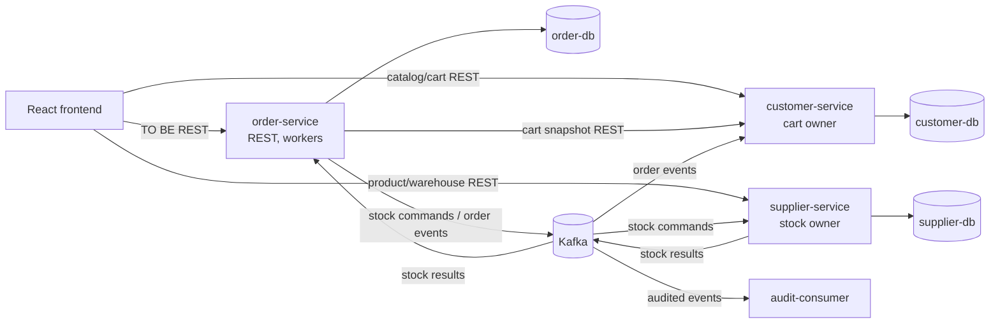
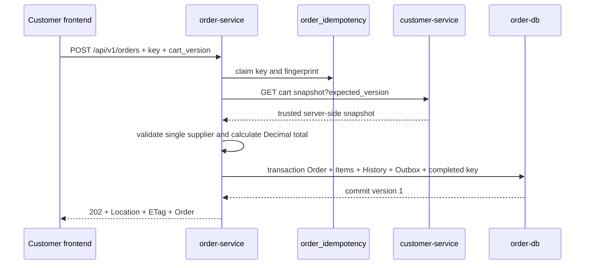
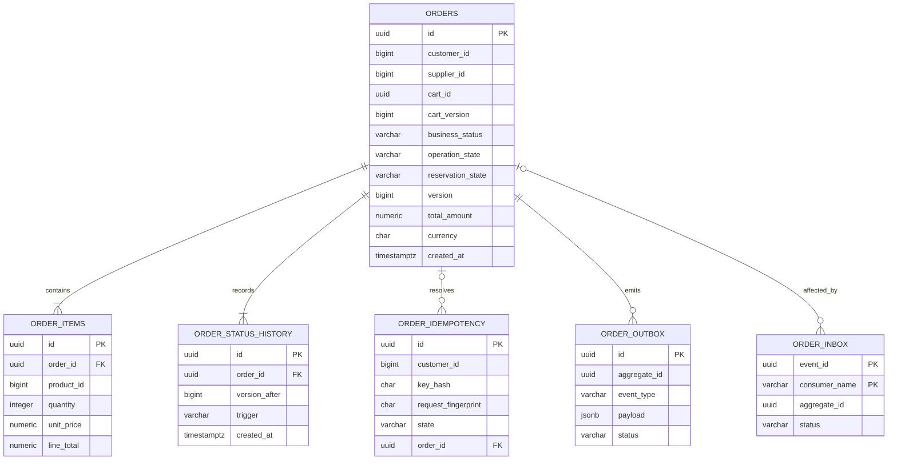
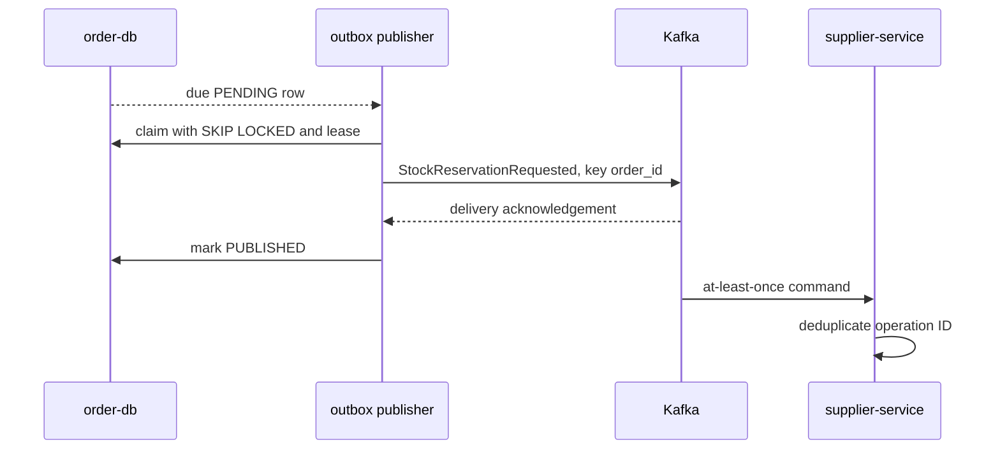
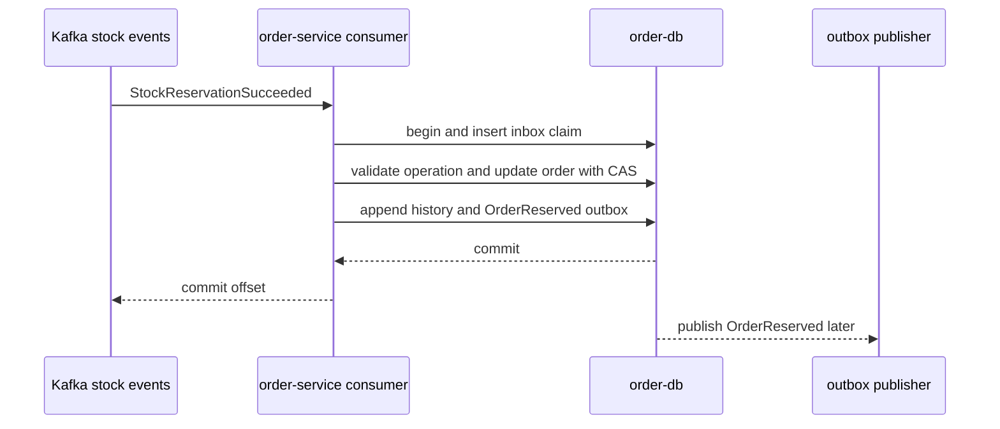
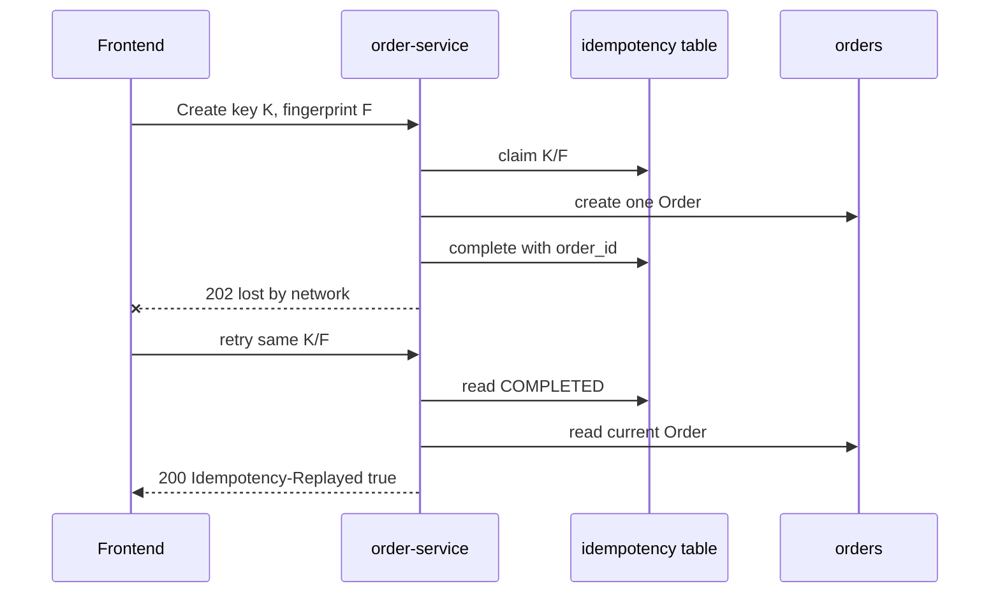

# Marketplace-QA 2.0: контракты order-service

## 0. Статус документа и граница AS IS / TO BE

Документ фиксирует **TO BE**-контракт первой версии `order-service`. Все REST-маршруты `/api/v1/...`, внутренний cart snapshot API, таблицы `order-db`, Kafka topics и события ниже являются проектными решениями и ещё не существуют, если явно не сказано обратное.

Подтверждённые **AS IS**-факты используются только как исходные ограничения:

- заказ сейчас создаётся в `customer-service` через `POST /orders`, хранится в таблицах `orders` и `order_items` `customer-db`, а сумма хранится как `DOUBLE PRECISION`;
- текущее событие `ORDER_CREATED` не содержит `order_id`, публикуется по одной позиции в `order-events`, а producer не подтверждает доставку;
- `supplier-service` уменьшает остаток непосредственно при чтении `order-events`, допускает частичный эффект при ошибке в середине обработки и не возвращает результат резервирования;
- текущий consumer имеет локальный retry и журналирует исчерпание как dead letter, но отдельного DLQ topic нет;
- текущий REST error body имеет форму `{"error":{"code":"...","message":"..."}}`;
- сервисы создают/адаптируют схему на старте через `create_all` и runtime `ALTER TABLE`; каталога миграций нет;
- текущие `customer-db` и `supplier-db` изолированы, Kafka работает в режиме at-least-once, а Compose содержит PostgreSQL 16, Kafka 4.2.0 и Kafka UI.

Этот документ не изменяет AS IS-контракты. Совместный запуск старого и нового flow требует отдельного переходного плана; реализация не должна направлять сообщения нового контракта в старый `order-events`.

## 1. Назначение документа

Цель — устранить критические варианты выбора перед реализацией `order-service`: зафиксировать REST, модель данных, Kafka, ошибки, ownership, конкурентность, идемпотентность, health/readiness и seed-контракт. Документ является реализационным контрактом, но не кодом, OpenAPI-файлом или миграцией.

## 2. Scope контрактов

В scope входят создание и чтение single-supplier заказа, асинхронное all-or-nothing резервирование, подтверждение/отклонение поставщиком, отмена до `CONFIRMED`, release, retry/DLQ, reconciliation, аудит переходов и тестовый user context.

В scope не входят payment, delivery, возвраты после получения, JWT, регистрация, промокоды, отзывы, partial fulfillment, multi-supplier order, production-grade IAM и exactly-once. Цена в заказе — исторический snapshot, но не основание изменения stock.

## 3. Связь с документами 01–05

| Документ | Что наследуется | Что уточняет 06 |
|---|---|---|
| [01 — vision](01-vision-and-architecture-principles.md) | границы сервисов, database-per-service, REST/Kafka, observability | физические контракты |
| [02 — MVP scope](02-mvp-scope-roles-and-user-scenarios.md) | single-supplier cart/order, роли, no partial | точные проверки и доступ |
| [03 — frontend requirements](03-frontend-functional-requirements.md) | Customer/Supplier flows, UI states, safe retry | response, errors, actions |
| [04 — order architecture](04-order-service-architecture.md) | source of truth, snapshot, outbox/inbox, retry | endpoints, tables, topics |
| [05 — state machine](05-order-state-machine.md) | три слоя state, переходы, race/reconciliation | persisted enums и event payload |

При расхождении этот документ приоритетен только для формата контрактов. Семантика переходов остаётся за документом 05.

## 4. Общие соглашения

### 4.1. Форматы

| Объект | Правило TO BE |
|---|---|
| Transport | JSON, `Content-Type: application/json; charset=utf-8`, UTF-8 |
| Naming | `snake_case` для JSON и SQL; Kafka `event_type` — PascalCase |
| Время | UTC, RFC 3339/ISO 8601 с миллисекундами и `Z`, например `2026-07-28T12:34:56.789Z` |
| Идентификаторы | UUID v4 в lower-case canonical form для order, event, correlation, cart, operation, outbox/inbox и idempotency record; существующие customer/supplier/product IDs — положительный `BIGINT` |
| Деньги | PostgreSQL `NUMERIC(19,2)`; JSON decimal string с двумя знаками; арифметика Decimal, round `HALF_UP`; `float` запрещён |
| Валюта | ISO 4217 uppercase; MVP принимает только `RUB` |
| Version | положительный `BIGINT`, начальное значение `1`, увеличение на каждом observable изменении заказа |
| Dates | `created_at` immutable, `updated_at` меняется вместе с `version` |
| Nullability | поле required присутствует всегда; nullable присутствует со значением или `null`; отсутствие допустимо только для явно optional request-поля |

### 4.2. Enum состояния заказа

| Поле | Значения |
|---|---|
| `business_status` | `PENDING_RESERVATION`, `RESERVED`, `CONFIRMED`, `REJECTED`, `CANCELLED` |
| `operation_state` | `NONE`, `CANCELLATION_PENDING`, `REJECTION_PENDING`, `FAILED` |
| `reservation_state` | `REQUESTED`, `RESERVED`, `NOT_RESERVED`, `RELEASE_REQUESTED`, `RELEASED`, `UNKNOWN` |
| `status` в public response | вычисленный lifecycle: пять business values плюс `CANCELLATION_PENDING`, `REJECTION_PENDING`, `FAILED` |
| `target_terminal_status` | `CANCELLED`, `REJECTED` или `null` |

`status` не хранится отдельно: он детерминированно вычисляется из трёх persisted state fields по документу 05.
Физическое имя `target_terminal_status` окончательно выбрано для API/БД этого контракта и соответствует тому же понятию, которое в документе 05 называлось `pending_terminal_status`.

### 4.3. Required, optional и совместимость

В таблицах payload required — все перечисленные поля, если у поля нет пометки nullable/optional. Unknown JSON fields должны игнорироваться tolerant reader, но сохранять их не требуется. В `/api/v1` допустимы только additive optional fields и новые error codes. Удаление/переименование required field, изменение типа, значения денег, state semantics или обязательности требует `/api/v2`. Kafka additive optional field сохраняет `event_version=1`; breaking payload change требует нового `event_version` и параллельной поддержки. Неизвестное критичное значение enum в команде/результате не угадывается: сообщение уходит в DLQ как incompatible. Неизвестный public lifecycle frontend показывает нейтрально и предлагает refresh.

## 5. Сводная TO BE архитектура взаимодействий

### 5.1. Матрица

| Инициатор | Получатель | Протокол | Операция | Режим | Источник истины | Retry | Idempotency |
|---|---|---|---|---|---|---|---|
| Frontend Customer | order-service | REST | create/list/detail/cancel | sync | order-service по заказу | read безопасно; create тем же key | HTTP key + cart uniqueness |
| Frontend Supplier | order-service | REST | list/detail/confirm/reject | sync | order-service по заказу | read безопасно; action по version | state + optimistic lock |
| order-service | customer-service | REST internal | cart snapshot | sync | customer-service по cart/projection | 3 попытки: 0/200/500 ms | GET + expected cart version |
| order-service | Kafka | outbox | order facts, stock commands | async | order-db до публикации | outbox policy | outbox ID/event ID |
| Kafka | supplier-service | consumer | reserve/release | async | supplier-service по stock/reservation | consumer policy | operation ID + inbox |
| supplier-service | Kafka | producer/outbox | stock result | async | supplier-service по reservation | producer policy | result event + operation ID |
| Kafka | order-service | inbox consumer | stock result | async | order-service по lifecycle | consumer policy | `(event_id, consumer_name)` |
| Kafka | customer-service/audit/supplier | consumer | order facts | async | order-service по order | consumer policy | consumer inbox |

### 5.2. Компонентные границы



Для локального Compose резервируются `order-postgres:5432/order_db`, host port `5434`, `order-service:8000`, host port `8002`. Обязательные env: `DATABASE_URL`, `KAFKA_BOOTSTRAP_SERVERS`, `CUSTOMER_SERVICE_URL`; topic names задаются env и по умолчанию равны разделу 18.

## 6. REST API order-service

### 6.1. Общие REST-правила

Все business endpoints требуют `X-Test-Role`, `X-Test-Subject-ID` и принимают optional `X-Correlation-ID`. `POST /api/v1/orders` дополнительно требует `Idempotency-Key`; action endpoints — `If-Match`. Ответ всегда содержит `X-Correlation-ID`; order detail/action/create также `ETag: "<version>"`.

### 6.2. Таблица endpoints

| Method и path | Actor и назначение | Params | Success | Idempotency/concurrency | Side effects |
|---|---|---|---|---|---|
| `POST /api/v1/orders` | Customer, checkout | body `customer_id`, `cart_version`, optional `client_request_id` | `202` first, `200` replay | key/fingerprint; cart version unique | order/items/history/idempotency/outbox |
| `GET /api/v1/customers/{customer_id}/orders` | Customer, свой список | page/filter params | `200` | safe read | нет |
| `GET /api/v1/customers/{customer_id}/orders/{order_id}` | Customer, свой detail | positive customer ID, UUID order | `200` | safe read | нет |
| `POST /api/v1/customers/{customer_id}/orders/{order_id}/cancel` | Customer, cancel до confirmed | `If-Match`, reason body | `202` pending release или `200` idempotent terminal/current | optimistic lock | history + release/order outbox |
| `GET /api/v1/suppliers/{supplier_id}/orders` | Supplier, свой список | page/filter params | `200` | safe read | нет |
| `GET /api/v1/suppliers/{supplier_id}/orders/{order_id}` | Supplier, свой detail | positive supplier ID, UUID order | `200` | safe read | нет |
| `POST /api/v1/suppliers/{supplier_id}/orders/{order_id}/confirm` | Supplier, confirm reserved | `If-Match`, `{}` | `200` | optimistic lock | state/history/OrderConfirmed outbox |
| `POST /api/v1/suppliers/{supplier_id}/orders/{order_id}/reject` | Supplier, reject reserved | `If-Match`, reason | `202` pending release | optimistic lock | state/history/release outbox |
| `GET /health` | probe, процесс жив | нет | `200` | safe read | нет |
| `GET /ready` | probe, зависимости готовы | нет | `200`/`503` | safe read | dependency checks |

### 6.3. Валидация, ownership, errors, events и DB changes по endpoint

| Endpoint | Business/ownership validation | Возможные ошибки | Kafka / DB |
|---|---|---|---|
| Create | subject=`customer_id`; snapshot version exact; non-empty; distinct items; quantity >0; one supplier; supported money/product state | 400 ID/key/body; 403 role/subject; 404 customer; 409 empty/stale/multi/key; 503/504 dependency; 500 | `OrderCreated`, `StockReservationRequested`; insert six relevant records atomically as описано в 7/14/16 |
| Customer list/detail | role Customer; subject=path; найденный order.customer_id=path | 400 IDs/filter; 403 context; 404 absent/foreign | read-only |
| Cancel | owner; lifecycle `PENDING_RESERVATION`/`RESERVED`; matching ETag; reason valid | 400; 403; 404; 409 status/version/confirmed | update state/history; `OrderCancellationRequested`, `StockReleaseRequested` |
| Supplier list/detail | role Supplier; subject=path; найденный order.supplier_id=path | 400; 403; 404 absent/foreign | read-only |
| Confirm | owner; exactly `RESERVED`, operation `NONE`, ETag matches | 400; 403; 404; 409 status/version/already cancelled | update/history; `OrderConfirmed` |
| Reject | owner; exactly `RESERVED`, operation `NONE`, valid reason, ETag | 400; 403; 404; 409 status/version/already confirmed | update/history; `StockReleaseRequested`; `OrderRejected` только после release |
| Health | без user context | 500 только при неотработанном handler failure | read-only |
| Ready | без user context; DB/schema/Kafka проверяются | 503 | read-only |

Foreign order возвращает `404 order_not_found`, а не `403`, чтобы не раскрывать существование. Неверная роль/несовпадающий test context до поиска заказа возвращает `403 order_access_forbidden`.

### 6.4. Полные request/response examples

Create request:

```json
{
  "customer_id": 101,
  "cart_version": 7,
  "client_request_id": "8a465c8d-95a8-4d98-880d-5419569d1fc8"
}
```

Create headers: `X-Test-Role: CUSTOMER`, `X-Test-Subject-ID: 101`, `Idempotency-Key: checkout-101-v7-a`, `X-Correlation-ID: 35c45f79-0ccd-4844-ad71-534a0fbf73fa`. Success headers: `Location: /api/v1/customers/101/orders/73f24f14-a729-41aa-b67b-bf667ce52062`, `ETag: "1"`, `Idempotency-Replayed: false`, `X-Correlation-ID: ...`.

Public Customer order response (`202`/detail/action; nullable fields are explicit):

```json
{
  "order_id": "73f24f14-a729-41aa-b67b-bf667ce52062",
  "customer_id": 101,
  "supplier_id": 201,
  "status": "PENDING_RESERVATION",
  "business_status": "PENDING_RESERVATION",
  "operation_state": "NONE",
  "reservation_state": "REQUESTED",
  "version": 1,
  "items": [
    {
      "product_id": 1001,
      "product_name": "QA Keyboard",
      "quantity": 2,
      "unit_price": "1500.50",
      "line_total": "3001.00",
      "currency": "RUB"
    }
  ],
  "total_amount": "3001.00",
  "currency": "RUB",
  "rejection_reason": null,
  "cancellation_reason": null,
  "created_at": "2026-07-28T12:34:56.789Z",
  "updated_at": "2026-07-28T12:34:56.789Z",
  "correlation_id": "35c45f79-0ccd-4844-ad71-534a0fbf73fa",
  "available_actions": {
    "can_cancel": true,
    "can_confirm": false,
    "can_reject": false,
    "can_retry": false,
    "can_refresh": true
  }
}
```

Customer list request body отсутствует. Пример: `GET /api/v1/customers/101/orders?page=1&limit=20&status=RESERVED&created_from=2026-07-01T00:00:00.000Z`.

```json
{
  "items": [
    {
      "order_id": "73f24f14-a729-41aa-b67b-bf667ce52062",
      "supplier_id": 201,
      "status": "RESERVED",
      "version": 2,
      "items_count": 1,
      "total_amount": "3001.00",
      "currency": "RUB",
      "created_at": "2026-07-28T12:34:56.789Z",
      "updated_at": "2026-07-28T12:35:00.100Z"
    }
  ],
  "page": 1,
  "limit": 20,
  "count": 1,
  "total": 1
}
```

Customer detail request body отсутствует; response совпадает с public Customer order выше.

Cancel request with `If-Match: "2"`:

```json
{
  "reason_code": "CUSTOMER_REQUEST",
  "reason_text": null
}
```

Cancel `202` response:

```json
{
  "order_id": "73f24f14-a729-41aa-b67b-bf667ce52062",
  "customer_id": 101,
  "supplier_id": 201,
  "status": "CANCELLATION_PENDING",
  "business_status": "RESERVED",
  "operation_state": "CANCELLATION_PENDING",
  "reservation_state": "RELEASE_REQUESTED",
  "version": 3,
  "items": [
    {
      "product_id": 1001,
      "product_name": "QA Keyboard",
      "quantity": 2,
      "unit_price": "1500.50",
      "line_total": "3001.00",
      "currency": "RUB"
    }
  ],
  "total_amount": "3001.00",
  "currency": "RUB",
  "rejection_reason": null,
  "cancellation_reason": {
    "code": "CUSTOMER_REQUEST",
    "text": null
  },
  "created_at": "2026-07-28T12:34:56.789Z",
  "updated_at": "2026-07-28T12:36:00.000Z",
  "correlation_id": "35c45f79-0ccd-4844-ad71-534a0fbf73fa",
  "available_actions": {
    "can_cancel": false,
    "can_confirm": false,
    "can_reject": false,
    "can_retry": false,
    "can_refresh": true
  }
}
```

Supplier list request body отсутствует; response имеет ту же pagination envelope, но item включает `customer_id` и `supplier_id`, а запрос: `GET /api/v1/suppliers/201/orders?page=1&limit=20&status=RESERVED`.

```json
{
  "items": [
    {
      "order_id": "73f24f14-a729-41aa-b67b-bf667ce52062",
      "customer_id": 101,
      "supplier_id": 201,
      "status": "RESERVED",
      "version": 2,
      "items_count": 1,
      "total_amount": "3001.00",
      "currency": "RUB",
      "created_at": "2026-07-28T12:34:56.789Z",
      "updated_at": "2026-07-28T12:35:00.100Z"
    }
  ],
  "page": 1,
  "limit": 20,
  "count": 1,
  "total": 1
}
```

Supplier detail response использует core order representation и Supplier actions:

```json
{
  "order_id": "73f24f14-a729-41aa-b67b-bf667ce52062",
  "customer_id": 101,
  "supplier_id": 201,
  "status": "RESERVED",
  "business_status": "RESERVED",
  "operation_state": "NONE",
  "reservation_state": "RESERVED",
  "version": 2,
  "items": [
    {
      "product_id": 1001,
      "product_name": "QA Keyboard",
      "quantity": 2,
      "unit_price": "1500.50",
      "line_total": "3001.00",
      "currency": "RUB"
    }
  ],
  "total_amount": "3001.00",
  "currency": "RUB",
  "rejection_reason": null,
  "cancellation_reason": null,
  "created_at": "2026-07-28T12:34:56.789Z",
  "updated_at": "2026-07-28T12:35:00.100Z",
  "correlation_id": "35c45f79-0ccd-4844-ad71-534a0fbf73fa",
  "available_actions": {
    "can_cancel": false,
    "can_confirm": true,
    "can_reject": true,
    "can_retry": false,
    "can_refresh": true
  }
}
```

Confirm request with `If-Match: "2"`:

```json
{}
```

Confirm `200` response:

```json
{
  "order_id": "73f24f14-a729-41aa-b67b-bf667ce52062",
  "customer_id": 101,
  "supplier_id": 201,
  "status": "CONFIRMED",
  "business_status": "CONFIRMED",
  "operation_state": "NONE",
  "reservation_state": "RESERVED",
  "version": 3,
  "items": [
    {
      "product_id": 1001,
      "product_name": "QA Keyboard",
      "quantity": 2,
      "unit_price": "1500.50",
      "line_total": "3001.00",
      "currency": "RUB"
    }
  ],
  "total_amount": "3001.00",
  "currency": "RUB",
  "rejection_reason": null,
  "cancellation_reason": null,
  "created_at": "2026-07-28T12:34:56.789Z",
  "updated_at": "2026-07-28T12:37:00.000Z",
  "correlation_id": "35c45f79-0ccd-4844-ad71-534a0fbf73fa",
  "available_actions": {
    "can_cancel": false,
    "can_confirm": false,
    "can_reject": false,
    "can_retry": false,
    "can_refresh": true
  }
}
```

Reject request with `If-Match: "2"`:

```json
{
  "reason_code": "SUPPLIER_REJECTED",
  "reason_text": "Упаковка повреждена"
}
```

Reject `202` response:

```json
{
  "order_id": "73f24f14-a729-41aa-b67b-bf667ce52062",
  "customer_id": 101,
  "supplier_id": 201,
  "status": "REJECTION_PENDING",
  "business_status": "RESERVED",
  "operation_state": "REJECTION_PENDING",
  "reservation_state": "RELEASE_REQUESTED",
  "version": 3,
  "items": [
    {
      "product_id": 1001,
      "product_name": "QA Keyboard",
      "quantity": 2,
      "unit_price": "1500.50",
      "line_total": "3001.00",
      "currency": "RUB"
    }
  ],
  "total_amount": "3001.00",
  "currency": "RUB",
  "rejection_reason": {
    "code": "SUPPLIER_REJECTED",
    "text": "Упаковка повреждена"
  },
  "cancellation_reason": null,
  "created_at": "2026-07-28T12:34:56.789Z",
  "updated_at": "2026-07-28T12:37:00.000Z",
  "correlation_id": "35c45f79-0ccd-4844-ad71-534a0fbf73fa",
  "available_actions": {
    "can_cancel": false,
    "can_confirm": false,
    "can_reject": false,
    "can_retry": false,
    "can_refresh": true
  }
}
```

Health request body отсутствует:

```json
{
  "status": "UP",
  "service": "order-service",
  "timestamp": "2026-07-28T12:34:56.789Z"
}
```

Ready `200`:

```json
{
  "status": "READY",
  "service": "order-service",
  "dependencies": {
    "database": "UP",
    "migrations": "UP_TO_DATE",
    "kafka": "UP"
  },
  "timestamp": "2026-07-28T12:34:56.789Z"
}
```

Ready `503`:

```json
{
  "status": "NOT_READY",
  "service": "order-service",
  "dependencies": {
    "database": "UP",
    "migrations": "UP_TO_DATE",
    "kafka": "DOWN"
  },
  "timestamp": "2026-07-28T12:34:56.789Z"
}
```

## 7. CreateOrder contract

Точный request указан в 6.4. `customer_id` в body выбран потому, что заданный endpoint не имеет customer path; он обязан совпасть с test subject. `client_request_id` optional UUID используется только для клиентской диагностики и не заменяет `Idempotency-Key`.

Алгоритм контракта:

1. Нормализовать headers/body, проверить context и заявить idempotency key.
2. По key hash и canonical request fingerprint создать/прочитать idempotency record.
3. Проверить существующий Order того же `(customer_id, cart_version)`; если он уже есть, связать key с ним и вернуть current Order без нового snapshot/outbox.
4. Запросить server-side snapshot с `expected_version=cart_version`.
5. Проверить non-empty, exact version, один `supplier_id`, уникальные products, quantity, money/currency и распознаваемость status metadata.
6. В одной транзакции сохранить immutable order/items, initial history, completed idempotency result и outbox `OrderCreated` + `StockReservationRequested`.
7. Вернуть `202 Accepted` до результата reservation.

Сумма строки равна `unit_price * quantity` с `HALF_UP`, total — точная сумма строк. Предварительное projected stock не считается гарантией. Два checkout одной `(customer_id, cart_version)` не создают два заказа; stable `cart_id` сохраняется для аудита. При concurrent unique collision проигравшая transaction перечитывает собственный Customer Order, завершает свой idempotency record ссылкой на него и возвращает `200` с `Idempotency-Replayed:true`.



## 8. Cart snapshot contract order-service ↔ customer-service

Предполагаемый TO BE endpoint: `GET /internal/v1/customers/{customer_id}/cart/snapshot?expected_version={positive_integer}`. Он принадлежит `customer-service`, не публикуется frontend и требует `X-Internal-Service: order-service` и `X-Correlation-ID`.

Response `200`:

```json
{
  "customer_id": 101,
  "cart_id": "d20de6c8-833f-4136-94e2-c748f9851586",
  "cart_version": 7,
  "supplier_id": 201,
  "items": [
    {
      "product_id": 1001,
      "product_name": "QA Keyboard",
      "supplier_id": 201,
      "quantity": 2,
      "unit_price": "1500.50",
      "currency": "RUB",
      "product_status": "ACTIVE",
      "projected_available_quantity": 5,
      "projection_updated_at": "2026-07-28T12:34:40.000Z"
    }
  ],
  "generated_at": "2026-07-28T12:34:56.700Z"
}
```

Пустая корзина возвращает `200` с `supplier_id:null` и `items:[]`; order-service преобразует это в `409 cart_empty`. Несовпадающая версия возвращает общий error envelope с `409 cart_version_conflict` и current version в details. Отсутствующий Customer маппится в `404 customer_not_found`; malformed ID — в `400 invalid_customer_id`. Нарушение внутренней response schema маппится в `503 dependency_unavailable`, Order не создаётся.

Доверенными для snapshot считаются identity/name/price/currency/supplier и cart version, полученные от owner service. `order-service` всё равно проверяет структуру, единый supplier, количество, Decimal, известность `product_status` и точность total. `product_status`, `projected_available_quantity` и `projection_updated_at` — snapshot/projection metadata, но окончательное решение о возможности резервирования принимает авторитетный `supplier-service`; поэтому concurrent archive/inactivation завершается асинхронным controlled business failure без частичного эффекта.

На одну попытку даётся 1 секунда; максимум 3 попытки с паузами 200 и 500 ms только для timeout, connection error и 5xx. После исчерпания timeout маппится в `504 operation_timeout`, иная недоступность — в `503 dependency_unavailable`; Order/outbox не создаются. Повторный checkout той же cart version блокируется unique constraint, даже с другим key. После `OrderCreated` customer-service может условно очистить только ту cart version; изменение корзины после snapshot не должно быть потеряно.

Для поддержки контракта TO BE customer projection обязана хранить `supplier_id`, а cart — stable `cart_id` и монотонный `cart_version`, увеличиваемый при каждой мутации.

## 9. Order response model

Public core приведён в 6.4. Customer и Supplier получают одинаковые исторические items и state, но actor-specific `available_actions`. `correlation_id` в body — correlation создания; header — текущего REST-запроса.

Причины имеют форму:

```json
{
  "code": "INSUFFICIENT_STOCK",
  "text": "Недостаточный остаток"
}
```

В public response не входят `reservation_request_id`, `reservation_id`, `release_request_id`, deadlines, failure stack, retry counters, inbox/outbox и idempotency hashes. Internal diagnostics доступны через order DB и structured logs. Audit fields хранятся в history: actor, trigger, event/correlation, before/after state, version и reason.

## 10. Pagination и filtering

Выбран `page/limit`: `page=1`, `limit=20`, maximum `100`. Response всегда содержит `page`, `limit`, `count` текущей страницы и `total` после фильтра. Стабильная сортировка — `created_at DESC, id DESC`.

Оба list endpoint принимают повторяемый `status` только из пяти `business_status` values, `created_from` inclusive и `created_to` exclusive в UTC; `created_from < created_to`. Отсутствие status означает все, включая заказы с техническим operation state; их response `status` всё равно показывает вычисленный lifecycle. Неизвестные filters — `400 invalid_request`; duplicate одинакового status нормализуется. Это сохраняет пятизначные business-фильтры документов 02, 03 и 05.

## 11. Data model order-db

### 11.1. Таблица таблиц

| Table | Назначение | Mutable | Retention |
|---|---|---|---|
| `orders` | aggregate и state/projection reservation | state, reasons, deadlines, version | срок стенда; не удалять автоматически |
| `order_items` | immutable checkout snapshot | нет | вместе с order |
| `order_status_history` | append-only audit переходов | нет | вместе с order |
| `order_idempotency` | HTTP key/fingerprint/result/lease | state/result/lease | 24 h после terminal record |
| `order_outbox` | надёжная Kafka publication | delivery metadata | published 7 days; failed 30 days/manual |
| `order_inbox` | Kafka dedup/processing result | processing metadata | processed 14 days; failed manual/30 days |

`reservation_projection` не создаётся: matching operation IDs, reservation state/ID и deadlines находятся в `orders`, чтобы state transition был атомарным. `reconciliation_jobs` не создаётся: worker выбирает orders по индексированным state/deadline полям и outbox по `next_attempt_at`.

### 11.2. ER diagram



### 11.3. Схемы служебных таблиц

`order_status_history` является append-only:

| Field | Type | Правило |
|---|---|---|
| `id` | `UUID` | PK |
| `order_id` | `UUID` | FK `orders(id) ON DELETE RESTRICT` |
| `business_status_before/after` | `VARCHAR(32)` | before nullable только для create |
| `operation_state_before/after` | `VARCHAR(32)` | before nullable только для create |
| `reservation_state_before/after` | `VARCHAR(32)` | before nullable только для create |
| `trigger` | `VARCHAR(64)` | command/event/timeout name |
| `actor_type` | `VARCHAR(32)` | `CUSTOMER`, `SUPPLIER`, `SYSTEM`, `KAFKA_CONSUMER` |
| `actor_id` | `BIGINT` | nullable для system/consumer |
| `event_id` | `UUID` | nullable для REST/root scheduler |
| `correlation_id` | `UUID` | required |
| `version_before` | `BIGINT` | `0` для create, иначе positive |
| `version_after` | `BIGINT` | positive; unique with order |
| `reason_code/reason_text` | `VARCHAR(64/500)` | nullable |
| `created_at` | `TIMESTAMPTZ` | immutable |

Полные field contracts `order_idempotency`, `order_outbox` и `order_inbox` находятся соответственно в разделах 14, 16 и 17; их keys, indexes и retention дополнительно сведены в 37.1.

## 12. Таблица orders

| Field | PostgreSQL | Null/default | Назначение/constraint |
|---|---|---|---|
| `id` | `UUID` | not null | PK, UUID v4 |
| `customer_id` | `BIGINT` | not null | `>0`, external reference without cross-DB FK |
| `supplier_id` | `BIGINT` | not null | `>0`, один supplier per order |
| `cart_id` | `UUID` | not null | stable cart identity |
| `cart_version` | `BIGINT` | not null | `>0` |
| `business_status` | `VARCHAR(32)` | not null | enum 4.2 |
| `operation_state` | `VARCHAR(32)` | not null, `NONE` | enum 4.2 |
| `reservation_state` | `VARCHAR(32)` | not null | enum 4.2 |
| `target_terminal_status` | `VARCHAR(16)` | nullable | only CANCELLED/REJECTED |
| `rejection_reason_code/text` | `VARCHAR(64/500)` | nullable | paired with reject states |
| `cancellation_reason_code/text` | `VARCHAR(64/500)` | nullable | paired with cancel intent |
| `total_amount` | `NUMERIC(19,2)` | not null | `>0` |
| `currency` | `CHAR(3)` | not null, `RUB` | uppercase; MVP RUB |
| `version` | `BIGINT` | not null, `1` | `>0` |
| `correlation_id` | `UUID` | not null | creation correlation |
| `client_request_id` | `UUID` | nullable | client diagnostics only |
| `reservation_request_id` | `UUID` | not null | logical reserve idempotency ID |
| `reservation_id` | `UUID` | nullable | supplier-issued reservation |
| `release_request_id` | `UUID` | nullable | stable logical release ID |
| `reservation_requested_at` | `TIMESTAMPTZ` | nullable initially | first durable publish-attempt timestamp |
| `reservation_deadline_at` | `TIMESTAMPTZ` | nullable initially | requested + 30 s |
| `reservation_attempt_count` | `INTEGER` | not null, `0` | logical send count, `>=0` |
| `reservation_last_attempt_at` | `TIMESTAMPTZ` | nullable | retry diagnostics |
| `release_requested_at` | `TIMESTAMPTZ` | nullable | first durable release publish attempt |
| `release_deadline_at` | `TIMESTAMPTZ` | nullable | requested + 30 s; required after release activation |
| `release_attempt_count` | `INTEGER` | not null, `0` | logical send count, `>=0` |
| `release_last_attempt_at` | `TIMESTAMPTZ` | nullable | retry diagnostics |
| `failure_phase` | `VARCHAR(32)` | nullable | `RESERVATION`/`RELEASE` |
| `failure_reason_code` | `VARCHAR(64)` | nullable | technical diagnosis |
| `failure_reason_text` | `VARCHAR(500)` | nullable | stack-safe diagnosis |
| `created_at` | `TIMESTAMPTZ` | not null | immutable |
| `updated_at` | `TIMESTAMPTZ` | not null | changes with version |

Checks enforce allowed enum values and at least:

- `operation_state=NONE` implies `target_terminal_status IS NULL`;
- cancellation/rejection pending requires matching target, `RELEASE_REQUESTED` и `release_request_id`; requested/deadline становятся required после первого durable publish attempt;
- `CONFIRMED` requires operation `NONE` and reservation `RESERVED`;
- terminal `CANCELLED`/release-based `REJECTED` requires operation `NONE` and reservation `RELEASED`; reservation business failure permits `REJECTED+NOT_RESERVED`;
- `FAILED` requires `failure_phase` and reason;
- total/currency/version/IDs are valid.

Deadline contract окончательно разрешает candidate-вопрос документов 04–05: на первом publisher claim перед сетевой отправкой worker один раз и атомарно фиксирует `*_requested_at=now`, `*_deadline_at=now+30s`, attempt metadata и тот же deadline в outbox payload. До claim PENDING row хранит event template, который не является отправляемым Kafka message; publisher дополняет required deadline до первой отправки. Повтор публикации не меняет payload или эти значения. Это считается первым **durable publish attempt**; timeout отсчитывается от него даже при потерянном acknowledgement, что исключает бесконечную неопределённость. Эти operational timestamps не меняют public representation и сами по себе не увеличивают aggregate `version`; lifecycle transition по timeout увеличивает.

## 13. Таблица order_items

| Field | PostgreSQL | Constraints |
|---|---|---|
| `id` | `UUID` | PK |
| `order_id` | `UUID` | FK `orders(id) ON DELETE RESTRICT`, not null |
| `product_id` | `BIGINT` | `>0`, not null |
| `product_name_snapshot` | `VARCHAR(255)` | non-blank, not null |
| `quantity` | `INTEGER` | `>0`, not null |
| `unit_price` | `NUMERIC(19,2)` | `>=0`, not null |
| `line_total` | `NUMERIC(19,2)` | `>=0`, not null |
| `currency` | `CHAR(3)` | `RUB`, not null |
| `supplier_id_snapshot` | `BIGINT` | `>0`, equals aggregate supplier by service invariant |

Unique `(order_id, product_id)` запрещает duplicate lines. После insert строки immutable; изменения каталога, цены или товара не изменяют snapshot. DB check не может сравнить supplier с parent без trigger, поэтому равенство проверяется transaction/service test и audit query.

## 14. Idempotency data model

`order_idempotency`:

| Field | Type | Правило |
|---|---|---|
| `id` | UUID PK | record ID |
| `customer_id` | BIGINT | positive |
| `operation_type` | VARCHAR(32) | `CREATE_ORDER` |
| `key_hash` | CHAR(64) | SHA-256 raw key; raw key не хранится |
| `request_fingerprint` | CHAR(64) | SHA-256 canonical JSON body |
| `state` | VARCHAR(24) | `IN_PROGRESS`, `COMPLETED`, `FAILED_RETRYABLE` |
| `owner_token` | UUID nullable | lease owner |
| `lease_expires_at` | TIMESTAMPTZ nullable | 60 s claim lease |
| `order_id` | UUID nullable FK | result reference |
| `response_status` | SMALLINT nullable | first committed result status: `202`, linked `200` or last retryable `503/504` |
| `last_error_code` | VARCHAR(64) nullable | dependency diagnosis |
| `created_at/updated_at` | TIMESTAMPTZ | audit |
| `expires_at` | TIMESTAMPTZ | completed/failed TTL |

Unique `(customer_id, operation_type, key_hash)`. Key length 1–128 printable ASCII characters after no trimming; empty/invalid is `400`. Fingerprint includes exact semantic `customer_id`, `cart_version`, normalized optional `client_request_id` and API operation, not correlation/header order.

Claim record commits before external cart call. Final order/outbox creation and transition idempotency record to `COMPLETED` occur atomically. Crashed `IN_PROGRESS` is not deleted: after 60 s a worker/client may take lease using compare-and-set. Dependency failure before order creation changes record to `FAILED_RETRYABLE`; same request may reclaim it. Terminal TTL is 24 hours; cleanup never removes active `IN_PROGRESS` blindly.

## 15. Optimistic locking

Mutating state uses `UPDATE orders SET ..., version=version+1, updated_at=... WHERE id=:id AND version=:expected_version`. `If-Match` is mandatory and имеет точный вид `"7"`; weak ETag, list, wildcard, zero/negative or malformed value — `400 invalid_request`.

Zero affected rows запускает одно повторное чтение:

- если desired idempotent result уже достигнут, вернуть current representation (`200`);
- если order исчез/не принадлежит actor, `404`;
- иначе `409 order_version_conflict` с `current_version`, `current_status` и новым `ETag`.

Автоматический retry допустим только для внутренних inbox/reconciliation операций, если event/operation ID тот же и после reread transition всё ещё однозначно разрешён. REST action не скрывает conflict retry.

## 16. Outbox contract

`order_outbox` fields: `id UUID PK`, `aggregate_type VARCHAR(32)` (`ORDER`), `aggregate_id UUID`, `event_type VARCHAR(64)`, `event_version SMALLINT`, `payload JSONB`, `headers JSONB`, `status VARCHAR(16)` (`PENDING`,`IN_PROGRESS`,`PUBLISHED`,`FAILED`), `attempt_count INTEGER >=0`, `next_attempt_at TIMESTAMPTZ`, `created_at TIMESTAMPTZ`, `published_at TIMESTAMPTZ nullable`, `last_error VARCHAR(1000) nullable`, `locked_at TIMESTAMPTZ nullable`, `locked_by VARCHAR(100) nullable`. Значение `id` одновременно является Kafka `event_id`; отдельный изменяемый event ID запрещён.

Business mutation and outbox insert use one DB transaction. Publisher выбирает до 100 due rows через `FOR UPDATE SKIP LOCKED`, ставит 30 s lease и публикует с delivery acknowledgement. Backoff после неудачи: 1, 2, 4, 8, 16, затем 30 s; максимум 10 attempts. После исчерпания — dead-state `FAILED`, structured alert, ручной replay с тем же `event_id`. `PUBLISHED` очищаются через 7 суток, `FAILED` — только после решения оператора, не ранее 30 суток. Retry сетевой публикации сохраняет тот же `event_id`; отдельная reconciliation reissue создаёт новый event ID, но сохраняет logical `reservation_request_id`/`release_request_id`.



## 17. Inbox contract

`order_inbox`: `event_id UUID`, `consumer_name VARCHAR(100)`, `event_type VARCHAR(64)`, `aggregate_id UUID`, `payload_hash CHAR(64)`, `received_at TIMESTAMPTZ`, `processed_at TIMESTAMPTZ nullable`, `status VARCHAR(16)` (`PROCESSING`,`PROCESSED`,`FAILED`), `attempt_count INTEGER >=1`, `last_error VARCHAR(1000) nullable`, `correlation_id UUID`.

Composite PK/unique `(event_id, consumer_name)`. Inbox claim, order transition, history and new outbox rows commit in one DB transaction; Kafka offset commits only afterward. Повтор `PROCESSED` — no-op. Тот же event ID с другим payload hash — protocol violation и DLQ. Processed records retain 14 days; failed records require resolution and retain at least 30 days.



## 18. Kafka topology

### 18.1. Topics

| Topic | Producer | Consumer | Key | Categories | Retention | Retry/DLQ/order |
|---|---|---|---|---|---|---|
| `marketplace.stock.commands.v1` | order-service | supplier-service, audit-consumer | `order_id` | reserve/release commands | 7 d | consumer 3 attempts; DLQ; order only per key |
| `marketplace.stock.events.v1` | supplier-service | order-service, audit | `order_id` | reservation/release results | 7 d | consumer 3 attempts; DLQ; order only per key |
| `marketplace.order.events.v1` | order-service | customer-service, supplier-service, audit | `order_id` | order lifecycle facts | 7 d | each consumer own retry/DLQ; order only per key |
| `marketplace.order.dlq.v1` | failed consumers/publish tooling | operator/replay tool | original `aggregate_id` | original envelope + failure metadata | 30 d | no automatic replay; preserve original IDs |

Отдельный `order.commands` не нужен: user commands приходят по REST, stock commands выделены отдельно. Для локального MVP partition count `3`, replication factor `1`; это учебный компромисс, не production HA. Ordering гарантируется только в пределах partition одного topic; межtopic ordering не предполагается. End-to-end delivery at-least-once.

Consumer retry: всего 3 обработки с backoff 1 s и 5 s. Business result не retry. Deserialization/schema/unknown enum, исчерпанная technical error и conflicting payload отправляются в DLQ envelope.

DLQ message сохраняет исходное сообщение и metadata без изменения исходного `event_id`:

```json
{
  "dlq_record_id": "143e583e-d2d4-450d-ac8d-4c134609563e",
  "failed_at": "2026-07-28T12:35:10.000Z",
  "consumer_name": "order-service-stock-events-v1",
  "original_topic": "marketplace.stock.events.v1",
  "original_partition": 1,
  "original_offset": 42,
  "original_key": "73f24f14-a729-41aa-b67b-bf667ce52062",
  "original_event_id": "df88de3d-acf4-42ba-bca7-61ad487519b7",
  "original_message": {
    "event_id": "df88de3d-acf4-42ba-bca7-61ad487519b7",
    "event_type": "StockReservationSucceeded",
    "event_version": 1,
    "occurred_at": "2026-07-28T12:35:00.000Z",
    "producer": "supplier-service",
    "aggregate_type": "ORDER",
    "aggregate_id": "73f24f14-a729-41aa-b67b-bf667ce52062",
    "correlation_id": "35c45f79-0ccd-4844-ad71-534a0fbf73fa",
    "causation_id": "21978f4d-2600-4577-b6f6-f77b13fa51bb",
    "payload": {
      "order_id": "73f24f14-a729-41aa-b67b-bf667ce52062"
    }
  },
  "failure": {
    "category": "INCOMPATIBLE_MESSAGE",
    "code": "reserved_items_mismatch",
    "message": "Reservation result does not match request",
    "attempt_count": 3,
    "first_failed_at": "2026-07-28T12:35:01.000Z",
    "last_failed_at": "2026-07-28T12:35:10.000Z"
  },
  "correlation_id": "35c45f79-0ccd-4844-ad71-534a0fbf73fa"
}
```

## 19. Kafka envelope

Все v1 messages:

```json
{
  "event_id": "21978f4d-2600-4577-b6f6-f77b13fa51bb",
  "event_type": "StockReservationRequested",
  "event_version": 1,
  "occurred_at": "2026-07-28T12:34:56.800Z",
  "producer": "order-service",
  "aggregate_type": "ORDER",
  "aggregate_id": "73f24f14-a729-41aa-b67b-bf667ce52062",
  "correlation_id": "35c45f79-0ccd-4844-ad71-534a0fbf73fa",
  "causation_id": null,
  "payload": {
    "order_id": "73f24f14-a729-41aa-b67b-bf667ce52062"
  }
}
```

Все envelope fields required; `causation_id` nullable. Event caused by HTTP has `causation_id:null`; event caused by Kafka uses source `event_id`. Headers дублируют строки `event_id`, `event_type`, `event_version`, `correlation_id`, nullable `causation_id`, `producer`, плюс `content_type=application/json`. Envelope and headers must match, иначе DLQ.

## 20. Kafka event contracts

### 20.1. Реестр

| Event | Topic | Producer → consumer | Resulting transition |
|---|---|---|---|
| `StockReservationRequested` | `marketplace.stock.commands.v1` | order-service → supplier-service, audit-consumer | supplier all-or-nothing reserve |
| `StockReservationSucceeded` | `marketplace.stock.events.v1` | supplier-service → order-service, audit-consumer | pending → reserved; late → compensation |
| `StockReservationFailed` | `marketplace.stock.events.v1` | supplier-service → order-service, audit-consumer | business failure pending → rejected; technical remains pending/retry |
| `StockReleaseRequested` | `marketplace.stock.commands.v1` | order-service → supplier-service, audit-consumer | idempotent release/no-op |
| `StockReleased` | `marketplace.stock.events.v1` | supplier-service → order-service, audit-consumer | pending target/controlled failed → terminal |
| `StockReleaseFailed` | `marketplace.stock.events.v1` | supplier-service → order-service, audit-consumer | retry or failed |
| `OrderCreated` | `marketplace.order.events.v1` | order-service → customer-service, supplier-service, audit-consumer | conditional cart clear/projection |
| `OrderReserved` | `marketplace.order.events.v1` | order-service → customer-service, supplier-service, audit-consumer | projection |
| `OrderConfirmed` | `marketplace.order.events.v1` | order-service → customer-service, supplier-service, audit-consumer | projection/finalization |
| `OrderRejected` | `marketplace.order.events.v1` | order-service → customer-service, supplier-service, audit-consumer | projection |
| `OrderCancellationRequested` | `marketplace.order.events.v1` | order-service → customer-service, supplier-service, audit-consumer | pending projection |
| `OrderCancelled` | `marketplace.order.events.v1` | order-service → customer-service, supplier-service, audit-consumer | terminal projection |
| `OrderProcessingFailed` | `marketplace.order.events.v1` | order-service → customer-service, supplier-service, audit-consumer | diagnostic projection |
| `OrderReservationTimedOut` | `marketplace.order.events.v1` | order-service → customer-service, audit-consumer | timeout diagnostic |
| `OrderReleaseTimedOut` | `marketplace.order.events.v1` | order-service → customer-service, supplier-service, audit-consumer | timeout diagnostic |

Для каждого event: partition key — `order_id`; envelope required; payload ниже required, кроме nullable; deduplication — source inbox по event ID и logical operation ID. Additive optional compatibility — v1; semantic/breaking — new event version. Consumer сверяет `payload.order_id=aggregate_id`.

### 20.2. Инварианты обработки по событию

| Event | Required invariant и deduplication | Consumer result |
|---|---|---|
| `StockReservationRequested` | one supplier, positive unique items; event + reservation request ID | supplier returns one all-or-nothing result |
| `StockReservationSucceeded` | matching request/supplier, exact item set; inbox event ID + request ID | `PENDING_RESERVATION→RESERVED`; late success → release |
| `StockReservationFailed` | matching request; business means no stock effect | business pending → rejected; technical → retry/no business transition |
| `StockReleaseRequested` | matching order/supplier; stable release ID | supplier release/no-op exactly once |
| `StockReleased` | matching release/target; inbox event ID + release ID | pending/controlled failed → saved terminal target |
| `StockReleaseFailed` | matching release; controlled technical code | stay pending/retry or `FAILED` on exhaustion |
| `OrderCreated` | version 1, unique order/cart version | conditional cart clear and projections |
| `OrderReserved` | monotonic order version, matching reservation | projection update only |
| `OrderConfirmed` | monotonic version, `CONFIRMED` | projection update; supplier finalizes reservation marker without new stock decrement |
| `OrderRejected` | monotonic version and reason; supplier reject only after release | terminal projection |
| `OrderCancellationRequested` | target CANCELLED, stable release ID | pending projection |
| `OrderCancelled` | monotonic version, `CANCELLED` | terminal projection |
| `OrderProcessingFailed` | phase/reason and optional matching target | diagnostic projection, no automatic retry button |
| `OrderReservationTimedOut` | matching request/deadline/version | diagnostic projection/audit |
| `OrderReleaseTimedOut` | matching release/target/deadline/version | diagnostic projection/audit |

Каждый receiving service должен иметь собственный consumer identity и inbox-equivalent. Повтор того же event ID — no-op; новое событие с stale aggregate version — no-op/anomaly; unsupported future version — DLQ.

### 20.3. Полные event examples

`StockReservationRequested`:

```json
{
  "event_id": "21978f4d-2600-4577-b6f6-f77b13fa51bb",
  "event_type": "StockReservationRequested",
  "event_version": 1,
  "occurred_at": "2026-07-28T12:34:56.800Z",
  "producer": "order-service",
  "aggregate_type": "ORDER",
  "aggregate_id": "73f24f14-a729-41aa-b67b-bf667ce52062",
  "correlation_id": "35c45f79-0ccd-4844-ad71-534a0fbf73fa",
  "causation_id": null,
  "payload": {
    "order_id": "73f24f14-a729-41aa-b67b-bf667ce52062",
    "customer_id": 101,
    "supplier_id": 201,
    "order_version": 1,
    "reservation_request_id": "bfe551c2-540e-4e57-a417-fd4230681ebf",
    "items": [
      {
        "product_id": 1001,
        "quantity": 2
      }
    ],
    "reservation_deadline_at": "2026-07-28T12:35:26.789Z",
    "correlation_id": "35c45f79-0ccd-4844-ad71-534a0fbf73fa"
  }
}
```

Invariant: все items одного supplier, product unique, quantity positive; supplier либо резервирует все, либо ничего. Цена отсутствует.

`StockReservationSucceeded`:

```json
{
  "event_id": "df88de3d-acf4-42ba-bca7-61ad487519b7",
  "event_type": "StockReservationSucceeded",
  "event_version": 1,
  "occurred_at": "2026-07-28T12:35:00.000Z",
  "producer": "supplier-service",
  "aggregate_type": "ORDER",
  "aggregate_id": "73f24f14-a729-41aa-b67b-bf667ce52062",
  "correlation_id": "35c45f79-0ccd-4844-ad71-534a0fbf73fa",
  "causation_id": "21978f4d-2600-4577-b6f6-f77b13fa51bb",
  "payload": {
    "order_id": "73f24f14-a729-41aa-b67b-bf667ce52062",
    "reservation_request_id": "bfe551c2-540e-4e57-a417-fd4230681ebf",
    "reservation_id": "3ee7646c-2151-45aa-a4e5-c88bf1530c15",
    "supplier_id": 201,
    "reserved_items": [
      {
        "product_id": 1001,
        "quantity": 2
      }
    ],
    "reserved_at": "2026-07-28T12:34:59.900Z"
  }
}
```

Invariant: reserved set exactly equals request; mismatch is DLQ/protocol failure, not partial success.

`StockReservationFailed`:

```json
{
  "event_id": "78631455-d52a-4a5b-a41e-f23aa3eb6c9f",
  "event_type": "StockReservationFailed",
  "event_version": 1,
  "occurred_at": "2026-07-28T12:35:00.000Z",
  "producer": "supplier-service",
  "aggregate_type": "ORDER",
  "aggregate_id": "73f24f14-a729-41aa-b67b-bf667ce52062",
  "correlation_id": "35c45f79-0ccd-4844-ad71-534a0fbf73fa",
  "causation_id": "21978f4d-2600-4577-b6f6-f77b13fa51bb",
  "payload": {
    "order_id": "73f24f14-a729-41aa-b67b-bf667ce52062",
    "reservation_request_id": "bfe551c2-540e-4e57-a417-fd4230681ebf",
    "supplier_id": 201,
    "failure_category": "BUSINESS",
    "reason_code": "INSUFFICIENT_STOCK",
    "failed_items": [
      {
        "product_id": 1001,
        "requested_quantity": 2,
        "available_quantity": 1
      }
    ],
    "occurred_at": "2026-07-28T12:34:59.900Z",
    "retryable": false
  }
}
```

Controlled `reason_code`: `INSUFFICIENT_STOCK`, `PRODUCT_INACTIVE`, `PRODUCT_ARCHIVED`, `PRODUCT_NOT_FOUND`, `TECHNICAL_FAILURE`. Первые четыре требуют `failure_category=BUSINESS`, `retryable=false` и гарантируют no stock effect; `TECHNICAL_FAILURE` требует `TECHNICAL`, обычно `retryable=true`, а `available_quantity` может быть `null`. Technical failure не переводит заказ в `REJECTED`.

`StockReleaseRequested`:

```json
{
  "event_id": "1136280c-8b84-4574-8d2a-f4e0f59741bf",
  "event_type": "StockReleaseRequested",
  "event_version": 1,
  "occurred_at": "2026-07-28T12:36:00.000Z",
  "producer": "order-service",
  "aggregate_type": "ORDER",
  "aggregate_id": "73f24f14-a729-41aa-b67b-bf667ce52062",
  "correlation_id": "c97706a3-a1d7-4a67-8508-ed1e19feb2ee",
  "causation_id": null,
  "payload": {
    "order_id": "73f24f14-a729-41aa-b67b-bf667ce52062",
    "supplier_id": 201,
    "release_request_id": "0b55767f-a29f-4791-98bb-056d6275a7e8",
    "reservation_id": "3ee7646c-2151-45aa-a4e5-c88bf1530c15",
    "reason": "CUSTOMER_CANCELLED",
    "requested_at": "2026-07-28T12:36:00.000Z",
    "correlation_id": "c97706a3-a1d7-4a67-8508-ed1e19feb2ee"
  }
}
```

`reason`: `CUSTOMER_CANCELLED`, `SUPPLIER_REJECTED`, `RESERVATION_TIMEOUT`, `COMPENSATION`. `reservation_id` nullable для cancellation во время pending/unknown. Duplicate `release_request_id` must return the same logical result and never increment stock twice.

`StockReleased`:

```json
{
  "event_id": "922e0836-d6dd-423c-87ea-771389c27dd0",
  "event_type": "StockReleased",
  "event_version": 1,
  "occurred_at": "2026-07-28T12:36:01.000Z",
  "producer": "supplier-service",
  "aggregate_type": "ORDER",
  "aggregate_id": "73f24f14-a729-41aa-b67b-bf667ce52062",
  "correlation_id": "c97706a3-a1d7-4a67-8508-ed1e19feb2ee",
  "causation_id": "1136280c-8b84-4574-8d2a-f4e0f59741bf",
  "payload": {
    "order_id": "73f24f14-a729-41aa-b67b-bf667ce52062",
    "release_request_id": "0b55767f-a29f-4791-98bb-056d6275a7e8",
    "reservation_id": "3ee7646c-2151-45aa-a4e5-c88bf1530c15",
    "supplier_id": 201,
    "result": "RELEASED",
    "released_at": "2026-07-28T12:36:00.900Z"
  }
}
```

`result`: `RELEASED`, `ALREADY_RELEASED`, `NO_RESERVATION`; все являются идемпотентным success для matching release intent. Unknown reservation не означает автоматический success, если supplier не доказал `NO_RESERVATION`.

`StockReleaseFailed`:

```json
{
  "event_id": "78013ee8-10fb-4c9b-ae66-f9d16d756f2f",
  "event_type": "StockReleaseFailed",
  "event_version": 1,
  "occurred_at": "2026-07-28T12:36:01.000Z",
  "producer": "supplier-service",
  "aggregate_type": "ORDER",
  "aggregate_id": "73f24f14-a729-41aa-b67b-bf667ce52062",
  "correlation_id": "c97706a3-a1d7-4a67-8508-ed1e19feb2ee",
  "causation_id": "1136280c-8b84-4574-8d2a-f4e0f59741bf",
  "payload": {
    "order_id": "73f24f14-a729-41aa-b67b-bf667ce52062",
    "release_request_id": "0b55767f-a29f-4791-98bb-056d6275a7e8",
    "reservation_id": "3ee7646c-2151-45aa-a4e5-c88bf1530c15",
    "supplier_id": 201,
    "reason_code": "TEMPORARY_FAILURE",
    "retryable": true,
    "occurred_at": "2026-07-28T12:36:00.900Z"
  }
}
```

Codes: `TEMPORARY_FAILURE`, `UNKNOWN_RESERVATION_STATE`, `INTERNAL_ERROR`. Retryable stays pending until policy exhaustion; non-retryable/exhausted becomes `FAILED`, preserving terminal target.

`OrderCreated`:

```json
{
  "event_id": "96b93ad7-dac6-49ff-a1e8-6a03e6b91e2d",
  "event_type": "OrderCreated",
  "event_version": 1,
  "occurred_at": "2026-07-28T12:34:56.800Z",
  "producer": "order-service",
  "aggregate_type": "ORDER",
  "aggregate_id": "73f24f14-a729-41aa-b67b-bf667ce52062",
  "correlation_id": "35c45f79-0ccd-4844-ad71-534a0fbf73fa",
  "causation_id": null,
  "payload": {
    "order_id": "73f24f14-a729-41aa-b67b-bf667ce52062",
    "customer_id": 101,
    "supplier_id": 201,
    "cart_id": "d20de6c8-833f-4136-94e2-c748f9851586",
    "cart_version": 7,
    "status": "PENDING_RESERVATION",
    "total_amount": "3001.00",
    "currency": "RUB",
    "created_at": "2026-07-28T12:34:56.789Z"
  }
}
```

Customer-service clears only matching unchanged cart version and deduplicates by event ID/order.

`OrderReserved`:

```json
{
  "event_id": "0852e0bf-c62c-40e0-a4d9-f8b5dd805a0f",
  "event_type": "OrderReserved",
  "event_version": 1,
  "occurred_at": "2026-07-28T12:35:00.100Z",
  "producer": "order-service",
  "aggregate_type": "ORDER",
  "aggregate_id": "73f24f14-a729-41aa-b67b-bf667ce52062",
  "correlation_id": "35c45f79-0ccd-4844-ad71-534a0fbf73fa",
  "causation_id": "df88de3d-acf4-42ba-bca7-61ad487519b7",
  "payload": {
    "order_id": "73f24f14-a729-41aa-b67b-bf667ce52062",
    "supplier_id": 201,
    "reservation_id": "3ee7646c-2151-45aa-a4e5-c88bf1530c15",
    "status": "RESERVED",
    "order_version": 2,
    "reserved_at": "2026-07-28T12:35:00.100Z"
  }
}
```

`OrderConfirmed`:

```json
{
  "event_id": "66300865-ccac-4b16-a0f5-d18d9b6a3b39",
  "event_type": "OrderConfirmed",
  "event_version": 1,
  "occurred_at": "2026-07-28T12:37:00.000Z",
  "producer": "order-service",
  "aggregate_type": "ORDER",
  "aggregate_id": "73f24f14-a729-41aa-b67b-bf667ce52062",
  "correlation_id": "c97706a3-a1d7-4a67-8508-ed1e19feb2ee",
  "causation_id": null,
  "payload": {
    "order_id": "73f24f14-a729-41aa-b67b-bf667ce52062",
    "supplier_id": 201,
    "status": "CONFIRMED",
    "order_version": 3,
    "confirmed_at": "2026-07-28T12:37:00.000Z"
  }
}
```

`OrderRejected`:

```json
{
  "event_id": "f39ad0b4-4977-4d67-b5a3-0643174a5b50",
  "event_type": "OrderRejected",
  "event_version": 1,
  "occurred_at": "2026-07-28T12:37:00.000Z",
  "producer": "order-service",
  "aggregate_type": "ORDER",
  "aggregate_id": "73f24f14-a729-41aa-b67b-bf667ce52062",
  "correlation_id": "c97706a3-a1d7-4a67-8508-ed1e19feb2ee",
  "causation_id": "922e0836-d6dd-423c-87ea-771389c27dd0",
  "payload": {
    "order_id": "73f24f14-a729-41aa-b67b-bf667ce52062",
    "supplier_id": 201,
    "status": "REJECTED",
    "order_version": 4,
    "reason_code": "SUPPLIER_REJECTED",
    "reason_text": "Упаковка повреждена",
    "rejected_at": "2026-07-28T12:37:00.000Z"
  }
}
```

For reservation business failure `reason_text` может быть `null`, `causation_id` указывает на failure event, reservation state is `NOT_RESERVED`. For supplier reject событие публикуется только после `StockReleased`.

`OrderCancellationRequested`:

```json
{
  "event_id": "49380e4a-9ff3-40ec-88a6-dfbfa83d437c",
  "event_type": "OrderCancellationRequested",
  "event_version": 1,
  "occurred_at": "2026-07-28T12:36:00.000Z",
  "producer": "order-service",
  "aggregate_type": "ORDER",
  "aggregate_id": "73f24f14-a729-41aa-b67b-bf667ce52062",
  "correlation_id": "c97706a3-a1d7-4a67-8508-ed1e19feb2ee",
  "causation_id": null,
  "payload": {
    "order_id": "73f24f14-a729-41aa-b67b-bf667ce52062",
    "customer_id": 101,
    "supplier_id": 201,
    "origin_status": "RESERVED",
    "target_status": "CANCELLED",
    "release_request_id": "0b55767f-a29f-4791-98bb-056d6275a7e8",
    "reason_code": "CUSTOMER_REQUEST",
    "reason_text": null,
    "requested_at": "2026-07-28T12:36:00.000Z"
  }
}
```

`OrderCancelled`:

```json
{
  "event_id": "8ae73f6b-9818-48fd-907d-4f4710999303",
  "event_type": "OrderCancelled",
  "event_version": 1,
  "occurred_at": "2026-07-28T12:36:01.100Z",
  "producer": "order-service",
  "aggregate_type": "ORDER",
  "aggregate_id": "73f24f14-a729-41aa-b67b-bf667ce52062",
  "correlation_id": "c97706a3-a1d7-4a67-8508-ed1e19feb2ee",
  "causation_id": "922e0836-d6dd-423c-87ea-771389c27dd0",
  "payload": {
    "order_id": "73f24f14-a729-41aa-b67b-bf667ce52062",
    "customer_id": 101,
    "supplier_id": 201,
    "status": "CANCELLED",
    "order_version": 4,
    "cancelled_at": "2026-07-28T12:36:01.100Z"
  }
}
```

`OrderProcessingFailed`:

```json
{
  "event_id": "4c2100c2-a288-487a-b2f6-661f048bb0a1",
  "event_type": "OrderProcessingFailed",
  "event_version": 1,
  "occurred_at": "2026-07-28T12:36:30.000Z",
  "producer": "order-service",
  "aggregate_type": "ORDER",
  "aggregate_id": "73f24f14-a729-41aa-b67b-bf667ce52062",
  "correlation_id": "c97706a3-a1d7-4a67-8508-ed1e19feb2ee",
  "causation_id": null,
  "payload": {
    "order_id": "73f24f14-a729-41aa-b67b-bf667ce52062",
    "phase": "RELEASE",
    "status": "FAILED",
    "target_terminal_status": "CANCELLED",
    "reason_code": "RELEASE_RETRY_EXHAUSTED",
    "retryable": false,
    "failed_at": "2026-07-28T12:36:30.000Z"
  }
}
```

`target_terminal_status` nullable for reservation failure. `FAILED` не означает business rejection и не ведёт автоматически в `RESERVED`.

`OrderReservationTimedOut`:

```json
{
  "event_id": "83380791-225c-47a9-92b7-5874abf3628b",
  "event_type": "OrderReservationTimedOut",
  "event_version": 1,
  "occurred_at": "2026-07-28T12:35:26.800Z",
  "producer": "order-service",
  "aggregate_type": "ORDER",
  "aggregate_id": "73f24f14-a729-41aa-b67b-bf667ce52062",
  "correlation_id": "35c45f79-0ccd-4844-ad71-534a0fbf73fa",
  "causation_id": null,
  "payload": {
    "order_id": "73f24f14-a729-41aa-b67b-bf667ce52062",
    "reservation_request_id": "bfe551c2-540e-4e57-a417-fd4230681ebf",
    "deadline_at": "2026-07-28T12:35:26.789Z",
    "order_version": 2,
    "timed_out_at": "2026-07-28T12:35:26.800Z"
  }
}
```

`OrderReleaseTimedOut`:

```json
{
  "event_id": "58420e42-d4b6-4ee4-b211-593f00760f84",
  "event_type": "OrderReleaseTimedOut",
  "event_version": 1,
  "occurred_at": "2026-07-28T12:36:30.100Z",
  "producer": "order-service",
  "aggregate_type": "ORDER",
  "aggregate_id": "73f24f14-a729-41aa-b67b-bf667ce52062",
  "correlation_id": "c97706a3-a1d7-4a67-8508-ed1e19feb2ee",
  "causation_id": null,
  "payload": {
    "order_id": "73f24f14-a729-41aa-b67b-bf667ce52062",
    "release_request_id": "0b55767f-a29f-4791-98bb-056d6275a7e8",
    "target_terminal_status": "CANCELLED",
    "deadline_at": "2026-07-28T12:36:30.000Z",
    "order_version": 4,
    "timed_out_at": "2026-07-28T12:36:30.100Z"
  }
}
```

## 21. Reservation request payload

Canonical payload — example `StockReservationRequested` in 20.3. `reservation_request_id` создаётся один раз на logical reservation и сохраняется при retry. `order_version` — версия на момент создания команды, используется для диагностики/stale detection, но supplier дедуплицирует по operation ID. Items не содержат price/name. Supplier validates product ownership/state and stock and выполняет all-or-nothing transaction across warehouses. Reconciliation делает не более трёх logical sends до deadline: каждый send имеет новый `event_id`, но тот же `reservation_request_id`.

## 22. Reservation result

Success обязан содержать exactly requested item set and quantities, stable `reservation_id` и matching request/supplier/order. Failure catalogue фиксирован в 20.3. Business failure доказывает отсутствие любого reservation effect и содержит минимум одну `failed_items`; для technical failure массив может быть пустым. `available_quantity` nullable только когда достоверно неизвестна. Technical failure обрабатывается retry/deadline policy, а не как недостаточный stock.

## 23. Release contracts

`release_request_id` стабилен для intent; `reservation_id` nullable только когда reservation ещё неизвестна. Supplier хранит результат по release ID:

| Situation | Result |
|---|---|
| reservation активна | release atomically; `RELEASED` |
| тот же release повторён | тот же `StockReleased`, no stock effect |
| reservation уже release другим matching intent | `ALREADY_RELEASED` |
| доказано, что reservation не создавалась | `NO_RESERVATION` |
| состояние reservation неизвестно | `StockReleaseFailed/UNKNOWN_RESERVATION_STATE`, не success |
| временная/внутренняя ошибка | failed + retryable policy |

Late reserve success после cancel/reject intent не переводит Order в `RESERVED`: order-service повторяет тот же logical release/compensation.
Release reconciliation ограничено тремя logical sends до deadline; каждый send получает новый event ID, но сохраняет один `release_request_id`.
Отдельный reconciliation endpoint в MVP не нужен: повтор `StockReleaseRequested` является одновременно идемпотентной compensation-командой и запросом авторитетного результата (`RELEASED`/`ALREADY_RELEASED`/`NO_RESERVATION`/failure). `UNKNOWN_RESERVATION_STATE` оставляет Order в `FAILED` для ручной диагностики, не угадывая stock outcome.

## 24. Error contract

Единый TO BE envelope:

```json
{
  "error": {
    "code": "order_version_conflict",
    "category": "CONFLICT",
    "message": "Версия заказа изменилась",
    "details": {
      "current_version": 3,
      "current_status": "CONFIRMED"
    },
    "field_errors": [],
    "retryable": false,
    "correlation_id": "c97706a3-a1d7-4a67-8508-ed1e19feb2ee",
    "timestamp": "2026-07-28T12:37:00.100Z"
  }
}
```

Validation example:

```json
{
  "error": {
    "code": "invalid_quantity",
    "category": "VALIDATION",
    "message": "Количество должно быть положительным",
    "details": {},
    "field_errors": [
      {
        "field": "items[0].quantity",
        "message": "Значение должно быть больше нуля"
      }
    ],
    "retryable": false,
    "correlation_id": "c97706a3-a1d7-4a67-8508-ed1e19feb2ee",
    "timestamp": "2026-07-28T12:37:00.100Z"
  }
}
```

Dependency example:

```json
{
  "error": {
    "code": "dependency_unavailable",
    "category": "DEPENDENCY",
    "message": "customer-service временно недоступен",
    "details": {
      "dependency": "customer-service"
    },
    "field_errors": [],
    "retryable": true,
    "correlation_id": "c97706a3-a1d7-4a67-8508-ed1e19feb2ee",
    "timestamp": "2026-07-28T12:37:00.100Z"
  }
}
```

`message` безопасен для UI, details не содержит stack/SQL/secrets. Unexpected exception становится `500 internal_error`; trace только в logs. Probe responses `/health` и `/ready` являются осознанным исключением из error envelope и имеют стабильную machine-readable форму раздела 6.4.

## 25. Error code catalogue

| Code | Category | HTTP | Retryable | Frontend behavior |
|---|---|---:|---|---|
| `invalid_request` | VALIDATION | 400 | no | field/general validation |
| `invalid_customer_id` | VALIDATION | 400 | no | user context/form error |
| `invalid_supplier_id` | VALIDATION | 400 | no | user context/form error |
| `invalid_order_id` | VALIDATION | 400 | no | route error |
| `invalid_quantity` | VALIDATION | 400 | no | highlight quantity |
| `cart_empty` | BUSINESS | 409 | no | empty cart state |
| `cart_version_conflict` | CONFLICT | 409 | no | refresh cart, new deliberate checkout |
| `cart_multiple_suppliers` | BUSINESS | 409 | no | enforce one supplier |
| `customer_not_found` | NOT_FOUND | 404 | no | user selection/not-found state |
| `order_not_found` | NOT_FOUND | 404 | no | not-found page |
| `order_access_forbidden` | FORBIDDEN | 403 | no | access error/user switch |
| `invalid_order_status` | BUSINESS | 409 | no | refresh order |
| `order_version_conflict` | CONFLICT | 409 | no | refresh and repeat deliberately |
| `order_already_confirmed` | BUSINESS | 409 | no | confirmed state |
| `order_already_cancelled` | BUSINESS | 409 | no | cancelled state |
| `confirmed_order_cannot_be_cancelled` | BUSINESS | 409 | no | disable cancel/refresh |
| `rejection_reason_required` | VALIDATION | 400 | no | highlight reason |
| `idempotency_key_required` | IDEMPOTENCY | 400 | no | preserve checkout and key |
| `idempotency_key_conflict` | IDEMPOTENCY | 409 | no | do not auto retry |
| `idempotency_request_in_progress` | IDEMPOTENCY | 409 | yes | wait `Retry-After`, same key/body |
| `insufficient_stock` | BUSINESS | 409 | no | show rejected/stock message |
| `dependency_unavailable` | DEPENDENCY | 503 | yes | retry same safe context |
| `operation_timeout` | TIMEOUT | 504 | yes | retry create with same key/body |
| `internal_error` | INTERNAL | 500 | conditional | show correlation, safe retry rules |

`insufficient_stock` применяется к synchronous validation only if authoritative result is available; normal async reservation failure is reflected in Order `REJECTED` and event reason, не превращает уже принятый CreateOrder response в HTTP error.

## 26. HTTP status mapping

| Status | Использование |
|---:|---|
| `200 OK` | reads, confirm, idempotent current/replay, health/ready success |
| `201 Created` | зарезервирован для будущего synchronous resource create; в текущих endpoints не используется |
| `202 Accepted` | первый CreateOrder; cancel/reject, ожидающие async release |
| `400 Bad Request` | syntax/type/header/field validation; выбран вместо 422 для единого контракта |
| `403 Forbidden` | invalid test role/subject context, но не раскрытие foreign order |
| `404 Not Found` | отсутствующий либо foreign order/customer snapshot |
| `409 Conflict` | state/version/cart/idempotency/business conflict |
| `422 Unprocessable Entity` | не используется |
| `500 Internal Server Error` | unexpected internal failure |
| `503 Service Unavailable` | dependency/readiness unavailable |
| `504 Gateway Timeout` | dependency operation deadline exhausted |

## 27. Idempotency HTTP behavior

| Case | Response | Headers/state |
|---|---|---|
| первый valid request | `202` Order | `Idempotency-Replayed:false`, Location, ETag; record completed |
| replay same key/fingerprint completed | `200` current Order | `Idempotency-Replayed:true`, same Location, current ETag |
| concurrent/in-progress same request | `409 idempotency_request_in_progress` | `Retry-After: 1`, replayed false |
| same key, different fingerprint | `409 idempotency_key_conflict` | no Order/outbox |
| network timeout after send | client repeats same key/body | one Order; `200` replay or `409` in-progress, never new key automatically |
| dependency failed before Order | `503/504`; record retryable | same key/body may reclaim; no Order |
| key record expired after 24 h, Order той cart version существует | new key claim links to existing own Order | `200`, replayed true; no snapshot/new outbox |

Stored result — `response_status` плюс ссылка `order_id`; успешный creator сохраняет `202`, а key, связанный с уже существующим Order, — `200`. Replay rebuilds current safe representation, поэтому body может содержать более новый state/version. Raw key/body не сохраняются.



## 28. Correlation contract

REST: valid client `X-Correlation-ID` UUID is propagated; absent or malformed header generates a new UUID, matching candidate rule документа 04. `Idempotency-Key` is opaque and never logged raw. `If-Match` contract is in 15.

Kafka: each message has unique `event_id`; `correlation_id` propagates business flow; `causation_id` references immediate source event or null for HTTP/root scheduler action. Retry публикации сохраняет event ID; новый semantic event получает новый ID.

Every structured log includes `timestamp`, `level`, `service`, `environment`, `message`, `correlation_id`, and when available `order_id`, `event_id`, `causation_id`, `customer_id`, `supplier_id`, `operation`, `attempt`, `duration_ms`, `result`, `error_code`. DB keeps creation correlation in orders, event correlation in inbox/outbox/history. PII payload/body, raw idempotency key and secrets не логируются.

## 29. Confirm/Reject/Cancel request contracts

Версия передаётся только в `If-Match`, не дублируется в body.

Confirm body — exactly empty object `{}`. Reject `reason_code` required; enums: `SUPPLIER_REJECTED`, `QUALITY_ISSUE`, `OTHER`. Cancel `reason_code` optional и при отсутствии нормализуется в `CUSTOMER_REQUEST`; enums: `CUSTOMER_REQUEST`, `DUPLICATE_ORDER`, `OTHER`. `reason_text` optional nullable до 500 characters, но required non-blank при `OTHER`. Unknown enum — `400`; нормализованная reason сохраняется в history/order и соответствующем event.

Cancel допускается только из `PENDING_RESERVATION`/`RESERVED` при operation `NONE`; после `CONFIRMED` — `confirmed_order_cannot_be_cancelled`. Reject/confirm допускаются только из `RESERVED`. Повтор same cancel/reject intent возвращает current representation без второго release; повтор cancel уже `CANCELLED` с другой нормализованной reason возвращает `order_already_cancelled`; competing intent/status — `409`. Повтор confirm уже `CONFIRMED` возвращает current representation, а reject такого заказа — `order_already_confirmed`.

## 30. Available actions

| Actor/state | cancel | confirm | reject | retry | refresh |
|---|---:|---:|---:|---:|---:|
| Customer PENDING/RESERVED + NONE | true | false | false | false | true |
| Customer other | false | false | false | false | true |
| Supplier RESERVED + NONE | false | true | true | false | true |
| Supplier other | false | false | false | false | true |

`can_retry=false` во всех public MVP responses: retry/reconciliation operational. Поле лишь UX hint; backend всегда заново проверяет ownership, state и version.

## 31. Security/ownership contract

Выбран единый test context:

- `X-Test-Role: CUSTOMER|SUPPLIER`;
- `X-Test-Subject-ID: <positive BIGINT>`.

| Request | Required context | Access |
|---|---|---|
| Create | CUSTOMER + subject=`body.customer_id` | own cart/order only |
| Customer list/detail/cancel | CUSTOMER + subject=`path customer_id` | `orders.customer_id` must match |
| Supplier list/detail/confirm/reject | SUPPLIER + subject=`path supplier_id` | `orders.supplier_id` must match |
| health/ready | none | no business data |
| internal cart snapshot | `X-Internal-Service: order-service` | network-only test trust |

Headers are an explicit educational/test-only identity mechanism, not authentication. Frontend route/body cannot grant access. Production exposure запрещено без gateway/IAM. Foreign resource is masked as `404`; invalid context itself is `403`. SQL queries scope by owner before returning representation, protecting against IDOR.

## 32. Health/readiness contract

`GET /health` only proves event loop/process can answer and does not query dependencies. `GET /ready` is strict: order DB connectivity, exact expected Alembic revision and Kafka metadata connectivity are all required. Kafka down means `503 NOT_READY`, because service cannot fulfil core reservation contract. `customer-service` не опрашивается readiness, чтобы его краткая недоступность не флапала deployment; она обрабатывается request-time.

Probe responses are in 6.4, contain no secrets, and target latency is under 1 s.

## 33. Migration strategy

Для совместимости с Python/FastAPI/SQLAlchemy стеком выбирается Alembic. Последовательность: создать `order_db` → выполнить отдельный one-shot `alembic upgrade head` → запустить service/workers → readiness сверяет revision. Application startup не вызывает `create_all` и не выполняет runtime `ALTER TABLE`.

Каждая migration versioned и reviewable; schema changes следуют expand/migrate/contract. Roll-forward предпочтителен. `downgrade` обязателен только для реально обратимых DDL; откат с потерей/преобразованием данных требует backup/restore plan. Seed запускается отдельной идемпотентной командой после migrations и не входит в migration history.

## 34. Seed contract

Seed не реализуется здесь. Детерминированный MVP dataset:

| Owner | IDs и данные |
|---|---|
| customer-service | Customers `101`, `102`; cart 101 versioned/empty initially |
| supplier-service | Suppliers `201`, `202`; warehouses `301` for 201, `302` for 202 |
| supplier 201 products | `1001` active stock 10; `1002` active low stock 1; `1003` active zero stock 0; `1004` archived |
| supplier 202 products | `2001` active stock 10 |
| customer projection | те же product IDs, prices Decimal RUB и mandatory `supplier_id` |

Dataset обеспечивает happy path, multi-item one supplier, insufficient stock (`1002` quantity 2), zero stock, archived product и попытку mixed suppliers (`1001` + `2001`). Seed должен быть repeatable without duplicates и не создавать готовые Orders: сценарии создают их через API.

## 35. Contract compatibility

REST major version находится в path `/api/v1`. OpenAPI должен отражать required/nullable, decimal strings, headers and errors. Клиенты игнорируют unknown fields. Добавление optional response/event field backward-compatible; превращение optional в required — breaking.

Kafka `event_version=1` относится к конкретному `event_type`; consumer dispatches pair `(event_type,event_version)`. Unknown version/critical enum — DLQ, не silent default. Producer не переиспользует имя event для другой semantics. Во время upgrade producer/consumer поддерживают окно совместимости; удаление v1 только после подтверждения всех consumer groups.

## 36. Открытые вопросы, не блокирующие реализацию MVP

1. Будет ли `audit-consumer` хранить TO BE audit в отдельной DB или продолжит учебное shared storage; payload/topics уже позволяют оба варианта.
2. Нужна ли отдельная операторская UI-команда для replay DLQ; в MVP достаточно documented manual tooling.
3. Нужно ли увеличивать partition count/retention после появления нагрузочного профиля; локальные defaults зафиксированы.
4. Какие failure diagnostics показывать QA в frontend помимо correlation ID; public contract уже безопасен и реализацию backend не блокирует.
5. Как supplier распределяет одну позицию между несколькими складами внутри all-or-nothing transaction; это отдельный supplier ADR, а внешняя семантика результата зафиксирована.

## 37. Implementation readiness checklist

- [x] REST paths, actors, headers, bodies, responses, status codes и ownership определены.
- [x] CreateOrder использует server-side snapshot и возвращает `202`.
- [x] Single-supplier, immutable Decimal snapshot и all-or-nothing reservation зафиксированы.
- [x] Public/internal/audit fields разделены.
- [x] Pagination/filtering единообразны.
- [x] Шесть DB tables, constraints, indexes и retention определены.
- [x] Optimistic locking использует mandatory `If-Match`.
- [x] HTTP idempotency claim/replay/concurrency/TTL определены.
- [x] Outbox/inbox и at-least-once behavior определены.
- [x] Четыре Kafka topics, envelope и v1 payloads определены.
- [x] Reservation/release business и technical failures различены.
- [x] Error envelope/catalogue и HTTP mapping определены.
- [x] Correlation/logging contract определён.
- [x] Health/readiness, Alembic и seed boundary определены.
- [x] Критических открытых решений для начала реализации `order-service` не осталось.

### 37.1. Индексы и constraints

| Table | Index/constraint | Назначение |
|---|---|---|
| orders | PK `(id)` | aggregate lookup |
| orders | UNIQUE `(customer_id, cart_version)` | один Order на монотонную cart version |
| orders | INDEX `(customer_id, created_at DESC, id DESC)` | Customer list |
| orders | INDEX `(supplier_id, created_at DESC, id DESC)` | Supplier list |
| orders | INDEX `(business_status, operation_state, created_at DESC)` | filter/operations |
| orders | partial INDEX `(reservation_deadline_at)` WHERE pending/requested | timeout scan |
| orders | partial INDEX `(release_deadline_at)` WHERE cancel/reject pending or failed-release | reconciliation |
| orders | UNIQUE `(reservation_request_id)` | logical reserve |
| orders | UNIQUE `(release_request_id)` WHERE not null | logical release |
| order_items | PK `(id)`, FK order restrict | identity/aggregate |
| order_items | UNIQUE `(order_id, product_id)` | no duplicate line |
| history | PK `(id)`, FK order restrict | append-only audit |
| history | UNIQUE `(order_id, version_after)` | one history transition/version |
| history | INDEX `(order_id, created_at, id)` | ordered audit |
| idempotency | UNIQUE `(customer_id, operation_type, key_hash)` | key scope |
| idempotency | INDEX `(state, lease_expires_at)` | reclaim |
| idempotency | INDEX `(expires_at)` | TTL cleanup |
| outbox | INDEX `(status, next_attempt_at, created_at)` | publisher |
| outbox | INDEX `(aggregate_id, created_at)` | diagnostics |
| inbox | PK `(event_id, consumer_name)` | dedup |
| inbox | INDEX `(status, received_at)` | retry/cleanup |
| all tables | CHECK constraints from sections 4/12–17 | enforce types/state invariants |

### 37.2. Acceptance criteria

#### AC-CT-ORD-001 — CreateOrder returns 202

- **Given** valid Customer context, new key and non-empty versioned single-supplier cart
- **When** Customer creates an order
- **Then** one Order is committed as `PENDING_RESERVATION` with snapshot/outbox and response is `202` before reservation result.

#### AC-CT-ORD-002 — empty cart

- **Given** cart snapshot has `items=[]`
- **When** CreateOrder is requested
- **Then** response is `409 cart_empty` and no Order/outbox is created.

#### AC-CT-ORD-003 — stale cart version

- **Given** request cart version differs from current snapshot version
- **When** checkout runs
- **Then** response is `409 cart_version_conflict` and no Order is created.

#### AC-CT-ORD-004 — multi-supplier cart

- **Given** snapshot items have more than one supplier
- **When** checkout runs
- **Then** response is `409 cart_multiple_suppliers` and no partial/order effect occurs.

#### AC-CT-ORD-005 — replay same key and payload

- **Given** a completed idempotency record for key/fingerprint
- **When** the same Customer repeats the same request
- **Then** response is `200`, `Idempotency-Replayed:true` and references the one existing Order.

#### AC-CT-ORD-006 — same key, different payload

- **Given** a key is stored with another fingerprint
- **When** the same Customer sends different semantic body with that key
- **Then** response is `409 idempotency_key_conflict` and no second Order/outbox is created.

#### AC-CT-ORD-007 — reservation success

- **Given** matching unseen all-items success for pending Order
- **When** consumer transaction commits
- **Then** Order becomes `RESERVED`, version increments, history/inbox and `OrderReserved` outbox commit together.

#### AC-CT-ORD-008 — insufficient stock

- **Given** matching business failure `INSUFFICIENT_STOCK` guarantees no stock effect
- **When** consumer processes it
- **Then** Order becomes `REJECTED/NOT_RESERVED` and `OrderRejected` is emitted without retry.

#### AC-CT-ORD-009 — confirm RESERVED

- **Given** owner Supplier, `RESERVED/NONE` Order and matching ETag
- **When** Supplier confirms
- **Then** response is `200`, Order becomes `CONFIRMED` and one `OrderConfirmed` outbox row exists.

#### AC-CT-ORD-010 — reject RESERVED

- **Given** owner Supplier, valid reason, `RESERVED/NONE` and matching ETag
- **When** Supplier rejects
- **Then** response is `202`, state is `REJECTION_PENDING`, release is requested and `OrderRejected` waits for release success.

#### AC-CT-ORD-011 — cancel RESERVED

- **Given** owner Customer, `RESERVED/NONE` and matching ETag
- **When** Customer cancels
- **Then** response is `202`, state is `CANCELLATION_PENDING` and one logical release is requested.

#### AC-CT-ORD-012 — optimistic conflict

- **Given** client ETag is older than persisted version and desired result was not already reached
- **When** action CAS updates zero rows
- **Then** service rereads once and returns `409 order_version_conflict` with current version/status.

#### AC-CT-ORD-013 — Customer ownership

- **Given** Customer context does not own an existing Order
- **When** detail/cancel is requested through another customer path
- **Then** response is `404 order_not_found` with no state disclosure/change.

#### AC-CT-ORD-014 — Supplier ownership

- **Given** Supplier context does not own an existing Order
- **When** detail/confirm/reject is requested through another supplier path
- **Then** response is `404 order_not_found` with no state disclosure/change.

#### AC-CT-ORD-015 — duplicate Kafka event

- **Given** `(event_id, consumer_name)` is already `PROCESSED`
- **When** Kafka redelivers the message
- **Then** consumer performs no state/history/outbox effect and safely commits offset.

#### AC-CT-ORD-016 — outbox retry

- **Given** Kafka delivery acknowledgement fails for a claimed outbox row
- **When** publisher records the failure
- **Then** attempt increments, next retry uses policy, event ID remains unchanged and row becomes dead-state `FAILED` only after attempt 10.

#### AC-CT-ORD-017 — network error after checkout

- **Given** client did not receive first CreateOrder response
- **When** it retries same key and body
- **Then** service returns in-progress or replay result and never creates another Order.

#### AC-CT-ORD-018 — duplicate release

- **Given** supplier already processed a release ID
- **When** identical release is redelivered
- **Then** it returns the same success/no-op result and stock is not incremented again.

#### AC-CT-ORD-019 — cancellation after confirmed

- **Given** Order is `CONFIRMED`
- **When** owner Customer requests cancel
- **Then** response is `409 confirmed_order_cannot_be_cancelled` and no release is published.

#### AC-CT-ORD-020 — technical reservation failure

- **Given** matching `TECHNICAL_FAILURE` is retryable
- **When** order-service processes it before deadline
- **Then** Order is not business-rejected and retry/reconciliation policy continues.

### 37.3. Каталог атомарных требований

- **CT-ORD-001.** Все новые контракты этого документа должны маркироваться как TO BE.
- **CT-ORD-002.** JSON должен кодироваться UTF-8 и использовать `snake_case`.
- **CT-ORD-003.** Все contract timestamps должны быть UTC RFC 3339 с миллисекундами.
- **CT-ORD-004.** Order, event, correlation и operation identifiers должны быть UUID v4.
- **CT-ORD-005.** External customer, supplier и product identifiers должны быть положительными `BIGINT`.
- **CT-ORD-006.** Деньги должны храниться `NUMERIC(19,2)` и передаваться decimal string.
- **CT-ORD-007.** Денежная арифметика не должна использовать binary float.
- **CT-ORD-008.** MVP должен принимать только ISO 4217 currency `RUB`.
- **CT-ORD-009.** `version` должна начинаться с 1 и быть положительной.
- **CT-ORD-010.** Required и nullable fields должны следовать правилам раздела 4.
- **CT-ORD-011.** Public lifecycle `status` должен вычисляться из трёх persisted state fields.
- **CT-ORD-012.** Unknown additive fields должны игнорироваться consumer/client.
- **CT-ORD-013.** Breaking REST change должен использовать новый major path.
- **CT-ORD-014.** Breaking Kafka payload change должен использовать новый `event_version`.
- **CT-ORD-015.** Неизвестный критичный Kafka enum не должен silently default.
- **CT-ORD-016.** `order-service` должен быть source of truth по lifecycle заказа.
- **CT-ORD-017.** `customer-service` должен оставаться source of truth по корзине.
- **CT-ORD-018.** `supplier-service` должен оставаться source of truth по stock/reservation.
- **CT-ORD-019.** Сервисы не должны использовать cross-database foreign keys.
- **CT-ORD-020.** Reservation/release flow должен использовать Kafka, не internal REST.
- **CT-ORD-021.** Customer CreateOrder должен использовать `POST /api/v1/orders`.
- **CT-ORD-022.** Customer list должен использовать заданный customer path.
- **CT-ORD-023.** Customer detail должен использовать заданный customer/order path.
- **CT-ORD-024.** Customer cancel должен использовать заданный action path.
- **CT-ORD-025.** Supplier list должен использовать заданный supplier path.
- **CT-ORD-026.** Supplier detail должен использовать заданный supplier/order path.
- **CT-ORD-027.** Supplier confirm должен использовать заданный action path.
- **CT-ORD-028.** Supplier reject должен использовать заданный action path.
- **CT-ORD-029.** Operational API должен иметь `/health` и `/ready`.
- **CT-ORD-030.** Каждый business response должен возвращать `X-Correlation-ID`.
- **CT-ORD-031.** Order create/detail/action должен возвращать strong numeric `ETag`.
- **CT-ORD-032.** CreateOrder должен требовать `Idempotency-Key`.
- **CT-ORD-033.** CreateOrder должен проверять Customer test context до чтения cart.
- **CT-ORD-034.** Frontend не должен отправлять доверенный product/price snapshot.
- **CT-ORD-035.** CreateOrder должен запросить snapshot у customer-service синхронно.
- **CT-ORD-036.** Snapshot version должна точно совпасть с request `cart_version`.
- **CT-ORD-037.** Empty cart должен приводить к `cart_empty`.
- **CT-ORD-038.** Cart должен содержать товары ровно одного supplier.
- **CT-ORD-039.** Duplicate product lines в snapshot должны отклоняться.
- **CT-ORD-040.** Каждая quantity должна быть положительным integer.
- **CT-ORD-041.** Order price/name/supplier должны браться из server snapshot.
- **CT-ORD-042.** Projected stock не должен считаться авторитетным.
- **CT-ORD-043.** Order item snapshot должен быть immutable.
- **CT-ORD-044.** Line total должен вычисляться Decimal с `HALF_UP`.
- **CT-ORD-045.** Order total должен равняться точной сумме line totals.
- **CT-ORD-046.** Accepted Order должен начинаться `PENDING_RESERVATION/NONE/REQUESTED`.
- **CT-ORD-047.** Первый успешный CreateOrder должен вернуть `202`.
- **CT-ORD-048.** `202` должен возвращаться до результата reservation.
- **CT-ORD-049.** Order/items/history/idempotency completion/outbox должны commit атомарно.
- **CT-ORD-050.** Одна `(customer_id, cart_version)` должна создавать не более одного Order.
- **CT-ORD-051.** Internal cart endpoint должен принимать `expected_version`.
- **CT-ORD-052.** Internal cart endpoint должен требовать service и correlation headers.
- **CT-ORD-053.** Empty snapshot должен иметь nullable supplier и empty items.
- **CT-ORD-054.** Snapshot должен содержать product availability metadata.
- **CT-ORD-055.** Cart snapshot timeout одной попытки должен быть 1 s.
- **CT-ORD-056.** Cart snapshot должен иметь максимум 3 попытки.
- **CT-ORD-057.** Cart retry pauses должны быть 200 ms и 500 ms.
- **CT-ORD-058.** Exhausted dependency timeout должен возвращать 504.
- **CT-ORD-059.** Exhausted connection/5xx dependency failure должен возвращать 503.
- **CT-ORD-060.** Dependency failure before commit не должен создавать Order/outbox.
- **CT-ORD-061.** Conditional cart clear не должен удалять более новую cart version.
- **CT-ORD-062.** Customer projection TO BE должна хранить `supplier_id`.
- **CT-ORD-063.** Cart TO BE должен иметь stable UUID и monotonic version.
- **CT-ORD-064.** Public Order должен содержать поля, перечисленные в разделе 9.
- **CT-ORD-065.** Public Order не должен раскрывать operation IDs/deadlines/retry internals.
- **CT-ORD-066.** Body correlation должен означать creation flow correlation.
- **CT-ORD-067.** Response header correlation должен означать текущий REST request.
- **CT-ORD-068.** Customer/Supplier actions должны вычисляться по actor/state.
- **CT-ORD-069.** Backend должен повторно валидировать действие независимо от actions hint.
- **CT-ORD-070.** List API должен использовать `page/limit`.
- **CT-ORD-071.** Default page/limit должны быть 1/20.
- **CT-ORD-072.** Maximum limit должен быть 100.
- **CT-ORD-073.** List response должен содержать `count` и `total`.
- **CT-ORD-074.** List sort должен быть `created_at DESC,id DESC`.
- **CT-ORD-075.** Status filter должен принимать пять значений business status.
- **CT-ORD-076.** `created_from` должен быть inclusive, `created_to` exclusive.
- **CT-ORD-077.** `order-db` должен иметь ровно шесть основных таблиц раздела 11.
- **CT-ORD-078.** Separate reservation table не должна требоваться для MVP.
- **CT-ORD-079.** Separate reconciliation job table не должна требоваться для MVP.
- **CT-ORD-080.** `orders` должен иметь unique `(customer_id, cart_version)`.
- **CT-ORD-081.** `orders` должен хранить один positive supplier ID.
- **CT-ORD-082.** `orders` state checks должны поддерживать document 05 invariants.
- **CT-ORD-083.** Pending release должен иметь target/release ID, а после publisher activation — requested time/deadline.
- **CT-ORD-084.** Confirmed order должен сохранять reserved reservation state.
- **CT-ORD-085.** Failed operation должен сохранять failure phase/reason.
- **CT-ORD-086.** Order item FK delete behavior должен быть RESTRICT.
- **CT-ORD-087.** Order item должен быть unique per order/product.
- **CT-ORD-088.** Item supplier snapshot должен совпадать с aggregate supplier.
- **CT-ORD-089.** Status history должен быть append-only.
- **CT-ORD-090.** Status history должен иметь одну запись на order/version-after.
- **CT-ORD-091.** Raw idempotency key не должен храниться.
- **CT-ORD-092.** Key/fingerprint должны храниться как SHA-256.
- **CT-ORD-093.** Key uniqueness должна быть scoped customer/operation/hash.
- **CT-ORD-094.** Idempotency key length должна быть 1–128 printable ASCII.
- **CT-ORD-095.** Idempotency claim должен commit до external snapshot call.
- **CT-ORD-096.** Idempotency final result и Order должны связываться атомарно.
- **CT-ORD-097.** In-progress lease должна быть 60 s.
- **CT-ORD-098.** Active in-progress record не должен удаляться cleanup.
- **CT-ORD-099.** Completed/failed idempotency TTL должен быть 24 h.
- **CT-ORD-100.** Same key/same fingerprint completed должен возвращать one existing Order.
- **CT-ORD-101.** Same key/different fingerprint должен возвращать conflict.
- **CT-ORD-102.** In-progress replay должен возвращать retryable conflict с `Retry-After`.
- **CT-ORD-103.** Client retry after network error должен сохранять key/body.
- **CT-ORD-104.** Action version должна передаваться только через `If-Match`.
- **CT-ORD-105.** Mutating update должен использовать version CAS.
- **CT-ORD-106.** Successful mutation должна increment version ровно один раз.
- **CT-ORD-107.** Zero-row CAS должен приводить к одному reread.
- **CT-ORD-108.** REST version conflict не должен автоматически повторять action.
- **CT-ORD-109.** Safe internal retry должен сохранять logical operation/event ID.
- **CT-ORD-110.** Outbox row должна записываться с business mutation.
- **CT-ORD-111.** Outbox publisher должен подтверждать Kafka delivery.
- **CT-ORD-112.** Outbox publisher должен использовать `SKIP LOCKED` и lease.
- **CT-ORD-113.** Outbox batch size должен быть не более 100.
- **CT-ORD-114.** Outbox должен использовать 10-attempt backoff policy раздела 16.
- **CT-ORD-115.** Exhausted outbox row должна становиться dead-state `FAILED`.
- **CT-ORD-116.** Outbox retry должен сохранять event ID.
- **CT-ORD-117.** Published outbox retention должен быть 7 days.
- **CT-ORD-118.** Inbox uniqueness должна быть `(event_id,consumer_name)`.
- **CT-ORD-119.** Inbox/order/history/outbox consumer effects должны commit атомарно.
- **CT-ORD-120.** Kafka offset должен commit только после DB transaction.
- **CT-ORD-121.** Processed duplicate event должен быть no-op.
- **CT-ORD-122.** Same event ID/different payload должен идти в DLQ.
- **CT-ORD-123.** Processed inbox retention должен быть 14 days.
- **CT-ORD-124.** Kafka topology должна содержать четыре topics раздела 18.
- **CT-ORD-125.** User commands не должны требовать отдельного order commands topic.
- **CT-ORD-126.** Kafka partition key всех order flow messages должен быть `order_id`.
- **CT-ORD-127.** Ordering должно предполагаться только per key per topic.
- **CT-ORD-128.** End-to-end delivery должна считаться at-least-once.
- **CT-ORD-129.** Consumer должен иметь 3 attempts с 1/5 s backoff.
- **CT-ORD-130.** Business result не должен retry как technical error.
- **CT-ORD-131.** DLQ replay не должен быть автоматическим.
- **CT-ORD-132.** Kafka envelope должен содержать все поля раздела 19.
- **CT-ORD-133.** Kafka headers и envelope identity должны совпадать.
- **CT-ORD-134.** Kafka-caused event должен ссылаться causation ID на source event.
- **CT-ORD-135.** Payload order ID должен совпадать с aggregate ID.
- **CT-ORD-136.** Reservation command не должен содержать цену.
- **CT-ORD-137.** Reservation ID request должен быть stable across retry.
- **CT-ORD-138.** Supplier reservation должен быть all-or-nothing.
- **CT-ORD-139.** Reservation success set должен точно совпадать с request set.
- **CT-ORD-140.** Business reservation failure должен гарантировать no stock effect.
- **CT-ORD-141.** Technical reservation failure не должен переводить Order в REJECTED.
- **CT-ORD-142.** Release request ID должен быть stable across retry.
- **CT-ORD-143.** Duplicate release не должен дважды увеличивать stock.
- **CT-ORD-144.** Unknown reservation state не должен интерпретироваться как released.
- **CT-ORD-145.** Late reservation success после cancel должен запускать compensation.
- **CT-ORD-146.** Supplier reject должен публиковать OrderRejected только после release.
- **CT-ORD-147.** Cancel до confirmed должен требовать release/no-reservation proof.
- **CT-ORD-148.** Cancel confirmed order должен быть запрещён.
- **CT-ORD-149.** Error response должен использовать envelope раздела 24.
- **CT-ORD-150.** Error details не должны содержать stack, SQL или secrets.
- **CT-ORD-151.** Validation errors должны использовать HTTP 400, не 422.
- **CT-ORD-152.** Foreign order должен быть masked как 404.
- **CT-ORD-153.** Invalid test context должен возвращать 403.
- **CT-ORD-154.** Async insufficient stock должен отражаться в Order/event.
- **CT-ORD-155.** Confirm body должен быть empty object.
- **CT-ORD-156.** Reject/cancel OTHER reason должен требовать non-blank text.
- **CT-ORD-157.** Confirm/reject должны допускаться только из RESERVED/NONE.
- **CT-ORD-158.** Cancel должен допускаться только из pending/reserved с NONE.
- **CT-ORD-159.** Public `can_retry` должен быть false в MVP.
- **CT-ORD-160.** Test context должен состоять из role и subject headers.
- **CT-ORD-161.** Test context не должен заявляться как production authentication.
- **CT-ORD-162.** Ownership query должна scope resource до сериализации.
- **CT-ORD-163.** `/health` не должен проверять dependencies.
- **CT-ORD-164.** `/ready` должен проверять DB, Alembic revision и Kafka.
- **CT-ORD-165.** Kafka unavailable должна делать readiness false.
- **CT-ORD-166.** Schema должна управляться Alembic, не `create_all`.
- **CT-ORD-167.** Migration должна выполняться до service readiness.
- **CT-ORD-168.** Seed должен выполняться отдельно от migrations.
- **CT-ORD-169.** Seed должен иметь минимум двух Customers и Suppliers.
- **CT-ORD-170.** Seed должен покрывать active/archived/zero/low stock.
- **CT-ORD-171.** Seed должен покрывать single-supplier restriction.
- **CT-ORD-172.** Structured logs должны содержать обязательные correlation fields.
- **CT-ORD-173.** Logs не должны содержать raw key, secrets или full body.
- **CT-ORD-174.** Existing AS IS `order-events` не должен смешиваться с TO BE topics.
- **CT-ORD-175.** MVP не должен реализовывать payment, delivery, JWT или partial fulfillment.
- **CT-ORD-176.** Exactly-once end-to-end не должно заявляться.
- **CT-ORD-177.** Reservation/release deadline должен фиксироваться до первой сетевой отправки команды.
- **CT-ORD-178.** Повтор публикации одной outbox row не должен менять deadline или payload.
- **CT-ORD-179.** Reservation reconciliation должна иметь не более трёх logical sends до deadline.
- **CT-ORD-180.** Release reconciliation должна иметь не более трёх logical sends до deadline.
- **CT-ORD-181.** Reconciliation reissue должна иметь новый event ID и тот же operation ID.
- **CT-ORD-182.** Outbox primary ID должен быть Kafka event ID.
- **CT-ORD-183.** `OrderConfirmed` не должен повторно уменьшать stock.
- **CT-ORD-184.** Cancel без reason code должен нормализоваться в `CUSTOMER_REQUEST`.
- **CT-ORD-185.** Отсутствующий Customer при checkout должен возвращать `customer_not_found`.
